 ## About Document

  **Revision history** 

  | Version | Date       | Author   | Description                                                  |
  | ------- | ---------- | -------- | ------------------------------------------------------------ |
  | 1.0     | 2020-12-14 | Rivern   | Initial Version                                              |
  | 1.1     | 2020-12-20 | Josh     | Added audio amplifier circuit of HW V1.1                     |
  | 1.1.1   | 2020-12-28 | Chic     | Added [**Program introduction**]                             |
  | 1.1.2   | 2021-01-06 | Chic     | Modified LED description                                     |
  | 1.2     | 2021-01-20 | Jorma    | Modified some contents                                       |
  | 1.2.1   | 2021-03-31 | David    | Added V.1.2 EVB and figure titles                            |
  | 1.2.2   | 2021-04-02 | chengzhu | Converted the format from word to md, as for later update, which will based on md. |
  | 1.2.3   | 2021-04-06 | David    | Modified format of figure and directory in md.               |
  | 1.3     | 2021-09-06 | Kayden   | Added the content of EVB & modified the content added before. |

  ## Basic illustration

  ### Description

  EC600X_QuecPython_EVB_V1.x is a Cat.1 communication EVB which equipped with various sensors. In this document, it mainly introduces the applications and notices on this EVB.

  The name principle of *EC600X_QuecPython_EVB_V1.x* is telling as following: 

  

  1. The EC600S_QuecPython_EVB_V1.x(x=0,1)（Abbreviated as "V1.1 EVB" in this document),  specialized for EC600S, is an EVB with portable characteristics.  Though small in volume, however, it is equipped with abundant functions such as temperature and humidity sensor, SIM socket, board antenna, LCD interface, photo-resistor and MIC. 

  2. In order to meet the development demand of multi modules, EC600X_QuecPython_EVB_V1.2 is also contrived correspondingly (Abbreviated as"V1.2 EVB" in this document). Compared with the former two, the main difference may lie in the GNSS module -L76K. 

  3. Furthermore, EC600X_QuecPython_EVB_V1.3 (Abbreviated as"V1.3 EVB" in this document) is also made for the convenience of selecting power supply of EVB for user end. Compared with the previous version, a power supply selection switch is added. 

  Only by one USB Type-C data cable, the developer can get the comprehensive knowledge of  EVB capabilities . 

  

  ### Resource of  V1.1 EVB

  - EC600S_CNAA Cat.1 communication module of Quectel 
- PCB antenna
  - NANO SIM PUSH-PUSH Socket
  - Reserve SMA antenna socket pad
  - USB Type-C data interface
  - One PWRKEY and one RESET
  - Two self-assigned function keys
  - Audio Amplifier, which supports the speaker of 4Ω3W at maximum 
  -  Integrated temperature and humidity sensor
  
  - G-Sensor 3-axis Accelerometers
  - （Not support) LED light 
  
  - （Sobering needed）Electret-MIC 
  - （Sobering needed）Speaker Audio output
  - （Sobering needed）Photo-resistor/ light-dependent resistor
  - （Sobering needed）GPIO pin header 
  - （Sobering needed）LCD pin header  
  
  ### Resource of V1.2 EVB
  
  - EC600X Cat.1 communication module of Quectel
  - NANO SIM PUSH-PUSH Socket
  - GPS, LTE, and WIFI/BT antenna interface
  - USB Type-C data interface
  - PWRKEY, RESET, Forced Download
  - Two self-assigned function keys
  - Audio Amplifier, which supports the speaker of 4Ω3W at maximum 
  - Integrated temperature and humidity sensor
  - G-Sensor 3-axis  Accelerometers
  
  - Monochromatic Lights
  - Electret-MIC
  
  - Speaker Audio output
  - Photoresistor/ light-dependent resistor
  - GPIO pin header
  - LCD pin header
  - CAMERA interface
  
  ### Resource of V1.3 EVB  
  
  - EC600X Cat.1 communication module of Quectel
  - NANO SIM PUSH-PUSH Socket
  - GPS, LTE, and WIFI/BT antenna interface
  - USB Type-C data interface
  - PWRKEY, RESET, Forced download
  - Two self-assigned function keys
  - Audio Amplifier, which supports the speaker of 4Ω3W at maximum 
  - Integrated temperature and humidity sensor
  - G-Sensor 3-axis  Accelerometers
  - Monochromatic Lights
  - Electret-MIC
  - Speaker Audio output
  - Photo-resistor/ light-dependent resistor
  - GPIO pin header
  - LCD pin header
  - CAMERA interface
  - Power supply selection switch

### Things can be done on EVB. 

#### Little test

Many interfaces and peripherals are included in EVB for developer to do exploration and debug. Meanwhile, multiply little tests are provided in the QuecPython official website.

For address, please refer to (https://python.quectel.com/doc/doc/Advanced_development/en/)

#### Fulfill product prototype

Based on the peripherals such as multiply sensors, keys and LCDs that attached to the EVB. The R&D can make the product prototype in a rapid way. Additionally, in accord with sensors embedded on EVB, we succeed in making the prototype of some products. 

- **Anti-theft and loss implementation**

**Background**: It refers to unattended devices such as parcel locker, charging station or charging point, which is exposed to the risk of theft or damage. As a result, these devices should be fulfilled with the functions of distance control, anti-theft, and abnormal state report.

**Implementation**: It is composed by Quectel communication module,  Accelerometers, GPIO (Matched with vibration sensor, micro switch, relay, and LED) and speaker. 

**Method**: Connect the Quectel communication module to cloud and save the parameters delivered by it. By reading the parameters reported by sensor, you can judge the current state , whether the vibration state surpasses the threshold, LED twinkle and alarm. After that, report all above to cloud. 

-  **Micro weather service station**

**Background**: Establish unattended micro weather service station in wide, which can report temperature and humidity, wind for recording, analyzing, and forecasting via network periodically. 

**Implementation**: It is divided into Quectel communication module, integrated temperature and humidity sensor, ADC (Wind scale detection, battery voltage detection) and GPIO. (Battery charge and discharge state detection)

**Method**: Connect the Quectel communication module to cloud and save the parameter delivered by it. Then make the internal clock synchronous via NTP; after that, read parameters displayed in temperature and humidity sensor and ADC. Finally, make the data sequenced in accord with cloud and report it via network. Under the circumstance of bad network condition, save data off-line and report the data to cloud in good network.

-   **Micro vending machine**

**Background**: The deficient minibar in hotel can’t meet the demand of customer, while the micro vending machine in guest-room can mend it. The micro vending machine can not only provide goods such as snacks, chewing gun and charging wire, but also mobile charging. 

**Implementation**: Quectel communication module, GPIO (matched with stepping motor, relay/Mos tube), light intensity transmitter, LCD, G-Sensor and speaker are included. 

**Method**: Connect the Quectel communication module to cloud, then register and authenticate it to receive data delivered by cloud; finally, corresponding QR code will be displayed on LCD screen. The user can scan the QR code to purchase goods via Wechat or Alipay though. After paying, the cloud will deliver command to module for controlling GPIO to fulfill shipment by revolving the stepping motor. Meanwhile, the light intensity transmitter will confirm whether the shipment is complete; Or it will charge the cellphone via controlling relay or MOS tube. Once all above is done, read corresponding info such as" the shipment is complete, looking forward your visit again" by TTS. If goods-pouring or violent damage is detected by G-sensor, it will report the info to cloud automatically for sake of the convenience of operator. 

- **Barcode scanner**

**Background**: In daily usage, it is available to use scanner to enroll in barcode and QR code in packet. However, traditional scanner should rely on PC, meanwhile, it is also complicate to scan by cellphone with bad stability and high-power consumption attached. By wireless barcode scanner, remote scan, wireless can and continuous scan can also be achievable.

**Implementation**: It is inevitable to use Quectel communication module, SPI camera, LCD and GPIO (matched with matrix keyboard).

**Method**: Connect the module to cloud after starting up, relevant info will be displayed on LCD. The user should click the keyboard to confirm firstly, then enable the camera to scan barcode or QR code (Single or continuous scan is optional) till the module identifies the info of above; finally, report info to cloud. 

- **Intellectual controlling**

**Background**: By delivering runnable parameter under cloud, the module can monitor device and controller automatically so as to save labor cost.

**Implementation**: Quectel communication module, SPI Camera, SPI, I2C, LCD and GPIO are integrated to achieve it. (Matched with keys and relays)

**Method**: Connect the module to cloud after starting up for sake of obtaining runnable parameters, just save it. Then, related controlling contents and running state will be displayed on LCD. Once the value of sensor surpasses the threshold, it will execute related operations and report to cloud via saved parameters so as to realize auto controlling. (E. g. when the humidity is over 80 %, the rely as well as dehumidifier should be opened )

- **Device positioning** 

**Background**: Nowadays, the shared bike is developing rapidly, however, it is inevitable that our customers can’t find the accurate location of the bike due to the remoteness in which it parked. As a result, it does not only affect the consumption experience but also waste too much resource, furthermore, the real time can also not be confirmed.

**Implementation**: Quectel communication module & L76K

**Method**：The L76K is used to get location info and output NEMA syntax. Then the NEMA can be read via the module serial interface; after that, transfer the data to cloud (E. g. Aliyun) to get real time sharing via the good network.

## Introduction on EVB

The purpose of EVB is for the convenience of developer to use QuecPython. While as for the EVB based on the EC600X Cat.1 communication module, it integrates with common configurations related to development, which will satisfy the demand of developer. 

###  V1.1 EVB

#### Front interfaces of EVB


#### Back interfaces of EVB


**TIPS：**

About the screen printing of EVB, please refer to the appendix; while about the EVB, please refer to <https://python.quectel.com/download>

#### V1.1 EVB configuration

Multiply sensors and other peripherals are embedded on the EVB, please check the contents as described below: 

| No.  | Item                                           | Type          | Support | Interface |
| ---- | ---------------------------------------------- | ------------- | ------- | --------- |
| 1    | G-Sensor 3-axis Accelerometers                 | LIS2DH12TR    | Yes     | I2C       |
| 2    | Integrated temperature and humidity sensor     | AHT10         | Yes     | I2C       |
| 3    | Photoresistor                                  | GL5528        | Yes     | ADC       |
| 4    | Micro Key                                      | -             | Yes     | GPIO      |
| 5    | Microphone                                     | GMI6050P-66DB | Yes     | SPK       |
| 6    | Power Amplifier Chipset                        | AW8733ATQR    | Yes     | SPK       |
| 7    | LED                                            | WS2812B-MINI  | No      | PWM       |
| 8    | LCD display (Display combo should be selected) | ST7789        | Yes     | SPI       |

### V1.2 EVB

#### Front interfaces of V1.2 EVB


#### Back interfaces of V1.2 EVB


| Tip                                                          |
| ------------------------------------------------------------ |
| About the screen printing of EVB, please refer to the appendix; while details about the EVB, please refer to <https://python.quectel.com/download> |


#### V1.2 EVB configuration

Multiply sensors and other peripherals are embedded on the EVB, please check the contents as described below: 

| No.  | Item                                           | Type          | Support | Interface |
| ---- | ---------------------------------------------- | ------------- | ------- | --------- |
| 1    | G-Sensor 3-axis Accelerometers                 | LIS2DH12TR    | Yes     | I2C       |
| 2    | Integrated temperature and humidity sensor     | AHT10         | Yes     | I2C       |
| 3    | Photoresistor                                  | GL5528        | Yes     | ADC       |
| 4    | Micro Key                                      | -             | Yes     | GPIO      |
| 5    | Microphone                                     | GMI6050P-66DB | Yes     | SPK       |
| 6    | Power Amplifier Chipset                        | NS4160        | Yes     | SPK       |
| 7    | LED                                            | Green         | Yes     | PWM、GPIO |
| 8    | LCD display (Display combo should be selected) | ST7789        | Yes     | SPI       |
| 9    | GNSS Module                                    | L76K          | Yes     | UART      |

### V1.3 EVB

#### Front interfaces of V1.3 EVB


#### Back interfaces of V1.3 EVB


| TIP                                                          |
| ------------------------------------------------------------ |
| About the screen printing of EVB, please refer to the appendix; while about the EVB, please refer to <https://python.quectel.com/download> |


#### V1.3 EVB configuration

Multiply sensors and other peripherals are embedded on the EVB, please check the contents as described below: 

| No.  | Item                                           | Type          | Support | Interface |
| ---- | ---------------------------------------------- | ------------- | ------- | --------- |
| 1    | Integrated temperature and humidity sensor     | AHT10         | Yes     | I2C       |
| 2    | Photoresistor                                  | GL5528        | Yes     | ADC       |
| 3    | Micro Key                                      | -             | Yes     | GPIO      |
| 4    | Microphone                                     | GMI6050P-66DB | Yes     | SPK       |
| 5    | Power Amplifier Chipset                        | NS4160        | Yes     | SPK       |
| 6    | LED                                            | Green         | Yes     | PWM、GPIO |
| 7    | LCD display (Display combo should be selected) | ST7789        | Yes     | SPI       |
| 8    | GNSS Module                                    | L76K          | Yes     | UART      |

## Function Specification

| Notice： Part of circuit schematic diagrams may not applicable to the EVB of all versions, for corresponding version, please download on official website. |
| ------------------------------------------------------------ |


### LCD Interface

The EVB is implemented with LCD interface and developer can do operations such as lighting the LCD screen and displaying pictures and words via it. More info if matched with LVGL.（Click the link to get knowledge of “[LCD](https://python.quectel.com/doc/doc/Advanced_development/en/QuecPythonSub/LCD.html)”)

Currently, screen supported by QuecPython: 

-   GC9305

-   HX8347

-   ST7789

-   ST7735

-   More screens are updating … 

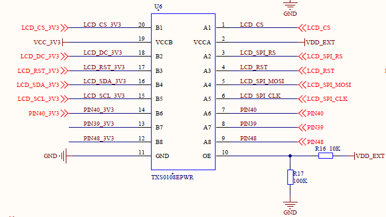

| Note                                                         |
| ------------------------------------------------------------ |
| As for the LCD slot, neither V1.0 EVB nor V1.1 EVB is embedded with CS, please select the screen without CS or make the CS of the screen ground. For more details, please refer to schematic diagram. |


### Accelerometer

In V1.2 EVB, it is embedded with 3-axis accelerometer of LIS2DH12TR; while as for V1.3 EVB, it is reserved sobering space instead of this accelerometer. This accelerometer is featured with small volume, low power consumption and high flexibility. It is acceptable for developer to collect the moving state & posture of EVB via it. 

Click the link to learn [“Accelerometers”  little test](https://python.quectel.com/doc/doc/Advanced_development/en/QuecPythonSub/i2c_lis2dh.html) 

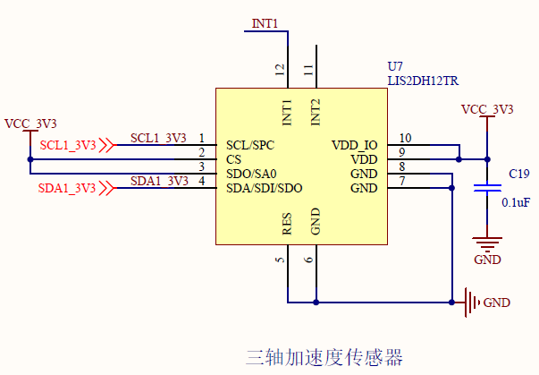

​                                                                               3-axis Accelerometer       

### Photo-resistor

The demo board is integrated with photo-resistor with high sensitivity of GL5528. As the photo-resistor is extremely sensitive to light, when there is no light, it is in a high resistance state with 1.5 MΩ; while in light, the value will be reduced to 1 KΩ or below. Developer should collect the info of light when using it. 

 Click the link to learn [Photoresistor test](https://python.quectel.com/doc/doc/Advanced_development/en/QuecPythonSub/Photoresistor.html)

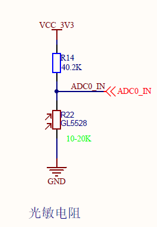

​                                                                           Photoresistor

| Note                                                         |
| ------------------------------------------------------------ |
| EC600N series modules only EC600NCNLD ADC functions are calibrated.  The EC600U series and subsequent modules can be used unless otherwise specified. |

### Temperature and humidity sensor

The EVB is integrated with AHT10 temperature & humidity sensor, which is featured with low power consumption, small volume, accuracy in counting. The developer can collect info such as temperature and humidity of environment via it. For more info, please refer to the link: [AHT10 temperature & humidity sensor](https://python.quectel.com/doc/doc/Advanced_development/en/QuecPythonSub/i2c_aht.html)

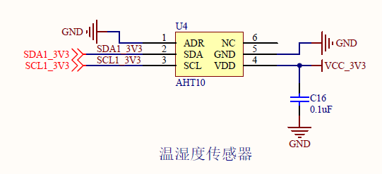

​                                                         Integrated Temperature and Humidity Sensor

### Audio Power Amplifier (Power Amplifier Chipset)

The EVB is equipped with audio power amplifier. As for V1.1, it is integrated with AW8733ATQR, which belongs to K type with characteristics of superior TDD restraint, super volume, break protection, ultra-low EMI and 2.0 W output power. While for V1.2 and V1.3, it is NS4160 that is embedded, which is featured with working mode switch between AB type and D type, ultra-low EMI,  filter-free and 5W single channel audio power amplifier. Click the link for more info：[Audio module development.](https://python.quectel.com/doc/doc/sbs/en/QuecPythonPlatform/Audio.html)

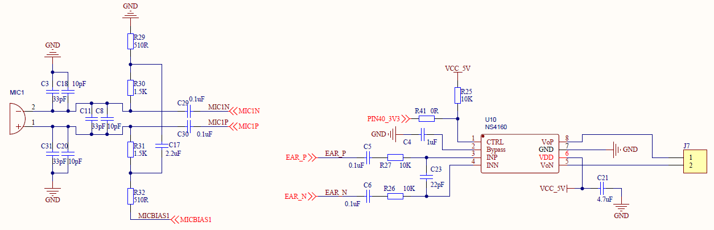


| Note                                                         |
| ------------------------------------------------------------ |
| As there is no amplifier chipset on V1.0 EVB, it will be a failure to enable volume. |
| Though there exists amplifier chipset on V1.1 EVB, it is still needed to pull up PIN58 for enabling: audio_EN = Pin(Pin.GPIO11, Pin.OUT, Pin.PULL_PD, 1) |
| Something issued on the sound recording on V1.1 EVB, as a result, R28 should be removed. |
| In V1.2 and V1.3, there is a need to enable amplifier chipset. For pulling up pin, please refer to schematic diagram. |


### Self-assigned Key

The EVB is implemented with 2 micro keys, so the developer can assign the function on his own. 

Click the link to learn [Key input experiment](https://python.quectel.com/doc/doc/Advanced_development/en/QuecPythonBus/button.html)


| Note                                                         |
| ------------------------------------------------------------ |
| Screen printing error occurred on V1.1 EVB. Actually, micro switches are connected to GPIO1 and GPIO2 separately. |

### GNSS Module：L76K

A GNSS module L76K is attached to the demo board V1.2 and V1.3 individually,  the client can get the location info without getting access to network. 

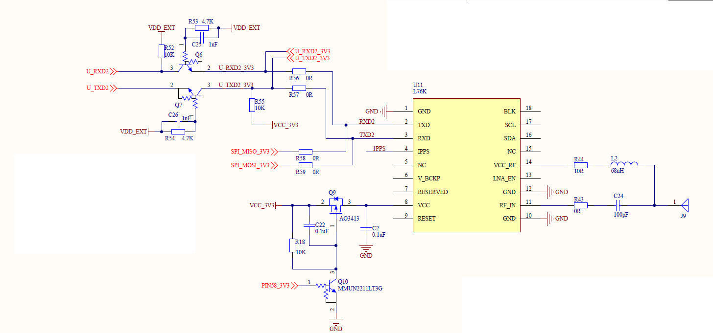

| Note                                                         |
| ------------------------------------------------------------ |
| Some development boards are not configured with this GNSS module. |


## Preparation

### Power on EVB

For modules, the condition to power on is similar; however, due to the difference in HW design, the power on operation among different EVBs are also varied.  <font color='red'>  **Therefore, it is strongly recommended to check the following table for a reference.**</font>

| EVB                        | Boot operation                                               |
| -------------------------- | ------------------------------------------------------------ |
| EC600S_QuecPython_EVB_V1.0 | Plug in to boot                                              |
| EC600S_QuecPython_EVB_V1.1 | Long press the POWKY on the EVB for 2 seconds, the module will boot |
| EC600X_QuecPython_EVB_V1.2 | If make short circuit of the PWR_On Jumper on EVB, there is no need to long press PWK; otherwise, it should be done. |
| EC600X_QuecPython_EVB_V1.3 | After power supply,  flip the power supply selection switch to select the power supply mode, then long press the PWK to boot; or make short circuit of the PWR_On Jumper on EVB, there is no need to long press PWK. |

### ***Install** USB driver*

Before deploying EVB, installing USB driver on PC is necessary. After it is a success, the PC can identify the EVB. 

Downloading address for driver : <https://python.quectel.com/download>

<font color='red'>  **Note**</font>

1. **The driver is divided into two categories:**

**No. 1 Based on the platform: ASR platform (EC600S、EC600N and EC100Y）and RDA platform（EC600U and EC200U ). For more info about platform, please refer to the link :[HW Support.](https://python.quectel.com/doc/doc/Quecpython_intro/en/Qp_Product_intro/Hardware_Support.html)**

Many may ask what the platform of EC600X is. Generally, the ”**X**“ in EC600X is an unknown, which can indicate EC600S or EC600U instead of the actual platform. 

**No. 2 Based on the PC system: Whether in Windows 7 or Windows 10, please download corresponding driver separately.** 

2. **While in terms of EC600SCNLA and EC600SSCNLB, it is a must to download the latest driver with at least V1.0.8 and later.** 

**Steps to install driver on ASR platform**

- Select corresponding driver (For details, please refer to notices above)
- After downloading the driver zip , the developer can unzip it to any directory, then double click to run **setup.exe**. 


- Click the "**Install**" button according to reminder. 

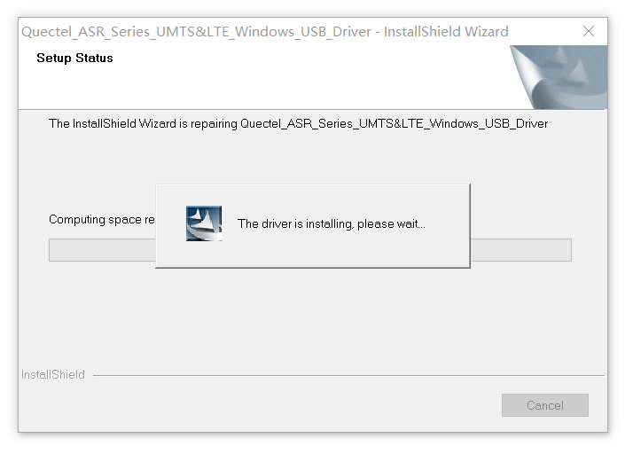

-  Once the installation is a success, click the "**Finish**" button. 

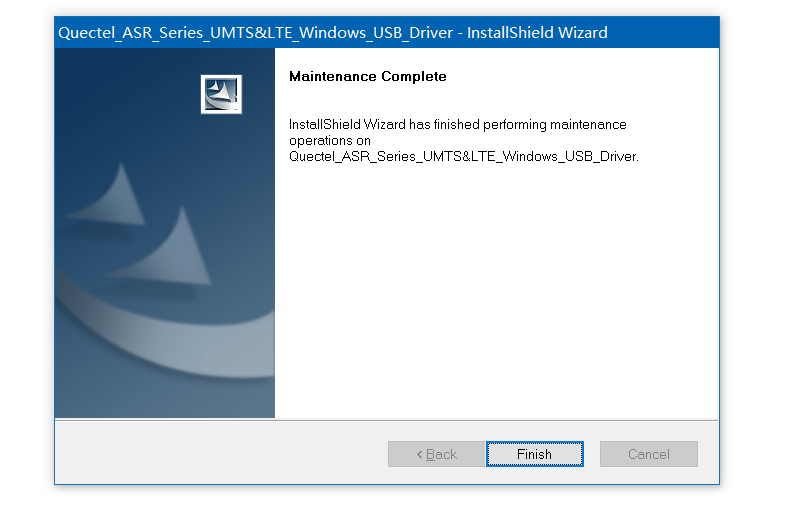

- Installing USB driver on ASR platform is complete till now. 

 **Steps to install driver on RDA platform**

- After downloading the driver zip , the developer can unzip it to any directory, then double click to run **setup.bat**. 
- Please wait till the installation is done

| Tips                                                         |
| ------------------------------------------------------------ |
| （1）Please back up your vital files and save your working progress in fear of file loss caused by something unexpected before installation. |
| （2）There is no need to reboot the PC after the installation is done. |
| （3）If there is a need to repair or unload driver program, just run this driver installation program and select "**Repair**" or "**Unload**". |

### Verify the driver installation

When the driver installation succeeds,  connect the demo board to PC via USB TypeA-TypeC data cable and boot up. (For details, please refer to the chapter-"Boot up EVB")

Open "Device Manager" on PC and enter it, then unfold "**Port (COM and LPT)**",  there will be three serial interface devices if the modules are EC600S and EC600N with QuecPython FW attached. 

- **Quectel USB AT Port (COMx)**
- **Quectel USB DIAG Port (COMx)**
- **Quectel USB MI05 COM Port (COMx)**

In terms of EC200U and EC600U, 7 serial interface devices will appear: 

- **Quectel USB AT Port (COMx)**
- **Quectel USB AP Log Port (COMx)**
- **Quectel USB CP Log Port (COMx)**
- **Quectel USB Diag Port (COMx)**
- **Quectel USB MOS Port (COMx)**
- **Quectel Modem (COMx)**
- **Quectel USB Serial-1 Port (COMx)**

| Tips:                                                        |
| ------------------------------------------------------------ |
| As for the port quantity and name of EC200U and EC600U, when downloading QuecPython FW, there will be no change. |
| Then how to open "Device Manager"?  it is available via following steps:  ”This PC“- "Properties"-"Device Manager". |


If no serial interface device is identified by PC, please check as described below: 

- Whether the EVB is connected to PC correctly (Damage in data cable or socket, insufficient power supply) 
-  Whether the EVB is booted correctly
-  Whether the USB driver is installed correctly
- Whether the mainboard driver is correctly attached to the PC. 

If this cannot be ruled out, please contact our technical support.

If the PC just identifies two serial interface devices without "**Quectel USB MI05 COM Port**", the probable reason may lie in the unflashed QuecPython FW. There is no hurry, refer to the next chapter to flash the QuecPython FW. 


While, if 3 serial interface devices are identified by PC, then you can run the QuecPython. 


### Verify FW Version

Open corresponding serial interface in “**Quectel USB AT Port**” via serial interface tool (Following conditions should be set beforehand: 115200 baud, 1 stop bit, no parity check, 8 bytes-size and no HW flow control). Tick "**Send With Enter**" and send "**AT+GMR**" command to check the info returned by module, which means the current FW version: 


 

If it is the QuecPython FW, Python-related characters such as PY or QPY will be included after querying. 

It is also available to verify whether the current FW version is the QuecPython via the QPYcom-the official graphical tool. 

Downloading address of QPYcom: <https://python.quectel.com/download>

For specific location, please refer to following screenshot.

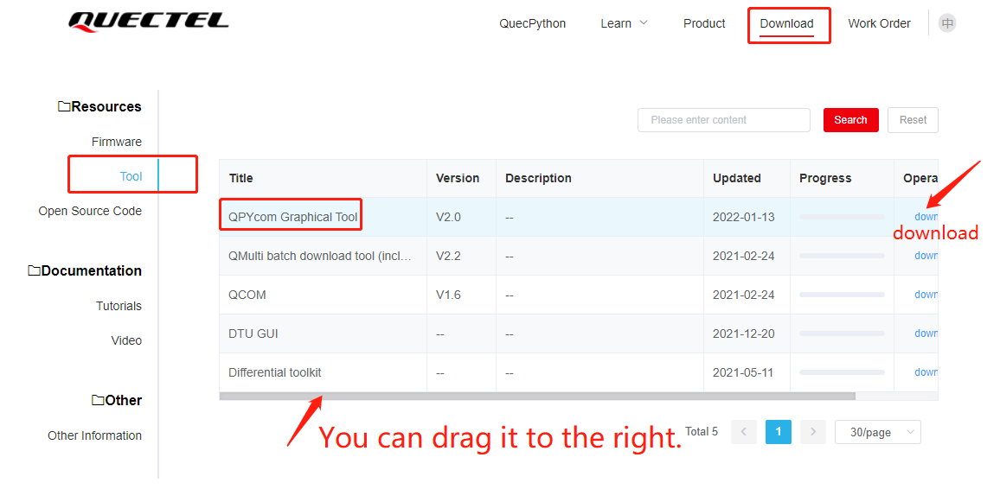

Steps to check FW version via QPYcom

| Module Series | Select the interaction serial interface name |
| ------------- | -------------------------------------------- |
| EC200U        | Quectel USB Serial-1 Port                    |
| EC600U        | Quectel USB Serial-1 Port                    |
| EC600S        | Quectel USB MI05 COM Port                    |
| EC600N        | Quectel USB MI05 COM Port                    |

4. After downloading the QPYcom, unzip it to arbitrary directory and double click the **QPYcom.exe** to run.

2. Connect the demo board to PC and start up.

3. Select code interaction serial interface, then enable it after setting the default baud as 115200. 

4. Click “**REPL**” label enter the inner page

5. Input commands as described below, then check the returned content of module

   ***import uos***

   ***uos.uname()***

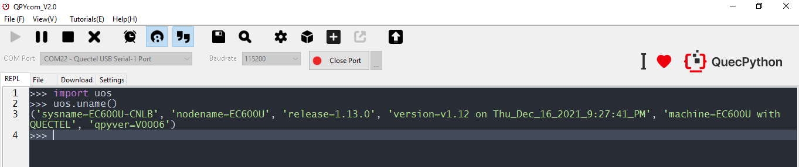

As the figure implies, if it can return contents normally, which means it is the QuecPython FW that is running. 

If issues such as no code interaction serial interface, failure to input or no return happen, then it is not the QuecPython that is running on internal module, as a result, we should download QuecPython FW. 

### Download FW

What does QuecPython FW mean (hereinafter abbreviated as ”FW”) and why should we download it? The FW is a binary program that contains resource like driver, BL, FS, and VM. A module without FW is just like the old saying: one can’t make bricks without straw. While after downloading that, the module can work. Generally, The FW to Quectel communication module is what operation system to PC. Similarly, the user script to QuecPython FW is what application to operation system. Only install the operation system to PC as well as various applications can the PC execute corresponding operations and commands. 

<font color='red'>  **Notes**</font> 

1. **How to get the QuecPython FW? Please refer to the QuecPython official website for downloading**：<https://python.quectel.com/download>  

   

2. **Different modules are varied in FW, as a result, it does not support cross-flashing. If there is a mistake, please correct it and flash the corresponding FW, otherwise, it won’t work. Take EC600S as an example, it is divided into EC600SCNAA, EC600SCNLA and EC600SCNLB, which do not support cross-flashing among these modules.** 

3. **About FW, owing to the FW zip package downloaded from official website contains FW package and change log, only unzip the FW package  furtherly can you get the flashed FW package. Both EC600S and EC600N FW packages share the same suffix *.bin*；while the *.pac* serves as the suffix in both EC200U and EC600U.** 

4. **Before downloading FW, it is suggested to confirm the FW version priorly so as to avoid degrade or download the wrong one. After downloading, all contents in user area will be empty( Unless stored in SecureData).**

5. **Steps to download FW via QPYcom**

   - After downloading QPYcom, unzip it to arbitrary directory, double click **QPYcom.exe** to run. 
   - Connect the demo board to PC and start up. 
   - Click “**Download**” label and enter downloading page
   - **Create** new item on the leftNav of the downloading page, then click ”**Choose FW**”.
   - Left click the inverted triangle on the bottom-right corner on this page, and select “**Download FW**” in the menu; after that, click “**Download FW**” button, the tool will get down to downloading FW automatically. 

| Tips                                                         |
| ------------------------------------------------------------ |
| When downloading FW, there is no need to select serial interface since the tool will select it automatically and download. |
| Never plug in two or more EVBs at the same time so as to avoid the unidentified situation, even worse, results in the error in downloading. |

| Note                                                         |
| ------------------------------------------------------------ |
| When downloading FW, please do not exit tool or plug out the serial interface, which may result in the inaccessibility of module. Once above situation happens, you can refer to the chapter “[How to rescue QuecPython from inaccessibility”](https://python.quectel.com/doc/doc/FAQ/en/QP_recovery/QP_recovery.html) |


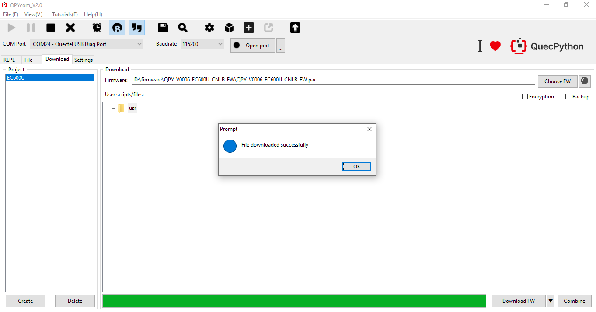


After the download is complete, the above method is available to send AT command; or test whether the download is correct via "**Interaction**" page. 

### Download *Helloworld.py* program to demo board

We can download the Python script file of us to module via **QPYcom**. 

hello world.py Codes (<a href="code/helloworld.py" target="_blank">Download codes</a>)： 

```python
import utime
while True:
    print(“hello world”)
    utime.sleep(1)
```

**Specific steps：**

- After downloading **QPYcom**, unzip it to arbitrary directory, double click QPYcom.exe to run. 
- Connect the demo board to PC and start up.
- Select code interaction serial interface, make the default baud and open serial interface. 
- Click “**File**” label and enter file page( the left indicated the files of local PC, and the right tells the files on module end). 
- Scan over the files of PC on the left and select the corresponding **.py** file. Then drag this file to the “**Root**” node or “**usr**” directory on the right, the file will be downloaded to the module as long as you release the left key of mouse. ( Click the “**+**” button on the right bar is also available, scan and select file needed, and download it to the module)
- During the process of downloading file, there will be downloading process on the bottom state bar; if it is 100%, which means the download is a success.

    As for file system of older file, please download it to “**Root**” node,current versions are all new file systems.

​         As for the dual file system of new system, download it to "**usr**" directory

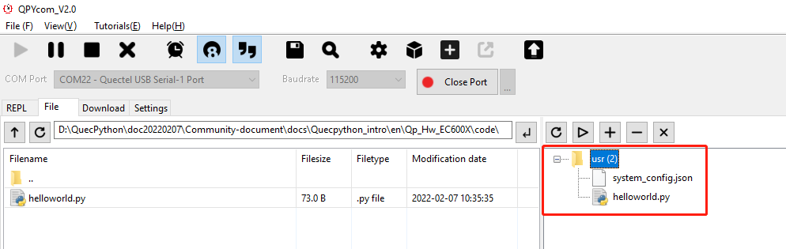

As the figure implies, the “**hello world.py**” file has been downloaded to the main directory of module in this moment, you can check via “interaction” page in QPYcom.

Steps to check in the dual file system of new version

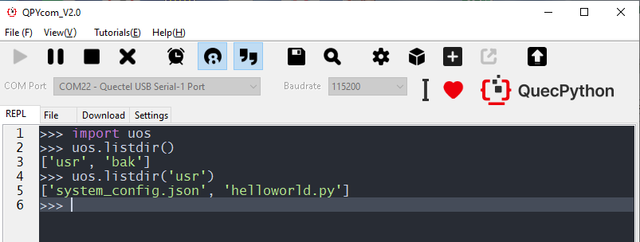

| Tips                                                         |
| ------------------------------------------------------------ |
| The FW of new version deploys dual file system, meanwhile, the root directory can be read instead of writing. |
| As for the backup partition, the **/bak** is neither can be read or written |
| As for the user partition, the **/usr** can be read and written |
| In terms of all **file io** operations of user, which should be done in **/usr** |

###  Run hello world. py program

Two ways are approachable to run the Python script in module. 

- Run manually


2. After downloading QPYcom, unzip it to arbitrary directory, double click **QPYcom.exe** to run.
4. Connect the demo board to PC and start up.
6. Select “**code interaction serial interface**”, make the default baud and open serial interface. 
8. Click “File” label and enter file page (The left indicated the files of local PC, and the right tells the files on module end). 
10. Scan over the file in the module on the right and select the py file which needs to be ran. Click ” **Triangle**” button as figure below, it will skip over to the “**Interaction**” page and run this script file.  

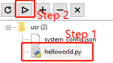

6. It also works if importing “example” module and run the python script file via “exec”. 

```python
import example
example.exec(‘usr/helloworld.py’)
```

Next figure displays the running result. 

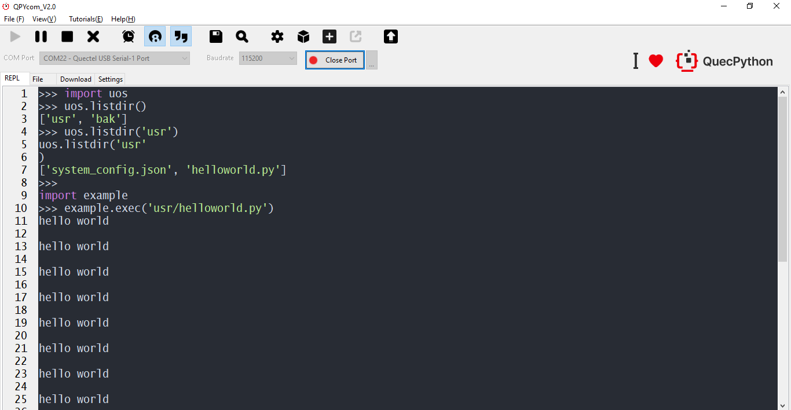


- Auto running after starting up

In QuecPython, it supports executing user codes automatically after power-on. After power-on and running Quectel communication module, the QuecPython will check the ***main.py*** program in user partition and execute it automatically. Therefore, if the user would like to run his own codes after power-on, he should name the program as main.py and download it to the module along with requirements. 

| Tip                                                          |
| ------------------------------------------------------------ |
| The file name shall be main.py (Cases should be coincide completely) and put in the user partition, then the auto running can be realized after starting up. If the *main.py* calls other *py* and *mpy* files, which should be downloaded into the user partition. |

Take ***helloworld.py*** as an example. Print " hello world! " string with a period of 1s via the method provided by helloworld.py file; and following codes shows the method to call ***helloworld.py*** in ***main.py*** file. 

```python
# helloworld.py code
import utime
def prtHelloworld():
    while True:
        print("hello world")
        utime.sleep(1)
```

```python
# main.py：
# Call helloworld.py file
import helloworld
# Call the prtHelloworld() in helloworld.py file
helloworld.prtHelloworld()
```

<font color='red'>  **Tips**</font> 

（1）In terms of the file name should be imported, it is suggested to use pure English instead of name which contains special character such as blank.  

（2）For the py file in dual-file system, two methods are acceptable to import: 

**Method 1:** from usr import helloworld 	#“helloworld” means py file name

​					helloworld.prtHelloworld() 

**Method2:** import usr.helloworld 	#It means the helloworld.py file under usr directory.  

​					usr.helloworld.prtHelloworld() 	#  Note: if in this method, the **usr** should be prefixed. 

 （3）Integrating above two methods, which can be induced: from usr.helloworld import * prtHelloworld() 

#The import* has been done, as a result, call the function name directly. 

Download above two files into module(<a href="code/test_code.7z" target="_blank">Download codes</a>).

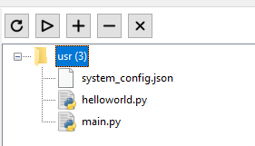

After the file is downloaded successfully, the tool will automatically restart the VIRTUAL machine. At this time, click **REPL** to see the printed "hello world".If the tool cannot automatically restart the VM, manually press the **RST** button on the development board to restart the module, and then open the serial port to view the output result.

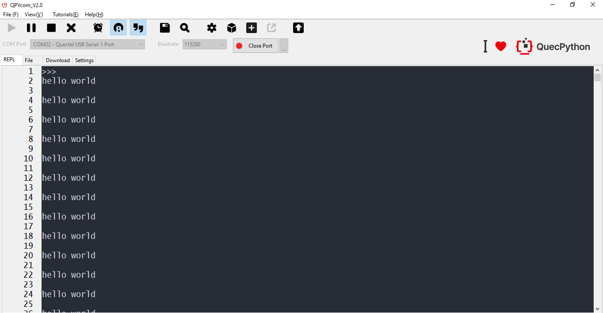


| Tip                                                          |
| ------------------------------------------------------------ |
| If the auto-running is a failure, check whether there exist errors on grammar or call in *py* file. |

| Note                                                         |
| ------------------------------------------------------------ |
| Press **Ctrl+C** to stop automatic or looping scripts; The script cannot be terminated if the module goes into interactive protection manually. There is only one way to do this: reload the firmware. |

### Common issues

**Q：Where is the FW of module？** 

A：Login the QuecPython official website and download: <http://python.quectel.com/download>

**Q：How to find the EVB and other materials commonly used?**

A：Login the QuecPython official website and download: <http://python.quectel.com/download> 

P.S. Any question, please refer to the online documents on official websites or get access to [QuecPython community](https://forums.quectel.com/c/quecpython/66).


## Appendix 1. Silkscreen diagram of Demo BoardV1.1

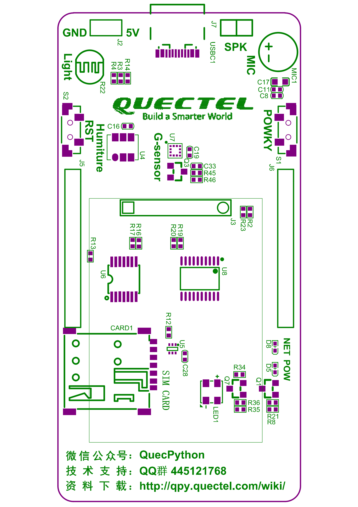

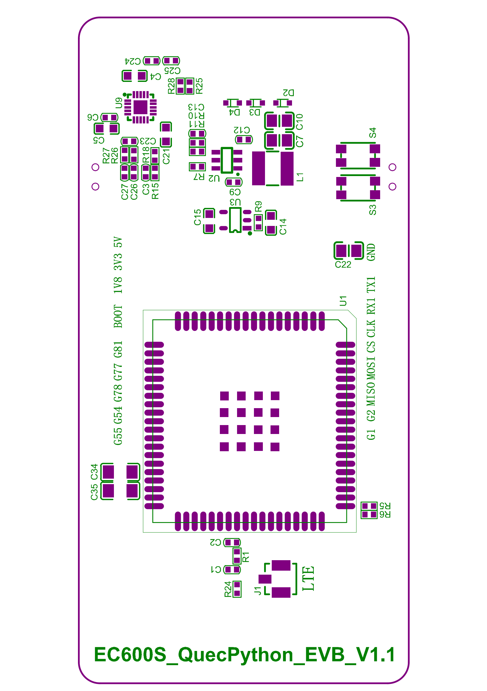


## Appendix 2: Silkscreen diagram of Demo BoardV1.2

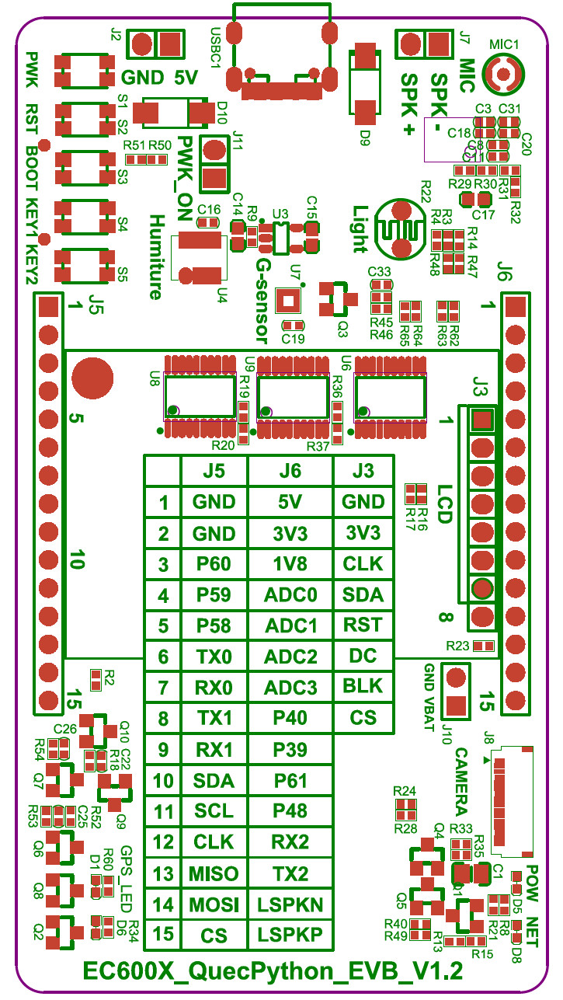

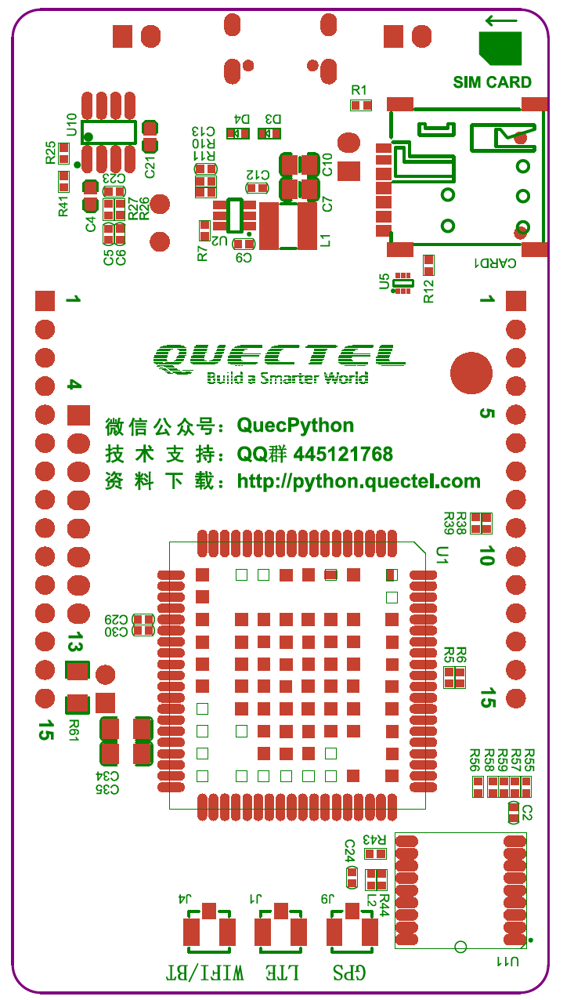

## Appendix 3. Silkscreen diagram of Demo BoardV1.3

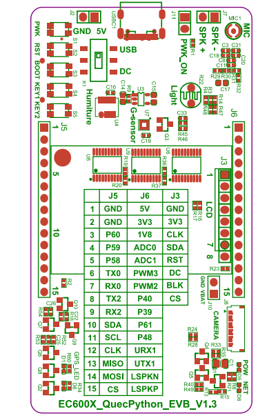

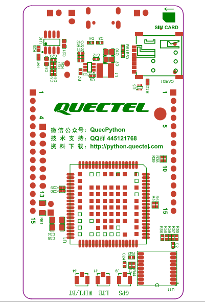