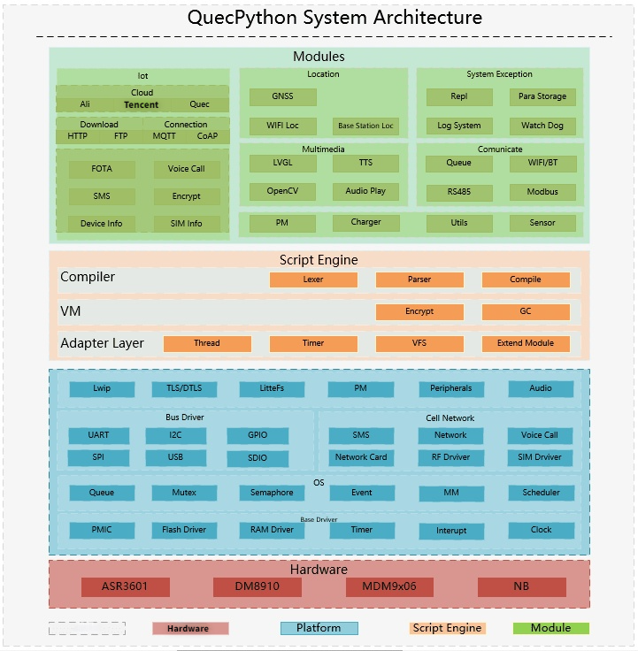
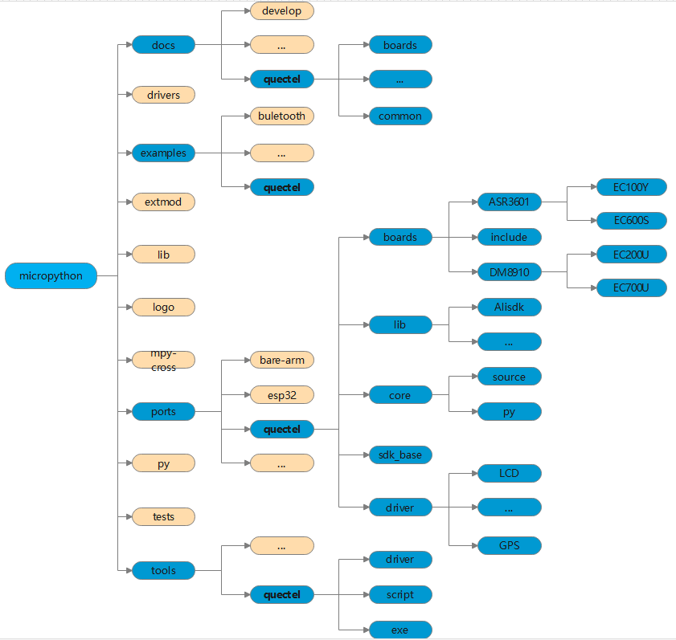

## Explore QuecPython System Architecture
**Revision history** 

| Version | Date       | Author | Description                  |
| -------- | ---------- | -------- | ----------------------------------  |
| 1.0     | 2021-09-31 | Rivern | Modified the initial Version |

### About System Architecture

What we can learn from above figure vividly is that the architectural layers from the low layer of platform to user interface layer are composed by Hardware Layer, OS Layer, QuecPython Adapter Layer, QuecPython VM, QuecPython Compiler layer and QuecPython Modules UE Interface Layer.

Among which

-   **C-SDK**：Hardware Layer and OS Layer

-   **QuecPython Architecture**：QuecPython Adapter Layer, QuecPython VM, QuecPython Compiler layer and QuecPython Modules User Interface Layer.

As for user, just get the knowledge of QuecPython Modules UE Interface Layer。 

Multiple API interfaces are provided in this layer such as I2C/SPI/GPIO/AUDIO/PWM/POWER/ADC/FOTA/Datacall/Aliyun

### Directory Architecture

-   **Illustration**
-   **Micropython----\>docs----\>quectel**：In this directory, it mainly contains the introductory documents about QuecPython, such as driver installation and EVB introduction. 
    
-   **Micropython----\>examples----\>quectel**：In this directory, it mainly contains the demo routines. 
    
-   **Micropython----\>ports----\>quectel----\>boards**：In this directory, it mainly includes adapter interfaces that transplanted to different platforms from QuecPython.
    
-   **Micropython----\>ports----\>quectel----\>core**：In this directory, it mainly tells the logic about user interface layer in QuecPython Modules. 
    
-   **Micropython----\>tools----\>quectel**：In this directory, it mainly introduces the QuecPython-related tools. 

### Appendix

Tablet 1: Terms and abbreviations

| Terms | Full Name in English              |
| ----- | --------------------------------- |
| SDK   | Software Development Kit          |
| VM    | Virtual Machine                   |
| OS    | Operating System                  |
| DTU   | Data Transfer Unit                |
| API   | Application Programming Interface |
| APP   | Application                       |

> ​	***For full documentation visit [http://python.quectel.com/.](http://python.quectel.com/.)***

