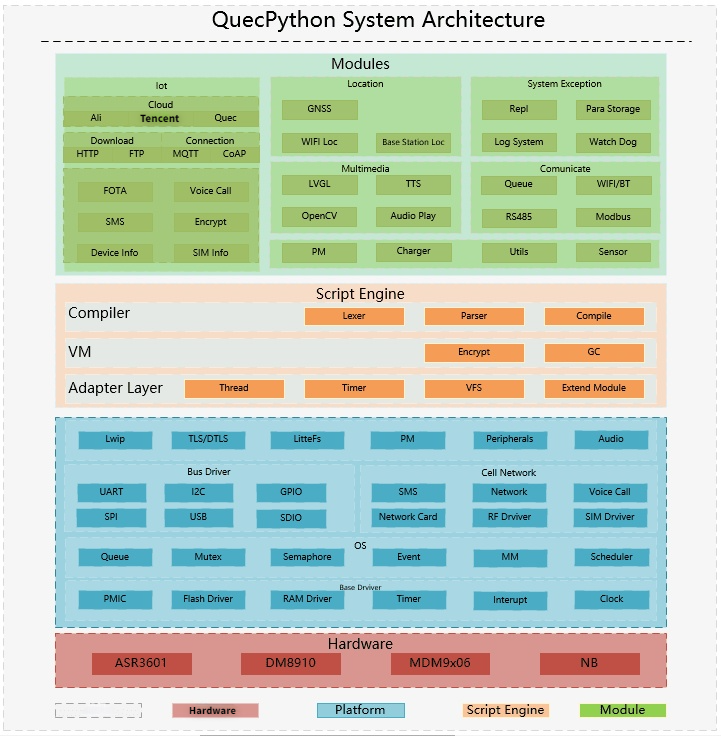

## Brief Introduction on QuecPython

**Revision History**

| Version | Date       | Author | Description            |
| -------- | ---------- | -------- | ----------------------------------  |
| 1.0      | 2021-09-31 | Rivern | Modified initial version & Adjusted the applicable module |

In this document, it mainly illustrates the technical features of QuecPython. 

##  Origin of QuecPython

Python, a cross-platform computer programming language, is a high-level scripting language that combines interpretation, compilation, interactivity, and object orientation. Initially, it is used to compile auto script (such as shell) and widely used in the development of independent & huge program with the updated version and addition of new capabilities. "One issue can only be unlocked by one method instead of much choices like that displayed in Perl language" , said by Python developer, as a result, when design Python language, it should be elegant, explicit and simple without too many flexible grammars. (Too many grammars may cause misunderstanding). Owing to discrimination in design, compared with Perl, the Python source code is considered as better readability and enough to support the SW development of magnitude. Moreover, Python, an object-oriented (such as function, module, figure and string) language, which supports inheritance, overloading, derivation and multi-inheritance, is beneficial to add the re-usability of source codes. Also, the Python itself is also designed to be expandable. Since not all features and capabilities are integrated into language core, multiply APIs and tools are provided in Python so as to make the programmer compile and expand module via C language, C++ and Cython more easily. In addition, Python itself can also be integrated into other program which needs script language, therefore,  it is called " **glue language** " as well, which is used to integrate and package program compiled by other language.

Applicable scenarios 

- Web and Internet development
- Science calculation and statistics
- AI (Artificial Intelligence)
- Desk surface development
- SW development 
- Back-end development
- Web crawler
- Embedded development

**Integrate Quectel with Python** 

QuecPython is not only the running environment to execute Python code but also a new Ethernet development method. " Quec ", abbreviation of " Quectel ", is the Ethernet module based on Quectel; while Python (also named crawler or glue language) , a design language for cross-platform computer program, with features of quick-start, easy and rapid compilation, convenient debugging, and highly efficient development, has become one of the most popular program design languages. QuecPython is transplanted from open-sourced library of  MicroPython, the developer can call module SW and external HW interface via MciroPython on Quectel module for secondary development. Furthermore, QuecPython will make it more convenient for developer to conduct secondary development on Ethernet module and an embedded operation system specialized for developer. 

##  The relationship between QuecPython and MicroPython 

### Introduction on MicroPython

As the name implies, the MicroPython is the combination of Micro and Python. In general, the Micro means tiny or small, while Python refers to a programming language. As a result, it is micro python literally. Actually, the MicroPython is the Python used in embedded system for compiling program and applications. 

MicroPython is the concise and highly efficient fulfillment of Python3 language - a small portion of Python standard library is also included. After optimization, it can be run on micro controller and limited environment.  MicroPython contains superior capabilities such as interaction reminder, big-Integer, close, list analysis, generator and abnormality handle. The MicroPython is concise enough to run on the chipset with the size of 256K code space and 16K RAM and compatible with normal Python as best as it can. As a result, the client can transmit the code from desk to micro controller or embedded system more easily. Currently, MicroPython can not only run on the Pyboard micro controller that developed at primary stage, but also on embedded system that based on ARM such as Arduino. By this way, it will be much convenient to develop auto control and robot via Python. 

The features of MicroPython are simple and easy to use, good transplantation, and convenient in reservation.  However, in terms of running efficiency, the program developed by MicroPython or other script language (such as Javascript) is not higher than that by C, C++ and Assembly. Please note that the MicroPython will not replace the role of C and C++ languages, but the biggest benefit brought by which is the improvement of overall development efficiency since in most cases, the HW characteristic is surplus and it won't do much effect when sacrificing a little running efficiency. We often hear it is the Arduino that leads the common elecfans, DIYers and Makers to the embedded region , which makes them feel no fear to HW development and usage; Similarly, it is the MicroPython that makes the normal engineer and fans develop embedded program in a rapid way and the whole process easier and simpler.

MicroPython deploys the MIT authorization instead of the GPL authorization used by mega, it means that all of us can use, modify and release it. In addition, you can apply it into commercial product for free. For relevant source code of MicroPython, please refer to *https://github.com/micropython/micropython*.

### The Relationship between QuecPython and MicroPython

1. QuecPython is transplanted from MicroPython, as a result, whether in capability interface assignment or directory architecture, it should be aligned with MicroPython highly. 

2. Both are applied in embedded scenarios development similarly. while the Python development language of light version will make the developer quicker to learn and reduces the difficulty on development correspondingly. 

3. Both are applied in the micro controller of limited resource, the smallest volume is just about 256K; while in running, it just occupies 16K RAM. 

##  The Relationship between QuecPython and C-SDK

What we can learn from above figure vividly is that the architectural layers from the low layer of platform to user interface layer are composed by Hardware Layer, OS Layer, QuecPython Adapter Layer, QuecPython VM, QuecPython Compiler layer and QuecPython Modules UE Interface Layer.

Among which

-   **C-SDK**: Hardware Layer and OS Layer

-   **QuecPython complete structural layer**：QuecPython Adapter Layer, QuecPython VM, QuecPython Compiler layer and QuecPython Modules User Interface Layer.

The QuecPython will carry out transplantation and adaptation based on C-SDK.

##  Features of QuecPython

**Main features of QuenPython** 

2.  **High Efficiency**: It is highly efficient and convenient to use Python, you can study and take charge of it easily. Furthermore, there is no need to compile, you can write and test at any time. 
4.  **Abundant API Interfaces**: The API Interfaces provided by we Quectel cover the common MCU and development library of mobile link connection, which can assure the stable interface and flexible capabilities to the greatest extent. 
6.  **Compatible with MicroPython**: Whether in directory architecture or in interface application, the QuecPython should be aligned with MicroPython so as to keep the pace with official for upgrade. 
8.  **Data Security**: Whether from the view of source code of data transmission, corresponding encryptions have been done, which can make sure the security and privacy of user at maximum.
10.  **Development Language**: Easy and quick to learn; meanwhile, it is stable and reliable.
12.  **Powerful Transplantation**: The system architecture of QuecPython can be transplanted and adapted to different application platform in a rapidly way. Therefore, the user just needs to develop the adapter layer interface from We Quectel. As for logic of other APPs , just ignore it. 
14.  **Abundant Technical Supports**: We Quectel has already provided quick-start, teaching document and video step by step. Moreover, we also built the official technical support team. User can learn how to use QuecPython from green-hand. Meanwhile, we provide technical support during the whole process when developing. 

