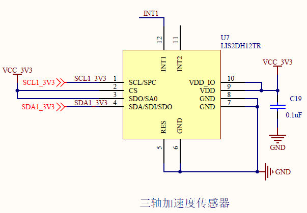
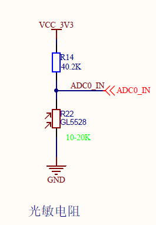
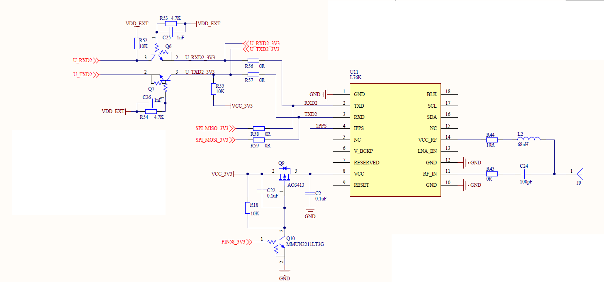
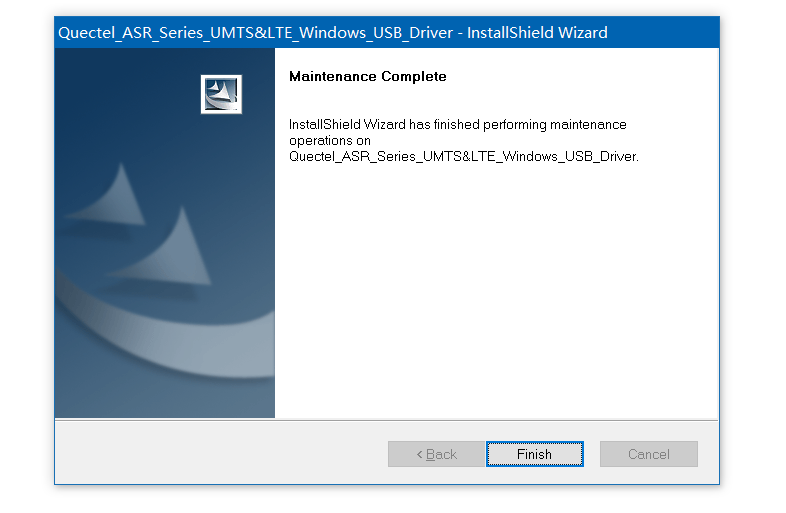
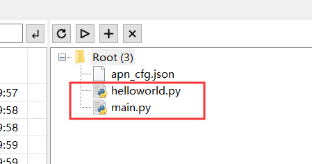

## **修订记录**

| **版本** | **日期**   | **作者** | **变更表述**                           |
| -------- | ---------- | -------- | -------------------------------------- |
| 1.0      | 2020-12-14 | 袁帅     | 初始版本                               |
| 1.1      | 2020-12-20 | Josh     | 硬件1.1版本增加音频功放电路            |
| 1.1.1    | 2020-12-28 | Chic     | 文档增加【项目推介】                   |
| 1.1.2    | 2021-01-06 | Chic     | 修改关于LED的描述                      |
| 1.2      | 2021-01-20 | Jorma    | 修改部分内容                           |
| 1.2.1    | 2021-03-31 | David    | 增加V1.2开发板的内容；增加图表标题     |
| 1.2.2    | 2021-04-02 | chengzhu | word转换成md,后续更新基于md更新        |
| 1.2.3    | 2021-04-06 | David    | md文档下，图片和目录的格式修改         |
| 1.3      | 2021-09-06 | Kayden   | 增加V1.3开发板的内容，修改增添部分内容 |

## 基本概述

### 描述

EC600X_QuecPython_EVB_V1.x开发板是一款搭载多款传感器的Cat.1通信模块开发板，本文将介绍这款开发板的使用方法和注意事项。

EC600X\_QuecPython_EVB_V1.x的命名规则如下：


EC600S_QuecPython_EVB_V1.x（x=0,1）开发板（本文简称“V1.1开发板”）是专门针对EC600S制造，是一款小巧便携的“口袋型”开发板。体型虽小，但是功能丰富，拥有温湿度传感器、SIM卡座、板载天线、LCD接口、光敏电阻、MIC、等元件。

为了满足多模组的开发需求，开发了EC600X_QuecPython_EVB_V1.2（本文简称“V1.2开发板”）。相比较前两款，在元件上主要增加了GNSS模组：L76K。

为了方便用户选择开发板供电方式，开发了EC600X_QuecPython_EVB_V1.3（本文简称“V1.3开发板”）。相比较上一个版本主要增加了一个电源选择开关。

开发者仅需一条USB Type-C 数据线即可轻松玩转开发板。


### V1.1开发板资源

- Quectel移远 EC600S_CNAA Cat.1 通信模组
- PCB天线
- NANO SIM自弹卡座
- 保留SMA天线座焊盘
- USB Type-C数据接口
- 一个开机按键，一个复位按键
- 两个自定义功能按键
- 音频功放，支持最高4Ω3W喇叭
- 温湿度传感器
- G-Sensor 三轴加速度传感器
- （不支持）LED彩灯
- （需焊接）驻极体MIC
- （需焊接）Speaker 音频输出
- （需焊接）光敏电阻
- （需焊接）GPIO排针
- （需焊接）LCD排针

### V1.2开发板资源

- Quectel移远 EC600X Cat.1 通信模组
- NANO SIM自弹卡座
- GPS、LTE、WIFI/BT天线接口
- USB Type-C数据接口
- 开机按键，复位按键，强制下载按键
- 两个自定义功能按键
- 音频功放，支持最高4Ω3W喇叭
- 温湿度传感器
- G-Sensor 三轴加速度传感器
- 单色灯
- 驻极体MIC
- Speaker 音频输出
- 光敏电阻
- GPIO排针
- LCD排针
- CAMERA接口

### V1.3开发板资源

- Quectel移远 EC600X Cat.1 通信模组
- NANO SIM自弹卡座
- GPS、LTE、WIFI/BT天线接口
- USB Type-C数据接口
- 开机按键，复位按键，强制下载按键
- 两个自定义功能按键
- 音频功放，支持最高4Ω3W喇叭
- 温湿度传感器
- 单色灯
- 驻极体MIC
- Speaker 音频输出
- 光敏电阻
- GPIO排针
- LCD排针
- CAMERA接口
- 电源选择开关

### 开发板能做的事情

#### 小实验

开发板包含诸多接口、外设，方便开发者开发调试。在QuecPython官网的文档中心提供了众多小实验。

具体地址见：[进阶开发](https://python.quectel.com/doc/doc/Advanced_development/zh/index.html)

#### 实现产品原型

基于开发板自带的众多传感器、按键、液晶屏等外设，开发者甚至可以直接以开发板为基础，快速做出产品原型。接下来试举几例以开发板板载的传感器为基础，可以做的某些产品原型：

- **防盗损装置**

**背景**：无人值守的设备如快递柜、充电站、充电桩等，存在被盗或破坏的风险。需要实现远程控制、防盗、异常状态上报等。

**装置**：Quectel通信模组+加速度传感器+GPIO（搭配振动传感器、微动开关、继电器、LED等）+喇叭。

**方法**：Quectel通信模组连接云端，保存云端下发的参数。读取传感器上报的参数，判断当前姿态、震动状态是否超过阈值，LED闪烁、报警，并通过网络上报到云端。

- **微型天气服务站**

**背景**：在野外架设无人值守的微型天气服务站，通过网络定时上报温湿度、风力等数据，以供记录、分析、预报。

**装置**：Quectel通信模组+温湿度传感器+ADC（风力检测、电池电压检测）+GPIO（电池充放电状态检测）。

**方法**：Quectel通信模组连接云端，保存云端下发的参数。通过NTP同步内部时钟；读取温湿度传感器、ADC器上报的参数，并按照云端的要求，将数据序列化通过网络上报到云端。网络不佳情况下，离线存储数据，待网络通畅再上报数据到云端。

- **微型自动售货机**

**背景**：很多酒店的miniBar不能满足客户的需求，而客房内的微型自动售货机则可以很好地弥补这个缺陷。售卖如零食、口香糖、充电线等小件商品，同时提供手机充电等服务。

**装置**：Quectel通信模组+GPIO（搭配步进电机、继电器/MOS管）+光照传感器+LCD+GSensor+喇叭。

**方法**：Quectel通信模组连接到云端，注册并鉴权，收到云端下发的数据，LCD屏幕显示对应的二维码；用户使用微信或者支付宝扫描LCD显示的二维码，进入小程序选购。选购完成并支付后，云端下发控制指令，通信模组接到指令，解析指令内容，控制GPIO实现步进电机旋转出货，并通过光照传感器确认出货完毕；或控制继电器/MOS管，实现手机充电功能；出货完毕后，可使用TTS语音朗读相应的信息如“*出货完毕，欢迎再次选购*”。当G-Sensor检测到倾倒或者暴力破坏时，可自动上报信息到云端，以便运维处理。

- **扫码把枪**

**背景**：日常场景，可以使用把枪实现批量录入条形码、二维码。但是传统把枪无法脱离电脑使用，而使用手机扫码颇为繁琐，且稳定性差、耗电量高。使用无线扫码把枪，可以实现远程扫码、无线扫码、连续扫码等。

**装置**：Quectel通信模组+SPI Camera+LCD+GPIO（搭配矩阵键盘）。

方法：Quectel通信模组开机后连接云端，LCD显示对应信息，使用者通过按键确认，然后开启
Camera扫描条形码或二维码（可选单次扫描、连扫等操作），模块识别条形码或二维码的信息，并上报到云端。

- **智能控制**

**背景**：云端下发运行参数，模块实现自动化监测设备、控制，节省人工成本。

**装置**：Quectel通信模组+SPI Camera+SPI+I2C+LCD+GPIO（搭配按键、继电器等）。

**方法**：Quectel通信模组开机后连接云端，获取运行参数并保存。在LCD显示相应的控制内容和运行状态；当检测到传感器的数值超过阈值，则根据保存的参数执行对应动作，并上报云端（例如湿度超过80%则打开继电器，控制除湿机开启），实现自动化控制。

- **设备定位**

**背景：**共享单车快速发展，部分单车由于停车位置的偏僻性，消费者在寻找时无法有效准确的找到单车的位置，影响客户的消费体验，同时耗费大量的资源，而且实时性无法保证。

**装置：**Quectel通信模组+ L76K。

**方法：**使用L76K获取定位信息，输出NEMA语句，然后通过模组的串口读取NEMA，输出定位信息，最后在连接网络的情况下，将数据发送到云端（例如：阿里云）实现实时共享。

## 开发板介绍

开发板是为方便开发者使用QuecPython，而设计的一款基于EC600X
Cat.1通信模块的开发板，其上集成了开发常用的配置，可以满足开发者的开发需求。

### V1.1开发板

#### V1.1开发板正面接口


#### V1.1开发板背面接口


**TIPS：**

开发板的丝印请参考本手册的附录内容开发板的更多资料，请访问 <https://python.quectel.com/download>

#### V1.1开发板配置

开发板配备了多种传感器，以及其他外设。明细如下：

| 序号 | 名称                         | 型号          | 是否支持 | 接口类型 |
| ---- | ---------------------------- | ------------- | -------- | -------- |
| 1    | 三轴加速度传感器             | LIS2DH12TR    | 是       | I2C      |
| 2    | 温湿度传感器                 | AHT10         | 是       | I2C      |
| 3    | 光敏电阻                     | GL5528        | 是       | ADC      |
| 4    | 微动按键                     | -             | 是       | GPIO     |
| 5    | 麦克风                       | GMI6050P-66DB | 是       | SPK      |
| 6    | 功放芯片                     | AW8733ATQR    | 是       | SPK      |
| 7    | LED彩灯                      | WS2812B-MINI  | 否       | PWM      |
| 8    | LCD 显示屏（需选择含屏套餐） | ST7789        | 是       | SPI      |

### V1.2开发板

#### V1.2开发板正面接口


#### V1.2开发板背面接口


| 小提示                                                                                            |
| ------------------------------------------------------------------------------------------------- |
| 开发板的丝印请参考本手册的附录内容 开发板的更多资料，请访问 <https://python.quectel.com/download> |

#### V1.2开发板配置

开发板配备了多种传感器，以及其他外设。明细如下：

| 序号 | 名称                         | 型号          | 是否支持 | 接口类型  |
| ---- | ---------------------------- | ------------- | -------- | --------- |
| 1    | 三轴加速度传感器             | LIS2DH12TR    | 是       | I2C       |
| 2    | 温湿度传感器                 | AHT10         | 是       | I2C       |
| 3    | 光敏电阻                     | GL5528        | 是       | ADC       |
| 4    | 微动按键                     | -             | 是       | GPIO      |
| 5    | 麦克风                       | GMI6050P-66DB | 是       | SPK       |
| 6    | 功放芯片                     | NS4160        | 是       | SPK       |
| 7    | LED                          | Green         | 是       | PWM、GPIO |
| 8    | LCD 显示屏（需选择含屏套餐） | ST7789        | 是       | SPI       |
| 9    | GNSS模组                     | L76K          | 是       | UART      |

### V1.3开发板

#### V1.3开发板正面接口


#### V1.3开发板正面接口


| 小提示                                                       |
| ------------------------------------------------------------ |
| 开发板的丝印请参考本手册的附录内容 开发板的更多资料，请访问 <https://python.quectel.com/download> |

#### V1.3开发板配置

开发板配备了多种传感器，以及其他外设。明细如下：

| 序号 | 名称                         | 型号          | 是否支持 | 接口类型  |
| ---- | ---------------------------- | ------------- | -------- | --------- |
| 1    | 温湿度传感器                 | AHT10         | 是       | I2C       |
| 2    | 光敏电阻                     | GL5528        | 是       | ADC       |
| 3    | 微动按键                     | -             | 是       | GPIO      |
| 4    | 麦克风                       | GMI6050P-66DB | 是       | SPK       |
| 5    | 功放芯片                     | NS4160        | 是       | SPK       |
| 6    | LED                          | Green         | 是       | PWM、GPIO |
| 7    | LCD 显示屏（需选择含屏套餐） | ST7789        | 是       | SPI       |
| 8    | GNSS模组                     | L76K          | 是       | UART      |

## 功能详解

| 注意：此部分电路原理图并非适用所有版本开发板，对应版本原理图请在官网下载或QQ群445121768群文件获取！ |
| ------------------------------------------------------------ |

### LCD接口

开发板集成了LCD接口，开发者可以通过该接口点亮LCD屏幕，显示图片文字等内容。搭配LVGL还能显示更多有趣内容哦（点此了解“[LCD开发](https://python.quectel.com/doc/doc/Advanced_development/zh/QuecPythonSub/LCD.html)”的小实验）。

目前，QuecPython支持的屏幕：

-   GC9305

-   HX8347

-   ST7789

-   ST7735

-   更多屏幕，正在适配中…


| 请注意                                                       |
| ------------------------------------------------------------ |
| 对于LCD Slot, V1.0和V1.1的开发板没有CS, 请选择没有CS的屏, 或者将屏的CS接地, 具体可参考V1.1的原理图 |

### 加速度传感器

V1.2开发板集成了LIS2DH12TR三轴加速度传感器，V1.3开发板没有此传感器，但是预留了焊接空间。该三轴加速度传感器是具有体积小巧、耗电低、灵敏度高的特点。开发者通过该加速度传感器，可以采集开发板的运动状态，姿态等数据。

点此了解：[“加速度传感器”开发](https://python.quectel.com/doc/doc/Advanced_development/zh/QuecPythonSub/i2c_lis2dh.html)



### 光敏电阻

开发板集成了GL5528高灵敏度光敏电阻。光敏电阻对光线十分敏感，其在无光照时，呈高阻状态，暗电阻一般可达1.5MΩ；而在光照时，阻值可小至1KΩ以下。使用该光敏电阻，开发者可以采集环境光照度信息。

点此了解：[光敏传感器开发](https://python.quectel.com/doc/doc/Advanced_development/zh/QuecPythonSub/Photoresistor.html)



| 请注意                                                 |
| ------------------------------------------------------ |
| EC600N后缀为UNNSA或EC600NCNLD模组ADC功能才能正常使用。 |

### 温湿度传感器

开发板集成了AHT10温湿度传感器。该传感器具有低功耗、体积小、计量准确的特点。开发者可以使用该传感器采集环境温度、湿度等信息。点此了解：[温湿度传感器开发](https://python.quectel.com/doc/doc/Advanced_development/zh/QuecPythonSub/i2c_aht.html)


### 音响功率放大器（功放芯片）

开发板集成了音响功率放大器。V1.1集成的是AW8733ATQR，该功放芯片是K类音响功率放大器,具有超强 TDD 抑制、超大音量、防破音、超低 EMI、输出功率2.0W的特点。V1.2和V1.3集成的是NS4160，一款带AB类/D类工作模式切换功能、超低EMI、无需滤波器、5W单声道音频功放的一种科技产品。点此了解：[音频开发](https://python.quectel.com/doc/doc/sbs/zh/QuecPythonPlatform/Audio.html)


| 请注意                                                       |
| ------------------------------------------------------------ |
| V1.0版开发板没有功放芯片，放音可能失败                       |
| V1.1版开发板有功放芯片，需要拉高PIN58使能：audio_EN = Pin(Pin.GPIO11, Pin.OUT, Pin.PULL_PD, 1) |
| V1.1版开发板录音存在问题，需要拿掉R28                        |
| V1.2、V1.3开发板均需要使能功放芯片，拉高引脚参见原理图。     |

### 自定义按键

开发板集成了2个自定义微动按键，开发者可以自行定义其功能。

点此了解：[按键输入开发](https://python.quectel.com/doc/doc/Advanced_development/zh/QuecPythonBus/button.html)


| 请注意                                                       |
| ------------------------------------------------------------ |
| V1.1开发板丝印错误，微动开关实际连接的是GPIO1、GPIO2，其他开发板具体看原理图 |

### GNSS模组：L76K

V1.2和V1.3开发板集成了一个GNSS模组L76K，客户无需联网即可获取定位信息。



| 请注意                                     |
| ------------------------------------------ |
| 对于V1.1之前开发板是没有配置此GNSS模组的。 |

## 准备工作

### 开发板开机

对于模组来说，开机条件都是类似的，但是由于硬件设计的不同，不同开发板的开机操作略有区别，<font color='red'>  **如下表格强烈建议查看**</font>

| 开发板                     | 开机操作                                                     |
| -------------------------- | ------------------------------------------------------------ |
| EC600S_QuecPython_EVB_V1.0 | 插电即开机                                                   |
| EC600S_QuecPython_EVB_V1.1 | 长按开发板侧边的POWKY两秒松开，模组便会开机                  |
| EC600X_QuecPython_EVB_V1.2 | 开发板上的PWK_ON跳帽短接，则无需长按PWK，反之需要长按PWK     |
| EC600X_QuecPython_EVB_V1.3 | 供电后先拨动电源选择开关选择供电方式，再长按PWK开机，或把开发板上的PWK_ON跳帽短接，则无需长按PWK |

### 安装USB驱动 

使用开发板前，需要在电脑上安装USB驱动。正确安装后，电脑可以识别开发板。

驱动程序下载地址：<https://python.quectel.com/download>

<font color='red'>  **注意事项**</font>

**1.驱动的分类主要分为两大类：**

**第一、基于模组支持的平台分类：ASR平台（EC600S、EC600N、EC100Y）和RDA平台（EC600U、EC200U）更多模组的平台信息可见：[硬件选型](https://python.quectel.com/doc/doc/Quecpython_intro/zh/Qp_Product_intro/Hardware_Support.html)**

**相信大家也有一个疑问EC600X是什么平台，实际上EC600X中“X”是一个未知数，可指EC600S、EC600U等，并不代表实际的平台。**

**第二、基于PC的系统分类：Windows7系统请下载Windows7对应的驱动；Windows10系统请下载Windows10对应的驱动。**

**2.对于EC600SCNLA和EC600SCNLB，必须下载最新版本的驱动，驱动版本至少在V1.0.8以上**

**ASR平台驱动安装步骤如下：**

- 请选择对应的驱动，具体安装哪个驱动参考上述注意事项

- 开发者下载驱动程序的压缩包后，完整解压该压缩包到任意目录，双击运行setup.exe：


- 按照提示，点击Install即可：


- 安装成功后，点击“Finish”结束：



- 至此，ASR平台USB 驱动安装结束。

**RDA平台驱动安装步骤如下：**

- 开发者下载驱动程序的压缩包后，完整解压该压缩包到任意目录，双击运行setup.bat：
- 等待安装成功即可。

| 小提示                                                       |
| ------------------------------------------------------------ |
| （1）安装前，请备份您的重要文件，并保存您的工作进度，以免发生意外情况，导致文件丢失 |
| （2）安装成功后，无需重启电脑                                |
| （3）如需修复或者卸载驱动程序，再次运行该驱动安装程序，选择“修复”或“卸载” 即可 |
| （4）如若安装失败，请联系我们的在线支持：QQ群 445121768      |

### 验证驱动安装

驱动安装成功后，使用USB TypeA-TypeC数据线，将开发板连接到电脑上，并开机（具体开机参考可参考上述“开发板开机”章节）。

在电脑上打开“设备管理器”，进入电脑的设备管理器，展开**“端口(COM 和LPT)”**，若是EC600S和EC600N且固件为QuecPython固件应出现三个串口设备：

- **Quectel USB AT Port (COMx)**
- **Quectel USB DIAG Port (COMx)**
- **Quectel USB MI05 COM Port (COMx)**

若是EC200U和EC600U应出现八个串口设备：

- **Quectel USB AT Port (COMx)**
- **Quectel USB AP Log Port (COMx)**
- **Quectel USB CP Log Port (COMx)**
- **Quectel USB Diag Port (COMx)**
- **Quectel USB MOS Port (COMx)**
- **Quectel Modem (COMx)**
- **Quectel USB Serial-1 Port (COMx)**
- **Quectel USB Serial-2 Port (COMx)**

| 小提示                                                       |
| ------------------------------------------------------------ |
| EC200U和EC600U在下载QuecPython固件前后端口数量和名称没有变化。 |
| 如何打开“设备管理器”呢？ 很简单，请跟我来：我的电脑—“此电脑”—属性—设备管理器 |

如果您的电脑没有识别到任何串口设备，请检查：

- 开发板是否正确连接到电脑（数据线损坏，或者插口损坏、供电不足等）

- 开发板是否正确开机

- USB驱动是否正确安装

- 电脑是否正确安装主板驱动。

如果无法排除，请联系我们的在线支持：QQ群 445121768

**如果您的电脑只识别了两个串口设备（没有“Quectel USB MI05 COM Port”），那么可能是因为没有刷入QuecPython固件的缘故。别着急，请阅读下一章节，刷入QuecPython固件就可以啦。**


如果您的电脑正确识别了三个串口设备，那么恭喜您，一切准备就绪，可以开始QuecPython之旅啦


### 验证固件版本

使用串口工具，打开“Quectel USB AT Port”对应的串口（波特率选择 115200，停止位 1位，无奇偶校验，8 位数据位，无硬件控制流）。勾选“发送新行”（Send With Enter），发送指令“AT+GMR”，查看模块返回的信息，即当前固件版本：


如果是QuecPython的固件，查询结果通常包含PY或QPY等和Python相关字符。

使用官方的图形化工具——QPYcom，同样也可以验证当前固件版本是否为QuecPython固件。

QPYcom下载地址：<https://python.quectel.com/download>

具体位置如下截图：


使用QPYcom工具查看固件版本的步骤如下：

| 模块型号 | 选择交互串口名称          |
| -------- | ------------------------- |
| EC600U   | Quectel USB Serial-1 Port |
| EC600S   | Quectel USB MI05 COM Port |
| EC600N   | Quectel USB MI05 COM Port |

1. 下载QPYcom工具后，完整解压到任意目录，双击QPYcom.exe运行；

2. 将开发板连接到电脑并开机；

3. 选择代码交互串口，默认波特率115200，打开串口；

4. 点击“**交互**”标签，进入交互页；

5. 键入如下命令，然后查看模块返回的内容：

   *import uos*

   *uos.uname()*


如图所示，如果可以正常返回内容，则证明当前运行的是QuecPython固件。

如果没有代码交互串口，或者无法输入，输入无返回等情况，则模组内运行的都不是QuecPython固件，需要下载QuecPython固件。

### 下载固件

什么是QuecPython 固件（下简称“固件”）？为什么要下载它呢？ 固件是包含驱动、BL、FS、VM等资源的一个二进制程序，没有固件的模块，就像没有辣椒的火鸡面，寡淡无味。下载固件后，模块就可以“跑起来”啦。  通俗来讲，“固件相对于Quectel通信模组”，类似于“操作系统相对于电脑”；”用户脚本相对于QuecPython固件”，类似于”应用程序相对于操作系统”。 只有把操作系统安装到电脑上（下载固件），再把应用程序安装好（下载用户脚本），才能让电脑发挥相应的功能，执行相应的操作和指令。

<font color='red'>  **注意事项**</font>

1. **哪里可以获取到QuecPython 固件？ 请到QuecPython官方网站下载：<https://python.quectel.com/download>  **
2. **不同模组对应不同的固件，不支持交叉烧录，如果误烧，一定要纠正烧录成对应固件，否则无法正常使用。例如：EC600S分为EC600SCNAA、EC600SCNLA、EC600SCNLB等等，这些模组之间都不支持交叉烧录。**
3. **关于固件包的说明，由于官网下载的固件压缩文件包含固件包与change log，所以官网下载的固件压缩文件需要解压一层，才可以得到可烧录的固件包，EC600S和EC600N固件包的后缀为.bin，EC200U和EC600U固件包的后缀为.pac。**
4. **下载固件前，建议优先需要确认固件版本，以免降级或者下错版本。 下载固件后，所有用户区的内容都将被清空（支持保留用户重要参数的版本正在开发）。**

使用QPYcom工具下载固件的步骤如下：

1. 下载QPYcom工具后，完整解压到任意目录，双击QPYcom.exe运行；

2. 将开发板连接到电脑并开机；

3. 点击“**下载**”标签，进入下载页；

4. 在下载页面左侧导航栏创建项目，然后点击“**选择固件**”选择固件包；

5. 左键点击页面右下角倒三角形，在弹出的菜单中选择“**下载固件**”菜单，点击“**下载固件**”按钮，工具自动开始固件下载。

| 小提示                                                       |
| ------------------------------------------------------------ |
| 下载固件时，无需选择串口，工具将自动选择并开始下载           |
| 请勿同时插入两个或两个以上的开发板，以免工具无法识别，导致下载出错 |

| 请注意                                                       |
| ------------------------------------------------------------ |
| 下载固件过程中，请勿退出工具，或者拔掉串口，可能致使模块变砖。 如果模块确已变砖，可见“[QuecPython救砖处理](https://python.quectel.com/doc/doc/FAQ/zh/QP_recovery/QP_recovery.html)”章节 |


下载完成后，可以使用上一章的方法，发送AT指令，或者使用“交互”页测试，固件是否正确下载。

### 下载helloworld.py程序到开发板

使用QPYcom工具，我们可以将自己的 Python 脚本文件下载到模块中。

hello world.py 文件内容( <a href="code/helloworld.py" target="_blank">代码下载</a>)：

```python
import utime
while True:
    print(“hello world”)
    utime.sleep(1)
```

具体的操作步骤如下：

1. 下载QPYcom工具后，完整解压到任意目录，双击QPYcom.exe运行

2. 将开发板连接到电脑并开机

3. 选择代码交互串口，默认波特率，打开串口

4. 点击“**文件**”标签，进入文件页（左侧为电脑本地的文件；右侧为模块端的文件）

5. 左侧浏览电脑的文件，并选择对应的.py文件，拖动该文件到右侧的“Root”根节点或“usr”目录，松开鼠标左键，即可自动下载文件到模块（也可以点击右侧栏的“**+**”按钮，浏览并选择文件，将文件下载到模块内）

6. 文件下载过程中，页面底部状态栏有下载进度，进度到100%表示文件下载成功。

   旧版文件系统下载到“Root”根节点：


​          新版双文件系统下载到“usr”目录：


如图所示，此时 hello world.py文件已经下载到模块主目录下，可以通过QPYcom工具的“交互”查看，操作如下：

旧版文件系统查询操作：


新版双文件系统查询操作：


| 小提示                                      |
| ------------------------------------------- |
| 新版固件使用双文件系统，根目录 / 可读不可写 |
| 备份分区 /bak 不可读不可写                  |
| 用户分区 /usr 可读可写                      |
| 用户的所有file io 操作，都应在 /usr 进行    |

### 运行hello world.py程序

运行模块内的python脚本，有两个方式：

- 手动运行


1. 下载QPYcom工具后，完整解压到任意目录，双击QPYcom.exe运行

2. 将开发板连接到电脑并开机

3. 选择代码交互串口，默认波特率，打开串口

4. 点击“文件”标签，进入文件页（左侧为电脑本地的文件；右侧为模块端的文件）

5. 右侧浏览模块内的文件，选中需要运行的py文件，点击“三角”按钮，QPYcom将自动跳转到“**交互**”页，并运行该脚本文件

6. 也可以导入 example 模块，并使用exec方法运行 python 脚本程序：

```python
import example
example.exec(‘hello world.py’)
```

| 小提示                                                       |
| ------------------------------------------------------------ |
| 如果是双文件系统，则应执行如下命令： import example  example.exec(‘usr/hello world.py’) |

运行结果如下图所示：


- 开机后自动运行


QuecPython支持上电自动执行用户代码。Quectel 通信模组上电运行后，QuecPython会查找用户分区下名成为 main.py的程序文件并自动执行该文件。所以如果用户希望能上电后自动运行自己的代码，需要将自己的程序命名为main.py，连同它的依赖等文件，一起下载到模块内。

| 小提示                                                       |
| ------------------------------------------------------------ |
| 文件名必须是main.py（大小写完全一致），必须放在用户区内，才能实现开机后自动运行。 如果main.py调用其他py、mpy文件，需要一同下载到用户区。 |

以helloworld.py 为例说明：将helloworld.py 文件提供方法 1s 周期性打印“hello world!”字符串； main.py 文件中调用 hello world.py 中的方法。

```python
#helloworld.py代码
import utime
def prtHelloworld():
    while True:
        print("hello world")
        utime.sleep(1)
```

```python
# main.py：
# 调用helloworld.py文件
import helloworld
# 调用helloworld.py 文件的 prtHelloworld() 函数
helloworld.prtHelloworld()
```

<font color='red'>  **小提示**</font>

（1）需要import的文件名，不建议包含空格等特殊字符，建议以纯英文命名。
（2）如果是双文件系统，用户的py文件，则需要使用如下方法import：
方法1：from usr import helloworld  #helloworld表示py文件名
helloworld.prtHelloworld() 
方法2：import usr.helloworld #意为usr目录下的helloworld.py 文件
usr.helloworld.prtHelloworld() #注意，此方式一定要带上usr的前缀

（3）上边两种方法结合，可以引申为： 
from usr.helloworld import *
prtHelloworld() #因为已经import *，所以此处直接调用函数名即可

将上面两个文件都下载到模块中。



按一下开发板上的 RESET 按键，系统启动后，重新连接主串口，电脑键盘按下 Enter键，进入交互界面即可看到自动运行结果：


| 小提示                                                     |
| ---------------------------------------------------------- |
| 自动运行失败，请检查py文件是否存在语法错误、调用错误的情况 |

| 请注意                                                                                                                       |
| ---------------------------------------------------------------------------------------------------------------------------- |
| 自动运行的脚本，或者循环输出的脚本，将无法使用Ctrl+C停止运行； 锁死交互的模块，也无法终止脚本运行； 唯一的方法是：重刷固件。 |

### 常见问题解决

**Q：模块的固件在哪？**

A：请登录QuecPython网站下载：<http://python.quectel.com/download>

**Q：哪里有开发板和其他常用资料？**

A：请登录QuecPython网站下载：<http://python.quectel.com/download>

P.S. 如果您遇到任何问题，请参照本官网在线文档进行解决或访问QuecPython社区进行搜索、交流、提问：[QuecPython社区](https://forumschinese.quectel.com/c/function-subjects/quectpython/43)

或者联系我们的在线支持：QQ群 445121768

## 附录1 V1.1开发板丝印图


## 附录2 V1.2开发板丝印图


## 附录3 V1.3开发板丝印图


