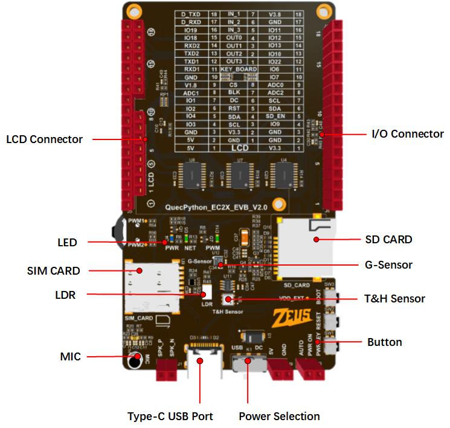

# EC2X EVB Introduction

## Quick Start

Supported module models

- [EC200U-EU](https://python.quectel.com/en/products/ec200u-eu)
- [EC200A-EU](https://python.quectel.com/en/products/ec200a-eu)
- [EC200A-AU](https://python.quectel.com/en/products/ec200a-au)

## Feature List

### Basic Overview

The QuecPython_EC2X_EVB is specifically designed for QuecPython. It is a small and portable "pocket-sized" EVB with rich features, such as temperature and humidity sensor, acceleration sensor, SIM card slot, SD card slot, LCD connector, LDR and MIC.

The EVB is equipped with a Type-C interface, so developers only need a USB Type-C cable to easily manipulate the EVB.

The EVB is equipped with the EC200U series module. For details, see [EC200U-EU](https://python.quectel.com/en/products/ec200u-eu).

### Feature Description

The main components and interface layout of the EVB are shown in the figure below.

## Document download

- [Quectel_EC200U_Series_Hardware_Design](https://images.quectel.com/python/sites/2/2023/05/Quectel_EC200U_Series_Hardware_Design_V1.2.pdf)
- [Quectel_EC200U_Series_LTE_Standard_Specification](https://images.quectel.com/python/sites/2/2023/06/Quectel_EC200U_Series_LTE_Standard_Specification_V1.2.pdf)
- [Quectel_EC200U_Series_Footprint&Part](https://images.quectel.com/python/2023/05/Quectel_EC200U_Series_FootprintPart_V1.4.zip)
- [Quectel_EC200U_Series_Reference_Design](https://images.quectel.com/python/sites/2/2023/05/Quectel_EC200U_Series_Reference_Design_V1.1.pdf)

##  Module Resources

### EVB Interface

**J5 Pin Assignment**

| Pin Header | Pin No. | Name    | Feature |
| ---------- | ------- | ------- | ------- |
| J5         | -       | VCC_5V  | 5V      |
| J5         | -       | VCC_5V  | 5V      |
| J5         | -       | GND     | Ground  |
| J5         | 24      | IO3     | GPIO3   |
| J5         | 25      | IO4     | GPIO4   |
| J5         | 26      | IO2     | GPIO2   |
| J5         | 27      | IO1     | GPIO1   |
| J5         | 44      | ADC1_IN | ADC1    |
| J5         | -       | VDD_EXT | 1.8 V   |

**J6 Pin Assignment**

| Pin Header | Pin No. | Name    | Feature                |
| ---------- | ------- | ------- | ---------------------- |
| J6         | -       | V3.3    | 3.3 V                  |
| J6         | -       | GND     | Ground                 |
| J6         | -       | GND     | Ground                 |
| J6         | 3       | IO9     | GPIO9                  |
| J6         | 119     | SD_EN   | SD card enable control |
| J6         | 142     | SDA     | I2C1                   |
| J6         | 141     | SCL     | I2C1                   |
| J6         | 43      | ADC2_IN | ADC2                   |
| J6         | 45      | ADC0_IN | ADC0                   |

**J7 Pin Assignment**

| Pin Header | Pin No. | Name | Feature |
| ---------- | ------- | ---- | ------- |
| J7         | -       | GND  | Ground  |
| J7         | 138     | RX1  | UART1   |
| J7         | 137     | TX1  | UART1   |
| J7         | 67      | TX2  | UART2   |
| J7         | 68      | RX2  | UART2   |
| J7         | 65      | IO18 | GPIO18  |
| J7         | 64      | IO19 | GPIO19  |
| J7         | 11      | D_RX | UART    |
| J7         | 12      | D_TX | UART    |

**J10 Pin Assignment**

| Pin Header | Pin No. | Name | Feature |
| ---------- | ------- | ---- | ------- |
| J10        | 136     | IO7  | GPIO7   |
| J10        | 135     | IO6  | GPIO6   |
| J10        | 127     | IO22 | GPIO22  |
| J10        | 40      | IO10 | GPIO10  |
| J10        | 39      | IO13 | GPIO13  |
| J10        | 38      | IO12 | GPIO12  |
| J10        | 37      | IO11 | GPIO11  |
| J10        | -       | GND  | Ground  |
| J10        | -       | V3.8 | 3.8 V   |

The following figure shows the pin assignment.

| Tips                                |
| ------------------------------------------------------------ |
| For more information about the EVB, please visit https://python.quectel.com/download |

### EVB Configuration

The EVB is equipped with various sensors and other peripherals. The pins of peripherals are shown in the table below.

| Pin No.   | Name                                 | Model         | Supported | Interface Type |
| --------- | ------------------------------------ | ------------- | --------- | -------------- |
| 41 and 42 | Temperature and Humidity Sensor      | AHT20         | Yes       | I2C            |
| 45        | LDR                                  | GT36528       | Yes       | ADC            |
| 41 and 42 | G-Sensor                             | QMA7981       | Yes       | I2C            |
| 75 and 77 | Microphone                           | GMI6050P-66DB | Yes       | SPK            |
| 73 and 74 | Power Amplifier Chip                 | NS4160        | Yes       | SPK            |
| 122–125   | LCD (Choose the package with screen) | ST7789        | Yes       | SPI            |
| 28–34     | SD_CARD                              | XKTF-NO2-N    | Yes       | SPI            |