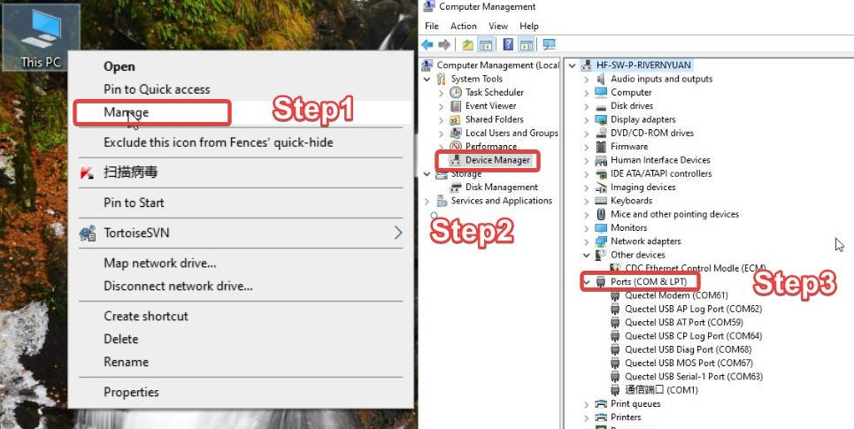
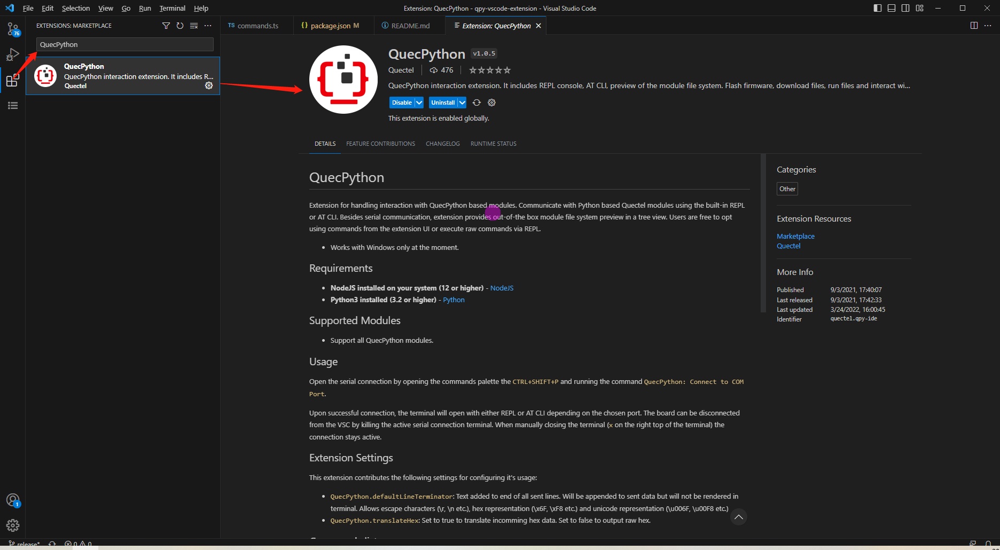

# Quick Start Guide

This document introduces how to set up the software environment for QuecPython hardware development, including how to use the Quectel EVB for development and debugging, and how to download firmware, develop code, and debug using QuecPython.

## Overview

QuecPython modules have the following advantages:

- Support multiple network modes, such as LTE-Cat 1, LTE-Cat 4, Cat-M, NB-IoT, thus offering a high cost-performance ratio.
- Comply with IEEE 802.11b/g/n/ax and Bluetooth 5.1 protocols.
- Incorporate rich network protocols, and integrate multiple industry-standard interfaces.
- Support various drivers and software functions (applicable to USB drivers in OS such as Windows 7/8/8.1/10/11, Linux, and Android).
- Improve the efficiency of IoT development by using Python language.

Quectel provides step-by-step user guides, operation instructions, and instructional videos to help you use QuecPython from scratch. At the same time, rich technical support is available throughout your development process. QuecPython solutions can meet the industry demands of POS, POC, ETC, shared devices, data cards, energy control, security, industrial-grade PDAs, etc.

### Supported Modules

| Region/Network Mode | Cat-1                                                        | Cat-4                                                        | Cat-M                                                        | NB-IoT                                                       | Wi-Fi                                                     |
| ------------------- | ------------------------------------------------------------ | ------------------------------------------------------------ | ------------------------------------------------------------ | ------------------------------------------------------------ | --------------------------------------------------------- |
| Domestic            | [EG810M-CN](https://python.quectel.com/products/eg810m-cn)<br/>[EC800E-CN](https://python.quectel.com/products/ec800e-cn)<br/>[EC600E-CN](https://python.quectel.com/products/ec600e-cn)<br/>[EC600G-CN](https://python.quectel.com/products/ec600g-cn)<br/>[EC800G-CN](https://python.quectel.com/products/ec800g-cn)<br/>[EC200N-CN](https://python.quectel.com/products/ec200n-cn)<br/>[EC800M-CN](https://python.quectel.com/products/ec800m-cn)<br/>[EC600M-CN](https://python.quectel.com/products/ec600m-cn)<br/>[EC200U-CN](https://python.quectel.com/products/ec200u-cn)<br/>[EC600U-CN](https://python.quectel.com/products/ec600u-cn)<br/>[EC600N-CN](https://python.quectel.com/products/ec600n-cn) | [EC200A-CN](https://python.quectel.com/products/ec200a-cn)<br/> | /                                                            | [BC25](https://python.quectel.com/products/bc25)             | [FCM360W](https://python.quectel.com/cn/products/fcm360w) |
| Overseas            | [EG915U-EU](https://python.quectel.com/en/products/eg915u-eu)<br/>[EG915N-EU](https://python.quectel.com/en/products/eg915n-eu)<br/>[EG912U-GL](https://python.quectel.com/en/products/eg912u-gl)<br/>[EG912N-EN](https://python.quectel.com/en/products/eg912n-en)<br/>[EC200U-EU](https://python.quectel.com/en/products/ec200u-eu)<br/>[EC600U-EU](https://python.quectel.com/en/products/ec600u-eu) | [EC200A-EU](https://python.quectel.com/en/products/ec200a-eu)<br/>[EC200A-AU](https://python.quectel.com/en/products/ec200a-au) | [BG77](https://python.quectel.com/en/products/bg77)<br/>[BG95-M1](https://python.quectel.com/en/products/bg95m1)<br/>[BG95-M3<br/>](https://python.quectel.com/en/products/bg95m3)[BG95-M8](https://python.quectel.com/en/products/bg95m3) | [BG77](https://python.quectel.com/en/products/bg77)<br/>[BG95-M3<br/>](https://python.quectel.com/en/products/bg95m3)[BG95-M8](https://python.quectel.com/en/products/bg95m3) | [FCM360W](https://python.quectel.com/en/products/fcm360w) |

## Preparations

Hardware:

- A [**QuecPython_EC2X_EVB**](EC2X_EVB.md) (For detailed information about the EVB, see the EVB list below.)
- **USB-A to USB-C cable** 
- **PC** (Windows7 & Windows10 & Windows11)

EVB List:

- [EC2X_EVB](EC2X_BOARD.md)
- [FCM360W-TE-B](FCM360W-TE-B.md)

Software:

- Download and install the **USB driver** for developing and debugging QuecPython modules.
- Download the **debugging tool** — QPYcom (QuecPython full-stack development debugging tool).
- Get the **QuecPython** firmware and related software resources.
- Install a **text editor** for the **Python language**, such as [VSCode](https://code.visualstudio.com/).

## Procedure

Please follow the steps below to set up a development environment and develop your first script.

1. <a href="#info_1">**Hardware Preparation**</a>
2. <a href="#info_2">**Driver Preparation**</a>
3. <a href="#info_3">**Get Tool**</a>
4. <a href="#info_4">**Install VSCode Extension**</a>
5. <a href="#info_5">**Get Firmware**</a>
6. <a href="#info_6">**Download Firmware**</a>
7. <a href="#info_7">**Debug in REPL**</a>
8. <a href="#info_8">**Develop Your First Script**</a>

## <a id="info_1">Hardware Preparation</a>

>  First, you need a PC in Windows 10 or above.

- **Step 1**: Install the antenna that matches with the EVB at the antenna base, and insert the SIM card into the SIM card slot on the EVB (SIM card insertion can be omitted for the Wi-Fi EVB).
- **Step 2:** Supply the power of EVB by connecting the Type-C interface of the EVB and the USB port of the PC with a USB Type-C cable.
- **Step 3:** Toggle the power selection switch on the EVB between USB and DC to the USB position, and short the PWK_ON jumper on the EVB to AUTO (automatic power-on).
- **Step 4:** Keep pressing PWK until the power indicator light on the main board is on (the light marked POW on the main board). If the previous step shorted PWK_ON, there is no need to long press PWK.

<font color='red'>**After performing the operations above, the POW light is always on, indicating that the EVB is successfully powered on.**</font>

## <a id="info_2">Driver Preparation</a>

- **Step 1:** Download Driver

The "device driver" is a special program that allows the PC to communicate with and the device. Only through this interface can the OS control the hardware device.

Open the [driver download link](https://python.quectel.com/en/download), select the driver that matches your module model and PC OS, and click the download icon.


- **Step 2:** Install the Driver

After downloading, unzip the driver package, find **"setup.exe"** or **"setup.bat"** and double-click to run it. After installation, open the "Device Manager" and you can see that the yellow exclamation mark in the port has disappeared, indicating that the installation is successful and your PC can communicate with the device normally.

*It is normal for devices such as <font color='red'>Mobile ECM Network Adapter</font> or <font color='red'>CDC Ethernet Control Model (ECM)</font> to not be recognized, which does not affect firmware download and subsequent development and can be ignored.*

Right-click to open **"My Computer"** — select **"Computer Management"** — select **"Device Manager"**, and then select **"Ports"** in the "Device Manager".

After opening the page by following the steps above, you can refresh the page and see whether there are ports starting with **Quectel USB**". If the ports starting with "**Quectel USB**" exist, the USB driver installation is successful.

**After the driver is installed**



## <a id="info_3">Get Tool</a>

To develop with QuecPython, you need a specialized development and debugging tool — **QPYcom**. This tool is used for debugging code, analyzing logs, transferring files, downloading firmware, merging firmware, and more.

[QPYcom](https://python.quectel.com/download) is a one-stop debugging tool for QuecPython development. 

*Note: This tool does not need to be installed. Just unzip and use it. It is recommended to manually disable any anti-virus software installed on your system in advance to avoid potential false positives that could lead to the tool being mistakenly deleted or unusable.*

## <a id="info_4">Install VSCode Extension</a>

When editing Python codes, you will use an IDE that is either dedicated to Python or compatible with multiple languages, which can significantly improve development efficiency. Here, we recommend VSCode.

For VScode, QuecPython has launched a dedicated extension to implement code hints, code completion, and serial port debugging. The installation method is shown below.

- In VSCode, click the extension marketplace in the sidebar. In the extension marketplace, search for "QuecPython" and download the extension based on the search result.



- You can also search for "QuecPython" in the [VSCode Extension Marketplace](https://marketplace.visualstudio.com/vscode). After downloading the extension based on the search result, VSCode will automatically be opened and installed.

  

## <a id="info_5">Get Firmware</a>

Standard AT firmware or QuecOpen firmware is usually downloaded into a module when the module leaves the factory. If you want to develop the module based on QuecPython, you need to manually re-download the dedicated QuecPython firmware into it.

The official firmware download URL is https://python.quectel.com/download. You can download the corresponding firmware according to the module model.


> After downloading the firmware zip file to your PC, you need to unzip it. After unzipping, you can get two files. The .bin, .lod or .pac file is the QuecPython firmware, and the .md file is the update logs.

>  Please be sure to unzip the file to a path that does **not contain any Chinese characters, spaces or special characters**. Otherwise, the download tool may not correctly recognize the firmware. Also, the path of the download tool **cannot contain any Chinese characters, spaces and special characters.**

## <a id="info_6">Download Firmware</a>

- **Step 1:** Make sure the module is connected to your PC and has been powered on. Open *QPYcom*, click the "**Download**" tab and click **"Create"**  to create a new-firmware project.
- **Step 2:** Select the firmware to be downloaded to the module (Select the corresponding firmware according to the module model).
- **Step 3:** Click "▼" on the right side of **"Download script"** and select **"Download FW"** in the drop-down list.
- **Step 4:** Click **"Download FW"** to start downloading the firmware. The download progress percentage will be displayed on the progress bar. A prompt window will be popped up when the firmware is successfully downloaded.


## <a id="info_7">Debug in REPL</a>

REPL stands for Read-Eval-Print-Loop (interactive interpreter). You can debug QuecPython programs in REPL.

Open **QPYcom**, select the correct serial port (no need to specify the baud rate) and open it to start Python command line interaction.

- **Step 1:** Open QPYcom, set "COM Port" to **"Quectel USB MI05 COM Port"**, and click the "REPL" tab.
- **Step 2:** Click "**Open port**", enter **print('hello world')** on the "REPL" page, and press "**Enter**" to view the execution result.

```python
>>> print('hello world')
hello world
```


<font color='red'>*Note: Only English characters can be entered on the "REPL" page, and Chinese characters will be blocked.*</font>

## <a id="info_8">Develop Your First Script</a>

### Write Your First Script File

Create a *helloworld.py* file to output "hello world". The script is as follows:

```python
print("hello world")
```

Use QPYcom to download the edited file above to the module and run the file.


### Transfer Files Between PC and Module

**Download Method 1:**


- **Step 1:** Set "COM Port" to the module's interaction port and click "**Open port**".
- **Step 2:** Click the "**File**" tab and upload or delete files by clicking "**+**" or "**-**" on the right side of the page.
- **Step 3:** You can also drag and drop the local files (or folders) displayed on the left side of the page to the module on the right.
- **Step 4:** The name of the downloaded file and the download progress will be displayed in the status bar.

**Download Method 2:**


- **Step 1:** Click "**Create**" to create a project according to your needs and execute the steps in "Download Firmware".
- **Step 2:** Select the script to be downloaded to the module (Right click the script file in the "User scripts/files" section).
- **Step 3:**  Click "▼" on the right side of **"Download script"** and select **"Download script"** in the drop-down list.
- **Step 4:** Click **"Download script"** to start downloading the script. The download progress percentage will be displayed on the progress bar.

### Run Script

- **Step 1:** Download the script file to be run in the module.
- **Step 2:** After opening the port, enter the following codes on the QPYcom "REPL" page to run the script file.

```python
import example
example.exec("/usr/helloworld.py") # The file path is the path of the script file to be run.
```

- **Step 3:** Or select the script file and click "**▷**" on the "File" page to run the script.

The execution result is as follows:


### Stop a Running Program

Depending on the type of running script file, there are the following methods to stop it:

<table valign="center">
    <tr>
		<td>Program </br>name is "main.py"</td>
		<td>Program </br>Contains Endless Loop</td>
		<td>Program </br>Uses Multithreading</td>
		<td valign="middle">Stop Steps</td>
	</tr>
    <tr>
		<td rowspan="4">✓</td>
		<td rowspan="2">✓</td>
		<td rowspan="1">✓</td>
		<td>1. Press "Ctrl + A" to enter RAW mode <br> 2. Press "Ctrl + D" to restart the QuecPython virtual machine <br> 3. Press "Ctrl + B" to return to normal interaction mode <br> 4. If the above methods are ineffective, please re-download the firmware</td>
	</tr>
	<tr>
		<td rowspan="1">✗</td>
		<td>1. Press "Ctrl + C" to interrupt the program execution <br> 2. If the above method is ineffective, please re-download the firmware</td>
	</tr>
	<tr>
		<td rowspan="2">✗</td>
		<td rowspan="1">✓</td>
		<td>1. Press "Ctrl + A" to enter RAW mode <br> 2. Press "Ctrl + D" to restart the QuecPython virtual machine <br> 3. Press "Ctrl + B" to return to normal interaction mode <br> 4. If the above methods are ineffective, please wait patiently for the program to finish running</td>
	</tr>
	<tr>
		<td rowspan="1">✗</td>
		<td>1. Press "Ctrl + C" to interrupt the program execution <br> 2. If the above method is ineffective, please re-download the firmware</td>
	</tr>
	<tr>
		<td rowspan="4">✗</td>
		<td rowspan="2">✓</td>
		<td rowspan="1">✓</td>
		<td>1. Press "Ctrl + D" to restart the QuecPython virtual machine <br> 2. If the above method is ineffective, please reboot the module</td>
	</tr>
	<tr>
		<td rowspan="1">✗</td>
		<td>1. Press "Ctrl + D" to restart the QuecPython virtual machine <br> 2. If the above method is ineffective, please reboot the module</td>
	</tr>
	<tr>
		<td rowspan="2">✗</td>
		<td rowspan="1">✓</td>
		<td>1. Press "Ctrl + C" to interrupt the program execution <br> 2. If the above method is ineffective, please re-download the firmware or reboot the module</td>
	</tr>
	<tr>
		<td rowspan="1">✗</td>
		<td>1. Press "Ctrl + C" to interrupt the program execution <br> 2. If the above method is ineffective, please re-download the firmware or reboot the module</td>
	</tr>
</table>