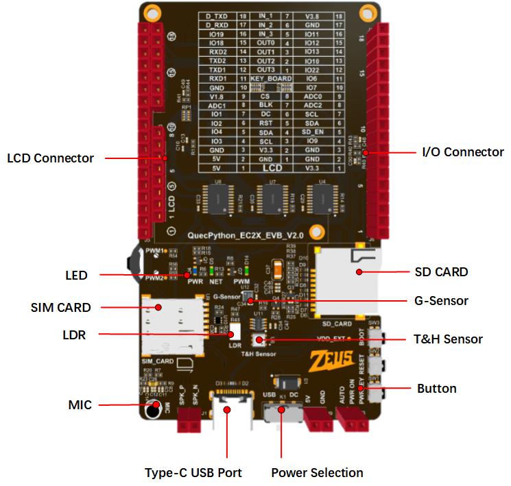

# EC2X开发板介绍

## 支持的模组列表

- [EC200A-CN](https://python.quectel.com/products/ec200a-cn)
- [EC200U-CN](https://python.quectel.com/products/ec200u-cn)
- [EC200A-EU](https://python.quectel.com/en/products/ec200a-eu)
- [EC200A-AU](https://python.quectel.com/en/products/ec200a-au)

## 功能列表

### 基本概述

QuecPython_EC2X_EVB_Vx.x 开发板是专门针对QuecPython制造，是一款小巧便携的“口袋型”开发板。体型虽小，但是功能丰富，拥有温湿度传感器、加速度传感器、SIM卡座、SD卡座、LCD接口、光敏电阻、MIC等元件。

开发板搭载Type-C接口，开发者仅需一条USB Type-C 数据线即可轻松玩转开发板。

开发板搭载EC200U模组，详细资料参考 [EC200U-EU](https://python.quectel.com/en/products/ec200u-eu)

### 功能说明

开发板的主要组件、接口布局见下图

## 资料下载

- [EC200U系列模组硬件设计手册（PDF）](https://images.quectel.com/python/2023/04/Quectel_EC200U%E7%B3%BB%E5%88%97_QuecOpen_%E7%A1%AC%E4%BB%B6%E8%AE%BE%E8%AE%A1%E6%89%8B%E5%86%8C_V1.1.pdf)
- [EC200U系列模组产品规格书（PDF）](https://images.quectel.com/python/2023/04/Quectel_EC200U%E7%B3%BB%E5%88%97_LTE_Standard_%E6%A8%A1%E5%9D%97%E4%BA%A7%E5%93%81%E8%A7%84%E6%A0%BC%E4%B9%A6_V1.2.pdf)
- [EC200U系列模组封装（ZIP）](https://images.quectel.com/python/2023/05/Quectel_EC200U_Series_FootprintPart_V1.4.zip)
- [EC200U系列模组参考设计手册（PDF）](https://images.quectel.com/python/2023/05/Quectel_EC200U%E7%B3%BB%E5%88%97_%E5%8F%82%E8%80%83%E8%AE%BE%E8%AE%A1%E6%89%8B%E5%86%8C_V1.2.pdf)

## 模组资源

### 开发板接口

**J5排针管脚分配表**

| 排针 | 编号 | 名称    | 引脚 | 功能  |
| ---- | ---- | ------- | ---- | ----- |
| J5   | 1    | VCC_5V  | -    | 5V    |
| J5   | 2    | VCC_5V  | -    | 5V    |
| J5   | 3    | GND     | -    | 接地  |
| J5   | 4    | IO3     | 24   | GPIO3 |
| J5   | 5    | IO4     | 25   | GPIO4 |
| J5   | 6    | IO2     | 26   | GPIO2 |
| J5   | 7    | IO1     | 27   | GPIO1 |
| J5   | 8    | ADC1_IN | 44   | ADC1  |
| J5   | 9    | VDD_EXT | -    | 1.8V  |

**J6排针管脚分配表**

| 排针 | 编号 | 名称    | 引脚 | 功能     |
| ---- | ---- | ------- | ---- | -------- |
| J6   | 1    | V3.3    | -    | 3.3V     |
| J6   | 2    | GND     | -    | 接地     |
| J6   | 3    | GND     | -    | 接地     |
| J6   | 4    | IO9     | 3    | GPIO9    |
| J6   | 5    | SD_EN   | 119  | SD卡使能 |
| J6   | 6    | SDA     | 142  | I2C1     |
| J6   | 7    | SCL     | 141  | I2C1     |
| J6   | 8    | ADC2_IN | 43   | ADC2     |
| J6   | 9    | ADC0_IN | 45   | ADC0     |

**J7排针管脚分配表**

| 排针 | 编号 | 名称 | 引脚 | 功能   |
| ---- | ---- | ---- | ---- | ------ |
| J7   | 1    | GND  | -    | 接地   |
| J7   | 2    | RX1  | 138  | UART1  |
| J7   | 3    | TX1  | 137  | UART1  |
| J7   | 4    | TX2  | 67   | UART2  |
| J7   | 5    | RX2  | 68   | UART2  |
| J7   | 6    | IO18 | 65   | GPIO18 |
| J7   | 7    | IO19 | 64   | GPIO19 |
| J7   | 8    | D_RX | 11   | UART   |
| J7   | 9    | D_TX | 12   | UART   |

**J10排针管脚分配表**

| 排针 | 编号 | 名称 | 引脚 | 功能   |
| ---- | ---- | ---- | ---- | ------ |
| J10  | 1    | IO7  | 136  | GPIO7  |
| J10  | 2    | IO6  | 135  | GPIO6  |
| J10  | 3    | IO22 | 127  | GPIO22 |
| J10  | 4    | IO10 | 40   | GPIO10 |
| J10  | 5    | IO13 | 39   | GPIO13 |
| J10  | 6    | IO12 | 38   | GPIO12 |
| J10  | 7    | IO11 | 37   | GPIO11 |
| J10  | 8    | GND  | -    | 接地   |
| J10  | 9    | V3.8 | -    | 3.8V   |

开发板主要管脚布局见下图

| 小提示                              |
| ------------------------------------------------------------ |
| 开发板的更多资料，请访问 <https://python.quectel.com/download> |

### 开发板配置

开发板配备了多种传感器，以及其他外设。外设资源管脚分配表明细如下：

| 序号 | 名称                         | 型号          | 是否支持 | 接口类型 | 引脚    |
| ---- | ---------------------------- | ------------- | -------- | -------- | ------- |
| 1    | 温湿度传感器                 | AHT20         | 是       | I2C      | 41,42   |
| 2    | 光敏电阻                     | GT36528       | 是       | ADC      | 45      |
| 3    | G-Sensor                     | QMA7981       | 是       | I2C      | 41,42   |
| 4    | 麦克风                       | GMI6050P-66DB | 是       | SPK      | 75,77   |
| 5    | 功放芯片                     | NS4160        | 是       | SPK      | 73,74   |
| 6    | LCD 显示屏（需选择含屏套餐） | ST7789        | 是       | SPI      | 122~125 |
| 7    | SD_CARD                      | XKTF-NO2-N    | 是       | SPI      | 28~34   |

## 上手准备

> 首先需要有一台运行有 Windows 10 以上 操作系统的电脑

- **Step1：天线安装**

安装开发板配套的天线,安装位置为LTE天线座位置,并将SIM卡插入开发板上的SIM卡座，如需使用GNSS或者BTWIFI功能，则需在对应的天线座安装天线

- **Step2：开发板连接**

使用USB Type-C数据线连接开发板的Type-C接口和电脑USB口即可完成供电

- **Step3：开发板电源设置**

开发板上USB和DC的电源选择开关拨到USB处,开发板上的PWK_ON跳帽短接AUTO(上电自动开机)

- **Step4：开发板开机**

按住PWK直至主板上电源指示灯亮（主板上丝印为POW的灯）,如果上一步短接PWK_ON则无需长按PWK自动开机

**执行以上操作后POW灯常亮即开机成功**