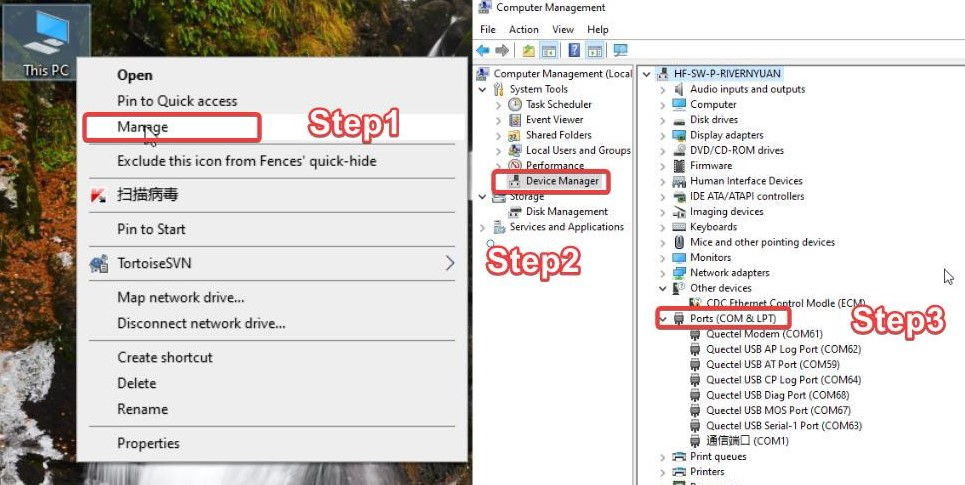
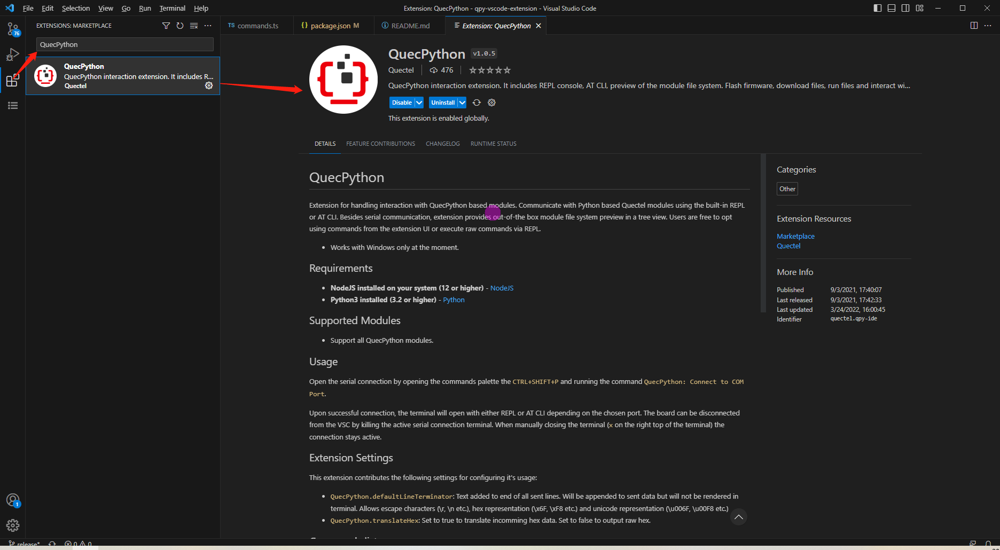
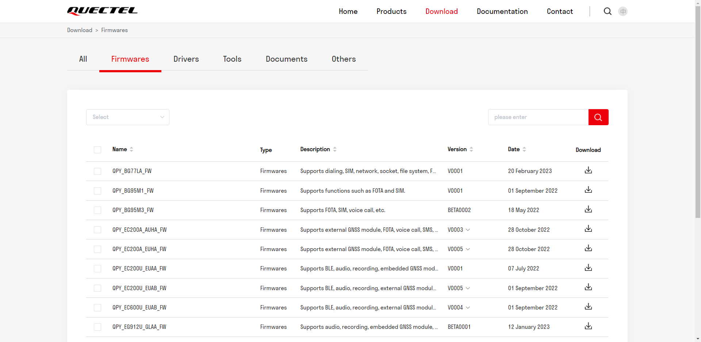
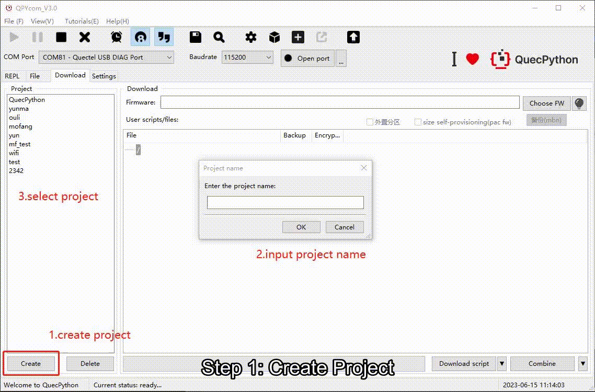
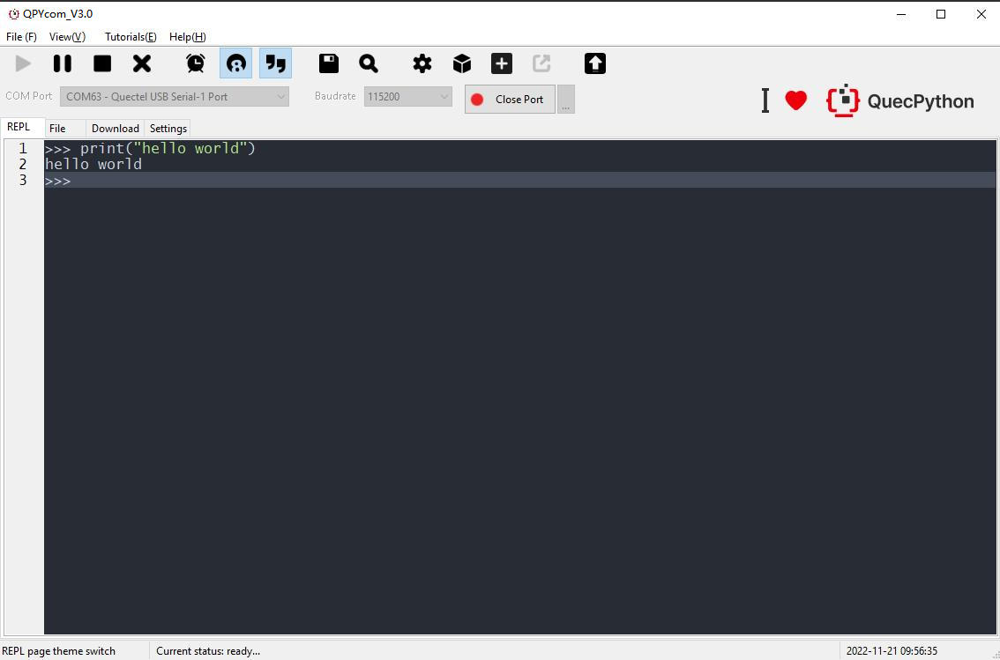
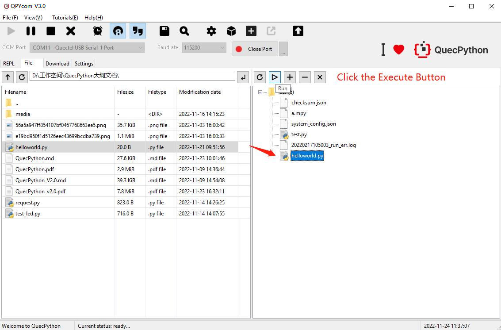
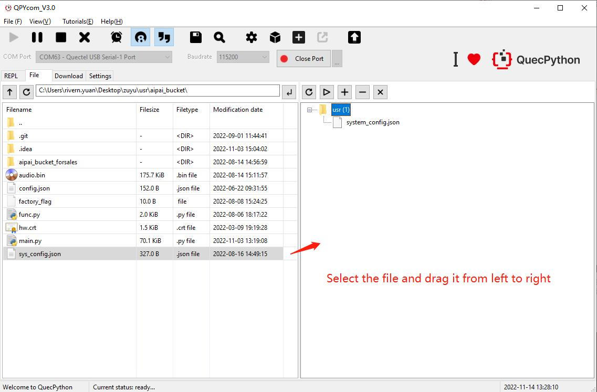
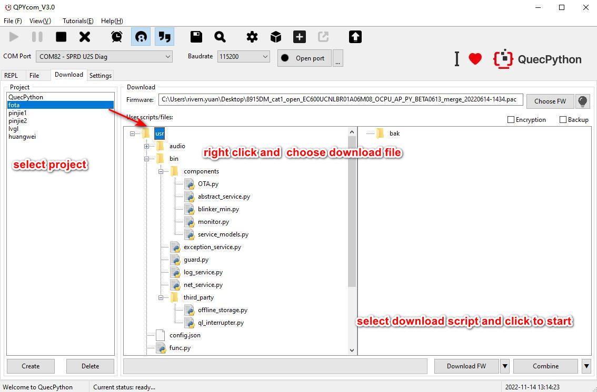
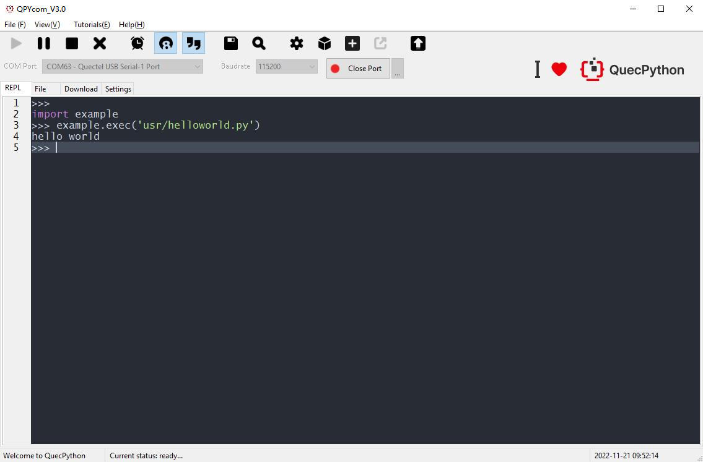

  Win10  Win10快速入门

本文档旨在指导用户搭建QuecPython硬件开发的软件环境，通过一个简单的示例展示如何使用官方的开发板进行开发调试，并使用QuecPython进行固件下载、代码开发和调试等步骤。

## 概述

QuecPython模组具有以下优势

- 支持Cat 1、Cat 4、Cat M、NB等多种网络制式，具有超高性价比
- 持IEEE 802.11b/g/n/ax和蓝牙5.1协议
- 内置丰富的网络协议，集成多个工业标准接口
- 支持多种驱动和软件功能（适用于Windows 7/ 8/ 8.1/ 10/ 11、Linux 和 Android 等操作系统下的 USB 驱动）
- 使用Python语言开发，大大提升了传统物联网开发的效率

移远提供了手把手的入门文档、教学文档和教学视频，用户可以从零入手学习QuecPython的使用，同时丰富的技术支撑全程为用户开发提供服务。可以满足如POS、POC、ETC、共享设备、数据卡、能源控制、安防以及工业级 PDA 等多方面的行业需求。

### 当前支持的模组

| 区域/网络制式 | Cat 1                                                        | Cat 4                                                        | Cat M                                                        | NB                                                           | WIFI                                                      |
| ------------- | ------------------------------------------------------------ | ------------------------------------------------------------ | ------------------------------------------------------------ | ------------------------------------------------------------ | --------------------------------------------------------- |
| 国内          | [EG810M-CN](https://python.quectel.com/products/eg810m-cn)<br/>[EC800E-CN](https://python.quectel.com/products/ec800e-cn)<br/>[EC600E-CN](https://python.quectel.com/products/ec600e-cn)<br/>[EC600G-CN](https://python.quectel.com/products/ec600g-cn)<br/>[EC800G-CN](https://python.quectel.com/products/ec800g-cn)<br/>[EC200N-CN](https://python.quectel.com/products/ec200n-cn)<br/>[EC800M-CN](https://python.quectel.com/products/ec800m-cn)<br/>[EC600M-CN](https://python.quectel.com/products/ec600m-cn)<br/>[EC200U-CN](https://python.quectel.com/products/ec200u-cn)<br/>[EC600U-CN](https://python.quectel.com/products/ec600u-cn)<br/>[EC600N-CN](https://python.quectel.com/products/ec600n-cn) | [EC200A-CN](https://python.quectel.com/products/ec200a-cn)<br/> | /                                                            | [BC25](https://python.quectel.com/products/bc25)             | [FCM360W](https://python.quectel.com/cn/products/fcm360w) |
| 海外          | [EG915U-EU](https://python.quectel.com/en/products/eg915u-eu)<br/>[EG915N-EU](https://python.quectel.com/en/products/eg915n-eu)<br/>[EG912U-GL](https://python.quectel.com/en/products/eg912u-gl)<br/>[EG912N-EN](https://python.quectel.com/en/products/eg912n-en)<br/>[EC200U-EU](https://python.quectel.com/en/products/ec200u-eu)<br/>[EC600U-EU](https://python.quectel.com/en/products/ec600u-eu) | [EC200A-EU](https://python.quectel.com/en/products/ec200a-eu)<br/>[EC200A-AU](https://python.quectel.com/en/products/ec200a-au) | [BG77](https://python.quectel.com/en/products/bg77)<br/>[BG95-M1](https://python.quectel.com/en/products/bg95m1)<br/>[BG95-M3<br/>](https://python.quectel.com/en/products/bg95m3)[BG95-M8](https://python.quectel.com/en/products/bg95m3) | [BG77](https://python.quectel.com/en/products/bg77)<br/>[BG95-M3<br/>](https://python.quectel.com/en/products/bg95m3)[BG95-M8](https://python.quectel.com/en/products/bg95m3) | [FCM360W](https://python.quectel.com/en/products/fcm360w) |


## 准备工作

硬件：

- 一块 [**QuecPython_EC2X_EVB**](EC2X_EVB.md) 开发板 (开发板介绍参见下文开发板列表)
- **USB 数据线** (USB-A TO USB-C)
- **PC** (Windows7 & Windows10 & Windows11)

开发板列表:

- [EC2X_EVB](EC2X_BOARD.md)
- [FCM360W-TE-B](FCM360W-TE-B.md)

软件：

- 下载安装 **USB驱动**，用于开发调试QuecPython模组
- 下载**调试工具** —— QuecPython全栈式开发调试工具
- 获取下载 **QuecPython** 固件和相关软件资源
- 安装**Python语言**的 **文本编辑器**，例如 [VSCode](https://code.visualstudio.com/)

## 详细步骤

请根据下方详细步骤，完成开发环境搭建和第一个脚本的开发。

- <a href="#info_1">**第一步：硬件准备**</a>
- <a href="#info_2">**第二步：驱动准备**</a>
- <a href="#info_3">**第三步：获取工具**</a>
- <a href="#info_4">**第四步：安装VScode插件**</a>
- <a href="#info_5">**第五步：获取固件**</a>
- <a href="#info_6">**第六步：烧录固件**</a>
- <a href="#info_7">**第七步：REPL调试**</a>
- <a href="#info_8">**第八步：编写第一个脚本**</a>

## <a id="info_1">硬件准备</a>

> 首先需要有一台运行有 Windows 10 以上 操作系统的电脑

- <font color='red'>**Step1：天线安装**</font>

安装开发板配套的天线,安装位置为LTE天线座位置,并将SIM卡插入开发板上的SIM卡座(Wi-Fi开发板无需插入SIM卡)

- <font color='red'>**Step2：开发板连接**</font>

使用USB Type-C数据线连接开发板的Type-C接口和电脑USB口即可完成供电

- <font color='red'>**Step3：开发板电源设置**</font>

开发板上USB和DC的电源选择开关拨到USB处,开发板上的PWK_ON跳帽短接AUTO(上电自动开机)

- <font color='red'>**Step4：开发板开机**</font>

按住PWK直至主板上电源指示灯亮（主板上丝印为POW的灯）,如果上一步短接PWK_ON则无需长按PWK

<font color='red'>**执行以上操作后POW灯常亮即开机成功**</font>

## <a id="info_2">驱动准备</a>

- <font color='red'>**Step1：驱动下载**</font>

驱动程序（device driver）全称为“设备驱动程序”，是一种可以使计算机和设备通信的特殊程序，操作系统只能通过这个接口，才能控制硬件设备的工作。

打开[驱动下载链接](https://python.quectel.com/download)，先选择驱动栏，然后在驱动栏选择与自己模组型号和电脑系统匹配的驱动，点击下载按钮即可

不同平台的模组所需要的驱动程序不一致，需要根据模组型号去下载对应的驱动包

| 模组型号                                                     | 平台  | 驱动名称                                       |
| ------------------------------------------------------------ | ----- | ---------------------------------------------- |
| [EC200A-CN](https://python.quectel.com/products/ec200a-cn)   | Win10 | **QuecPython_USB_Driver_Win10_A**              |
| [BG77](https://python.quectel.com/en/products/bg77)<br/>[BG95-M3](https://python.quectel.com/en/products/bg95m3)<br/>[BG95-M8](https://python.quectel.com/en/products/bg95m8) | Win10 | Win10**Win10****QuecPython_USB_Driver_Win10_BG |
| [EC800E-CN](https://python.quectel.com/products/ec800e-cn)<br/>[EC600E-CN](https://python.quectel.com/products/ec600e-cn) | Win10 | **QuecPython_USB_Driver_Win10_E**              |
| [EC200N-CN](https://python.quectel.com/products/ec200n-cn)<br/>[EC800M-CN](https://python.quectel.com/products/ec800m-cn)<br/>[EC600N-CN](https://python.quectel.com/products/ec600n-cn)<br/>[EC600M-CN](https://python.quectel.com/products/ec600m-cn) | Win10 | **QuecPython_USB_Driver_Win10_M_N**            |
| [EC600U-CN](https://python.quectel.com/products/ec600u-cn)<br/>[EC600G-CN](https://python.quectel.com/products/ec600g-cn)<br/>[EC800G-CN](https://python.quectel.com/products/ec800g-cn) | Win10 | **QuecPython_USB_Driver_Win10_U_G**            |


- <font color='red'>**Step2：驱动安装**</font>

下载后解压驱动压缩包，找到**"setup.exe"** 或者是**"setup.bat"**，双击运行即可，安装完之后打开设备管理器就可以看到设备管理器中端口的黄色感叹号消失了，说明安装成功，能够正常通信。

*出现 <font color='red'>Mobile ECM Network Adapter </font>或 <font color='red'>CDC Ethernet Control Modle (ECM) </font>等设备未被识别属于正常现象，不影响固件烧录和后续开发，无需理会。*

右键打开【**我的电脑**】——选择【**管理**】——选择【**设备管理器**】,然后在设备管理器中选择 【**端口**】

按照步骤打开页面后如图所示能刷新出**Quectel USB** 名称开头的串口则USB驱动安装成功

**安装驱动后:**



## <a id="info_3">获取工具</a>

使用QuecPython进行开发需要用到专用的开发调试工具——**QPYcom**，包括但不限于调试代码、分析日志、文件传输、烧录固件、合并固件等。

[QPYcom](hhttps://python.quectel.com/download) : 适用于QuecPython开发的一站式调试工具

*注意:该工具无需安装，解压即用，建议提前手动关闭系统中安装的防病毒软件，以避免潜在的误报导致工具被误删或者无法使用。*

## <a id="info_4">安装VSCode插件</a>

编辑Python代码一般会用到专用于Python或者兼容多种语言的IDE，可以有效提升开发效率，这里推荐VSCode

针对VScode，QuecPython推出专用插件实现代码提示、代码补全和串口调试等功能，安装方法见下图

- 在VSCode中点击侧边栏插件市场，在插件市场中搜索 “QuecPython”，根据搜索结果下载该插件即可



- 在[VSCode插件商店网站](https://marketplace.visualstudio.com/vscode) 搜索“QuecPython”，根据搜索结果下载该插件后会自动打开VSCode并安装


## <a id="info_5">获取固件</a>

模组在出厂时通常烧录有标准 AT 固件或 QuecOpen 固件，如需基于 QuecPython 对模块进行开发，需要手动为其重新烧录专门的 QuecPython 固件。

官网固件下载地址：**<https://python.quectel.com/download>** 



面对官网种类众多的固件，如何选择合适的固件包，首先需要知道使用的模组的型号，模组型号可以通过模组的镭雕或者发送AT指令来获得。

在获取到模组型号之后根据模组的型号去官网下载该模组对应的固件即可。


> 从官网下载的固件包为压缩包格式，固件压缩包下载到本地后，需进行解压。解压后可获得两个文件，其中 .bin 、.lod或 .pac 格式的是 QuecPython 固件本体，.md 格式的是更新日志。

> 请务必将压缩包内容解压至一个**不包含中文、空格和其他特殊字符**的路径下，否则下载工具可能无法正常识别到固件，同时下载工具路径也**不可包含中文、空格和其他特殊字符**。

## <a id="info_6">烧录固件</a>

- <font color='red'>**Step1：创建项目**</font>

首先确保模组连接正常并已开机，打开工具进入下载页面，点击**"创建"**项目，新建要下载的固件项目

- <font color='red'>**Step2：选择固件**</font>

选择要下载到模组的固件(根据要下载的模组型号选择对应的固件)

- <font color='red'>**Step3：设置下载模式**</font>

单击**“Download script”**右侧的下拉选择箭头，选择**"Download FW"**

- <font color='red'>**Step4：开始烧录固件**</font>

点击**"Download FW"**，开始下载固件,下载过程会有进度条和进度百分比显示，等待下载完毕会有弹窗提示下载成功



## <a id="info_7">REPL调试</a>

REPL全称为<font color='red'>**Read-Eval-Print-Loop (交互式解释器)**</font>，可以在REPL中进行QuecPython程序的调试

运行 **QPYcom** 工具后，选择正确的串口（波特率无需指定）并打开，即可开始 Python 命令行交互。

- <font color='red'>**Step1：进入交互页面**</font>

打开QPYcom工具，端口选择连接**“Quectel USB MI05 COM Port”**，选择“交互”界面

- <font color='red'>**Step2：打开串口**</font>

点击“打开串口”按钮，在交互界面输入**print(‘hello world’)**，按回车后可以看到执行的结果信息

```python
>>> print('hello world')
hello world
```



<font color='red'>*注意：工具交互页面输入时需要输入英文字符，中文字符将会被屏蔽*</font>

## <a id="info_8">开发第一个脚本</a>

### 编写第一个脚本文件

创建*helloworld.py*文件输出“hello world”，打印“hello world”，编写脚本如下所示：

```python
print("hello world")
```

通过QPYcom将上面编辑好的文件下载到模组中去并运行



### PC与模组间的文件传输

**下载方法一:**



- <font color='red'>**Step1：打开串口**</font>

首先选择模组的交互口,点击"打开串口"按钮

- <font color='red'>**Step2：通过工具按钮下载**</font>

可以通过文件页面右侧上面的 "**+**","**-**" 按钮来上传和删除文件

- <font color='red'>**Step3：通过拖拽形式下载**</font>

也可以通过拖拽的方式将文件页面左侧显示的本地文件直接拖拽到右侧模组中去（也可以拖拽文件夹）

- <font color='red'>**Step4：下载进度和结果**</font>

下载过程中会在状态栏显示下载文件名和下载进度

**下载方法二:**



- <font color='red'>**Step1：创建项目**</font>

根据需求，创建用户项目（点击"创建"按钮）,步骤同上文烧录固件

- <font color='red'>**Step2：配置要下载的文件**</font>

选择需要下载到模块的用户脚本(在"用户脚本"区域通过右键菜单添加)

- <font color='red'>**Step3：设置下载模式**</font>

左击下拉选择箭头，选择"下载脚本"，即"Download Script"

- <font color='red'>**Step4：开始下载脚本**</font>

点击"下载脚本"开始下载脚本，下载过程中有进度条提示

### 执行脚本文件

- <font color='red'>**Step1：下载脚本**</font>

将要执行的脚本文件下载到模组中去,具体步骤参考上文

- <font color='red'>**Step2：通过repl执行脚本**</font>

打开串口之后，在QPYcom交互页面输入以下代码执行脚本文件

```python
import example
example.exec("/usr/helloworld.py") # filePath为要执行的脚本文件路径
```

- <font color='red'>**Step3：通过GUI工具执行脚本**</font>

或者通过QPYcom文件页面 **执行** 按钮执行脚本文件,在工具的文件页面选择要执行的脚本文件然后点击 "**▷**"按钮

执行结果如图




### 停止程序运行

如何停止正在运行的程序,根据运行的脚本文件类型有以下方法:

<table valign="center">
    <tr>
		<td>程序名是否</br>为main.py</td>
		<td>程序中是否</br>包含了死循环</td>
		<td>程序中是否</br>使用了多线程</td>
		<td valign="middle">停止步骤</td>
	</tr>
    <tr>
		<td rowspan="4">✓</td>
		<td rowspan="2">✓</td>
		<td rowspan="1">✓</td>
		<td>（1）按 Ctrl + A 键进入 RAW 模式</br>（2）按 Ctrl + D 键重启 QuecPython 虚拟机</br>（3）按 Ctrl + B 键回到普通交互模式</br>（4）若以上方法无效，请重新烧录固件</td>
	</tr>
	<tr>
		<td rowspan="1">✗</td>
		<td>（1）按 Ctrl + C 键打断程序运行</br>（2）若以上方法无效，请重新烧录固件</td>
	</tr>
	<tr>
		<td rowspan="2">✗</td>
		<td rowspan="1">✓</td>
		<td>（1）按 Ctrl + A 键进入 RAW 模式</br>（2）按 Ctrl + D 键重启 QuecPython 虚拟机</br>（3）按 Ctrl + B 键回到普通交互模式</br>（4）若以上方法无效，请耐心等待程序运行结束</td>
	</tr>
	<tr>
		<td rowspan="1">✗</td>
		<td>（1）按 Ctrl + C 键打断程序运行</br>（2）若以上方法无效，请重新烧录固件</td>
	</tr>
	<tr>
		<td rowspan="4">✗</td>
		<td rowspan="2">✓</td>
		<td rowspan="1">✓</td>
		<td>（1）按 Ctrl + D 键重启 QuecPython 虚拟机</br>（2）若以上方法无效，请直接重启模块</td>
	</tr>
	<tr>
		<td rowspan="1">✗</td>
		<td>（1）按 Ctrl + D 键重启 QuecPython 虚拟机</br>（2）若以上方法无效，请直接重启模块</td>
	</tr>
	<tr>
		<td rowspan="2">✗</td>
		<td rowspan="1">✓</td>
		<td>（1）按 Ctrl + C 键打断程序运行</br>（2）若以上方法无效，请重新烧录固件或直接重启模块</td>
	</tr>
	<tr>
		<td rowspan="1">✗</td>
		<td>（1）按 Ctrl + C 键打断程序运行</br>（2）若以上方法无效，请重新烧录固件或直接重启模块</td>
	</tr>
</table>