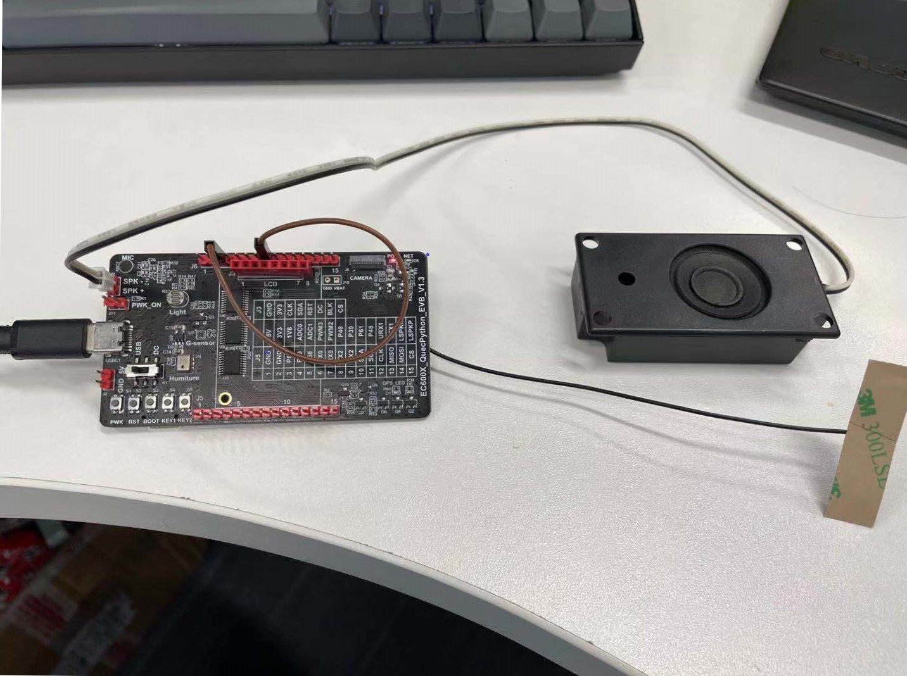

## About history

| **Version** | **Date**   | Author | **Description** |
| ----------- | ---------- | ------ | --------------- |
| 1.0         | 2021-09-31 | igni   | Initial Version |

##  Brief introduction

HTTP Live Stream (also named HLS) is a HTTP-based online streaming media play function with the advantage of realizing audio play under the circumstance of no occupancy of flash space. As a result, it can be applied to embedded application program perfectly. Currently, the EC600U platform does not only support the HTTP-based online streaming media play function, which includes the common network media format such as M4A and MP3 as well as M3U8 who serves as live based on HTTP, but also the flv online audio play in a form of RTMP. It is one of the cheapest solution with the feature of no need to buffer all media files, realizing audio multiple media play under the circumstance of no occupancy of flash space via inputting the link of corresponding resource, and lower cost. 

Kindly reminder: The RTMP live stream can be done with the SW that supporting RTMP. 

### Play live stream and its principle

* HTTP: the audio files can be downloaded from web server. After that, the device will request link to get resource and save it in cache, finally, play it. The network audio format such as m4a and mp3 is commonly used. In addition. the live with the format of M3U8  can play live stream via updating file directories with continuous m3u8 list based on HTTP. 
* RTMP, the abbreviation of Real-Time Messaging Protocol,  is developed by Adobe Systems Company for the audio, video and data transmission between flash player and server. As for its principle, the server provides the video stream with FLV format. After that, you can decode it via the info in header and play it. 

## HW connection 
Take the QuecPython EVB as an example. By plugging in antenna and SIM card, carrying out short connection to power supply of 1.8V and P40, and enabling and powering on amplifier and getting into speaker on SPK+ SPK-, you can test. 



## About API 

### Import hls library

> **from hls import hls_audio**

### Create hls object

> **hls = hls_audio(URL)**

### Links to play

> **hls.play(URL)**


| Parameter | Type   | Illustration                                                 |
| --------- | ------ | ------------------------------------------------------------ |
| URL       | string | Here shows the format: http://host\[:port][/app[/filepath]]<br>Here shows the format: rtmp://host\[:port][/app[/playpath]] |


* Function

​       Play related online filed or RTMP stream in accord with HTTP URL or RTMP URL imported by user.   Please make sure the network status after calling, following that, you can play. 


* Return value

​       None, the backstage will play related live stream as well. 

* E. g 

```python
from hls import hls_audio
hls = hls_audio()
hls.play("http://home.xiupa617.top:38080/file/down4.m4a")  #Play .m4a file
```

```python
from hls import hls_audio
hls = hls_audio()
hls.play("rtmp://58.200.131.2:1935/livetv/cctv1")  #Play RTMP audio stream
```

### Stop playing link

> **hls.close()**

* Parameter
 None, aimed at hls object


* Function

​       Stop playing current hls object


* Return value

​       None, the backstage will play related live stream and print related info

* E. g. 

```python
from hls import hls_audio
hls = hls_audio()
hls.play("http://home.xiupa617.top:38080/file/down4.m4a")  #Play .m4a file
hls.close()    #Stop playing .m4a file 
```

```python
from hls import hls_audio
hls = hls_audio()
hls.play("rtmp://58.200.131.2:1935/livetv/cctv1")  #Play RTMP audio stream
hls.close()    #Stop RTMP audio stream
```


### Seek the time of file play 

> **hls.seek_secs(second)**


| Parameter | Type | Illustration                                        |
| ---- | ------ | ------------------------------------------------------------|
| second  | long | Seek to the corresponding second |


* Function 

​       Seek to the corresponding second of the current file which is playing, limited to mp3 and m4a file. 


* Return value 

​       None, the backstage will play the corresponding live stream and print the remaining length of file. 

* E. g. 

```python
from hls import hls_audio
hls = hls_audio()
hls.play("http://home.xiupa617.top:38080/file/down4.m4a")  #Play .m4a file
hls.seek_secs(100)    #Seek to 100 second and play
```

### Adjust Volume level

> **hls.set_volume(volume)**


| Parameter | Type | Illustration                                             |
| ---- | ------ | ------------------------------------------------------------|
| volume  | int | Volume level     0~11                       |


* Function 

​       Set the volume of when playing current hls object


* Return value

​       None

* 示例：E. g. 

```python
from hls import hls_audio
hls = hls_audio()
hls.play("http://home.xiupa617.top:38080/file/down4.m4a")  #Play .m4a file
hls.set_volume(3)    #Set volume as 3
```

### Pause/play

> **hls.pause(state)**


| Parameter | Type | Illustration                                             |
| ---- | ------ | ------------------------------------------------------------|
| state  | int | 1: Pause  0: Play           |


* Function 

​        Pause and play current hls object


* Return value

​       None 

* E. g. 

```python
from hls import hls_audio
hls = hls_audio()
hls.play("http://home.xiupa617.top:38080/file/down4.m4a")  #Play .m4a file
hls.pause(1)    #Pause
hls.pause(0)	#Play
```

## Online music box

```python
from hls import hls_audio
import utime
hls = hls_audio()
hls.set_volume(3)    # Set the volume as 3
URL1 = "http://home.xiupa617.top:38080/file/down.mp3"
URL2 = "http://home.xiupa617.top:38080/file/down5.m4a"
URL3 = "http://home.xiupa617.top:38080/file/down.m3u8"

if __name__ == '__main__':
    print("start URL1")
    hls.play(URL1)
    utime.sleep(7)
    print("now jump to 30s")
    hls.seek_secs(30)
    utime.sleep(7)
    print("now jump to 40s")
    hls.seek_secs(40)
    utime.sleep(7)
    hls.close()
    utime.sleep(1)
    print("start URL2")
    hls.play(URL2)
    utime.sleep(10)
    hls.pause(1)
    print("play paused resume after 3s")
    utime.sleep(3)
    print("now resume")
    hls.pause(0)
    utime.sleep(5)
    hls.close()
    utime.sleep(1)
    print("start URL3")
    hls.play(URL3)
    utime.sleep(10)
    hls.set_volume(9)
    print("now set volume to 9")
    utime.sleep(3)
    hls.set_volume(3)
    print("now set volume to 3")
    hls.close()
    utime.sleep(1)
    print("play finshed")
```