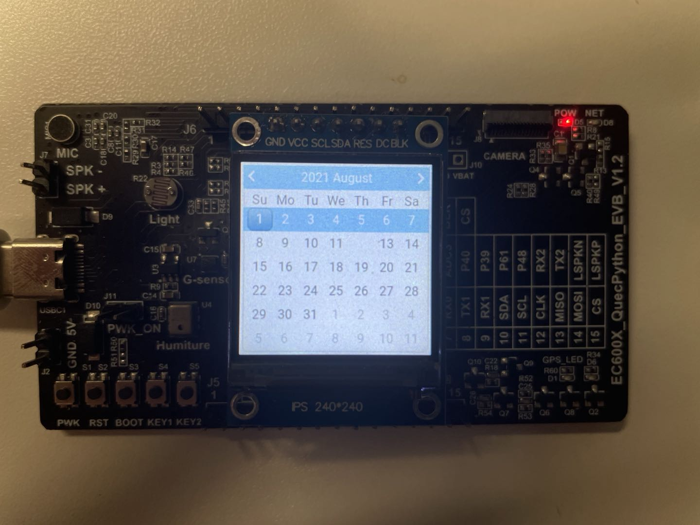
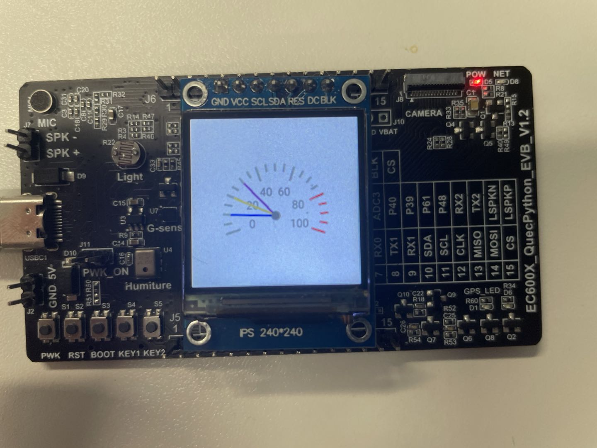
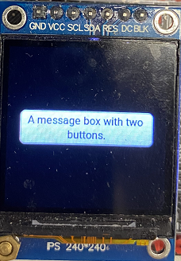

## Preamble

In this document,  it introduces how to realize the drawing of GUI via littlevgl module based on QuecPython.

## About document

**Revision history**

| **Version** | **Date**   | **Author** | **Description** |
| ----------- | ---------- | ---------- | --------------- |
| 1.0         | 2021-09-26 | felix.ye   | Initial version |


## About LVGL

###  Advantages

（1）Open-sourced

（2）Abundant components (such as buttons, diagrams and slide blocks)

（3）Standard C, Strong capability

（4）Small resource consumption（64KB flash, 16KB RAM released by official website）

（5）Support multiple input devices (button, touching panel, mouse, keyboard and etc)

（6）Multiple languages , which supports UTF-8

（7）Advanced Graphics effect:  animation, anti-aliasing, transparency and smooth scrolling. 

（8）Support multiple and various display devices.


### Lvgl HW demand 

Resource demand


**Officially** 

​	• 16,32 or 64 bit micro controller or CPU

​	• As for the clock speed, over 16MHz is recommended .

​	• Flash Memory/ROM: For vital component, which should be over 64KB (Over 180KB is preferred)

**Memory**

​	• Static RAM usage: It is about 8 to 16 KB.  which depends on the function and object type used. 

​	• Stack : Over 2KB (Over 4KB is preferred)

​	• Dynamic data:  Over 4KB (Multiple objects are used, over 16KB is preferred). You cna set LV_MEM_SIZ E in lv_conf.h

​	• Display buffer: Bigger than "horizontal resolution" pixel (over 10 × "horizontal resolution" is suggested)

**In actual scenario**

 Font library: Since we have embedded font library in RO, there is about 400KB needed. 

 Buffer： w (width) * h (height) * 2

### Lvgl structure


Bidirectional communication between application and library can be set up to create GUI,  including one HAL (HW Abstract Layer) port to register the display and input device driver program. 

​		lv_hal_disp.c ==> lv_disp_drv_register   Register display device driver. Compared with Quectel, that is a display of screen. When starting Python, it will notify and display related info such as width and buf. This port is called to register in low layer.

​		v_hal_indev.c ==> lv_indev_drv_register Register input driver (button, keyboard, touching panel and mouse)

​		lv_hal_tick.c ==> lv_tick_inc 为LVGL提供时钟支持

​                                                        Provide clock support to LVGL

### Procedure to draw lvgl


​         As above figure implies, when we call *lv_disp_drv_register*, one buf will be imported. However, once we operate for a second time, the data will be filled into the memory and call *flush_cb* afterwards (That refers to the display driver program that imported via *lv_disp_drv_register*) to display it on the entity screen. If DMA2D acceleration of LTDC is also supported (Similar to GPU, which will accelerate in many scenarios of 2D Graphics.), correspondingly, it will be moved to SDRAM via DMA and notify LVGL this drawing is complete by calling *lv_disp_flush_ready*. Finally, the next drawing can be carried out. 

## About LVGL

For more details, please refer to [Documentary on LVGL official website](https://docs.lvgl.io/6.1/).

### Objects

The littleVGL is based on object, among which the most critical is **lv_obj**. As for other specific widgets (such as button, tag and list), they are all derived from lv_obj. 

The *lv.obj()* and *lv_obj.delete* undertake the responsibility of creating and deleting object separately. 

**Basic attributes**

Every object is endowed with basic attribute, which is shown as following contents. Or it is also available to set/get attribute via lv.obj.set_.../ lv.obj.get_....

​				\* Position

​				\* Size

​				\* Parent

​				\* Drag enable

​				\* Click enable

​				\* Alignment

For details, please take the [Documentary on LVGL—objects](https://docs.lvgl.io/6.1/overview/object.html) as a reference. 

### Event

​     **Events** are triggered in LittlevGL when something happens which might be interesting to the user, e.g. if an object:

- is clicked
- is dragged
- its value has changed, etc.

​      Register **api** as *obj.set_event_cb*


- **LV_EVENT_PRESSED** The object has been pressed
- **LV_EVENT_PRESSING** The object is being pressed (sent continuously while pressing)
- **LV_EVENT_PRESS_LOST** The input device is still being pressed but is no longer on the object
- **LV_EVENT_SHORT_CLICKED** Released before `LV_INDEV_LONG_PRESS_TIME` time. Not called if dragged.
- **LV_EVENT_LONG_PRESSED** Pressing for `LV_INDEV_LONG_PRESS_TIME` time. Not called if dragged.
- **LV_EVENT_LONG_PRESSED_REPEAT** Called after `LV_INDEV_LONG_PRESS_TIME` in every `LV_INDEV_LONG_PRESS_REP_TIME` ms. Not called if dragged.
- **LV_EVENT_CLICKED** Called on release if not dragged (regardless to long press)
- **LV_EVENT_RELEASED** Called in every case when the object has been released even if it was dragged. Not called if slid from the object while pressing and released outside of the object. In this case, `LV_EVENT_PRESS_LOST` is sent.
- **LV_EVENT_DRAG_BEGIN** Dragging of the object has started
- **LV_EVENT_DRAG_END** Dragging finished (including drag throw)
- **LV_EVENT_DRAG_THROW_BEGIN** Drag throw started (released after drag with “momentum”)
- **LV_EVENT_KEY** A *Key* is sent to the object. Typically when it was pressed or repeated after a long press
- **LV_EVENT_FOCUSED** The object is focused in its group
- **LV_EVENT_DEFOCUSED** The object is defocused in its group
- **LV_EVENT_VALUE_CHANGED** The object value has changed (e.g. for a [Slider](https://docs.lvgl.io/6.1/object-types/slider.html))
- **LV_EVENT_INSERT** Something is inserted to the object. (Typically to a [Text area](https://docs.lvgl.io/6.1/object-types/ta.html))
- **LV_EVENT_REFRESH** Query to refresh the object. Never sent by the library but can be sent by the user.
- **LV_EVENT_APPLY** “Ok”, “Apply” or similar specific button has clicked. (Typically from a [Keyboard](https://docs.lvgl.io/6.1/object-types/kb.html) object)
- **LV_EVENT_CANCEL** “Close”, “Cancel” or similar specific button has clicked. (Typically from a [Keyboard](https://docs.lvgl.io/6.1/object-types/kb.html) object)
- **LV_EVENT_DELETE** The object is being deleted. Free the related user-allocated data.

For more contents, please refer to [Documentary on LVGL official website-event](https://docs.lvgl.io/6.1/overview/event.html)

### Style

 The style is used to set the appearance of the object. 

 The *lv.obj.set_style()* is aimed at basic object since every object owns its style-set function.

 Such as : *btn.set_syle()*

 Get style via *lv.obj,get_style()*

 In order to refresh the influenced objects, if there is a need to modify the style used by object, you can deploy *lv.obj.refresh_style（obj）*on every object of this style or notify all objects with assigned style via *lv.obj.report_style_mod（&style)*. However, if the parameter on *lv.obj.report_style_mod* is empty, it will notify all objects. 

Register **api** as *obj.set_event_cb*

For more details, please refer to [Documentary on LVGL official website-style](https://docs.lvgl.io/6.1/overview/style.html).

## Perform lvgl on QuecPython

**Step 1: Initialize LCD** 

Currently, we should initialize LCD beforehand since the display of LVGL is based on our various LCDs.  

Specific illustration is told on QuecPython wiki, for more details, please refer to  [Application notes on LCD](/docsite/en-us/docs/Advanced_development/Component/QuecPythonSub/LCD_adv.html).

**Step 2: Initialize LVGL to register the display device driver**

**Step 3: Register input device driver (not compulsory)**

**Step 4: Enable *tick_thread* and *handler_thread***

**Step 5: Enable own function demands**


### Register display driver

In LittleVGL, there will be multiple displays with driver program and object accompanying. 

The lvgl is corresponding to the GUI drawing, as a result, it is an necessity to register display driver. 

Here shows steps

```python
lcd.init() #Initialize LCD

lv.init()		#Initialize LVGL resource
disp_buf1 = lv.disp_buf_t()		#Provide the buf entity of lvgl display
buf1_1 = bytes(int(LCD_SIZE_W*LCD_SIZE_H*2))
lv.disp_buf_init(disp_buf1, buf1_1, None, len(buf1_1))
disp_drv = lv.disp_drv_t()
lv.disp_drv_init(disp_drv)
disp_drv.buffer = disp_buf1
disp_drv.flush_cb = lcd.lcd_write	#The method to enable its own lvgl. 
disp_drv.hor_res = LCD_SIZE_W
disp_drv.ver_res = LCD_SIZE_H
lv.disp_drv_register(disp_drv)

lv.tick_inc(5)
lv.task_handler()
```

Take [Documentary on LVGL official website-display ](https://docs.lvgl.io/6.1/overview/display.html) as a reference. 

### Register input device

Input device can be divided into several categories: 

- Similar with probe, such as touching pad or mouse 
- Keyboard 
- Encoder with left/right turn and push options
- External HW button allocated to the specific point on the screen.

If you want to accomplish it, you'd better take the following case as an example. 

```python
indev_drv = lv.indev_drv_t()
indev_drv.init() 
indev_drv.type = lv.INDEV_TYPE.POINTER	#Probe type
indev_drv.read_cb = touchpad_read		#Concrete method
indev_drv.register()
```

For specific info, please refer to [Documentary on LVGL official website -input devices](https://docs.lvgl.io/6.1/overview/indev.html).

### Arc

The arc object will draw an arc within start and end angles with a given thickness. 

For particular port, please refer to the documentary on LVGL ARC wiki (Not available now).

E. g. 

```python
def arc_demo(self,thread_id):
    print('arc demo start',thread_id)
    global arc_obj
    arc_style =  lv.style_t(lv.style_plain)
    arc_style.line.color = lv.color_make(0,0,255) 
    arc_style.line.width = 8     
    arc_obj = lv.arc(father)
    arc_obj.set_style(lv.arc.STYLE.MAIN, arc_style) 
    arc_obj.set_angles(90, 60)
    arc_obj.set_size(150, 150)
    arc_obj.align(None, lv.ALIGN.CENTER, 0, 0)
    angles = 0
    while 1:
        angles +=5
        if angles >= 359: angles = 359
        if angles < 180: arc_obj.set_angles(180-angles, 180)
        else: arc_obj.set_angles(540-a, 180)
        if angles == 359:
            angles = 0

```


<video src="media\arc.mp4"></video>


### Bar 

The **lv.bar** is composed by background and indicator for the convenience of setting separately. After that, whether in a form of horizontal or vertical, the orientation of the bar relies on the width/length ratio automatically. Logically, It is available to set the digital range of the bar via set_range port and set another new bar value via **set_value** port separately. Meanwhile, an animation to display the bar change can be selected. All in all, it is relatively easy to use this control. 

For particular port, please refer to the documentary on LVGL BAR wiki (Not available now).

E. g. 

```python
def bar_demo(self,thread_id):
    print('bar demo start',thread_id)
    bar1 = lv.bar(father)
    bar1.set_size(200, 30)
    bar1.align(None, lv.ALIGN.CENTER, 0, 0)
    bar1.set_anim_time(1000)
    while 1:
        bar1.set_value(100, lv.ANIM.ON)
        utime.sleep_ms(2000)
        bar1.set_value(0, lv.ANIM.ON)
        utime.sleep_ms(2000)

```

<video src="media\bar.mp4"></video>

### Btn  

**Lv.btn** is not only one relatively complicated variant of **lv.cont**, but also one simple rectangle object. However, its style and status will be changed when pressing or releasing. 

For particular port, please refer to the documentary on LVGL BTN wiki (Not available now).

E. g 

```python
    def lvgl_btn(self):
        btn1 = lv.btn(lv.scr_act())  # Create one button
        btn1.align(None, lv.ALIGN.CENTER, 0, -40)  # Set button location
        label = lv.label(btn1)  # Button label
        label.set_text("Button")  # Button name
        btn2 = lv.btn(lv.scr_act())  # Create one button
        btn2.align(None, lv.ALIGN.CENTER, 0, 40)  # Set button location
        btn2.set_toggle(True)  # Set as toggle button
        btn2.toggle()  # Switch button status
        btn2.set_fit2(lv.FIT.NONE, lv.FIT.TIGHT)  # Set self-adapation method of horizontal or vertical. 
        label = lv.label(btn2)  # Button label
        label.set_text("Toggled")  # Button name
```


### Button matrix

The **lv.btnm** can be considered as series of collections of pseudo-buttons. However, all sub buttons are arranged with an ordered row and column. Moreover, the "***m***" contained in the name is the abbreviation of "***matrix***". Please note that one character "***pesudo***"  added here on purpose, which means that it is not the real **lv.btn** object but the figure with button appearance drawn by internal **lv.btnm**.

However, this figure is featured with the same clicking effect as **lv.btn** and endowed with no memory consumption (about 8 bytes). To some extent, it is a optimization of littleVGL. As a result, it is preferred to use **lv.btnm** instead of the scheme with a combination of *lv_cont* and *lv_btn* under the circumstance that you own application scenarios of multiple button collections. 

The **lv.btnm** is endowed with the capability to set text title to every pseudo button and relative size; meanwhile, it can set various controlling attributes of inner buttons such as visibility and disability status *via lv.`btnm`.set_btn_ctrl* port.

Besides that, similar with **lv.label** object, the **lv.btnm** is equipped with the feature of recoloring text and exclusive "One toggle" that can be enabled via *lv.`btnm`.set_one_toggle* port . While after enabling, only at most one key is allowed to be in switch status at the same time. Once the inner button of the **lv.btnm** is clicked or long-pressed repeatedly, it will send *lv.EVENT.VALUE_CHANGED* to its event callback function.

Also the button ID will be transferred via event self-definition data. Therefore, it would be convenient for us to get the button ID in event callback function via following codes: *btn_id = obj.get_active_btn_text(); print (“ The current button ID : %s” , % btn_id)*. Apart from this method, it is also available to get the button ID via the  *lv.`btnm`.get_active_btn()* port. Please bear in mind that it will also send *lv.EVENT.VALUE_CHANGED* instead of  *lv.EVENT.LONG_PRESSED_REPEAT*  mentioned beforehand when the button was long pressed repeatedly.

By the way, you can change the attribute if you want to make the long-pressed effect of the button invalid.  The last but not the least, when talking about the permutation method of the inner **lv.btnm** object, it is arranged from the left to the right and from up to down with unique ID appended to every single button. It is also same to ID when talking about the permutation method, it starts form 0 and added by 1 on turn.

All in all, it is a little complicate for us to take charge of **lv.btnm**; however, it is implemented with strong capabilities. Take the **lv.kb** as an example, it also depends on **lv.btnm**.  

For particular port, please refer to the documentary on LVGL BTNM wiki (Not available now).

E .g. 

```python
def btnm_handler(obj, event):  # LVGL callback function
    if event == lv.EVENT.VALUE_CHANGED:
        btn_id = obj.get_active_btn_text()
        print("%s was pressed" % btn_id)
        
def btnm_demo(self):
    print('btnm demo start')
    btnm_map = ["OK", "DEL", "\n",
                "1", "2", "3", "\n",
                "4", "5", "6", "\n",
                "7", "8", "9", "\n",
                "*", "0", "#", ""]
    btnm1 = lv.btnm(father)
    btnm1.set_size(235, 235)
    btnm1.set_map(btnm_map)
    btnm1.align(None, lv.ALIGN.CENTER, 0, 0)
    btnm1.set_event_cb(self.btnm_handler)

```


### Calendar 

The *lv.calendar*  is used to manifest or set date, including year, month, day and week instead of hour, minute or second. This widget is composed by two parts, the upper part is the **HEADER**, which displays info such as year, month as well as the arrow button for month up and down. 

For particular port, please refer to the documentary on LVGL Calendar wiki (Not available now). 

E. g. 

```python
def event_handler(obj, event):  # LVGL callback function
    # Click callback logic of calendar 
    if event == lv.EVENT.CLICKED:  # Modify 
        date = obj.get_pressed_date()  # Get selected date
        if date is not None:  # Click and judge whether it is non-empty
            obj.set_today_date(date)  # Modify the displayed date
def calendar_demo(self):
    print('calendar demo start')
    calendar = lv.calendar(father, None)  # Create one calendar
    calendar.set_size(235, 235)  # Adjust the size of date to comply with display area of his own
    calendar.align(None, lv.ALIGN.CENTER, 0, 0)  # Set display location
    calendar.set_event_cb(self.event_handler)  # Set callback function
    today = lv.calendar_date_t()  # Create the handle of today
    today.year = 2021  # Year
    today.month = 8  # Month
    today.day = 1  # Day
    calendar.set_today_date(today)  # Set the calendar as today 
    calendar.set_showed_date(today)  # Display today on the calendar particularly
    highlihted_days = [
        lv.calendar_date_t({'year': 2021, 'month': 8, 'day': 7}),
        lv.calendar_date_t({'year': 2021, 'month': 8, 'day': 12})
    ]
    calendar.set_highlighted_dates(highlihted_days, len(highlihted_days))  # Highlight

```




### Canvas 

​      The **lv.canvas** is a canvas widget and you can draw any figure or revolve; however, this **lv.canvas** is heavily relied on the buffer with a feature of global or static. That means you shall make sure the buffer won't be released when using this canvas widget. 

It is valid to set a buffer to canvas control via c*anvas.set_buffer* (buffer, width, height,cf) port, which assigns not only the width and height of the drawing area, but also the colour format of canvas as well. 

For particular port, please refer to the documentary on LVGL canvas wiki (Not available now).

E. g.

```python
import lvgl as lv

class CANVAS_Class(object):
    inst = None

    def __init__(self):
        CANVAS_Class.inst = self

    def CANVAS_process(self):
        CANVAS_WIDTH  = 80
        CANVAS_HEIGHT = 50

        style = lv.style_t()
        lv.style_copy(style, lv.style_plain)
        style.body.main_color = lv.color_make(0xFF,0,0)
        style.body.grad_color = lv.color_make(0x80,0,0)
        style.body.radius = 4
        style.body.border.width = 2
        style.body.border.color = lv.color_make(0xFF,0xFF,0xFF)
        style.body.shadow.color = lv.color_make(0xFF,0xFF,0xFF)
        style.body.shadow.width = 4
        style.line.width = 2
        style.line.color = lv.color_make(0,0,0)
        style.text.color = lv.color_make(0,0,0xFF)

        # CF.TRUE_COLOR requires 2 bytes per pixel
        cbuf = bytearray(CANVAS_WIDTH * CANVAS_HEIGHT * 2)

        canvas = lv.canvas(lv.scr_act())
        canvas.set_buffer(cbuf, CANVAS_WIDTH, CANVAS_HEIGHT, lv.img.CF.TRUE_COLOR)
        canvas.set_size(CANVAS_WIDTH,CANVAS_HEIGHT)
        canvas.align(None, lv.ALIGN.CENTER, 0, 0)
        canvas.fill_bg(lv.color_make(0xC0, 0xC0, 0xC0))

        canvas.draw_rect(0, 0, CANVAS_WIDTH//2, CANVAS_HEIGHT//2, style)

        canvas.draw_text(0, CANVAS_HEIGHT//2, 100, style, "text", lv.label.ALIGN.LEFT)
        
   def KEY_process(self):
    while True:
        key_mun = self.KEY_Scan()
        if key_mun == 1:
            lv.scr_act().clean()
        elif key_mun == 2:
            CANVAS_inst = CANVAS.CANVAS_Class.inst
            CANVAS_inst.CANVAS_process()
        else:
            pass

        utime.sleep_ms(1)
```


### Checkbox 

The **lv.cb** is composed by 3 parts 

The first part: the background of outermost layer. 

The second part: the little box on the left of the inner, which serves as the **lv.btn**. Therefore, 5 statuses and 5 forms are embedded in this little box.  

The third part: the text on the right of the inner, which serves as the **lv.label**. it is achievable to set text to **checkbox** via *lv.cb.set_text.* 

When setting **checkbox** to find out whether it is selected via *lv.cb.set_checked* port, if the **checkbox** is selected, it will send a *lv.EVENT.VALUE_CHANGED* to the event callback function. Besides that, the size of **checkbox** is self-adapted. That means it is invalid to set the size of it via *obj.set_size* since the size is in accord with the text in inner. 

For particular port, please refer to the documentary on LVGL check wiki (Not available now). 

E. g. 

```python
def cb_hangler(obj,event):
    if event == lv.EVENT.VALUE_CHANGED:
        print("State: %s" % ("Checked" if obj.is_checked() else "Unchecked"))
def cb_demo(self,thread_id):
    print('cb demo start',thread_id)
    cb = lv.cb(father)
    cb.set_text("I agree to terms and conditions.")
    cb.align(None, lv.ALIGN.CENTER, 0, 0)
    cb.set_event_cb(self.cb_hangler)
    while 1:
        cb.set_checked(True)
        utime.sleep_ms(1000)
        cb.set_checked(False)
        utime.sleep_ms(2000)

```

<video src="media\cb.mp4"></video>


### Chart 

The **lv.chart** is mainly divided into three parts: background, horizontal/vertical separator and series. Among which, the series is the most vital one. One series refers to the collection of some data points. And one series can be drawn into polygonal, column chart, scatter points , area or the combination of these charts. However, as for one **lv.chart**, it can draw multiple series without limitation and the colour of each series can be assigned independently via  *`chart`.add_series(color)*. As mentioned before, the series is the collection of data, to be exactly, it is the point collection of Y coordinate. While as for the number of data points, we can set via  *`chart`.set_point_count(point_num)* so as to modify or update the data value. 

For particular port, please refer to the documentary on LVGL chart wiki (Not available now) .

E. g. 

```python
def chart_demo(self):
    print('chart demo start')
    # Create a chart
    chart = lv.chart(father)
    chart.set_size(200, 150)
    chart.align(None, lv.ALIGN.CENTER, 0, 0)
    chart.set_type(lv.chart.TYPE.POINT | lv.chart.TYPE.LINE)  # Show lines and points too
    chart.set_series_opa(lv.OPA._70)                         # Opacity of the data series
    chart.set_series_width(4)                              # Line width and point radious
    chart.set_range(0, 100)
    # Add two data series
    ser1 = chart.add_series(lv.color_make(0xFF,0,0))
    ser2 = chart.add_series(lv.color_make(0,0x80,0))
    # Set points on 'dl1'
    chart.set_points(ser1, [10, 10, 10, 10, 10, 10, 10, 30, 70, 90])
    # Set points on 'dl2'
    chart.set_points(ser2, [90, 70, 65, 65, 65, 65, 65, 65, 65, 65])

```


### Container 

The so-called container is used to load things. In littleVGL, it is used to place all kinds of sub objects. With the increase of sub object, the sequence of sub objects in father container is prominent; therefore, a special layout should be deployed to regulate the allocation of sub-objects on container. However, the layout interval is controlled by *style.body.padding*. In addition, Auto fit is also vital to take charge. By learning about Layout and Autofit, it will be a piece of cake to deploy container. Kindly reminder: in later stage, there will be container composed by much more complicated components.

For particular port, please refer to the documentary on LVGL container wiki (Not available now).

E. g. 

```python
def cont_demo(self):
    print('cont demo start')
    cont = lv.cont(father)
    cont.set_auto_realign(True)                    # Auto realign when the size changes
    cont.align_origo(None, lv.ALIGN.CENTER, 0, 0)  # This parametrs will be sued when re-aligned
    cont.set_fit(lv.FIT.TIGHT)
    cont.set_layout(lv.LAYOUT.COL_M)
    label = lv.label(cont)
    label.set_text("Short text")
    utime.sleep(2)
    label = lv.label(cont)
    label.set_text("It is a long text")
    utime.sleep(2)
    label = lv.label(cont)
    label.set_text("Here is an even longer text")

```


<video src="media\cont.mp4"></video>


### Drop-down list 

The **drop**-**down** list allows the user to select one value from a list.

The **drop**-**down** list is closed by default and displays a single value or a predefined text. When activated (by click on the drop-down list), a list is created from which the user may select one option. When the user selects a new value, the list is deleted again.

For particular port, please refer to the documentary on LVGL drop down wiki (Not available now) .

E. g. 

```python
def ddlist_demo(self):
    print('ddlist demo start')
    # Create a drop down list
    ddlist = lv.ddlist(lv.scr_act())
    ddlist.set_options("\n".join([
                        "Apple",
                        "Banana",
                        "Orange",
                        "Melon",
                        "Grape",
                        "Raspberry"]))
    ddlist.set_fix_width(150)
    ddlist.set_fix_height(150)
    ddlist.set_draw_arrow(True)
    # Enable auto-realign when the size changes.
    # It will keep the bottom of the ddlist fixed
    ddlist.set_auto_realign(True)
    # It will be called automatically when the size changes
    ddlist.align(None, lv.ALIGN.IN_BOTTOM_MID, 0, -20)
    while True:
        ddlist.open(lv.ANIM.ON)
        utime.sleep(2)
        ddlist.close(lv.ANIM.ON)
        utime.sleep(2)

```

<video src="media\ddlist.mp4"></video>

### Gauge  

The gauge is embedded with the graduation label and probe. 

For particular port, please refer to the documentary on LVGL gauge wiki (Not available now).

E. g. 

```python
def gauge_demo(self):
    print('gauge demo start')
    # Create a style
    style = lv.style_t()
    lv.style_copy(style, lv.style_pretty_color)
    style.body.main_color = lv.color_hex3(0x666)     # Line color at the beginning
    style.body.grad_color =  lv.color_hex3(0x666)    # Line color in the end
    style.body.padding.left = 10                     # Scale line length
    style.body.padding.inner = 8                     # Scale label padding
    style.body.border.color = lv.color_hex3(0x333)   # Needle middle circle color
    style.line.width = 3
    style.text.color = lv.color_hex3(0x333)
    style.line.color = lv.color_hex3(0xF00)         # Line color after the critical value
    # Describe the color for the needles
    needle_colors = [
        lv.color_make(0x00, 0x00, 0xFF),
        lv.color_make(0xFF, 0xA5, 0x00),
        lv.color_make(0x80, 0x00, 0x80)
    ]
    # Create a gauge
    gauge1 = lv.gauge(lv.scr_act())
    gauge1.set_style(lv.gauge.STYLE.MAIN, style)
    gauge1.set_needle_count(len(needle_colors), needle_colors)
    gauge1.set_size(150, 150)
    gauge1.align(None, lv.ALIGN.CENTER, 0, 20)
    # Set the values
    gauge1.set_value(0, 10)
    gauge1.set_value(1, 20)
    gauge1.set_value(2, 30)

```




### Image

**Image**s are the basic object to display **image**s from flash (as arrays) or from files

To provide maximum flexibility, the source of the **image** can be:

- a variable in code (a C array with the *lv.img_dsc_t* structure).
- a file stored externally (e.g. on an SD card or USB).
- a text with [Symbols](https://docs.lvgl.io/master/overview/font.html).

For particular port, please refer to the documentary on LVGL image wiki (Not available now) .

E. g. 

```python
def img_demo(self):
    print('img demo start')
    from usr import lv_ex_image2
    img_dsc = lv_ex_image2.img_get_dsc()	#Get image array
    obj = lv.img(lv.scr_act())
    obj.set_size(lv_ex_image2.img_w ,lv_ex_image2.img_h)
    obj.align(None, lv.ALIGN.CENTER, 0, 0)
    obj.set_src(img_dsc)
```


### Image button 

Compared with **lv.btn**, the **lv.imgtn** is quite similar with it except adding image display on each status. As we have learnt about **lv.btn** and **lv.img**, it will be much easier for us to take charge of **lv.imgbtn**.

It is well-known that button is equipped with five statuses. Correspondingly, the **lv.imgbtn** is also implemented with five statuses. It is valid to set one image to each status via the *imgbtn.set_src(lv.btn.STATE.XX,img_src)* port. Bear in mind that, the **img_src** does not support icon or text. Once set, the image button will be adapted with the size of image automatically and it will be invalid to modify that via the *lv_obj_set_size* port. 

When enabling toggle attribute via *imgbtn.set_toggle(True)* port by **lv.imgbtn**, one *lv.EVENT.VALUE_CHANGED* will be triggered for each toggle operation. It is probable that you can modify the status of image button via *imgbtn.set_state(lv.btn.STATE.XX)* port, the *lv.EVENT.VALUE_CHANGED* will not be triggered though. 

For particular port, please refer to the documentary on LVGL image button wiki (Not available now) .

E. g. Please refer to document for details. 

```python
import lvgl as lv                     
import utime                         
from usr import lv_ex_imgbtn2
from usr import lv_ex_imgbtn3

class IMGBTN_Class(object):
    inst = None

    def __init__(self):
        IMGBTN_Class.inst = self
        self.state = lv.btn.STATE.REL

    def IMGBTN_process(self):
        img_dsc2 = lv_ex_imgbtn2.img_get_dsc()
        img_dsc3 = lv_ex_imgbtn3.img_get_dsc()

        self.imgbtn = lv.imgbtn(lv.scr_act())
        self.imgbtn.align(None, lv.ALIGN.CENTER, 0, 0)
        self.imgbtn.set_src(lv.btn.STATE.REL, img_dsc2)
        self.imgbtn.set_src(lv.btn.STATE.PR, img_dsc3)

        utime.sleep_ms(1000)
        self.imgbtn.set_state(1)
        utime.sleep_ms(1000)
        self.imgbtn.set_state(0)

    def IMGBTN_Run(self):
        self.IMGBTN_process()
        
	def KEY_process(self):
        while True:
            key_mun = self.KEY_Scan()
            if key_mun == 1:
                lv.scr_act().clean()
                utime.sleep_ms(500)
                lv_ex_imgbtn.IMGBTN_Class.inst.IMGBTN_Run()
            elif key_mun == 2:
                IMGBTN_inst = lv_ex_imgbtn.IMGBTN_Class.inst
                IMGBTN_inst.imgbtn.toggle()
                if IMGBTN_inst.state == lv.btn.STATE.REL:
                    IMGBTN_inst.state = lv.btn.STATE.PR
                else:
                    IMGBTN_inst.state = lv.btn.STATE.REL
                IMGBTN_inst.imgbtn.set_state(IMGBTN_inst.state)
                print(IMGBTN_inst.state)
            else:
                pass

            utime.sleep_ms(1)
```


### Keyboard 

Generally, **lv.kb** is a matrix button object featured complexion and specialization. Since we have learnt about it, we can learn more about the **lv.kb** based on former knowledge. 

In **lv.kb**, there are two digital keyboards: *lv.kb_MODE_TEXT* and *lv.kb_MODE_NUM.* Compared with digital keyboard, the text keyboard is much more complicated since smaller character, capital character and symbols are included. 

Compared with text keyboard who contains 0123456789, the digital keyboard seems to be more dedicated since it can only input digital. In terms of created keyboard, it owns one default location and size of coordinate if you do not assign beforehand. As for location, it is center aligned on the bottom with the parent object by default. While as for width, it is equal to the adaptable width of parent object by default ( the width that deleting the padding on the left and right). At last,  in terms of the height, it is equal to the half of the adaptable height of parent object(the height that deleting the padding on the top and bottom). One **lv.kb** can be bound with **lv.ta** via *`kb`.set_ta(ta)* port. Once bound, the character pressed by user on keyword will be input to the **lv.ta** correspondingly. At the same time, the keyboard can also take charge of the **lv.ta** owing to better conformity. when a new **lv.ta** is bound to the keyword, it will cover the cursor of former **lv.ta** and manifest the new one. However, the operation of taking charge of cursor is accomplished by *`kb`.set_cursor_manage(true)* port since it won't control it by default. 

For particular port, please refer to the documentary on LVGL keyboard wiki (Not available now). 

E. g. 

```python
def kb_demo(self):
    # Create styles for the keyboard
    rel_style = lv.style_t()
    pr_style  = lv.style_t()
    lv.style_copy(rel_style, lv.style_btn_rel)
    rel_style.body.radius = 0
    rel_style.body.border.width = 1
    lv.style_copy(pr_style, lv.style_btn_pr)
    pr_style.body.radius = 0
    pr_style.body.border.width = 1
    # Create a keyboard and apply the styles
    kb = lv.kb(lv.scr_act())
    kb.set_cursor_manage(True)
    kb.set_style(lv.kb.STYLE.BG, lv.style_transp_tight)
    kb.set_style(lv.kb.STYLE.BTN_REL, rel_style)
    kb.set_style(lv.kb.STYLE.BTN_PR, pr_style)
    # Create a text area. The keyboard will write here
    ta = lv.ta(lv.scr_act())
    ta.align(None, lv.ALIGN.IN_TOP_MID, 0, 10)
    ta.set_text("")
    # Assign the text area to the keyboard
    kb.set_ta(ta)

```

<video src="media/kb.mp4" controls="controls" width="400" height="600">您的浏览器不支持播放该视频！</video>


### Label  

The label is used to display the basic object type of text. 

For particular port, please refer to the documentary on LVGL label wiki (Not available now).

E. g. 

```python
def label_demo(self):
    label1 = lv.label(lv.scr_act())
    label1.set_long_mode(lv.label.LONG.BREAK)     # Break the long lines
    label1.set_recolor(True)                      # Enable re-coloring by commands in the text
    label1.set_align(lv.label.ALIGN.CENTER)       # Center aligned lines
    label1.set_text("#000080 Re-color# #0000ff words# #6666ff of a# label " +
                    "and wrap long text automatically.")
    label1.set_width(150)
    label1.align(None, lv.ALIGN.CENTER, 0, -30)
    label2 = lv.label(lv.scr_act())
    label2.set_long_mode(lv.label.LONG.SROLL_CIRC)     # Circular scroll
    label2.set_width(150)
    label2.set_text("It is a circularly scrolling text. ")
    label2.align(None, lv.ALIGN.CENTER, 0, 30)

```

<video src="media\label.mp4"></video>

### LED

To be briefly, The **LED**s are rectangle-like (or circle) object whose brightness can be adjusted between 0 (darkest) and 255 (lightest) . With lower brightness the colors of the LED become darker. Furthermore, the toggles between the ON and OFF state is also induced. When it is OFF, the lightness is 100, while ON, the lightness will be 255. All in all, it will be simple to take charge of this widget. 

For specifications, please take TODO as an example. 

E. g. 

```python
def led_demo(self):
    # Create a style for the LED
    style_led = lv.style_t()
    lv.style_copy(style_led, lv.style_pretty_color)
    style_led.body.radius = 800 # large enough to draw a circle
    style_led.body.main_color = lv.color_make(0xb5, 0x0f, 0x04)
    style_led.body.grad_color = lv.color_make(0x50, 0x07, 0x02)
    style_led.body.border.color = lv.color_make(0xfa, 0x0f, 0x00)
    style_led.body.border.width = 3
    style_led.body.border.opa = lv.OPA._30
    style_led.body.shadow.color = lv.color_make(0xb5, 0x0f, 0x04)
    style_led.body.shadow.width = 5
    # Create a LED and switch it OFF
    led1  = lv.led(lv.scr_act())
    led1.set_style(lv.led.STYLE.MAIN, style_led)
    led1.align(None, lv.ALIGN.CENTER, -80, 0)
    led1.off()
    # Copy the previous LED and set a brightness
    led2  = lv.led(lv.scr_act(), led1)
    led2.align(None, lv.ALIGN.CENTER, 0, 0)
    led2.set_bright(190)
    # Copy the previous LED and switch it ON
    led3  = lv.led(lv.scr_act(), led1)
    led3.align(None, lv.ALIGN.CENTER, 80, 0)
    led3.on()
```


### Line 

The **Line** object is capable of drawing straight lines between a set of points.

For particular port, please refer to the documentary on LVGL line wiki (Not available now) .

E. g. 

```python
def line_demo(self):
    # Create an array for the points of the line
    line_points = [ {"x":5, "y":5}, 
                    {"x":70, "y":70}, 
                    {"x":120, "y":10}, 
                    {"x":180, "y":60}, 
                    {"x":240, "y":10}]
    # Create new style (thick dark blue)
    style_line = lv.style_t()
    lv.style_copy(style_line, lv.style_plain)
    style_line.line.color = lv.color_make(0x00, 0x3b, 0x75)
    style_line.line.width = 3
    style_line.line.rounded = 1
    # Copy the previous line and apply the new style
    line1 = lv.line(lv.scr_act())
    line1.set_points(line_points, len(line_points))      # Set the points
    line1.set_style(lv.line.STYLE.MAIN, style_line)
    line1.align(None, lv.ALIGN.CENTER, 0, 0)

```


### List 

The list is composed by the background page and its buttons. One selectable Image (or a character) , similar with icon, as well as a label, is contained in Buttons. However, when the list is long enough, which can be scrolled. 

For particular port, please refer to the documentary on LVGL list wiki (Not available now). 

E. g.

```python
def list_event(obj,event):
    if event == lv.EVENT.CLICKED:
        print("Clicked: %s" % lv.list.get_btn_text(obj))
def list_demo(self):
    # Create a list
    list1 = lv.list(lv.scr_act())
    list1.set_size(160, 200)
    list1.align(None, lv.ALIGN.CENTER, 0, 0)
    # Add buttons to the list
    list_btn = list1.add_btn(lv.SYMBOL.FILE, "New")
    list_btn.set_event_cb(self.list_event)
    list_btn = list1.add_btn(lv.SYMBOL.DIRECTORY, "Open")
    list_btn.set_event_cb(self.list_event)
    list_btn = list1.add_btn(lv.SYMBOL.CLOSE, "Delete")
    list_btn.set_event_cb(self.list_event)
    list_btn = list1.add_btn(lv.SYMBOL.EDIT, "Edit")
    list_btn.set_event_cb(self.list_event)
    list_btn = list1.add_btn(lv.SYMBOL.SAVE, "Save")
    list_btn.set_event_cb(self.list_event)

```


### Line meter 

Line Meter object is composed by some radials for drawing ratio. 

For particular port, please refer to the documentary on LVGL line meter wiki (Not available now) .

E. g. 

```python
def lmeter_demo(self):
    # Create a style for the line meter
    style_lmeter = lv.style_t()
    lv.style_copy(style_lmeter, lv.style_pretty_color)
    style_lmeter.line.width = 2
    style_lmeter.line.color = lv.color_hex(0xc0c0c0)              # Silver
    style_lmeter.body.main_color = lv.color_hex(0x91bfed)         # Light blue
    style_lmeter.body.grad_color = lv.color_hex(0x04386c)         # Dark blue
    style_lmeter.body.padding.left = 16                           # Line length
    # Create a line meter
    lmeter = lv.lmeter(lv.scr_act())
    lmeter.set_range(0, 100)                    # Set the range
    lmeter.set_value(80)                        # Set the current value
    lmeter.set_scale(240, 31)                   # Set the angle and number of lines
    lmeter.set_style(lv.lmeter.STYLE.MAIN, style_lmeter)          # Apply the new style
    lmeter.set_size(150, 150)
    lmeter.align(None, lv.ALIGN.CENTER, 0, 0)

```


### Message box 

The Message box is established by Container, Label and Button matrix. Among which, the Container is used to play the background of message box, the Label is used to manifest the content of message box, while the **btnm** is for the button bar on the bottom. 

For particular port, please refer to the documentary on LVGL message box wiki (Not available now) .

E. g. 

```python
    def lvgl_mbox(self):
        global g_poc_style_plain_16
        global LCD_SIZE_H
        global LCD_SIZE_W
        test_log.info("=================LVGL.mbox_Demo=================")
        self.lcd.lcd_clear(colour)  # Clear screen

       
        def event_handler(obj, event):
            if event == lv.EVENT.VALUE_CHANGED:
                print("Button: %s" % lv.mbox.get_active_btn_text(obj))

        # btns = ["Apply", "Close", ""]

        mbox_test = lv.mbox(self.scr_obj)
        mbox_test.set_text("A message box with two buttons.");
        # mbox_test.add_btns(btns)
        mbox_test.set_width(200)
        mbox_test.set_event_cb(event_handler)
        mbox_test.align(None, lv.ALIGN.CENTER, 0, 0)  # Align to the corner
```



### Page 

The **lv.page** is made by two **lv.conts**. One of the container will be used as the background layer of **lv.page**. while the other container will serve as the carrier of **lv.page**. This carrier is capable to save the child object of any type. Assuming that the carrier size surpasses the **lv.page**, then it can be scrolled in vertical or horizontal. By which the interaction with multiple child objects can be accomplished in limited and visible area. For better understanding, we just call it as **scrl** (abbreviation of scroll).

When scrolling, the **lv.page** will display the optional scroll bar. According to the different application scenarios, this scroll bar can be varied in 6 types with the assist of *page.set_sb_mode( SB_MODE)* port. Besides scrolling, we can also focus on this child object via *page.focus(child, lv.ANIM.ON/OFF)* port if we want to make certain child object mentioned above visible in **lv.page**. Subsequently, the **lv.page** will make the the child object visible automatically. During this period, We can call *page.set_anim_time(anim_time)* port to set the animation time duration. Besides that, the horizontal and vertical direction control can be set by *page.scroll_hor(dist)* and *page.scroll_ver(dist)* ports individually. 

Finally, we will talk about the edge semi-arc animation effect of the **lv.page**. When we enable this effect through the *page.set_edge_flash(en)* port, if the user scrolls to an edge, the edge will appear a semi-arc animation effect. The relatively humanized, cool small function is mainly used to remind the user that you have slipped to the edge. 

For particular port, please refer to the documentary on LVGL page wiki (Not available now). 

E. g. 

```python
import lvgl as lv
import utime


class PAGE_Class(object):
    inst = None

    def __init__(self):
        PAGE_Class.inst = self

    def PAGE_Process(self):
        # Create a scroll bar style
        style_sb = lv.style_t()
        lv.style_copy(style_sb, lv.style_plain)
        style_sb.body.main_color = lv.color_make(0, 0, 0)
        style_sb.body.grad_color = lv.color_make(0, 0, 0)
        style_sb.body.border.color = lv.color_make(0xff, 0xff, 0xff)
        style_sb.body.border.width = 1
        style_sb.body.border.opa = lv.OPA._70
        style_sb.body.radius = 800  # large enough to make a circle
        style_sb.body.opa = lv.OPA._60
        style_sb.body.padding.right = 3
        style_sb.body.padding.bottom = 3
        style_sb.body.padding.inner = 8  # Scrollbar width

        # Create a page
        page = lv.page(lv.scr_act())
        page.set_size(150, 200)
        page.align(None, lv.ALIGN.CENTER, 0, 0)
        page.set_style(lv.page.STYLE.SB, style_sb)  # Set the scrollbar style

        # Create a label on the page
        label = lv.label(page)
        label.set_long_mode(lv.label.LONG.BREAK)  # Automatically break long lines
        label.set_width(page.get_fit_width())  # Set the label width to max value to not show hor. scroll bars
        label.set_text("""Lorem ipsum dolor sit amet, consectetur adipiscing elit,
        sed do eiusmod tempor incididunt ut labore et dolore magna aliqua.
        Ut enim ad minim veniam, quis nostrud exercitation ullamco
        laboris nisi ut aliquip ex ea commodo consequat. Duis aute irure
        dolor in reprehenderit in voluptate velit esse cillum dolore
        eu fugiat nulla pariatur.
        Excepteur sint occaecat cupidatat non proident, sunt in culpa
        qui officia deserunt mollit anim id est laborum.""")

        page.set_edge_flash(True)
        utime.sleep_ms(500)
        page.scroll_ver(-200)
        utime.sleep_ms(300)
        page.scroll_ver(-200)
        utime.sleep_ms(300)
        page.scroll_ver(-200)
        utime.sleep_ms(300)
        page.scroll_ver(-200)
        utime.sleep_ms(300)
        page.scroll_ver(-200)
        
    def KEY_process(self):
        while True:
            key_mun = self.KEY_Scan()
            if key_mun == 1:
                lv.scr_act().clean()
            elif key_mun == 2:
                PAGE_inst = PAGE.PAGE_Class.inst
                PAGE_inst.PAGE_Process()
            else:
                pass

            utime.sleep_ms(1)
```


### Preloader

To some extent, the preloader is a kind of progress bar, however, owing to the specialty, It just tells the event is on progress instead of displaying the exact value. Therefore, it owns special applicable scenario. Derived from **lv.arc**, in terms of appearance, the **lv.preloader** is just same as that.  With a background of cycle, as well as an arc rotating around, the **lv.preloader** is accomplished.  

The angle occupied by small arc is set by *preload.set_arc_length(deg)* port. What's more, the rotation of it varies into two types. Featured with slow speed on the top, however, they are differentiated in angle: during the process of rotation, for one kind, the corresponding angle of the arc keeps remained, while for other kind, the corresponding angle of the arc will alternate back and forth. In addition, the rotation will be set by *preload.set_type(type)* port and the rotation direction by *preload.set_dir(dir)*. Kindly reminder: the default direction is clockwise.  

For particular port, please refer to the documentary on LVGL preloader wiki (Not available now).

E. g. 

```python
def preload_demo(self):
    # Create a style for the Preloader
    style = lv.style_t()
    lv.style_copy(style, lv.style_plain)
    style.line.width = 10                          # 10 px thick arc
    style.line.color = lv.color_hex3(0x258)        # Blueish arc color
    style.body.border.color = lv.color_hex3(0xBBB) # Gray background color
    style.body.border.width = 10
    style.body.padding.left = 0
    # Create a Preloader object
    preload = lv.preload(lv.scr_act())
    preload.set_size(100, 100)
    preload.align(None, lv.ALIGN.CENTER, 0, 0)
    preload.set_style(lv.preload.STYLE.MAIN, style)

```

<video src="media\preload.mp4"></video>


### Roller 

The roller, a simple widget, is similar with **ddlist**. Compared with **ddlist** who selects value via extending or contracting, the roller will select value via scrolling. What you need to do is to scroll the value (which to be selected) to the middle location. 

For particular port, please refer to the documentary on LVGL roller wiki (Not available now).

E. g.

```python
def roller_handler(obj,event):
    if event == lv.EVENT.VALUE_CHANGED:
        option = " "*10
        obj.get_selected_str(option, len(option))
        print("Selected month: %s" % option.strip())
def roller_demo(self):
    roller1 = lv.roller(lv.scr_act())
    roller1.set_options("\n".join([
                        "January",
                        "February",
                        "March",
                        "April",
                        "May",
                        "June",
                        "July",
                        "August",
                        "September",
                        "October",
                        "November",
                        "December"]), lv.roller.MODE.INIFINITE)
    roller1.set_visible_row_count(4)
    roller1.align(None, lv.ALIGN.CENTER, 0, 0)
    roller1.set_event_cb(self.roller_handler)

```


### Slider 

The **Slider** object looks like a [Bar](https://docs.lvgl.io/master/widgets/core/bar.html) supplemented with a knob. The knob can be dragged to set a value. Just like Bar, Slider can be vertical or horizontal.

For particular port, please refer to the documentary on LVGL slider wiki (Not available now).

E. g. 

```python
    def slider_handler(obj,event):
        if event == lv.EVENT.VALUE_CHANGED:
            print("Value: %d" % obj.get_value())
    
    def slider_demo(self):
        # Create styles
        style_bg = lv.style_t()
        style_indic = lv.style_t()
        style_knob = lv.style_t()
        lv.style_copy(style_bg, lv.style_pretty)
        style_bg.body.main_color =  lv.color_make(0,0,0)
        style_bg.body.grad_color =  lv.color_make(0x80, 0x80, 0x80)
        style_bg.body.radius = 800 # large enough to make a circle
        style_bg.body.border.color = lv.color_make(0xff,0xff,0xff)
        lv.style_copy(style_indic, lv.style_pretty_color)
        style_indic.body.radius = 800
        style_indic.body.shadow.width = 8
        style_indic.body.shadow.color = style_indic.body.main_color
        style_indic.body.padding.left = 3
        style_indic.body.padding.right = 3
        style_indic.body.padding.top = 3
        style_indic.body.padding.bottom = 3
        lv.style_copy(style_knob, lv.style_pretty)
        style_knob.body.radius = 800
        style_knob.body.opa = lv.OPA._70
        style_knob.body.padding.top = 10
        style_knob.body.padding.bottom = 10
        # Create a slider
        slider = lv.slider(lv.scr_act())
        slider.set_style(lv.slider.STYLE.BG, style_bg)
        slider.set_style(lv.slider.STYLE.INDIC, style_indic)
        slider.set_style(lv.slider.STYLE.KNOB, style_knob)
        slider.align(None, lv.ALIGN.CENTER, 0, 0)
        slider.set_event_cb(self.slider_handler)
        while True:
            slider.set_value(100,lv.ANIM.ON)
            utime.sleep(2)
            slider.set_value(0,lv.ANIM.ON)
            utime.sleep(2)

```


<video src="media\slider.mp4"></video>


### Spinbox 

In essence, the **lv.spinbox** is a text domain widget of **lv.ta**, however, some functions are extended to adjust the value by increasing or decreasing gradually. In addition, it can adjust the value exactly in accord with step based on *spinbox.set_step(step)* port. Take 10 as an example. the value will be increased or decreased by 10 if you increase or decrease it by degree. As for task of increasing or decreasing, they are varied in *spinbox.increment()* and *spinbox.decrement()* ports separately. However, once above behaviors surpass the range set by *spinbox.set_range(min, max)* port, the value will keep remained. 

For particular port, please refer to the documentary on LVGL spinbox wiki (Not available now).

E. g.

```python
def spinbox_handler(obj,event):
    if event == lv.EVENT.VALUE_CHANGED:
        print("Value: %d" % obj.get_value())
    elif event == lv.EVENT.CLICKED:
    # For simple test: Click the spinbox to increment its value
        obj.increment()
def spinbox_demo(self):
    spinbox = lv.spinbox(lv.scr_act())
    spinbox.set_digit_format(5, 3)
    spinbox.step_prev()
    spinbox.set_width(100)
    spinbox.align(None, lv.ALIGN.CENTER, 0, 0)
    spinbox.set_event_cb(self.spinbox_handler)

```

<video src="media\spinbox.mp4"></video>

### SW (Switch)

The switch can be used to open/close sth, which looks like a slider. 

For particular port, please refer to the documentary on LVGL sw box wiki (Not available now)

E. g. 

```python
def sw_handler(obj,event):
    if event == lv.EVENT.VALUE_CHANGED:
        print("State: %s" % ("On" if obj.get_state() else "Off"))
def sw_demo(self):
    # Create styles for the switch
    bg_style = lv.style_t()
    indic_style = lv.style_t()
    knob_on_style = lv.style_t()
    knob_off_style = lv.style_t()
    lv.style_copy(bg_style, lv.style_pretty)
    bg_style.body.radius = 800
    bg_style.body.padding.top = 6
    bg_style.body.padding.bottom = 6
    lv.style_copy(indic_style, lv.style_pretty_color)
    indic_style.body.radius = 800
    indic_style.body.main_color = lv.color_hex(0x9fc8ef)
    indic_style.body.grad_color = lv.color_hex(0x9fc8ef)
    indic_style.body.padding.left = 0
    indic_style.body.padding.right = 0
    indic_style.body.padding.top = 0
    indic_style.body.padding.bottom = 0
    lv.style_copy(knob_off_style, lv.style_pretty)
    knob_off_style.body.radius = 800
    knob_off_style.body.shadow.width = 4
    knob_off_style.body.shadow.type = lv.SHADOW.BOTTOM
    lv.style_copy(knob_on_style, lv.style_pretty_color)
    knob_on_style.body.radius = 800
    knob_on_style.body.shadow.width = 4
    knob_on_style.body.shadow.type = lv.SHADOW.BOTTOM
    # Create a switch and apply the styles
    sw1 = lv.sw(lv.scr_act())
    sw1.set_style(lv.sw.STYLE.BG, bg_style)
    sw1.set_style(lv.sw.STYLE.INDIC, indic_style)
    sw1.set_style(lv.sw.STYLE.KNOB_ON, knob_on_style)
    sw1.set_style(lv.sw.STYLE.KNOB_OFF, knob_off_style)
    sw1.align(None, lv.ALIGN.CENTER, 0, -50)
    sw1.set_event_cb(self.sw_handler)
    # Copy the first switch and turn it ON
    sw2 = lv.sw(lv.scr_act(), sw1)
    sw2.on(lv.ANIM.ON)
    sw2.align(None, lv.ALIGN.CENTER, 0, 50)
    sw2.set_event_cb(lambda o,e: None)

```


### Table 

**Tables**, as usual, are built from rows, columns, and cells containing texts.

The **Table** object is very lightweight because only the texts are stored. No real objects are created for cells but they are just drawn on the fly.

For particular port, please refer to the documentary on LVGL table wiki (Not available now).

E. g. 

```python
def table_demo(self):
    # Create a normal cell style
    style_cell1 = lv.style_t()
    lv.style_copy(style_cell1, lv.style_plain)
    style_cell1.body.border.width = 1
    style_cell1.body.border.color = lv.color_make(0,0,0)
    # Crealte a header cell style
    style_cell2 = lv.style_t()
    lv.style_copy(style_cell2, lv.style_plain)
    style_cell2.body.border.width = 1
    style_cell2.body.border.color = lv.color_make(0,0,0)
    style_cell2.body.main_color = lv.color_make(0xC0, 0xC0, 0xC0)
    style_cell2.body.grad_color = lv.color_make(0xC0, 0xC0, 0xC0)
    table = lv.table(lv.scr_act())
    table.set_style(lv.table.STYLE.CELL1, style_cell1)
    table.set_style(lv.table.STYLE.CELL2, style_cell2)
    table.set_style(lv.table.STYLE.BG, lv.style_transp_tight)
    table.set_col_cnt(2)
    table.set_row_cnt(4)
    table.align(None, lv.ALIGN.CENTER, 0, 0)
    # Make the cells of the first row center aligned
    table.set_cell_align(0, 0, lv.label.ALIGN.CENTER)
    table.set_cell_align(0, 1, lv.label.ALIGN.CENTER)
    # Make the cells of the first row TYPE = 2 (use `style_cell2`)
    table.set_cell_type(0, 0, 2)
    table.set_cell_type(0, 1, 2)
    # Fill the first column
    table.set_cell_value(0, 0, "Name")
    table.set_cell_value(1, 0, "Apple")
    table.set_cell_value(2, 0, "Banana")
    table.set_cell_value(3, 0, "Citron")
    # Fill the second column
    table.set_cell_value(0, 1, "Price")
    table.set_cell_value(1, 1, "$7")
    table.set_cell_value(2, 1, "$4")
    table.set_cell_value(3, 1, "$6")

```


### Tabview 

The Tabview object can be used to organize content in tabs

For particular port, please refer to the documentary on LVGL tabview wiki (Not available now).

E. g.

```python
def tabview_demo(self):
    # Create a Tab view object
    tabview = lv.tabview(lv.scr_act())
    # Add 3 tabs (the tabs are page (lv_page) and can be scrolled
    tab1 = tabview.add_tab("Tab 1")
    tab2 = tabview.add_tab("Tab 2")
    tab3 = tabview.add_tab("Tab 3")
    # Add content to the tabs
    label = lv.label(tab1)
    label.set_text("""This the first tab
    If the content
    of a tab
    become too long
    the it 
    automatically
    become
    scrollable.""")
    label = lv.label(tab2)
    label.set_text("Second tab")
    label = lv.label(tab3)
    label.set_text("Third tab")

```


### Text area 

The text area is a surface with label and cursor and it is valid to fill in text or character. In addition, the long line will be wrapped. In addition, when it is long enough, the text area can be scrolled.

For particular port, please refer to the documentary on LVGL text area wiki (Not available now).

E. g.

```python
    def ta_handler(ta,event):
        if event == lv.EVENT.INSERT:
           # get inserted value
            ptr = lv.C_Pointer()
            ptr.ptr_val = lv.event_get_data()
            if ptr.str_val == "\n":
                print("Ready")
        elif event == lv.EVENT.CLICKED:
            # Focus on the clicked text area
            kb.set_ta(ta)
    def kb_event_cb(event_kb, event):
        # Just call the regular event handler
        event_kb.def_event_cb(event)
    def ta_demo(self):
        global kb
        HOR_RES = lv.disp_get_hor_res(lv.disp_get_default())
        # Create the password box
        pwd_ta = lv.ta(lv.scr_act())
        pwd_ta.set_text("")
        pwd_ta.set_pwd_mode(True)
        pwd_ta.set_one_line(True)
        pwd_ta.set_width(HOR_RES // 2 - 20)
        pwd_ta.set_pos(5, 20)
        pwd_ta.set_event_cb(self.ta_handler)
        # Create a label and position it above the text box
        pwd_label = lv.label(lv.scr_act())
        pwd_label.set_text("Password:")
        pwd_label.align(pwd_ta, lv.ALIGN.OUT_TOP_LEFT, 0, 0)
        # Create the one-line mode text area
        oneline_ta = lv.ta(lv.scr_act(), pwd_ta)
        oneline_ta.set_pwd_mode(False)
        oneline_ta.set_cursor_type(lv.CURSOR.LINE | lv.CURSOR.HIDDEN)
        oneline_ta.align(None, lv.ALIGN.IN_TOP_RIGHT, -5, 20)
        oneline_ta.set_event_cb(self.ta_handler)
        # Create a label and position it above the text box
        oneline_label = lv.label(lv.scr_act())
        oneline_label.set_text("Text:")
        oneline_label.align(oneline_ta, lv.ALIGN.OUT_TOP_LEFT, 0, 0)
        # Create a keyboard and make it fill the width of the above text areas
        kb = lv.kb(lv.scr_act())
        kb.set_pos(5, 90)
        kb.set_event_cb(self.kb_event_cb) # Setting a custom event handler stops the keyboard from closing automatically
        kb.set_size(HOR_RES - 10, 140)
        kb.set_ta(pwd_ta) # Focus it on one of the text areas to start
        kb.set_cursor_manage(True) # Automatically show/hide cursors on text areas

```


### Tile view  

The **Tile** view is a container object whose elements (called *tiles*) can be arranged in grid form. A user can navigate between the tiles by swiping. 

If the **Tile** view is screen sized, the user interface resembles what you may have seen on smartwatches.

For particular port, please refer to the documentary on LVGL tileview wiki (Not available now).

E. g. 

```python
import lvgl as lv                       # LVGL display module 
import utime                            # Latency

class tileview_Class(object):
    inst = None

    def __init__(self):
        tileview_Class.inst = self

    def tileview_Process(self):
        valid_pos = [{"x":0, "y": 0}, {"x": 0, "y": 1}, {"x": 1,"y": 1}]

        # resolution of the screen
        HOR_RES = lv.disp_get_hor_res(lv.disp_get_default())
        VER_RES = lv.disp_get_ver_res(lv.disp_get_default())

        tileview = lv.tileview(lv.scr_act())
        tileview.set_valid_positions(valid_pos, len(valid_pos))
        tileview.set_edge_flash(True)

        tile1 = lv.obj(tileview)
        tile1.set_size(HOR_RES, VER_RES)
        tile1.set_style(lv.style_pretty)
        tileview.add_element(tile1)

        # Tile1: just a label
        label = lv.label(tile1)
        label.set_text("Tile 1")
        label.align(None, lv.ALIGN.CENTER, 0, 0)

        # Tile2: a list
        lst = lv.list(tileview)
        lst.set_size(HOR_RES, VER_RES)
        lst.set_pos(0, VER_RES)
        lst.set_scroll_propagation(True)
        lst.set_sb_mode(lv.SB_MODE.OFF)
        tileview.add_element(lst)

        list_btn = lst.add_btn(None, "One")
        tileview.add_element(list_btn)

        list_btn = lst.add_btn(None, "Two")
        tileview.add_element(list_btn)

        list_btn = lst.add_btn(None, "Three")
        tileview.add_element(list_btn)

        list_btn = lst.add_btn(None, "Four")
        tileview.add_element(list_btn)

        list_btn = lst.add_btn(None, "Five")
        tileview.add_element(list_btn)

        list_btn = lst.add_btn(None, "Six")
        tileview.add_element(list_btn)

        list_btn = lst.add_btn(None, "Seven")
        tileview.add_element(list_btn)

        list_btn = lst.add_btn(None, "Eight")
        tileview.add_element(list_btn)

        # Tile3: a button
        tile3 = lv.obj(tileview, tile1)
        tile3.set_pos(HOR_RES, VER_RES)
        tileview.add_element(tile3)

        btn = lv.btn(tile3)
        btn.align(None, lv.ALIGN.CENTER, 0, 0)

        label = lv.label(btn)
        label.set_text("Button")

        utime.sleep_ms(1000)
        tileview.set_tile_act(0,1,1)
        utime.sleep_ms(1000)
        tileview.set_tile_act(1,1,1)
        utime.sleep_ms(1000)
        tileview.set_tile_act(0,1,1)
        utime.sleep_ms(1000)
        tileview.set_tile_act(0,0,1)
        
    def KEY_process(self):
        while True:
            key_mun = self.KEY_Scan()
            if key_mun == 1:
                lv.scr_act().clean()
            elif key_mun == 2:
                tileview_inst = tileview.tileview_Class.inst
                tileview_inst.tileview_Process()
            else:
                pass
```


### Window 

Composed by two parts - upper stage (a `header` container) and lower stage (`page` used for saving content), the **lv.win** is one of the most complicated widgets that similar with container. To be specific, a window title is placed on the left of the header container, while on the right, it is a button matrix. In other words, it is the combination of **lv.cont**, **lv.lavel** and **lv.page** as we learned beforehand. 

For particular port, please refer to the documentary on LVGL window wiki (Not available now).

E. g. 

```python
    def win_demo(self):
        # Create a window
        win = lv.win(lv.scr_act())
        win.set_title("Window title")                 # Set the title
        # Add control button to the header
        close_btn = win.add_btn(lv.SYMBOL.CLOSE)      # Add close button and use built-in close action
        close_btn.set_event_cb(lv.win.close_event_cb)
        win.add_btn(lv.SYMBOL.SETTINGS)               # Add a setup button
        # Add some dummy content
        txt = lv.label(win)
        txt.set_text(
        """This is the content of the window
        You can add control buttons to
        the window header
        The content area becomes automatically
        scrollable is it's large enough.
        You can scroll the content
        See the scroll bar on the right!"""
        )

```


## Appendix A  Term abbreviation 

Tablet 2: Term abbreviation 

```
Abbr   Full name in English

LCD 	Liquid Crystal Display

SPI 	Serial Peripheral Interface
```

