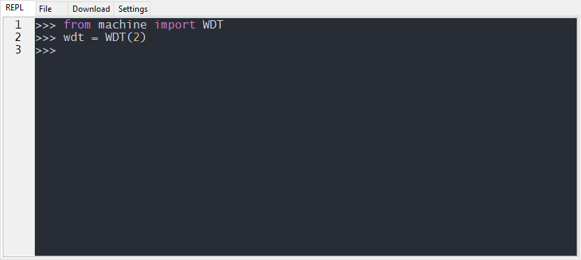

## Revision history

| Version | Date       | Author | Description              |
| ------- | ---------- | ------ | ------------------------ |
| 1.0     | 2021-09-15 | Kayden | Modified initial version |


## Application notes of Watchdog development

In this document, it mainly introduces how to use QuecPython_Watchdog on EC600S (applicable to other modules). The watchdog is usually used to prevent getting stuck of the device. It will reboot the module once the device gets stuck by adding Watchdog. In this document, you will learn all parameters and application notes of WDT (the acronym of Watchdog).

##  About HW

The function of WDT: The reboot will occur under the circumstance that failure to execute by the exception in APP. Since this function is embedded in interior, no peripheral circuit is needed. 

## Interaction 

2.  Interact with module via QPYcom, here shows the case: 



Notes: 

2.  The purpose of executing "from machine import WDT " is to make the WDT vivid in current space. 
3.  Only execute "from machine import WDT " can the function and variate in WDT be used. 

Note: If there is no behavior of feeding dog, the system will reset automatically after 2 s. 

## Download and verify

Download **.py** file and run it on module, here shows the code

 <a href="/docs/en-us/Advanced_development/Component/QuecPythonBus/code/Watchdog.py" target="_blank">Download code</a>

```python
from machine import WDT
from machine import Timer

count = 0
def feed(t):
    global count
    count += 1
    if count >= 5:
        print('Stop feeding')
        timer1.stop()
    print('Feed')
    wdt.feed()


timer1 = Timer(Timer.Timer1)
wdt = WDT(2)  # Initiate watchdog, the intervel time. the unit is s. 
timer1.start(period=1000, mode=timer1.PERIODIC, callback=feed)  # Feed by timer

```

##  SW design

 For specific Watchdog API, please refer to the link: [Watchdog API](https://python.quectel.com/wiki/#/en-us/api/QuecPythonClasslib?id=wdt)

2.  Function prototype WDT (period): return a wdt object to set the feed, start and stop function of WDT.

Create WDT object and initiate immediately

>   wdt = WDT(period)

| Parameter | Type | Illustration                                           |
| --------- | ---- | ------------------------------------------------------ |
| period    | int  | Set the detection time of SW watchdog, the unit is "s" |

1.  Function prototype **feed()**: no return value

Feed

>   wdt.feed()

1.  Function prototype **stop()**: no return value 

Stop SW Watchdog function

>   wdt.stop()


## Term explanation

>   **Watchdog**:  It will reset the whole system compulsorily since the program will be considered as failure to work once the count is added to threshold.

>   **Feed**: Reset count value

  