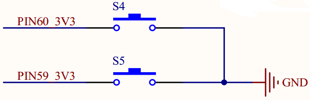

# Button input test

## Revision history

| Version | Date       | Author | Description     |
| ------- | ---------- | ------ | --------------- |
| 1.0     | 2021-09-17 | Grey   | Initial version |

In this document, we may concentrate on how to detect the GPIO level from views of HW and SW designs. By reading through this text, you may learn about how to check the HW connection, compile code and verify test. 

For more details about API, please refer to  [QuecPython-machine - PIN](https://python.quectel.com/wiki/#/en-us/api/QuecPythonClasslib?id=pin)

## HW resource

Two pins on EC600x are available for client to carry out button input test. 

By configuring corresponding GPIO as the pull up (the input mode) , we can change the GPIO level via pressing the button or not. 




## SW design

First of all, we should confirm which GPIO should be detected, then find out the relevant GPIO No. via the API class library on official website. Check the details on [QuecPython-machine - PIN](https://python.quectel.com/wiki/#/en-us/api/QuecPythonClasslib?id=pin).

 

Take the EC600U as an example, the PIN 60 is the GPIO 4. 

As for the  While it is the EC600U, the PIN 60 serves as GPIO 4, however, there is no corresponding GPIO to PIN 59; consequently, the button input test is invalid.

### Code performance

```python
import utime
from machine import Pin


if __name__ == '__main__':
    gpio = Pin(Pin.GPIO4, Pin.IN, Pin.PULL_PU, 1)
    while True:
        if gpio.read() == 0:
            utime.sleep_ms(10)
            if gpio.read() == 0:
                while gpio.read() == 0:
                    pass
                print("Button press")
        pass
```


## Download and verify

Download and run the **.py** file on module


After that, press the button, there will be printed info correspondingly. 


## The matched codes

<a href="/docsite/docs/en-us/Advanced_development/Component/QuecPythonBus/code/code_button.py" target="_blank">Download code</a>
