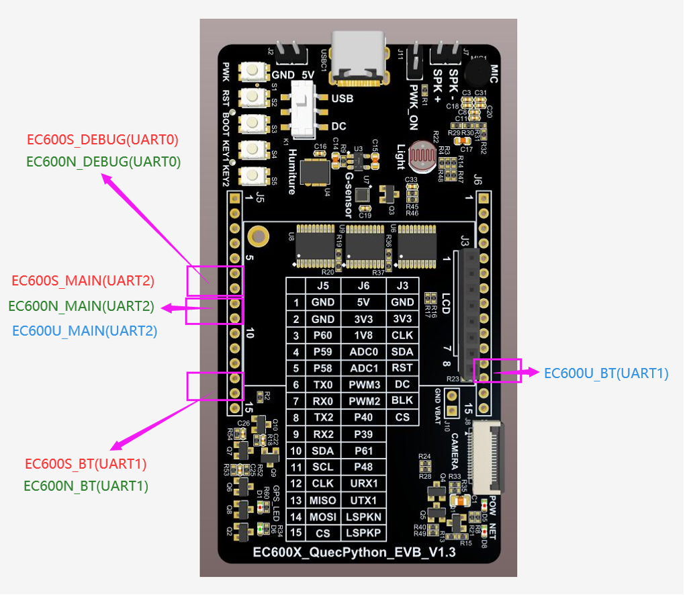
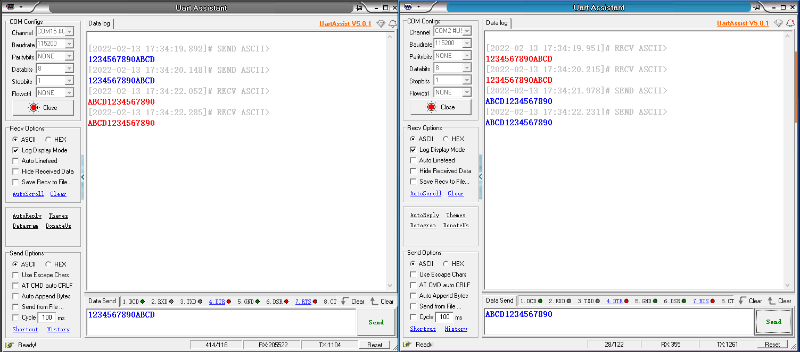

---
title: Serial Port Development
keywords: Serial Port,uart
description: Serial Port Development
---
# UART Test

## Revision history

| Version | Date       | Author  | Description     |
| ------- | ---------- | ------- | --------------- |
| 1.0     | 2021-09-22 | Grey.tu | Initial Version |

In this document, it mainly focuses on QuecPython_UART. As a common and universal method, Uart is widely used in data interaction and full duplex transmission. After reading through this article, you will comprehensively learn about the setting parameter and application of UART on EC600X, including in EC600S , EC600N and EC600U. 

For related API, please refer to [QuecPython-machine-UART](https://python.quectel.com/wiki/#/en-us/api/QuecPythonClasslib?id=uart)

## HW design

In terms of various modules, the disclosed UARTs are shown as following: 

| Module type | UART No.                                                     | UART_PIN                                                     |
| ----------- | ------------------------------------------------------------ | ------------------------------------------------------------ |
| EC600S/N    | UART0_DEBUG PORT<br>UART1_BT PORT<br/>UART2_MAIN PORT<br />UART3_USB CDC PORT | UART0_DEBUG_PORT(TX => PIN71 & RX => PIN72)<br />UART1_BT_PORT(TX => PIN3 & RX => PIN2)<br />UART2_MAIN_PORT(TX => PIN32 & RX => PIN31)<br />USB_CDC_PORT ==> Virtual port of USB, the baudrate is not limited. |
| EC600U      | UART0_DEBUG PORT<br />UART1_BT PORT<br/>UART2_MAIN PORT<br />UART3_USB CDC PORT | UART0_DEBUG_PORT(TX => PIN71 & RX => PIN72)<br />UART1_BT_PORT(TX => PIN124 & RX => PIN123) <br />UART2_MAIN_PORT(TX => PIN32 & RX => PIN31)<br />USB_CDC_PORT ==> Virtual port of USB, the baudrate is not limited.<br /Note: the EC600U_DEBUG PORT can only service as the DEBUG_LOG output instead of UART communication |

UART location mark of official QuecPython EVB V1.2/V1.3. 



Note: This figure is exclusively applicable to official QuecPython EVB V1.2/V1.3. As for further EVB, it depends. 

## SW design

We have already introduced the basic connection of physical UART on previous chapter, there is no need to elaborate more. In this chapter, we just focus on USB CDC PORT.

As the virtual serial communication port, the USB CDC port adapts the same protocol as UART. However, it does not the real UART. Without the UART baudrate on communication rate, it can identify automatically via USB protocol with faster transmission speed and unnecessity the burden of fixed baudrate. 

```python
# import log
import utime
import _thread
import ubinascii
from machine import UART

state = 1
uart_x = None
usbcdc = None


def uart_x_read():
    global state
    global uart_x
    global usbcdc

    while state:
        msglen = uart_x.any()  # Returns whether there is a readable length of data
        if msglen:  # Read when data is available
            msg = uart_x.read(msglen)  # Read Data
            utf8_msg = msg.decode()  # The initial data is byte type (bytes), which encodes byte type data
            if "Grey" in utf8_msg:
                break
            else:
                usbcdc.write("{}".format(utf8_msg))  # send data
        utime.sleep_ms(1)
    state = 0


def usbcdc_read():
    global state
    global uart_x
    global usbcdc

    while state:
        msglen = usbcdc.any()  # Returns whether there is a readable length of data
        if msglen:  # Read when data is available
            msg = usbcdc.read(msglen)  # Read Data
            utf8_msg = msg.decode()  # The initial data is byte type (bytes), which encodes byte type data
            if "Grey" in utf8_msg:
                break
            else:
                uart_x.write("{}".format(utf8_msg))  # send data
        utime.sleep_ms(1)
    state = 0


if __name__ == "__main__":
    uart_x = UART(UART.UART2, 115200, 8, 0, 1, 0)
    usbcdc = UART(UART.UART3, 115200, 8, 0, 1, 0)  # It is unvalid to set the baudrate, while in communication, any baudrate is available

    uart_x.write("Grey_test")
    usbcdc.write("Grey_test") 

    _thread.start_new_thread(uart_x_read, ())  # Create a thread to listen for receiving UART messages
    _thread.start_new_thread(usbcdc_read, ())  # Create a thread to listen for receiving CDC messages

    while state:
        utime.sleep_ms(1)
```

Run above script code, the data transparency between UART2 and USB CDC PORT can be achievable. 

## Download and verify

Download and run the **.py** file on module.


After that, the data transparency between UARTx and USB CDC PORT can be accessible. 




## The matched codes

<a href="/docsite/docs/en-us/Advanced_development/Component/QuecPythonBus/code/code_UART_CDC.py" target="_blank">Download code</a>
