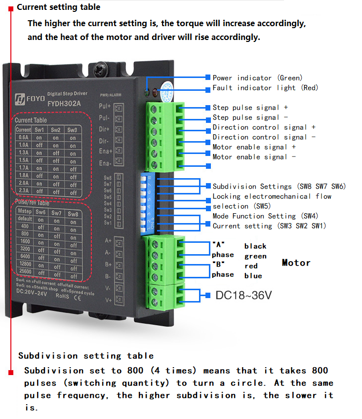
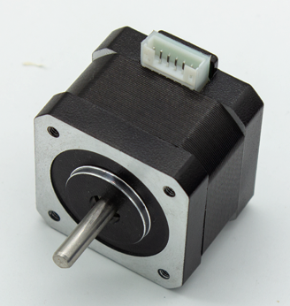
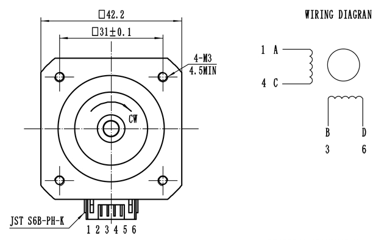
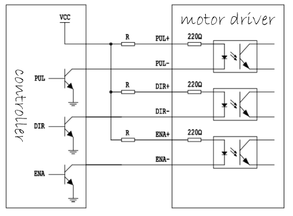

# Stepper motor drive experiment

## Revision history

|Version | date | author | change statement|
| ---- | ---------- | ------- | -------- |
|1.0 | 2021-09-24 | Grey. Tu | First Edition|

This article mainly describes the use of ec600x to drive the stepper motor controller to drive the stepper motor.


## Hardware description

Module driven stepper motor requires stepper motor controller:

#### Stepper motor controller



#### Stepping motor





Stepper motors are divided into 42 stepper motors, 57 stepper motors and 86 stepper motors. Different stepper motors are suitable for different stepper motor controllers.

### Experimental equipment

(1) DC power supply can output 12V ~ 48V DC

(2) Stepper motor controller

(3) Stepping motor

(4) Several connecting lines

### Drive description

The stepper motor driver only needs to control three pins to drive the driver to control the motor.

(1) ENA enable control pin enables the driver to drive the motor. The level varies according to the driver model.

(2) Dir direction control pin to determine clockwise or counterclockwise. The level varies according to the driver model.

(3) Pul step pulse pin to pulse the controller. According to the subdivision set, there are different pulse numbers to step a step angle. The subdivision setting is the driver dial switch setting.

### Pin connection

(1) Connect the 24V power supply, and the specific voltage shall be determined according to the actual stepping motor driver specification.

|Driver pin | power pin | description | backup|
| ---------- | -------- | -------- | ---- |
|V + | 24V | power supply positive ||
|V - | GND | negative pole of power supply ||

(2) Connect the driver and stepper motor. The specific wiring mode is determined according to the actual specifications of stepper motor driver and stepper motor.

|Driver pin | stepper motor pin | description | backup|
| ---------- | ------------ | ---- | ---- |
|A + | a | item a + ||
|A - | C | item a - ||
|B + | B | item B + ||
|B - | D | item B - ||

(3) Connect the driver and ec600x development board. The specific voltage is determined according to the actual stepping motor driver specification.

The stepper motor driver can be connected by common anode / common cathode, and we use common anode here



|Driver pin | ec600s development board pin | description | backup|
| ---------- | ----------------- | ------------ | ---- |
|ENA + | 1v8 | common anode ||
|ENA - | gpiox | enable control signal ||
|Dir + | 1v8 | common anode ||
|Dir + | gpiox | direction control signal ||
|Pul + | 1v8 | common anode ||
|Pul - | gpiox / pwmx | step pulse signal ||


## Software design

```python
from misc import PWM
from machine import Pin
import utime as time
import urandom as random
import log
def delay_500us():
    for i in range(600):
        pass


def delay_250us():
    for i in range(310):
        pass


ENABLE_MOTOR = 0x1
DISABLE_MOTOR = 0x0

DIR_CLOCKWISE = 0x1
DIR_ANTI_CLOCKWISE = 0x0


class ebf_smd4805():

    dev_log = None

    # Parameters of stepping motor
    sm_para_step = None  # Step angle
    # Parameters of controller
    env_pin = None  # Enable pin
    dir_pin = None  # Direction pin
    pul_pwm = None  # Pulse output pin
    ctrl_divstep = None  # For subdivision parameters, please refer to the controller manual

    def init(self, step, divstep):
        self.dev_log = log.getLogger("ebf_smd4805")
        self.env_pin = Pin(Pin.GPIO7, Pin.OUT, Pin.PULL_DISABLE, 0)
        self.dir_pin = Pin(Pin.GPIO6, Pin.OUT, Pin.PULL_DISABLE, 0)
        # Configure the parameters of the motor
        self.sm_para_step = step
        # Configure the parameters of the controller
        self.ctrl_divstep = divstep

    def reset(self):
        self.env_pin.write(DISABLE_MOTOR)
        self.dir_pin.write(DIR_ANTI_CLOCKWISE)
        if self.pul_pwm is not None:
            self.pul_pwm.close()

    # Initialize PWM according to frequency
    def outputpwm(self, HZ, duty_cycle):
        # Convert Hz to us level
        cycleTime = int(1000000/HZ)
        highTime = int(cycleTime * duty_cycle)
        return highTime, cycleTime

    # Set the output of PWM according to the speed
    def enable_pwm(self, speed):
        # 1. First, calculate the number of pulses required for one revolution according to the stepping angle of the stepping
        Count_pulse = int(360/self.sm_para_step)
        self.dev_log.debug("sm motor step as {0}".format(Count_pulse))
        # 2. According to the subdivision parameters of the controller, calculate the number of pulses required for the controller to control the stepper motor to rotate for one turn
        Count_pulse = int(Count_pulse * self.ctrl_divstep)
        # 3. Finally, calculate how many pulses are needed to rotate the speed cycle in one second, in other words, the frequency
        Count_pulse = int(Count_pulse * speed)
        # 4. Initialize PWM, default duty cycle% 50
        highTime, cycleTime = self.outputpwm(Count_pulse, 0.1)
        self.dev_log.debug(
            """config  frequency  is {0}HZ,cycleTime {1}us, hightime {2}us"""
            .format(Count_pulse, cycleTime, highTime))
        self.pul_pwm = PWM(PWM.PWM2, PWM.ABOVE_10US,
                           int(highTime), int(cycleTime))
        self.pul_pwm.open()
        pass

    def disable_pwm(self):
        self.pul_pwm.close()
        pass

    # Speed is the speed, how many laps per second
    # Duration is the duration, Ms
    # Dir indicates direction
    def run(self, speed, Duration, dir=DIR_CLOCKWISE):
        self.dir_pin.write(dir)
        self.dev_log.info(
            "Configure the motor to rotate {0} revolutions per second".format(speed))
        self.enable_pwm(speed)
        self.env_pin.write(1)
        # delay
        for i in range(int(Duration * 4)):
            delay_250us()
        self.env_pin.write(0)

        self.reset()
        pass


def test_ebf_smd4805():
    log.basicConfig(level=log.DEBUG)
    # log.basicConfig(level=log.INFO)
    ebf_smd4805_dev = ebf_smd4805()
    ebf_smd4805_dev.init(step=1.8, divstep=2)
    for i in range(2, 10):
        ebf_smd4805_dev.run(i, Duration=1000, dir=DIR_CLOCKWISE)
    print("test_ebf_smd4805  Function exit,!!!")
    pass


if __name__ == "__main__":
    # creat a thread Check key status
    test_ebf_smd4805()
```


## Matching code

<!-- *  [download code](code/code_ebf_smd4805.py) -->
<a href="/docsite/docs/en-us/Advanced_development/Component/QuecPythonSub/code/code_ebf_smd4805.py" target="_blank">Download code</a>
