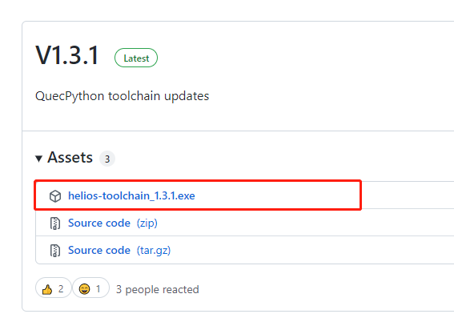
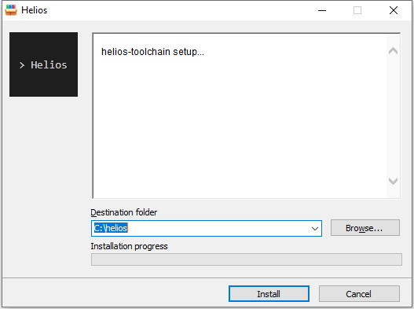
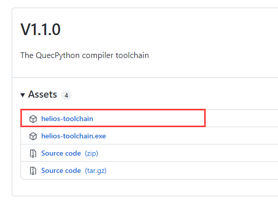
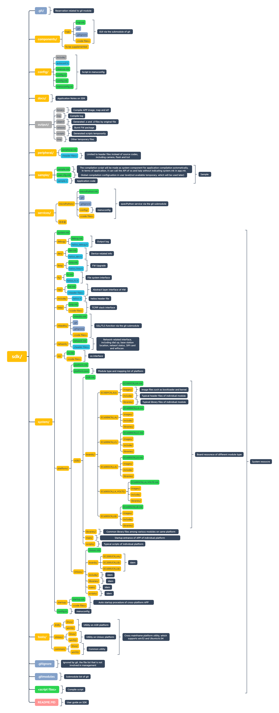
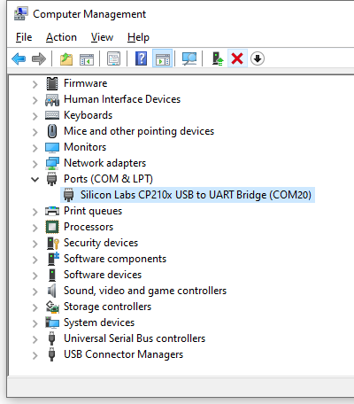
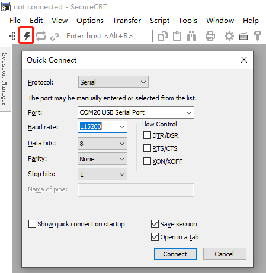
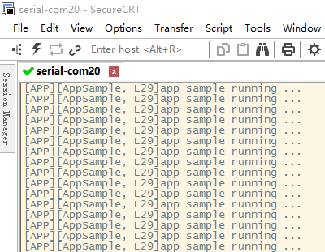

##  Brief introduction of SDK

Helios SDK (hereinafter abbreviated as SDK) is organized by components, including in systematic components, service component, peripheral components and components of the third-party. 

  * Systematic component: os, bsp, file system, various network protocol stacks, OTA and log output. 
  * Service component: QuecPython 
  * Peripheral component: camera, Norflash and LCD. 
  * The third-party component: lvgl and tts.  

The dependency of each component can be realized by compiling the assigned dependency path in managed script of component, which will be illustrated in the following chapter.

Meanwhile, whether enabling the function of all components, you can configure via menuconfig for the convenience of clipping.

## Build environment

### Build environment of Windows 10

 **Step 1: Download tool-chain** 

  * Download **[toolchain.exe](https://github.com/quecpython/toolchain/releases)** under the circumstance of Windows 10 from GitHub website. 



 **Step 2 : Install tool-chain** 

  * Run the **helios-toolchain.exe** by Administrator as described below. just click the "**Install**" button. 



> The target folder is limited to C:\ and under no circumstance shall you modify it. 

### Build environment of Ubuntu16.04

 **Step 1: download tool-chain** 

  * Download **[toolchain.exe](https://github.com/quecpython/toolchain/releases)** under the circumstance of Ubuntu16.04 from GitHub website. 



 **Step 2: Install tool-chain**   

  * Place the package to the same location with the target folder as predicted. you can install the **tool-chain** via executing following command.

`sudo ./helios-toolchain`

 **Step 3:  Install other tooIs** 

  * Install `p7zip-full`, `git`, `make` and `python3` by clicking into following commands on terminal. 


          1. sudo apt install p7zip-full git make python3


​    

## Extract code

You can extract the overall SDK codes via executing following commands by turns in command line. 


      1. git clone https://gitee.com/quecpython/HeliosSDK.git
      2. cd HeliosSDK
      3. git submodule init
      4. git submodule update


​    

## SDK directory architecture

The next figure shows the SDK directory architecture, whose indications are varied in colour. 

  * Purple: Git library-related file and directory
  * Yellow: Inherent folder of SDK
  * Green: Script file of SDK
  * Blue: Source code file in SDK
  * Pink: `Readme.md`
  * Gray: The generated folder after compiling, which can be deleted. 
  * Black: Note



## Compile application code

>   * Theoretically, you can build a new application code file in any location of SDK directory.
>   * In actual, for sake of regulation, it is suggested to build the application code folder under the root directory of SDK.
>   * As for the unit test code of function, it is suggested to place it in the `test` or `demo` folder under function directory
>   * It is advised to open the SDK via VSCode. In the near future, we Quectel will put forward the flexible plug-in that specialized for VSCode. 

Take the`sample` under the root directory of SDK as an example: 

**Step 1: Build a new application code folder** 

  * Build a new `sample` folder under the root directory of SDK.

**Step 2: Build the source file of application code**   

  * Enter `sample` folder and build a new `sample.c`. 

**Step 3: Compile application code**

  * **Open `sample.c`** 
  * **The header file is included **    
  * In `sample.c`, it only contains the most fundamental header file, that are `helios.h`, `helios_debug.h` and `helios_os.h`. 
  * `helios.h`: It defines the interface when adding self-boot currently. 
  * `helios_debug.h`: It defines the interfaces that relevant to log printing
  * `helios_os.h`: It defines the interfaces that relevant to multiple threads. 

Codes that including in header file. 


          1. #include "helios.h"
          2. #include "helios_debug.h"
          3. #include "helios_os.h"


​    

  * **Print interface of self-defined log**

> Interface illustration of log printing  
>  In `helios_debug.h`, it provides the interface that relevant to log printing. 
>  `void Helios_Debug_Enable(void)`: Enable log printing
>  `void Helios_Debug_Disable(void)`: Disable log printing 
>  `helios_debug(fmt, ...)`：Common interface used to output log  
>  `custom_log(tag, fmt, ...)`：Log output interface that customizing label, which will be outputted along with log. 
>  Enable log printing by default. 

Define the log output interface that customizing label in `sample.c`, then modify the label name as `APP` 


          1. #define app_debug(fmt, ...) custom_log(APP, fmt, ##__VA_ARGS__) // Define custom_log in heloios_debug.h. 

  * **Realize application function**   

  * The logs are printed every second in `sample.c`. Here shows codes

```
      1. static void AppSample(void *argv)
      2. {
      3.     UNUSED(argv); // Define in helios.h
      4.     while (1)
      5.     {
      6.         app_debug("app sample running ...\r\n"); // Output the customized log with label. 
      7.         Helios_sleep(1); // Define in helios_os.h. 
      8.     }
      9. }
```

​    

  * **Add it as self-initialization**  
    
  * After compiling application function codes, call the following interfaces to automatically start application functions after the system is started:
    
        1. application_init(AppSample, "AppSample", 2, 0); // Define in helios.h

> Illustration of  `application_init` Interface 
>
> Definition: ：`application_init(entry, name, stack_size_kib, startup_prio)`  
>
> Parameter：`entry` \- Entrance address of application code 
>
> Parameter: `name` \- Application name   
>
> Parameter: `stack_size_kib`-the size of application thread stack, whose unit is KB. 
>
> Parameter: `startup_prio`-start up priority, the 0 represents the highest priority. 

**Step 4: Compile controlling script** 

  * **Build a new mk script file**    

Build a new `.mk` file that shares the same name with root directory of application code. In this case, the `sample.mk`serves as the newly-built file.
  * **Compile mk script file** 

> As for the details on compiling mk script file, please refer to the `README.MD` under the root directory of SDK. 


      1. NAME := SAMPLE #  Component name, it is suggested to keep in line with the name in the root directory of componnet with capitals. 
      2. $(NAME)_SRCS := sample.c # Add the relative path of source which is going to be compiled, (Compared with root directory of component code. However, it is sample directory)
      3. $(NAME)_INCS := . # The relative path that can be quoted by internal component limitedly,(Compared with root directory of component code. However, it is sample directory. In actual, there is no header file in sample directory, which can be deleted hereby )                          
      4. $(NAME)_COMPONENTS := # Relative path of other components on which the current component depends (Relative to SDK root, this line can be deleted when empty)


​    

Till now, the application code compilation is done. 

## Compile and flash

**Step 1： Check the method to compile command**  

  * Click the `helios` in the booted command lines under SDK directory, then press "Enter" to check the method to use helios commands

The following figure shows the outputted result. 


      1. Usage: helios <action> [<app>] [<at>] [<fw_name>]
      2. These are common commands used in various situations:
      3. menuconfig                       - Do the project configuration
      4. make <app> [[<at>] [<fw_name>]]  - Do the compilation work
      5. private_clean                    - Clean the app private target
      6. clean                            - Clean the output directory
      7. help                             - Show this help page


​    

>  As for the method on how to compile command in details, please refer to the `README.MD` under the root directory of SDK. 

**Step 2: Compile FW**  

  * Take **EC600SCN_LB** module as an example, click into following commands in line and press "**Enter**"


          1. helios make sample @EC600SCN_LB EC600SCNLBR01A01M08


​    

  * `helios`：Trigger compilation procedure
  * `make`: Compile FW
  * `sample`：Application Entrance address (Compared with root directory of SDK)
  * `@EC600SCN_LB`：Assign target module type, which is by default with a value of `@EC200UCN_AA`. 
  * `EC600SCNLBR01A01M08`：Name of FW version by default. Take the assigned root directory of application code as the default value.

If there is a need to delete the target to be compiled, click following commands in line and press "**Enter**"


          1. helios clean


​    

 **Step 3: Check the target after compiling** 

  * The generated FW package is saved in the `output/release` folder under the root directory of SDK, which is shown as next figure. 


 **Step 4 : Flash FW** 

  * For flashing FW, please refer to <User guide on Quectel_QFlash>

## Function Test

**Step 1: Connect PC and module**  

  * Connect the debug and PC via serial port wire.

**Step 2: Check the serial port number of Debug on PC** 

  * Open the device manager on PC, which is shown as next figure. In this document, it is the COM20 that is deployed. 



**Step 3: Open the serial port debug tool on PC**  

  * Take the SecureCRT as an example. Click the "Quick connect" as described below, then the `Quick Connect` window will appear  

  * After that, click the drop-down of `Port` selection and select COM20 correspondingly. As for parameters of the rest, please adhere to the configurations as told below. 

It is available to open the serial port via clicking the `Connect` button on the bottom right corner.  



**Step 4: Start module program** 

  * Reset the module to start the program 

**Step 5: Check the running log of module** 

  * Check the running log in the receiving area of serial port of SecureSRT. 



As above figure implies, the outputted format of log contains the `APP` (customized label), `AppSample` (the function name if outputted log), the `L29` ( The file lines of outputted log) and `app sample running ...` (The log content).

