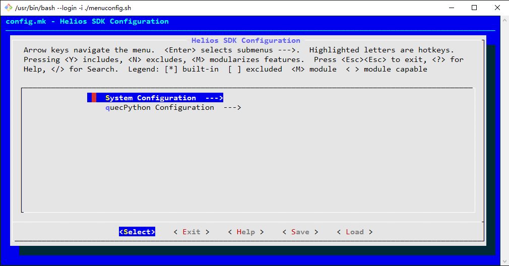
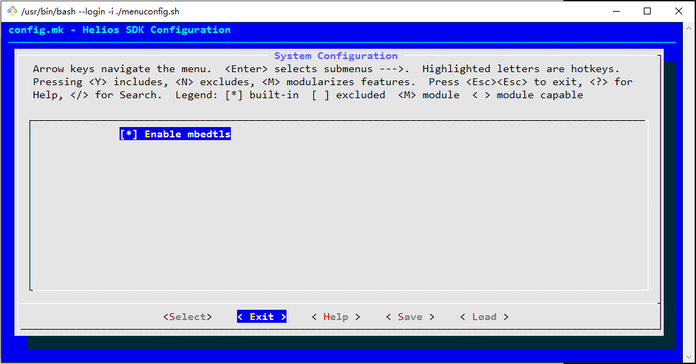
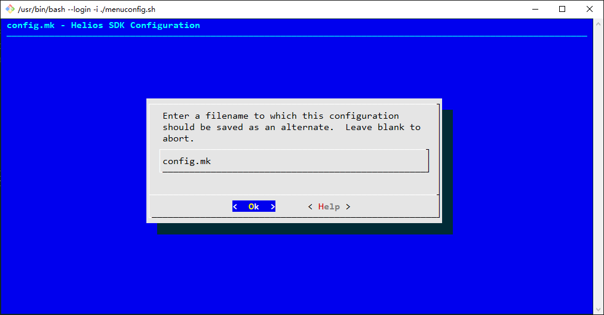
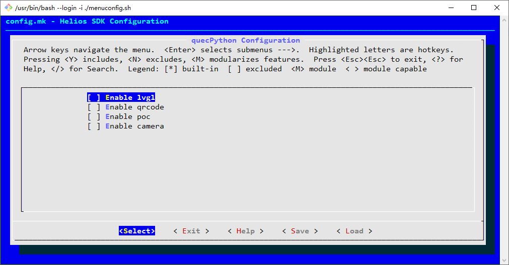
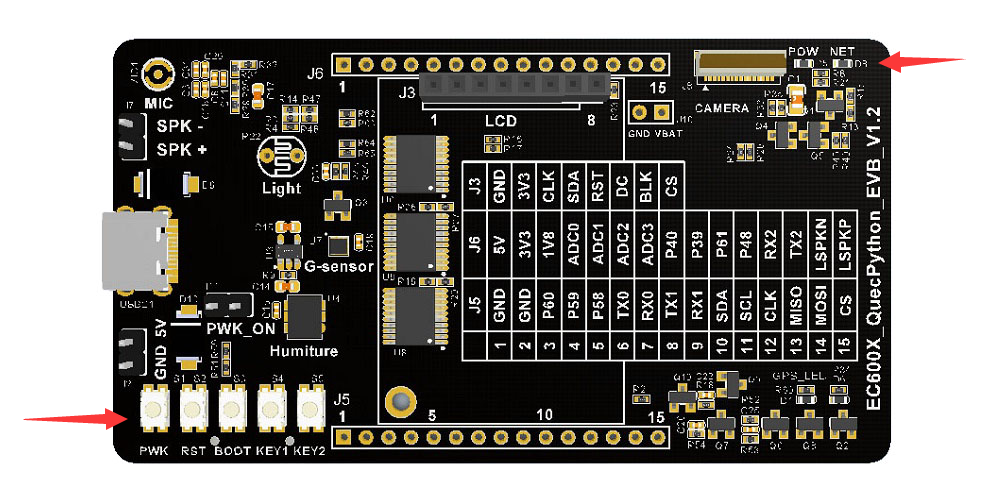
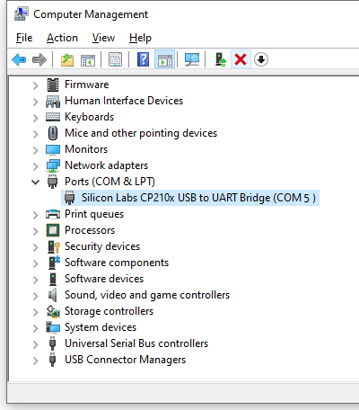
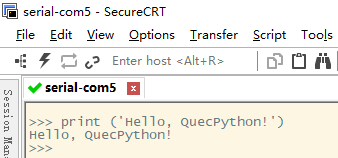

## About document

**Revision history** 

| Version | Date       | Author | Description     |
| ------- | ---------- | ------ | --------------- |
| 1.0     | 2021-09-30 | Chic   | Initial version |

## menuconfig

Menuconfig, as its name implies, it is implemented with dual meanings of menu and config, which refers to the configuration based on menu. 

### Operation illustration of menuconfig

####  Surface illustration 

Click `helios menuconfig` in command line to start configuring menu. For details, please refer to the following figure:



As the figure mentioned above, the menuconfig is composed by four sections: **title**, **application note**, **menu** and **operation keys**. 

  * **Title**: A row of light blue words on a mazarine background at the top of the figure-`config.mk - Helios SDK Configuration`.
  * **Application note**: Three rows of words on a gray background at the top of the figure, which is used to tell the user how to operate menuconfig.
  * **Menu**: Two rows of characters on a gray background in a lower concave frame, that means `System Configuration --->` and `quecPython Configuration --->`.
  * **Operation keys**: the last row at the bottom of the figure, which is covered by angle brackets, that mean `<Select>, < Exit >, < Help >, < Save > and  < Load >`.

#### Operation explanation

The keyboard is only available to operate menuconfig: 

  * **Up/down**: used to select different menu
  * **Left/right**: used to select different operation keys
  * **Enter**: used to enter lower menu or trigger executing operation keys
  * **Space**: used to open/close the selected menu.
  * **Esc**: double click this key, used to return the upper menu. If you execute in the root directory of menu, it will exit menuconfig.

E. g. Click the Enter to get in  `System Configuration`, what we can see is that the mebedtls is enabled. For details, please refer to the next figure. 



In the menu of `[*] Enable mbedtls`, the `*` covered by square brackets means the mbedtls is enabled; when clicking Space, the `*` will disappear and the mbedtls is disabled. 

####  Save configuration 

After modifying configuration, three methods are available to save configurations. 

  * i. In configuring menu surface, select the  `<Save>` on the bottom as described below via `left/Right` keys. After that, click " `Enter` ", a surface as below will appear; finally, select `<OK>`, the configuration will be saved. 

> The name of configured file is not allowed to modify since other script files will search for configuration via this name; otherwise, it will be a failure to find out the configured file. 




  * ii. In configuring menu surface, double click `Esc` button till exiting menuconfig. when exiting, if it detects some configurations that are not saved, the save surface still appears as described above, please adhere to the instruction of i. 
  * iii. In configuring menu surface, select and execute `<Exit>` continuously till exiting menuconfig. when exiting, if it detects some configurations that are not saved, the save surface still appears as described above, please adhere to the instruction of i. 

#### Remove the behavior of saving configuration

After entering the saving configuration surface as shown on Chapter 1.1.3, if you want to delete it, please double click `Esc`. 

####  Configure file

The compiled file will be saved in the config file under the root directory of SDK,  whose full names are `autoconf.h` and `config.mk` separately.

  * The `autoconf.h` is called by C language. The developer can cite the macro definition in this file in codes directly without including in this header file. Meanwhile, the compiled script will include this file into the compiled C file automatically. 
  * The `config.mk` is called by compiled script. 
  * In SDK, the mbedtls has been enabled by default. 

Here shows the content that corresponding to `autoconf.h`. 


```c
   /*
    *
    * Automatically generated file; DO NOT EDIT.
    * Helios SDK Configuration
    *
    */
   #define CONFIG_MBEDTLS 1
```


Here shows the content that corresponding to `config.mk`. 


```makefile
   #
   # Automatically generated file; DO NOT EDIT.
   # Helios SDK Configuration
   #
   #
   # System Configuration
   #
   CONFIG_MBEDTLS=y

   #
   # quecPython Configuration
   #
   # CONFIG_LVGL is not set
   # CONFIG_QRCODE is not set
   # CONFIG_POC is not set
   # CONFIG_CAMERA is not set
```


### Configure system 

As it mentioned above on chapter 1, when configuring system, only mbedtls is included currently. 

If there is a need to use encryption algorithm or encrypt network radio in application, this function shall be enabled. 

It is necessary to use mbedtls in quecPython, therefore, when compiling QuecPython FW, this function shall be enabled as well. 


### Configure QuecPython

Following figure is telling how to configure QuecPython menu. 



These 4 categories of menus are used to configure the QuecPython FW and check whether lvgl surface, QR code scanning, Two-way radio and camera are included. 

##  Compile QuecPython FW

The user can configure the functions supported by QuecPython via menuconfig according to actual needs. 

In this case, we just deploy the default configuration of menuconfig and take **EC600SCN_LB** as an example. Then input following commands in command line and click "**Enter**".


```makefile
helios make services\microPython @EC600SCN_LB EC600SCNLBR01A01M08
```


>   * As for the break of path of `services\microPython`, please adhere to the demand of host system. On win32 platform, it shall be `\`; while on Linux, it shall be `/` though. 
>   * For the method of compiling command, please refer to <Guide on Helios SDK (1)-- Quick Start >
>   * For flashing FW, please refer to <User guide on Quectel_QFlash>.
>

## About QuecPython interaction

 **Step 1: Connect PC and EVB** 

Connect the QuecPython EVB to PC via the Type-C USB port. 

 **Step 2: Boot up the module** 

As the next figure shows, long press the `PWK` button on the bottom left corner at the back of the EVB to execute booting up as well as starting up the program on EVB. 

After starting up, the network light on the upper-right corner at the back of the EVB will spark, which means the boot is a success. 



> Illustration on keys of EVB
>
> `PWK`：Power key. Long press to boot up. 
>
> `RST`：Reset key. Press to reset
>
> `BOOT`： Enter flashing FW mode
>
> `KEY1`、`KEY2`：Keys for user to explore. 

**Step 3: Open USB serial device port** 

Open " **Device Manager** " and release " **COM and LPT** ", then find `USB serial device` and note down the number. In this case, it is COM5 as described below: 



For opening COM5, please refer to the Step 3 of Chapter 7 in <Guide on Helios SDK--Quick Start>. 

 **Step 4: Interaction of QuecPython command**

Click "**Enter**" in the data receiving area of SecureCRT, there will be command interaction reminder `>>>` that specialized for Python will appear. 

At this time, we will carry out the printing operation with the assistance of `print` function of Python.  Before that, we should input following codes into SecureCRT. 


```python
print ('Hello, QuecPython!')
```


The result after executing:



Till now, we have already made one simplest application via QuecPython.

For more functions and port usage of QuecPython, please refer to the [Official Wiki. ](https://python.quectel.com/wiki/#/en-us/)
