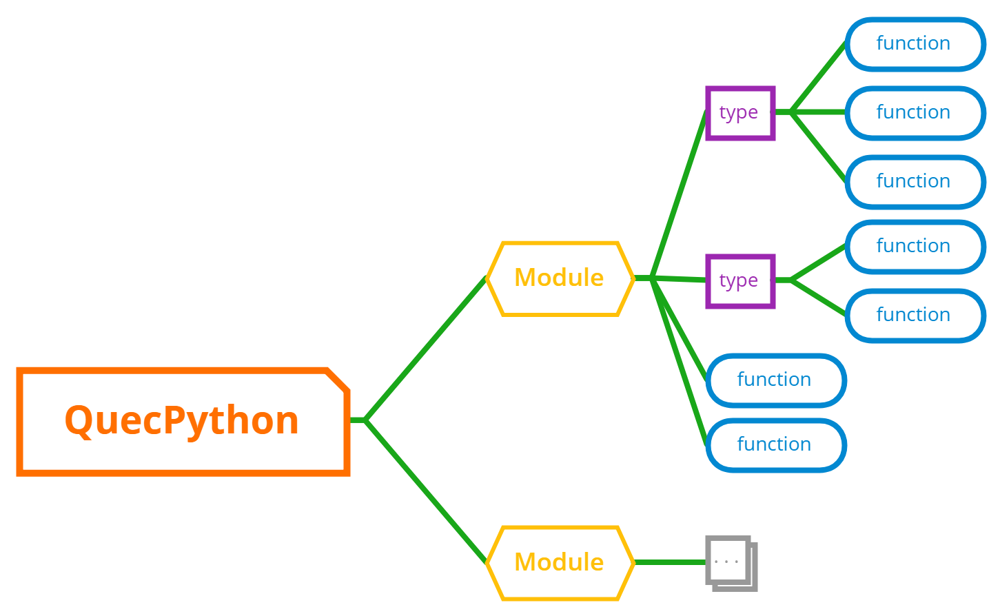
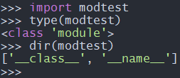

## About Document

**Revision History** 

| Version | Date       | Author | Description     |
| ------- | ---------- | ------ | --------------- |
| 1.0     | 2021-09-30 | Chic   | Initial Version |


## Execute script file via QuecPython file system

In this chapter, it illustrates how to import the Python script file that compiled by yourself into module for running.

### Install QPYcom 

Enter [official download page](https://python.quectel.com/download) and download `QPYcom Graphical tool`, which is shown as next figure: 


 After downloading, unzip to use. 

> For detailed application note, please refer to the  `docs\<application note of Quectel QuecPython_QPYcom.docx >` in root directory of tool. 

### Compile Python script file

Compile the script file with the name of `QuecPython_demo.py` in PC. 


```python
  1. import uos
  2.   
  3. print ('Hello, QuecPython!')
  4.   
  5. root_list = uos.listdir('') # show file list under root dir
  6. print ('root_list:', root_list)
  7.   
  8. usr_list = uos.listdir('usr') # show file list under /usr
  9. print ('usr_list:', usr_list)
```


### Import the Python script file into QuecPython file system 

**Step 1: Open QPYcom**

Double click the `QPYcom.exe` in root directory of tool. 

**Step 2: Open serial device port of USB** 

According to the Step 3 of Chapter 3 in <User Guide on Helios SDK (2) -- Advance>, select corresponding port  in the drop-down menu of `Select serial port` of QPYcom. In this case, we just take **COM5** as an example. 
Click " `Open Serial port` " to enter the command interaction surface by default. 
Please take a view at the next figure. 


 **Step 3: Enter file transmission surface**

Click the `file` and enter transmission surface, which is shown as below: 


As above figure shows, it is the local file list of PC that lies on the left; while on the right, it is the file list of module. 

Once the QuecPython is booted on module end, it will generate a file named `system_config.json` automatically. There is no need for user to get knowledge of this file temporarily. 

 **Step 4: Import Python script file** 

Click the `+` button on the top of the file list and start to transmit file to module. 

As next figure implies, you can import the `QuecPython_demo.py` file to file system with a sequence of No. 1, No. 2 and No. 3. 


When all above is done, it is vivid that the `QuecPython_demo.py` file has been added into the file list on module end, please refer to the following figure. 


### Execute the imported script file

Click " `Interaction` " to enter the command interaction surface as before. 

Input following two lines of commands.


```python
  1. import example
  2. example.exec('/usr/QuecPython_demo.py')
```


After the execution is done, what we can see in surface is shown as following figure： 


Till now, the `QuecPython_demo.py` is accomplished and the newly-imported script file has been in **usr_list/**.

### Start application script via main.py automatically

You've learned how to import script files into the QuecPython file system and trigger script execution with commands till now.

However, QuecPython can start application scripts automatically by executing " **main.py** " automatically after boot.

 **Step 1: Compile main.py file**

Compile a script file named `main.py` in PC. Here shows the contents: 


```python
  1. import utime
  2.   
  3. if __name__ == '__main__':
  4.     while True:
  5.         print('Hello, QuecPython!')
  6.         utime.sleep(1)
```


**Step 2: Import main.py file into file system of module**

Import the `main.py` file into the file system of module via Chapter 1.3. 

**Step 3: Reboot the module**

Reboot the module to execute `main.py` automatically. 

**Step 4: Reconnect serial device port of USB** 

The USB serial device port that opened by QPYcom will disconnect with PC owing to the reboot.  

Reconnect the port according to the Step 2 of Chapter 1.3.

**Step 5: Observe the result after executing**

After reconnecting the USB serial device port, if there exists `Hello, QuecPython!` with an interval of every other 1s periodically in command interaction surface, which means the *mian.py* script has been auto-booted successfully.


##  Compile py module based on Python language

In QuecPython, the compiled module based on Python language will be saved in the path of `services\microPython\ports\quectel\core`.

Then, we will illustrate how to compile py module based on Python language in QuecPython by compiling the module named `hello.py`.

**Step 1: Build a new hello.py file** 

Build a new `hello.py` file under the directory of `services\microPython\ports\quectel\core`.

**Step 2: Compile file contents** 

Compile following contents into the newly-built `hello.py` file. 


```python
  1. def say_hello(name):
  2.     print ('Hello,', name)
```


**Step 3: Modify the compiled script** 

Open `services\microPython\ports\quectel\core\Makefile`, then add `$(BUILD)/hello.mpy\` into the dependency file and executable command `$(BUILD)/_frozen_mpy.c` separately, which is shown as following figure: 


> Pay attention to the `\` at the end of `$(BUILD)/hello.mpy \`.
> 
>In Makefile, if you separate one command into several lines, the `\`  should be suffixed. In addition, no character shall exist behind the `\` , including in empty space. 

**Step 4: Compile QuecPython FW** 

The script file in the path of `services\microPython\ports\quectel\core` is compiled to the FW package with a form of binary and serves as an inner library. As a result, there is a need to execute command for compiling new FW package. 

As for the command for compilation, please refer to the Chapter 2 of <Guide on Helios SDK (2) -Advance>.

**Step 5: Flash FW and verify function**  

Flash the FW to module and reboot; after that, open QPYcom and input next two commands into the interactive serial port.


```python
  1. import hello
  2. hello.say_hello('QuecPython')
```


The result after executing: 


As Above figure shows, we  have already compiled the `hello` module in a successful way as well as the `hello.say_hello(name)`.

## Compile py module based on C language

As for some demands such as certain algorithm who has demand on executing speed or external drivers extended by himself, it might be a failure to compile py module via Python language.

Therefore, in this chapter, we will introduce how to compile py module based on C language. 

### Classification of module port



From above figure, we can see that the QuecPython module port can be divided into three categories:`module`, `type` and `function`. 

Also, the layer relationship among these three is also obvious: 

  * Multiple modules are contained in one QuecPython. 
  * Many types and functions are included in one module.
  * Correspondingly, several functions are enrolled in one type. 

E. g. In `machine` module, both`machine.Pin` and `machine.UART` are belonged to type. 

It lives specific function under type, such as `Pin.value()`, which is used to set the high/low level of GPIO. 

We can input following commands in the interaction window of QPYcom to check the individual type. 


```python
  1. import machine
  2. type(machine)
  3. type(machine.Pin)
  4. type(machine.Pin.vaue)
```

The outputted result as described below verifies the comment above. 


After acquiring the knowledge of level classification and applying the patterns of various port definition provided by microPython, you can compile py module via C language.  

### Add Module

**Step 1: build a new modtest.c file** 

Build a new `modtest.c` file in the directory of `services\microPython\ports\quectel\core\source`.

> In the directory of `services\microPython\ports\quectel\core\source`, it saves all **py** modules added in Quectel by C language. 

```python
  1. #include <stdint.h>
  2. #include <stdio.h>
  3.   
  4. #include "obj.h"
  5. #include "runtime.h"
  6.   
  7. /* Define the global dictionary of modtest, after that, the type and function will be added in it */
  8. STATIC const mp_rom_map_elem_t modtest_globals_table[] = {
  9.     {MP_OBJ_NEW_QSTR(MP_QSTR___name__), MP_ROM_QSTR(MP_QSTR_modtest)},   // This is corresponding to the attribute of name in Python 
  10. };
  11.   
  12. /*  Register the modtest_globals_table to mp_module_modtest_globals */
  13. STATIC MP_DEFINE_CONST_DICT(mp_module_modtest_globals, modtest_globals_table);   
  14.   
  15. /* Define one module type */
  16. const mp_obj_module_t mp_module_modtest = {
  17.     .base = {&mp_type_module},    
  18.     .globals = (mp_obj_dict_t *)&mp_module_modtest_globals,
  19. };
```

Form above codes, we can learn that the `modtest.c` is composed by three parts, which are compulsory selections when adding a module. 

  * `mp_rom_map_elem_t modtest_globals_table[ ]`
  * `MP_DEFINE_CONST_DICT(mp_module_modtest_globals, modtest_globals_table)`
  * `mp_obj_module_t mp_module_modtest`

**Step 2: Register modtest module to QuecPython** 

Open `services\microPython\ports\quectel\core\source\mpconfigport.h`.

Find in which defines `MICROPY_PORT_BUILTIN_MODULES` and carry out external citation illustration on  `mp_module_modtest` before it. 

About registering `modtest` module, please refer to the format of `MICROPY_PORT_BUILTIN_MODULES` definition.

Here displays codes after registering:


```python
  1. extern const struct _mp_obj_module_t mp_module_wifiscan;
  2.   
  3. extern const struct _mp_obj_module_t mp_module_modtest; // Carry out external citation illustration on `mp_module_modtest`.
  4.   
  5. #define MICROPY_PORT_BUILTIN_MODULES \
  6.         { MP_OBJ_NEW_QSTR(MP_QSTR_uos), (mp_obj_t)&uos_module }, \
  7.         { MP_OBJ_NEW_QSTR(MP_QSTR_machine), (mp_obj_t)&mp_module_machine }, \
  8.         { MP_OBJ_NEW_QSTR(MP_QSTR_usocket), (mp_obj_t)&mp_module_usocket }, \
  9.         { MP_OBJ_NEW_QSTR(MP_QSTR_misc), (mp_obj_t)&mp_module_misc}, \
  10.         { MP_OBJ_NEW_QSTR(MP_QSTR_osTimer), (mp_obj_t)&mp_ostimer_type}, \
  11.         { MP_OBJ_NEW_QSTR(MP_QSTR_example), (mp_obj_t)&example_module }, \
  12.         { MP_OBJ_NEW_QSTR(MP_QSTR_dial), (mp_obj_t)&mp_module_dial}, \
  13.         { MP_OBJ_NEW_QSTR(MP_QSTR_modem), (mp_obj_t)&mp_module_modem}, \
  14.         { MP_OBJ_NEW_QSTR(MP_QSTR_utime), (mp_obj_t)&utime_module }, \
  15.         { MP_OBJ_NEW_QSTR(MP_QSTR_utils), (mp_obj_t)&mp_module_utils},\
  16.         { MP_OBJ_NEW_QSTR(MP_QSTR_hmacSha1), (mp_obj_t)&mp_module_hmacSha1}, \
  17.         { MP_OBJ_NEW_QSTR(MP_QSTR_sms), (mp_obj_t)&mp_module_sms}, \
  18.         { MP_OBJ_NEW_QSTR(MP_QSTR_sim), (mp_obj_t)&mp_module_sim}, \
  19.         { MP_OBJ_NEW_QSTR(MP_QSTR_pm), (mp_obj_t)&mp_module_pm}, \
  20.         { MP_OBJ_NEW_QSTR(MP_QSTR_net), (mp_obj_t)&mp_module_net}, \
  21.         { MP_OBJ_NEW_QSTR(MP_QSTR_cellLocator), (mp_obj_t)&mp_module_celllocator}, \
  22.         { MP_OBJ_NEW_QSTR(MP_QSTR_wifiScan), (mp_obj_t)&mp_module_wifiscan},\
  23.         { MP_OBJ_NEW_QSTR(MP_QSTR_modtest), (mp_obj_t)&mp_module_modtest }, /* Register modtest module */ \
  24.         MICROPY_PORT_BUILTIN_MODULES_FOTA \
  25.         MICROPY_PORT_BUILTIN_MODULES_LVGL 
```


The annotated lines of above codes are our new sections.

>   *
>   
>   As for the macro definition of `MICROPY_PORT_BUILTIN_MODULES` in C language, owning to the massive contents, we should deploy the `\` to " **Enter** " another line. Please note no character shall exist on the behind of the `\`, including space. This is the same as that in Makefile. If there is a need to annotate, we should use `/* */`to wrap it out and put it ahead of `\`. 
>
>   *
>
>   In macro definition of `MICROPY_PORT_BUILTIN_MODULES`, the format of last two lines is different from the front. This is the way via macro definition for the convenience of cut relevant functions. Anyone who is interested, please explore more.

**Step 3: Add the modtest.c file into the compiled script** 

Open `services\microPython\ports\quectel\core\Makefile`, then add `modtest.c` file in accord with the 7th line of following codes: 


```python
  1. SRC_QSTR += source/moduos.c \
  2.             source/QuecPython.c \
  3.             source/utf8togbk.c \
  4.             ... \
  5.             source/modlvgl.c \
  6.             source/modwifiscan.c \
  7.             source/modtest.c # Add modtest.c file
  8.   
  9. ifeq ($(strip $(PLAT)),ASR)
  10. SRC_QSTR += source/modfota.c
  11. endif
```


> If the `\` exists in the current line of Makefile and the next line is not empty,  it is not allowed to add annotation to current line before the `\`; otherwise, in **make** system, all lines that connected to  `\`  will be treated as annotations. 
> 
>As for above codes, since the annotation is located at the last line of line feed, the annotation can be added. 

Open `services\microPython\microPython.mk` file, add value to `$(NAME)_SRCS` variate-`ports/quectel/core/source/modtest.c`, which refers to the 7th line of following codes. 


```python
  1. $(NAME)_SRCS = \
  2.     extmod/modubinascii.c \
  3.     extmod/moducryptolib.c \
  4.     extmod/moductypes.c \
  5.     ... \
  6.     ports/quectel/core/source/modwifiscan.c \
  7.     ports/quectel/core/source/modtest.c \
  8.     ports/quectel/core/build/_frozen_mpy.c \
  9.     ...
```


**Step 4: Compile FW** 

Compile a new QuecPython FW according to the Chapter 2 of <Guide on Helios SDK (2)--Advance>.

**Step 5: Flash FW and verify function** 

For Flashing FW, please refer to <User guide on Quectel_Qflash>.

After flashing, reboot the module, open QPYcom and input following commands in turn:  


```python
  1. import modtest
  2. type(modtest)
  3. dir(modtest)
```


Finally, what we can acquire in QPYcom is the content shown as following figure: 



From above figure, we can learn that the `modtest` module has been added successfully. However, neither **type** or **function** is added. 

### Add function to module

The function is divided into two categories: the function with parameter and the function without parameter. Consequently, we will add the function with parameter and the function without parameter to `modtest`module separately.  

In Python, there are two methods corresponding to it : `modtest.func_noargs()` and `modtest.func_withargs(argv)`.

#### The function without parameter

Here, we add one method to realize C function: `mp_obj_t modtest_func_noargs(void)`.

Function: input `modtest.func_noargs()` in command interaction port,  it will output the string ` here we go`. 

**Step 1: Modify code** 

Open `services\microPython\ports\quectel\core\source\modtest.c` file and modify codes.

The overall codes:


```python
  1. #include <stdint.h>
  2. #include <stdio.h>
  3. #include <string.h>
  4.   
  5. #include "obj.h"
  6. #include "runtime.h"
  7.   
  8. #include "mphal.h"
  9.   
  10. /* Function without parameters under modtest module */
  11. STATIC mp_obj_t modtest_func_noargs(void)
  12. {
  13.     mp_hal_stdout_tx_strn("here we go\n", strlen("here we go\n"));
  14.     return mp_const_none; // In Python function, if there is no need to return data, just return mp_const_none.
  15. }
  16.   
  17. /* Register the modtest_obj_func_noargs of function object */
  18. STATIC const MP_DEFINE_CONST_FUN_OBJ_0(modtest_obj_func_noargs, modtest_func_noargs);
  19.   
  20. /* Define the global dictionary of modtest, after that, the type and function will be added in it */
  21. STATIC const mp_rom_map_elem_t modtest_globals_table[] = {
  22.     {MP_OBJ_NEW_QSTR(MP_QSTR___name__), MP_ROM_QSTR(MP_QSTR_modtest)}, // This is corresponding to the attribute of name in Python
  23.     {MP_OBJ_NEW_QSTR(MP_QSTR_func_noargs), MP_ROM_PTR(&modtest_obj_func_noargs)}, // Register the newly-added modtest_obj_func_noargs to modtest
  24. };
  25.   
  26. /*  Register the modtest_globals_table to mp_module_modtest_globals*/
  27. STATIC MP_DEFINE_CONST_DICT(mp_module_modtest_globals, modtest_globals_table);
  28.   
  29. /* Define one module type */
  30. const mp_obj_module_t mp_module_modtest = {
  31.     .base = {&mp_type_module},    
  32.     .globals = (mp_obj_dict_t *)&mp_module_modtest_globals,
  33. };
```


As the next figure shows, we can learn about the difference between this code and code in Chapter 3.2. (The current codes are on the right, while the red represents the difference) 

  * Add the `modtest.func_noargs()` (The method of `modtest` of Python module ) that corresponding to `modtest_func_noargs` (The C language). As long as the C language that corresponding to Python, it will return `mp_obj_t` always. In this case, there is no returned value via `modtest.func_noargs()` method, as a result, it should return `mp_const_none` in C function so as to notify Python. 
  * Add one function `modtest_obj_func_noargs` into the macro `MP_DEFINE_CONST_FUN_OBJ_0`, which means codes in 18th lines. 
  * Register the newly-added `modtest_obj_func_noargs` into modtest, that refers to codes in 23rd line. 


**Step 2: Verify function** 

While the Step 1 is done, you can compile and flash directly, as a result, there is no need to modify script file. 

When the flash is complete, reboot the module, open QPYcom and input commands as described below correspondingly: 


```python
  1. import modtest
  2. dir(modtest)
  3. modtest.func_noargs()
```


Check the result after executing：


From above figure, the `func_noargs` has been listed in the result of `dir(modtest)`.

Execute `modtest.func_noargs()` and it outputs the string like `here we go` as predicted. 

#### The function with parameters

Here, we add one method to realize C function: `mp_obj_t modtest_func_withargs(mp_obj_t argv)`

Function: when inputting `modtest.func_withargs('Bingo')` in command interaction port,  it will output the string `Bingo, here we go`. 

 **Step 1: Modify code** 

Open `services\microPython\ports\quectel\core\source\modtest.c` file and modify codes.

Please check overall codes: 


```python
  1. #include <stdint.h>
  2. #include <stdio.h>
  3. #include <string.h>
  4.   
  5. #include "obj.h"
  6. #include "runtime.h"
  7.   
  8. #include "mphal.h"
  9.   
  10. /* Function without parameters under modtest module */
  11. STATIC mp_obj_t modtest_func_noargs(void)
  12. {
  13.     mp_hal_stdout_tx_strn("here we go\n", strlen("here we go\n"));
  14.     return mp_const_none; // In Python function, if there is no need to return data, just return mp_const_none
  15. }
  16.   
  17. /* Register the modtest_obj_func_noargsof function */
  18. STATIC const MP_DEFINE_CONST_FUN_OBJ_0(modtest_obj_func_noargs, modtest_func_noargs);
  19.   
  20. /* Funtion definition with parameter in modtest module*/
  21. STATIC mp_obj_t modtest_func_withargs(mp_obj_t str)
  22. {
  23.     char reply_str[64] = {0};
  24.   
  25.     /*
  26.      * Extract the inputted string paramter from Python level by user via "str" of `mp_obj_str_get_str(str)
  27.      * If the user is looking forward the integer that transmitted from Python, therefore, just extract the integer via calling mp_obj_get_int(data)
  28.      */
  29.     snprintf(reply_str, sizeof(reply_str), "%s, here we go\n", mp_obj_str_get_str(str));
  30.     mp_hal_stdout_tx_strn(reply_str, strlen(reply_str));
  31.     return mp_const_none;  // Similarly, there is no value returned, 
  32. }
  33.   
  34. /*
  35.  * The macro definition used here is different from the former name. the suffix is 1 instead of 0. 
  36.  * The number of parameter depends on the number of suffix. 
  37.  */
  38. STATIC const MP_DEFINE_CONST_FUN_OBJ_1(modtest_obj_func_withargs, modtest_func_withargs);
  39.   
  40. /* Define the global dictionary of modtest, after that, the type and function will be added in it */
  41. STATIC const mp_rom_map_elem_t modtest_globals_table[] = {
  42.     {MP_OBJ_NEW_QSTR(MP_QSTR___name__), MP_ROM_QSTR(MP_QSTR_modtest)}, // This is corresponding to the name attribute in Python level.
  43.     {MP_OBJ_NEW_QSTR(MP_QSTR_func_noargs), MP_ROM_PTR(&modtest_obj_func_noargs)}, //Register the newly-added modtest_obj_func_withargs to modtest.
  44.     {MP_OBJ_NEW_QSTR(MP_QSTR_func_withargs), MP_ROM_PTR(&modtest_obj_func_withargs)}, //Register the newly-added modtest_obj_func_withargs to modtest.
  45. };
  46.   
  47. /* Register the modtest_globals_table to mp_module_modtest_globals  */
  48. STATIC MP_DEFINE_CONST_DICT(mp_module_modtest_globals, modtest_globals_table);
  49.   
  50. /* Define one module type */
  51. const mp_obj_module_t mp_module_modtest = {
  52.     .base = {&mp_type_module},    
  53.     .globals = (mp_obj_dict_t *)&mp_module_modtest_globals,
  54. };
```


As the next figure shows, we can learn about the difference between this code and code in Chapter 3.3.1. (The current codes are on the right, while the red represents the difference) 

  * Add the `modtest.func_withargs(str)` (The method of `modtest` of Python module) that corresponding to `modtest_func_withargs` (The C language).  In this case, it obtains the inputted string parameter by user in Python level via `mp_obj_str_get_str(str)`. 
  * Add one function `modtest_obj_func_withargs` into the macro `MP_DEFINE_CONST_FUN_OBJ_1`, which means codes in 38th lines. 
  * Register the newly-added `modtest_obj_func_withargs` into modtest, which refers to codes in 44th line. 

**Step 2: Verify function**

While the Step 1 is done, you can compile and flash directly, as a result, there is no need to modify script file. 

When the flash is complete, reboot the module, open QPYcom and input commands as described below: 


```python
  1. import modtest
  2. dir(modtest)
  3. modtest.func_withargs('Bingo') # with argv: 'Bingo'
```


Check the result after executing：


From above figure, the `func_withargs` has been listed in the result of `dir(modtest)`.

Execute `modtest.func_withargs('Bingo')` and it outputs the string `Bingo, here we go` as predicted. 

### Add Type to module

In this chapter, we will try add a type named `math` to `modtest`.

 **Step 1: Build a new modtest_math.c file** 

Build a new `modtest_math.c` file in the directory of `services\microPython\ports\quectel\core\source`.


```python
  1. #include <stdint.h>
  2. #include <stdio.h>
  3.   
  4. #include "obj.h"
  5. #include "runtime.h"
  6.   
  7. /* Define the local dictionary of type */
  8. STATIC const mp_rom_map_elem_t math_locals_dict_table[] = {
  9. };
  10.   
  11. /* Register the math_locals_dict_table to math_locals_dict */
  12. STATIC MP_DEFINE_CONST_DICT(math_locals_dict, math_locals_dict_table);
  13.   
  14. /* Define the structure entity of mp_obj_type_t; Please note that the type used here is different from that in module*/
  15. const mp_obj_type_t modtest_math_type = {
  16.     .base={ &mp_type_type }, 
  17.     .name = MP_QSTR_math, // The name attribute of type is defined here instead of in DICT.
  18.     .locals_dict = (mp_obj_dict_t*)&math_locals_dict, // Register math_locals_dict 
  19. };
```


Form above codes, we can learn that the `modtest_math.c` is composed by three parts, which are compulsory selections when adding a type. 

  * `mp_rom_map_elem_t math_locals_dict_table[ ]`
  * `MP_DEFINE_CONST_DICT(math_locals_dict, math_locals_dict_table)`
  * `mp_obj_type_t modtest_math_type`

 Compared with the added codes of module

  * Both are composed by three parts
  * It is same to define and register dictionary. While the difference lies in the name of variate. 
  * It is `mp_obj_module_t` that is used to define module, while as for type, it is `mp_obj_type_t`.

**Step 2: Add the `modtest_math.c` to the compiled script** 

This step is as same as that in Chapter 3.2. 

Add `modtest_math.c` file into `services\microPython\ports\quectel\core\Makefile` via the 7th and 8th lines of codes as described below. 


```python
  1. SRC_QSTR += source/moduos.c \
  2.             source/QuecPython.c \
  3.             source/utf8togbk.c \
  4.             ... \
  5.             source/modlvgl.c \
  6.             source/modwifiscan.c \
  7.             source/modtest.c \
  8.             source/modtest_math.c # Add modtest_math.c file
  9.   
  10. ifeq ($(strip $(PLAT)),ASR)
  11. SRC_QSTR += source/modfota.c
  12. endif
```


> Note: When adding `source/modtest_math.c` in this script, there is a need to delete the annotation behind the `source/modtest.c` and add `\` though.

Open `services\microPython\microPython.mk` file, add value to `$(NAME)_SRCS` variate-`ports/quectel/core/source/modtest.c`, which refers to the 8th line of following codes. 


```python
  1. $(NAME)_SRCS = \
  2.     extmod/modubinascii.c \
  3.     extmod/moducryptolib.c \
  4.     extmod/moductypes.c \
  5.     ... \
  6.     ports/quectel/core/source/modwifiscan.c \
  7.     ports/quectel/core/source/modtest.c \
  8.     ports/quectel/core/source/modtest_math.c \
  9.     ports/quectel/core/build/_frozen_mpy.c \
  10.     ...
```


 **Step 3: Register modtest_math_type for modtest** 

Open `services\microPython\ports\quectel\core\source\modtest.c` file.

Add citation illustration of `modtest_math_type` before `mp_rom_map_elem_t modtest_globals_table[ ]`.

Register `modtest_math_type` in inner `mp_rom_map_elem_t modtest_globals_table[ ]`.

Codes after modifying: 


```python
  1. /* Define the global dictionary of modtest, after that, the type and function will be added in it */
  2. extern const mp_obj_type_t modtest_math_type;
  3. STATIC const mp_rom_map_elem_t modtest_globals_table[] = {
  4.     {MP_OBJ_NEW_QSTR(MP_QSTR___name__), MP_ROM_QSTR(MP_QSTR_modtest)}, // This is corresponding to the name attribute of python level. 
  5.     {MP_OBJ_NEW_QSTR(MP_QSTR_func_noargs), MP_ROM_PTR(&modtest_obj_func_noargs)}, // Register the newly-added modtest_obj_func_noargs to modtest
  6.     {MP_OBJ_NEW_QSTR(MP_QSTR_func_withargs), MP_ROM_PTR(&modtest_obj_func_withargs)}, // Register the newly-added modtest_obj_func_withargs to modtest
  7.     {MP_OBJ_NEW_QSTR(MP_QSTR_math), MP_ROM_PTR(&modtest_math_type)}, //Register modtest_math_type
  8. };
```


Compared with the content before modifying, it just adds the 2nd and 7th lines to above codes. 

 **Step 4: Verify function** 

After above three steps are done, you can compile and flash directly. In addition, there is no need to modify script file. 

After the flash is done, reboot the module, open QPYcom and input following commands. 


```python
  1. import modtest
  2. dir(modtest)
  3. type(modtest.math)
```


Please check the result after executing:


From the above figure, we can learn that we have added a type named `math` successfully. 

### Add function to type 

In this chapter, it tells how to add function to type.

Similar with adding function to module, it is divided into function with parameter and without parameter. 

#### Function without parameter 

Here, we add one method to realize C function: `mp_obj_t math_nothing(void)`.

Function: Input `modtest.func_withargs('Bingo')` in command interaction port,  it will output the string  `Bingo, here we go`. 

 **Step 1: Modify codes**

Modify codes in `services\microPython\ports\quectel\core\source\modtest_math.c` file. 

Here displays overall codes: 


```python
  1. #include <stdint.h>
  2. #include <stdio.h>
  3. #include <string.h>
  4.   
  5. #include "obj.h"
  6. #include "runtime.h"
  7.   
  8. #include "mphal.h"
  9.   
  10. /* Function without parameters under modtest module  */
  11. STATIC mp_obj_t math_nothing(void)
  12. {
  13.     mp_hal_stdout_tx_strn("do nothing in this function\n", strlen("do nothing in this function\n"));
  14.     return mp_const_none; //In Python function, if there is no need to return data, just return mp_const_none
  15. }
  16.   
  17. /* Register math_nothing_obj of function */
  18. STATIC MP_DEFINE_CONST_FUN_OBJ_0(math_nothing_obj, math_nothing);
  19.   
  20. /* Define the local dictionary of type */
  21. STATIC const mp_rom_map_elem_t math_locals_dict_table[] = {
  22.     { MP_ROM_QSTR(MP_QSTR_nothing), MP_ROM_PTR(&math_nothing_obj) }, // Register the newly-added math_nothing_obj to modtest_math_type
  23. };
  24.   
  25. /* Register the math_locals_dict_table into math_locals_dict */
  26. STATIC MP_DEFINE_CONST_DICT(math_locals_dict, math_locals_dict_table);
  27.   
  28. /* Define the structure entity of mp_obj_type_t; Please note that the type used here is different from that in module */
  29. const mp_obj_type_t modtest_math_type = {
  30.     .base={ &mp_type_type }, 
  31.     .name = MP_QSTR_math, // The name attribute of type is defined here instead of in DICT.
  32.     .locals_dict = (mp_obj_dict_t*)&math_locals_dict, //Register math_locals_dict
  33. };
```

As the next figure shows, we can learn about the difference between these codes and codes before modifying. (The current codes are on the right, while the red represents the difference) 


It is obvious that the method to add the function without parameter in type is as same as that in module, as a result, there is no further explanation.

**Step 2: Verify function** 

While the Step 1 is done, you can compile and flash directly, as a result, there is no need to modify script file. 

When the flash is complete, reboot the module, open QPYcom and input commands as described below: 


```python
  1. import modtest
  2. dir(modtest.math)
  3. modtest.math.nothing()
```


Here shows the result after executing:  


As above figure implies, it executes `modtest.math.nothing()` successfully and outputs the string `do nothing in this function` as predicted. 

#### Function with parameters

A function with parameters is added into type, which is different from that in module. 

In Python, the type is type-oriented, while operating the function with parameter, there is a need to exemplify an object such as `mymath=modtest.math()`. Therefore, when corresponding to C language, it is a must to have the corresponding allocated space, function to create object and structure entity to manifest object. 

Here, we build an object named `mymath` in Python level via `modtest.math()`. In addition, we execute the Add operation that displayed as `mymath.add(10,20)`, the predicted result is `30`. 

 **Step 1 : Define the structure entity of `math_obj_t`** 

Add the structure entity of `math_obj_t` in `services\microPython\ports\quectel\core\source\modtest_math.c` to display the structure of math object.


```python
  1. /* Define the structure entity of math_obj_t */
  2. typedef struct _math_obj_t
  3. {
  4.     mp_obj_base_t base;   //This member should be included in the defined structure entity
  5.     uint16_t value1;      // You should add following members by yourself
  6.     uint16_t value2;
  7. }math_obj_t;
```


 **Step 2: Add `.make_new` and corresponding function to `modtest_math_type`.** 

Here shows codes:


```python
  1. /* Build a function of real object, which is corresponding to the mymath = modtest.math()in Python; after that, build mymath object. */     
  2. const mp_obj_type_t modtest_math_type;
  3. STATIC mp_obj_t modtest_math_make_new(const mp_obj_type_t *type, size_t n_args, size_t n_kw, const mp_obj_t *args)
  4. {
  5.     mp_arg_check_num(n_args, n_kw, 0, 0, true);   //Check the number of parameter
  6.     math_obj_t *self = m_new_obj(math_obj_t);     //Build object and allocate space
  7.     self->base.type = &modtest_math_type;         //Define the type of object
  8.     return MP_OBJ_FROM_PTR(self);                 //Return the probe of object
  9. }
  10.   
  11. /* Define the structure entity of mp_obj_type_t; Please note that the type used here is different from that in module */
  12. const mp_obj_type_t modtest_math_type = {
  13.     .base={ &mp_type_type }, 
  14.     .name = MP_QSTR_math, //The name attribute of type is defined here instead of in DICT
  15.     .make_new=modtest_math_make_new, //dd the attribute of make new
  16.     .locals_dict = (mp_obj_dict_t*)&math_locals_dict, // Register math_locals_dict
  17. };
```


 **Step 3: Method to add `math_add`  to  `modtest_math_type`** 

Here shows codes


```python
  1. /*  Define math_add function */
  2. mp_obj_t math_add(mp_obj_t self_in, mp_obj_t val1, mp_obj_t val2) {
  3.     math_obj_t *self=MP_OBJ_TO_PTR(self_in); //Extract the object probe from the first parameter
  4.     self->value1 = mp_obj_get_int(val1);  //Extract the first parameter of Add operation from the second parameter
  5.     self->value2 = mp_obj_get_int(val2);  //Extract the seconde parameter of Add operation from the third parameter
  6.     return mp_obj_new_int(self->value1+self->value2);  //Return the calculated result. 
  7. }
  8.   
  9. /*  Note: It is OBJ_3 that is deployed here since there are three parameters in math_add() */
  10. STATIC MP_DEFINE_CONST_FUN_OBJ_3(math_add_obj, math_add);
  11.   
  12. /* Define the local dictionary of type */
  13. STATIC const mp_rom_map_elem_t math_locals_dict_table[] = {
  14.     { MP_ROM_QSTR(MP_QSTR_nothing), MP_ROM_PTR(&math_nothing_obj) }, //Register the newly-added math_nothing_obj to the modtest_math_type. 
  15.     { MP_ROM_QSTR(MP_QSTR_add), MP_ROM_PTR(&math_add_obj) },  //Register the newly-added math_add_obj to the modtest_math_type. 
  16. };
```


After above three steps are done, let's check out the difference between codes in this chapter and that before modifying. 

The red parts refer to the all codes that newly-added. 


 **Step 4: Verify function** 

After above three steps are done, you can compile and flash directly. In addition, there is no need to modify script file. 

After the flash is done, reboot the module, open QPYcom and input following commands. 


```python
  1. import modtest
  2. mymath = modtest.math() # Build mymath object
  3. mymath.add(10, 20) # Execute Add operation
```


Please check the result after executing:


As above figure implies, the method of `mymath.add()` is a success. 

## Ending words 

Till now, we have finished the <Guide on Helios SDk> and we believe that everyone has took charge of the basic knowledge of QuecPython. 

Finally, we sincerely hope that you can explore more flexible applications based on QuecPython. 

