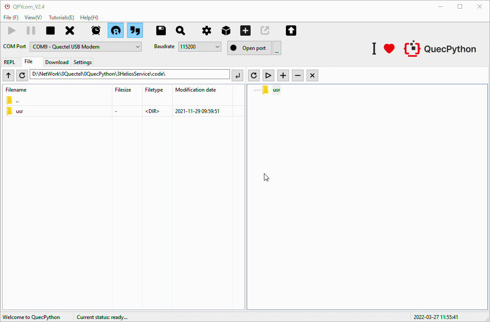

## About document

**Revision history** 

| Version | Date       | Author | Description     |
| ------- | ---------- | ------ | --------------- |
| 1.0     | 2021-09-17 | Chic   | Initial version |


## Brief introduction on Helios Services

1. Background

2. Issues solved by new structure/characteristics/advantages

3. Take some cases as examples to illustrate in which aspect can it solve. 

4. Please illustrate how to use this structure, analyze directory and deploy application note briefly. 

5. A simple case to illustrate the flexibility of new structure and reason to use it. 

   Connect to Aliyun, feed watchdog on device terminal, pull up/down GPIO and transmit data in package via new structure.

Describe problems during the development. Then we contrive the new structure to solve it. Finally, how does it solve problems and in which aspect. 

(E. g. Support log service, tackling thread communication issues, components of watchdog, Tencent Cloud and Aliyun.)

Please check the main body (To be supplemented)

## Background

Till now, the QuecPython is not implemented with an applicable layer framework to arrange message registration & monitoring, event management, component communication, session, repeated work, security and stability.

In order to cater to the development of QuecPython and simplify complex data processing and data protection operations such as the underlying network, log, remote cloud service, location, media and so on from user side, we have specially developed a set of application programming frameworks to simplify the complex creation and maintenance operations.

We would like to simplify the complex coding process via data drivers; therefore, we developed the Helios Service - the applicable coding framework of QuecPython. 

## Advantage

Though the Python is equipped with convenient and powerful development capability, while QuecPython degrades the threshold of embedded development based on python to a great extent.

However, there are many green-hands still have no idea how to carry out or face with various issues when building program framework and compiling codes if they want to develop their own programs.

In order to avoid the repeated issues and improve the development efficiency, we Quectel contrives this Helios Service based on previous experience and endeavors of all official developers. 

So, what does the new HeliosService framework bring to QuecPython?

In Helios Service, it integrates common functions as services and provides united API for customer to call, which makes it more convenient for user to realize network, log, exception, thread communication and queue.

In addition, it provides abundant third-party components such as interrupter, GPIO read/write interceptor, timing interceptor, watchdog interceptor, which alleviate the development difficulty heavily. 

Preliminary purpose of design

- Turn active behaviors of users and operations into positive behaviors.
- Decoupling among services. Therefore, we will introduce the publication/subscription mode of some components in this system especially. 
- The developer just should subscribe services that really matter to himself, after that, he can get the relevant status. 
- Provide message queue, the client can customize components via message queue.
- Provide session center and support customized TOPIC publication and subscription service even if getting rid of this system. 
- Service as container. We provide initiator, then all services and components will be got by this container instead of loading one by one. 
- We take simplifying operations of user and decoupling the dependency among service as our core target. 

How many problems are solved by new framework? please refer to the next chapter. 

## The settled issues

Carry with the BUS of publication and subscription 

  - Support the binding and handling of message . 
  - Asynchronous message handling mechanism
  - There is no need for user to care about the corresponding handling function, just send message to corresponding topic. 

 Carry with message queue broadcasting mechanism

  - Customize message type. Execute asynchronous/synchronous mode, event distribution/management, standard queue and observer mode. 
  - Transmitting message between two threads and multiple events broadcasting. 
  - Carry out the standard decoupling process in module and provide united and stable event management center to ensure the communication quality. 

**NET**

  - Provide network service (Solve the dependency of network, the user just needs to register the callback interface, after that the network registration status will be found. In addition, it supports active query and sets APN)
  - Support network failure notification, reconnect network notification and subscribing message)
  - Support active query of network

**LOG**

  - Provide standard log system (Solve log standardization issue, provide the output of log standardization and carry with time. Similarly, it supports asynchronous and synchronous configuration, Cloud transmission and write the data into storage)
  - Support the output of different uart port as well as the data which written into the storage. 
  - Support subscribing and releasing message

**CLOUD (Quectel Cloud Service)**

  - Provide OTA upgrade and log transmission port based on Quectel cloud. (The ending log report, OTA upgrade and components. Meanwhile, it supports modes of synchronization and asynchronization )
  - Support automatic FW upgrade
  - Support automatic file upgrade
  - Support submitting cloud log for we Quectel log system

**MEDIA (Media service)**

  - Provide media service (support publishing asynchronous media message, united media message management)
  - Support asynchronous tts and audio broadcasting
  - Support tts, audio message publication, broadcasting, subscription
  - Support automatic management of tts and audio broadcasting, assure the reliability of message broadcasting. 

**EXCEPTION (Exception service)** 

  - Provide exception service support
  - Support synchronization and asynchronization message
  - Support asynchronous message subscription and transmission

**PM (Low Power consumption service)**

  - Optical power management
  - Low power mode by default
  - Support wakeup in a high refreshing rate

**SYS_BUS (Publish subscription bus)**

  - Support customized topic so as to realizing publication and subscription;
  - Support publishing subscription, in addition, allocate thread handling service via automatic thread channel;
  - Support the handling of high concurrency.

**Queue (Standard queue)**

  - Support the message transmission among various threads.
  - Congestion realization, support the atomic operation of "**put and get**" of multiple threads.

## Illustration 

**Code directory architecture** 

```python
usr																		 # User partition
├─main.py 															     # user codes (program entrance)
├─bin																     # script and starter (Some common services and components are located here)
│  ├─cloud_service.py												     # Cloud service component
│  ├─exception_service.py       									     # Exception service component
│  ├─guard.py                   									     # Boot container of overall monitor and configuring file
│  ├─log_service.py             								         # Log service component
│  ├─media_service.py           							  	         # Media service component
│  ├─net_service.py             								         # Network service component
│  ├─pm_service.py              	    						         # Power management service component
│  └─components                 								         # Some components are located in this directory
│  │   ├─abstract_service.py   							  		         # Abstract service component
│  │   ├─blinker_min.py        								 					
│  │   ├─monitor.py            													
│  │   ├─OTA.py                									         # OTA upgrade service component
│  │   └─service_models.py     							 		         # Service models
│  └─third_party                											
│       ├─ql_interrupter.py   								             # Third-party component, such as external interrupter and watchdog
│       └─ ...
├─etc                            									     # Directory of configured file(not compulsory)
│   ├─app_config                									     # Directory of configured file related to app service
│   └─system_config             								         # Directory of configured file relatde to system service
├─log                            										 # Log storage service (Not compulsory, it will be built automatically when saving log in the local)
└─utils                            										 # Common utilities directory
   ├─JsonParserUtils.py          										 # Utility via json 
   ├─resolver.py                										 # Resolver of time formatization
   └─service_utils.py             										 # Single case mode
```

> About third-party components, which will be updated continuously.

### Application note on matching with utility

> The new structure should be matched with QPYcom_V1.7  

All above directories and files can be downloaded into module via QPYcom. Once compiled the code, the user can download codes into module and debug. For detailed downloading method, please refer to next figure. 

No.1 Download  the configured program in the next page, the advantage is that you can just download the script button if you want to download and debug again after importing the directory structure by one button control. 


No. 2  In file page, drag from the local file tree on the left to the module file tree on the right, then wait till the downloading is accomplished. The advantage is that it is simple and convenient to drag directly. 



> Above two schemes can be used to download structure code into module

### How to use API 

Refer to API illustration 

## Cases 

### Reading configured files

```python
# Initialize the overall container environment
from usr.bin.guard import GuardContext
guard_context = GuardContext()
# Refresh container and start all services
guard_context.refresh()
# Read configured files
config = guard_context.service_config["cloud"] # Read the dictionary object that returned by configured file of /usr/etc/app_config/cloud/config.json 
```

Network and log service

```python
from usr.bin.guard import GuardContext

def net(*args, **kwargs):
	"""network callback function""" 
	app_log.debug("net_callback,args:{},kwargs:{}".format(args, kwargs))
			
if __name__ == '__main__':
    # Initialize overall container
    guard_context = GuardContext()
    guard_context.refresh()
    # Obtain network & log service
    net_service = guard_context.get_server('net')
    log_service = guard_context.get_server('log')
	# Subscribe network service
    net_service.subscribe(net)

    # Obtain app_log
    app_log = guard_context.get_logger("app_log")
    app_log.debug("net status: {}".format(net_service.get_net_status()))
```

### Case of third party

GPIO read/write interceptor

```python
from usr.bin.third_party.ql_interrupter import PinInterrupter 
from machine import Pin, ExtInt
pin_inter = PinInterrupter(Pin.GPIO1, trige_mode=Pin.OUT, pull_mode=Pin.PULL_DISABLE, mode=0) # Initialize
pin_inter.write(1) # Set the level output of pin as high
```

E. g. 

```python
from usr.bin.third_party.ql_interrupter import WatchDog
from machine import Pin, ExtInt
import sys_bus
# Initialize watch dog
wd = WatchDog(Pin.GPIO15, 1, 10000)
wd.start()
def topic1_cb(topic, msg):
	pass
def topic2_cb(topic, msg):
	pass
# After subscribing watchdog feeding, the HW will pull up GPIO and notify the module that the watchdog feeding is a success. 
sys_bus.subscribe("WDT_KICK_TOPIC", topic1_cb)
# The callback after subscribing watchdog feeding.
sys_bus.subscribe("WDT_KICK_TOPIC_FEED", topic2_cb)
```

> For more exemplified codes and performances, please refer to API illustration. 
