## About document

**Revision history** 

| Version | Date       | Author | Description     |
| ------- | ---------- | ------ | --------------- |
| 1.0     | 2021-09-17 | Chic   | Initial Version |

## The illustration of advanced Helios Services

In this chapter, we will introduce how to use these functions. We have already built up the environment via the introduction on Quick start. From now on, we will use above functions as well as results. 

## Deploy document of Helios Service

### Container 

It is included and integrated with all services and configurations. In order to get familiar with it, we will launch the core functions; as for other functions, please refer to API document. 

#### Start the container

- [OK]  Succeed to start 
- [FAILED] Fail to start 
- Both ***sys*** and ***app*** represent partition to which service belongs. As for ***sys***, it is system level; while the ***app*** is user level. 
- We can call the container after succeeding to start. In addition, we can also check all services that have been started successfully. 

 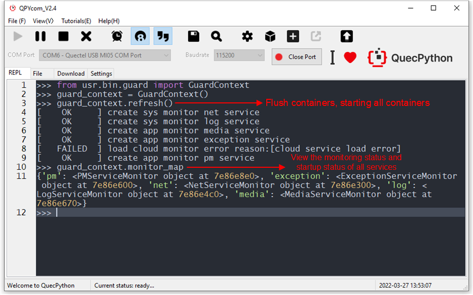

#### Network service

##### Basic function

- Obtain **sim**, **net** and **dataCall** object without importing 
- Subscribe network status

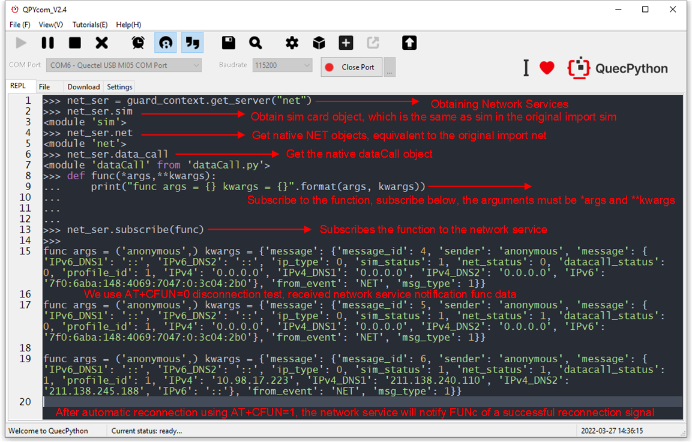

##### Detect Network connection 

- It is available to check network status after starting up. For returned value, please refer to `HeliosService API document`.

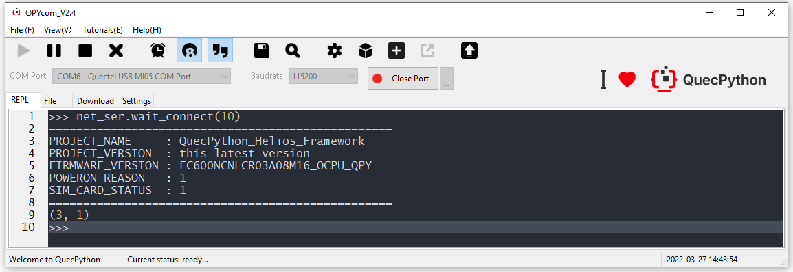

##### Other functions

Take the API document as a reference. 

#### Log service

##### Basic function

- Obtain the log with a name on user end
- Output log
- Set the output level of log 

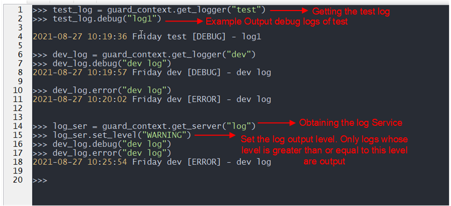

- Subscribe log

  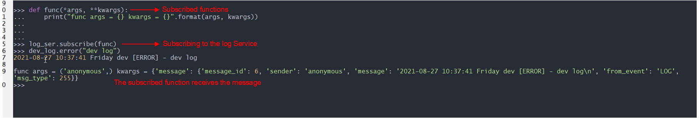

##### Other functions

Please refer to API document

#### Media Service

##### Basic function

- Obtain original **tts** and **audio**
- Subscribe message
- Set mode
- Set PA (Refer to API document) 

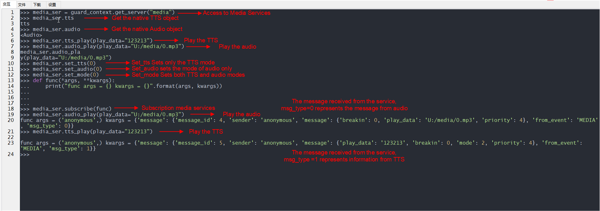

##### Other function

Please scan over API document

#### PM (Low power consumption service)

##### Basic function 

- Start low power consumption  mode by default
- Vote mechanism
- Check whether the vote is 0; if it is, which means it can't enter sleep mode
- However, every vote needs cancellation if you delete vote. 

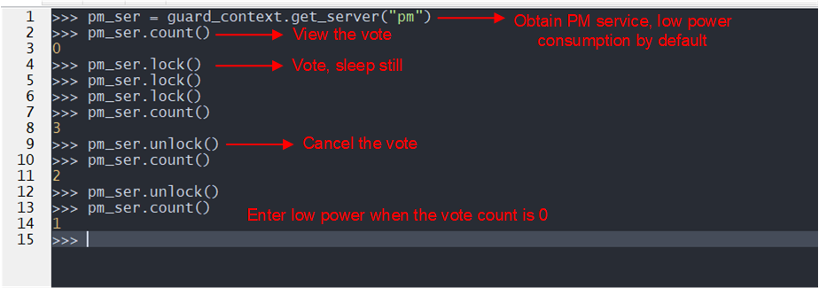

##### Other functions 

Please check API-related document

#### Quectel Cloud service

##### Basic function

- Provide log to upload to Quectel Cloud
- Upgrade **OTA** signal file

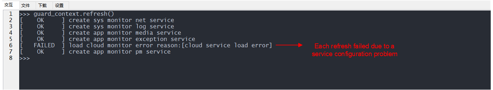

Build *config.json* of Cloud service, which is located in *app_config*.

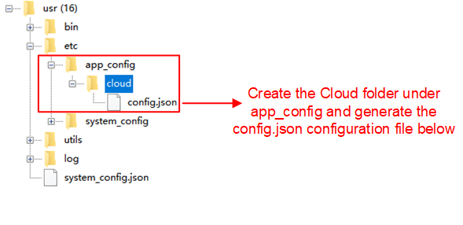

The contents of the Cloud service config.json

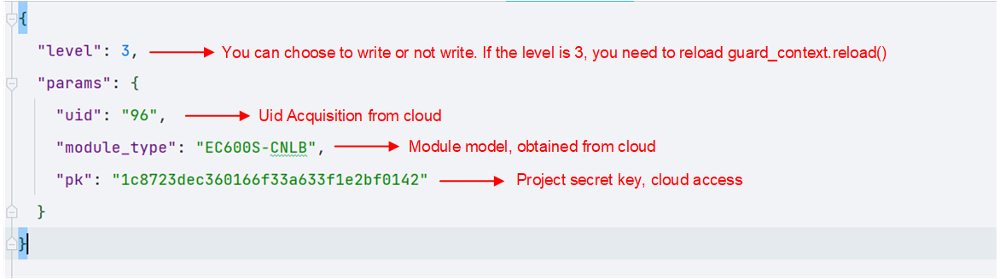

Since the level is set at 3, it could not be used even if it is successfully created here, so we need reload service to enable automatic upgrade service. The original intention of the design is to make the startup level of some services lower, so that customers can change the startup sequence of the controller.

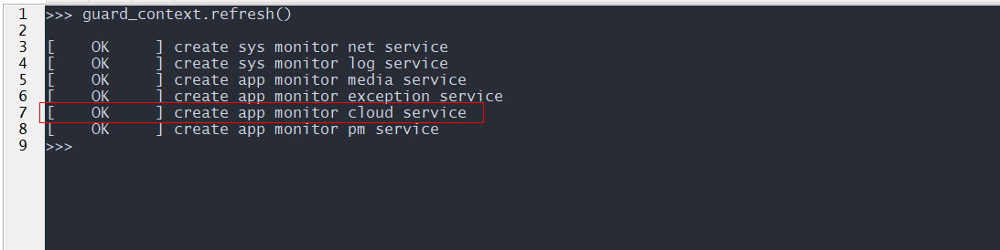 

 

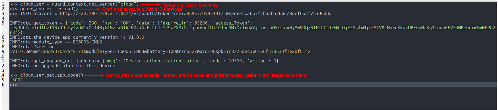

- Submit log 

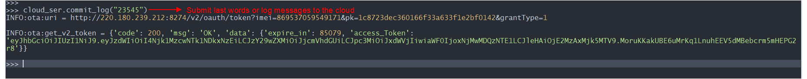

#####  Other functions

Please check API document

#### Exception service

##### Basic function

- Subscribe exception service
- Publish exception

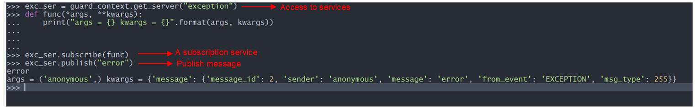

### Third-party component

It is involved in gpio, interrupt, timer, package of watchdog, security component and offline-storage. 

Please check the API-related document

### Sys_bus usage 

- Subscribe topic function
- Publish data 

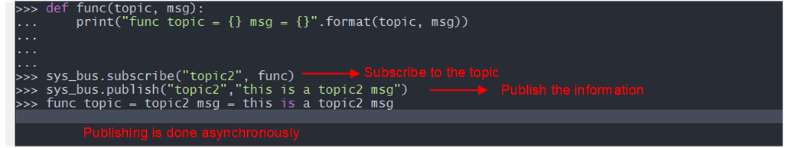

### About cut

- Following contents, which marked with red square and with " **_service** " suffix, can be cut, if there is no need to delete this service, you can delete it. 

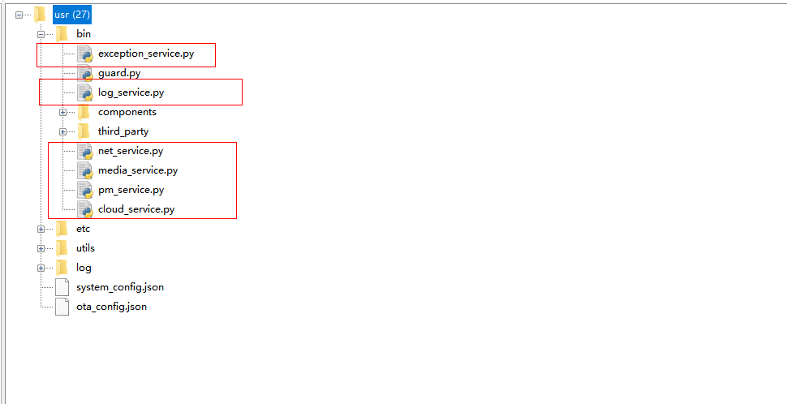 
