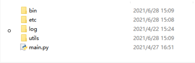

# Application notes on Helios Service structure and API document


## Background 

In order to cater for the development of QuecPython and simplify the operations on complicated data and security on lower lay network, log, QuecCloud service, location and media from the perspective of user side, we especially contrive the QuecPython structure hereby. The aim of it is to optimize complicated code process via data. 


## Solved issues 

### Bus for publishing and subscribing 

- Support the bind of message and handling 
- Asynchronous message handling mechanism 
- There is no need for user to care about corresponding handling function, just send message to related topic. 


### Message queue broadcast mechanism

- Define message type, execute asynchronous and synchronous mode, support event delivery and management, standard queue and observer mode.  
- Tackle the message transmission between two threads, as well as multiple events broadcast issue. 
- Carry out standard decoupling process, and stable event management center to guarantee the communication quality. 

### NET:

- Provide network (It solves the issue on  network reliance from client side. The client can observe the network registration status via registering callback interface. Moreover, it supports active query and setting APN. )
- Support disconnection notification, reattachment notification and subscribing message. 
- Support querying network actively 

### LOG

- Provide standard log  system (solve the issue on log standardization, provide standard log out with time stamp. Similarly, the synchronous and asynchronous configuration is supported. What's more, it supports the cloud transmission and write the data in the disc)
- Support transmission among various uarts and writting data in the disc.
- Support subscribing and publishing message 

### CLOUD (QuecCloud):

- Provide OTA Upgrade and interface to transmit log (Last Will and Testament log, OTA upgrade, and OTA components of synchronous and asynchronous mode)
- Support auto FW upgrade 
- Support auto file upgrade
- Support submitting cloud log that matched with the log system of we Quectel

### MEDIA (Media service)

- Support media (publish asynchronous media message, unify media message management)
- Support the broadcast of asynchronous tts and audio
- Support publishing tts & audio message, broadcasting message and subscribing message. 
- Support the auto management of tts & audio broadcast to guarantee the reliability of message broadcast. 

### EXCEPTION

- Provide exception service 
- Support synchronous/asynchronous message 
- Support subscribing/publishing asynchronous message 

### PM

- Selectable PM 
- Low power consumption mode by default 
- High refresh rate wakeup 

### SYS_BUS(Bus for publication and subscription)

- Publish and subscribe via self-defined topic 
- The operation on publication and subscription, allocate thread handing service via automatic thread tunnel. 
- Handle high concurrency

### Queue (Standard queue)

- Support the message transmission among different threads 
- Block. In addition, it supports the put and get of multiple threads in atomic level. 


## Directory structure

### Specific illustration on directory 

- usr
  - bin
  - etc
  - utils
  - log

#### usr(Compulsory)

- User directory 

- Perform 
  - 

##### bin

- Script and initiator directory (Some public services and components are located)

###### components

- Directory of some public components. 

#### etc (Selectable)

- Directory of configuration file 

##### app_config

- Directory of configuration file related to APP service 

##### system_config

- Directory of configuration file related to system service 

#### log (Selectable)

- Save log 
- It will be created if the local storage is not selected to save log. 

#### utils (Compulsory)

- Common utilities directory

Directory display

#### main.py (User code)


## Message Queue Bus


### Sys_bus(Publish/Subscribe)

#### Subscribe 

>  **subscribe(topic, callback)**

Parameter 

| Parameter | Type          | indication                                                   |
| --------- | ------------- | ------------------------------------------------------------ |
| topic     | string \| int | Topic                                                        |
| callback  | function      | Subscribe function, please note that the parameter of this function must be *(args, kwargs)*. |

Example 

```python
import sys_bus

def cb_callback(topic, msg):
    print(topic, msg)

# Support one topic, multiple subscription function can be registered 
sys_bus.subscribe("topic1", cb_callback)
```


#### Publish 

>  **publish(topic, msg)**

Parameter 

| Parameter | Type          | Indication            |
| --------- | ------------- | --------------------- |
| topic     | string \| int | Topic                 |
| msg       | void          | Send message to topic |

Example 

```python
import sys_bus

"The subscriber will receive message after publishing " 
sys_bus.publish("topic1", "this is a msg")
```


#### Unsubscribe 

>  **unsubscribe(topic, callback=None)**

Parameter 

| Parameter | Type          | Indication                                                   |
| --------- | ------------- | ------------------------------------------------------------ |
| topic     | string \| int | Topic                                                        |
| callback  | function      | Unsubscribe function, which is None by default. If it does not upload, unsubscribe topic by default. If it uploads, unsubscribe the callback function of this topic. |

Example

```python
import sys_bus

# Unsubscribe the cb_callback function under Topic 
sys_bus.unsubscribe("topic1", cb_callback)
# Unsubscribe topic 
sys_bus.unsubscribe("topic1")
```


#### Check register table 

>  **sub_table(topic=None)**

Parameter 

| Parameter | Type          | Indication                                                   |
| --------- | ------------- | ------------------------------------------------------------ |
| topic     | string \| int | If it does not upload, check all topics and return **k:v** dictionary. While uploading, return the subscription function portfolio under corresponding topic. |

Example 

```python
import sys_bus

sys_bus.sub_table()
# Return {"topic1": set(cb_callback...)}

sys_bus.sub_table("topic1")
# Return set(cb_callback...)
```


### Ordinary Queue (Mainly on thread session)

Provide queue service

#### Create queue object

> from queue import Queue
>
> q = Queue(maxsize=100)

- Parameter

| Parameter | Type | Illustration                               |
| --------- | ---- | ------------------------------------------ |
| maxsize   | int  | The maximum size of queue, 100 by default. |


#### In queue 

> q.put(item)

- Parameter

| Parameter | Type | Illustration                |
| --------- | ---- | --------------------------- |
| item      | void | The contents put into queue |


- Return value 

  - True:  Success 
  - False:  Failure 


#### Out queue 

It will block waiting message, if any data is put, the **get** will receive related info. 

> q.get()

- Parameter 
  - None 
- Return value
  - Return the **put** data 

#### Example

```python
import _thread
from queue import Queue
# Initialize queue
q = Queue(maxsize=100)

def get():
    while True:
        # The q.get will block the waiting message. As long as the q.put is done, the q.get will receive relevant signal.Subsequently, release the block and carry out further step.  
        item = q.get()
        print(item)
        
# Initiate thread to wait for message 
_thread.start_new_thread(get,())
# Put the message into queue 
q.put(1)
q.put(2)
```


## Application notes on API 

### Guard application 

The initiation container for global monitor and configuration file

#### Get structure version number 

- Get structure version number 

**version**

```PYTHON
>>>from usr.bin.guard import GuardContext
>>> GuardContext().version()
{'ARTIFACT_ID': 'qpy-framework', 'VERSION': '1.0.0.RELEASE', 'GROUP_ID': 'qpy.quectel.com'}
```

- Return value 

| Returned Value | Type   | Illustration                                  |
| -------------- | ------ | --------------------------------------------- |
| GROUP_ID       | string | Attributed group address                      |
| ARTIFACT_ID    | string | Name ID                                       |
| VERSION        | string | The version number starts from  1.0.0.RELEASE |

#### Initialize 

- Initialize the global guard environment 

```python
>>> from usr.bin.guard import GuardContext
>>> guard_context = GuardContext()
```


#### Refresh container 

- Refresh container and initiate all services (As for the level of service, it is not equal to 3)

**refresh**

```python
>>> guard_context.refresh()

[    OK     ] create sys monitor net service
[    OK     ] create sys monitor net service

[    OK     ] create app monitor media service
[    OK     ] create app monitor exception service

[   FAILED  ] load cloud monitor error reason:[cloud service load error]
```

- Output 
  - The initiation status of relevant services 

| Status                      | Display                | Description |
| --------------------------- | ---------------------- | ----------- |
| Succeed in creating service | [       OK       ] XXX | Success     |
| Fail to create service      | [    FAILED   ] XXX    | Failure     |
| Warning                     | [    WARN    ] XXX     | Warning     |


#### Query all services 

**servers**

- Get all services 

```python
>>> guard_context.servers()
{'media': <MediaServiceMonitor object at 7eb6df60>, 'log': <LogServiceMonitor object at 7eb6a550>, 'net': <NetServiceMonitor object at 7eb64e10>, 'exception': <ExceptionServiceMonitor object at 7eb6b0d0>}
```

Current services 

| Service name | Perpetual | Description                                                  |
| ------------ | --------- | ------------------------------------------------------------ |
| log          | True      | Initialize **refresh** by default                            |
| media        | True      | Initialize **refresh** by default                            |
| net          | True      | Initialize **refresh** by default                            |
| exception    | True      | Initialize **refresh** by default                            |
| cloud        | False     | The cloud should import configuration file by default<br />[1. Configure and import actively <br />2. Write in *etc/app_config/cloud/config.json* ] <br />Initialize **refresh** or **reload** |


#### Get service 

**get_server**

- Get service 

> guard_context.get_server(server_name)

- Parameter 

| Parameter   | Type         | Illustration         |
| ----------- | ------------ | -------------------- |
| server_name | Service name | Get service via name |

- Return value
  - Corresponding service object

Example

```python
>>> guard_context.get_server("log")
<LogService object at 7eb655a0>
```


#### Register service manually

**register_monitor**

Used to register service manually

> guard_context.register_monitor(server_name, monitor)

- Parameter

| Parameter   | Type   | Description                                                  |
| ----------- | ------ | ------------------------------------------------------------ |
| server_name | string | Service name                                                 |
| monitor     | class  | Derived from MonitorInterface, in addition, the starter of server is wrapped. |

- Return value 
  - True  Success 
  
  - False Failure 
  
    

#### Reload service

**reload**

- Reload service when there is a need to register service manually or starting service priority. 

> guard_context.reload()

- Parameter 
  - None
- Return value
  - None


#### Get app/json contents 

When setting the configuration file applied in APP under the directory of */usr/etc/app_config*, the corresponding directory format will be read for us during the process of initializing guard. 

- /usr
  - /etc
    - /app_config
      - /app_name[App name, English is compulsory]
        - config.json


 **service_config**

- It contains the json contents under all app_config. The corresponding relationship is *{app_name: json_content}*.

> guard_context.service_config

Example 

```python
>>> guard_context.service_config["cloud"]

```


### Net service 

#### Get network  service 

```python
>>> net_ser = guard_context.get_server("net")
>>> net_ser
<NetService object at 7eb62de0>
```


#### Subscribe network service

**subscribe**

Subscribe service message, mainly on network connection/disconnection

> net_ser.subscribe(callback)

- Parameter

| Parameter | Type     | Description                                                  |
| --------- | -------- | ------------------------------------------------------------ |
| callback  | function | Subscribe function, please note that the parameter of this function must be *(args, kwargs)*. |

- Return value
  - None


#### Unsubscribe

**unsubscribe**

Unsubscribe the function 

> net_ser.unsubscribe(callback)

- Parameter 

| Parameter | Type     | Illustration                                                 |
| --------- | -------- | ------------------------------------------------------------ |
| callback  | function | Subscribe function, please note that the parameter of this function must be *(args, kwargs)*. |

- Return value 
  - None 


#### Output data of subscriber 

After subscribing to the logging service, the subscribed function will be notified when the log is printed

```python
from usr.bin.guard import GuardContext

guard_context = GuardContext()

guard_context.refresh()

net_ser = guard_context.get_server('net')

# The event will be triggered when network exception of user occurs. 

def func(*args, **kwargs)
	"""
	 args: ('anonymous',)No need to care about 
	 kwargs:
		{
			'message': {
				'message_id': 2, 															# Message ID 
				'sender': 'anonymous', 														# Sender 
				'message': {
                    'IPv6_DNS1': '::', 											            # IPV6的DNS1 DNS1 of IPV6
                    'IPv6_DNS2': '::', 													    # IPV6的DNS2 DNS2 of IPV6
                    'ip_type': 0,                                                           # There is a need to pay attention to, the "0" refers to IPV4                                *
                    'sim_status': 1,                                                        # SIM card status, 1 means the existence while 0 refers to non-existence of SIM card.                  *
                    'net_status': 0,                                                        # Net status, 1 refers to relatively good, while 0 means network failure	    *
                    'datacall_status': 0,                                                   # Datacall status                                   *
                    'profile_id': 1,                                                        # PDP INDEX
                    'IPv4': '0.0.0.0', 														# IPV4 address
                    'IPv4_DNS1': '0.0.0.0', 											    # IPV4dns1
                    'IPv4_DNS2': '0.0.0.0',                                                 # IPV4dns2
                    'IPv6': '7f0:e6b8:8948:4069:7047:8849:20:4861'                          # IPV6 Address 
				}, 
				'from_event': 'NET',                                                       # The origin of event 
				'msg_type': 1                                                              # Message type
				}
		}
		The user should pay attention to the item with "*" appended. 
	"""

    print("args = {} kwargs = {}".format(args, kwargs))
```


### About media service 

 Get media service 

- Play audio. It supports playing TTS, mp3 and AMR. 

```python
>>> media_ser = guard_context.get_server("media")
>>> media_ser
<MediaService object at 7eb6ae80>
```


#### Set mode 

- Device Type.  0- headset 1- earphone 2- speaker  **[0 refers to headset mode by default]**

> media_ser.set_mode(mode)

- Example 

```python
>>> media_ser.set_mode(0)
```


#### Get audio 

Get original audio object for extra handles. 

```python
>>> media_ser.audio
```

- Return 
  - Audio object 


#### Get tts

Get original audio object for extra handles. 

```python
>>> media_ser.tts
```

- Return 
  - TTS object 


#### Set PA 

Set the gpio pin of outputted PA and enable it. Currently, it only supports the switch of AB type to D type. That means the pulse of these two rising edge is limited in a range of 1us to 12us separately. 

>  media_ser.set_pa("priority=4, breakin=0, mode=2, play_data="")

- Parameter 

| Parameter | Type | Illustration                                |
| --------- | ---- | ------------------------------------------- |
| gpio      | int  | Set output gpio, which can be got from pin. |

- Return value 

When success, return integer 1.

When failure, return integer 0. 

- Example 

```python
>>> media_ser.set_pa(Pin.GPIO15)
1
```


#### Set auto play 

Under the circumstance that the client would like to play via subscribing function instead of we interface, he can select disabling auto play. Normally, the True refers to auto play while the False means played via client by default. 

> media_ser.enable = False

- Parameter
  - None
- Return value
  - None


#### Subscribe media service

**subscribe**

Subscribe service message, mainly on network connection/disconnection signal.

> media_ser.subscribe(callback)

- Parameter 

| Parameter | Type     | Description                                                  |
| --------- | -------- | ------------------------------------------------------------ |
| callback  | function | Subscribe function, please note that the parameter of this function must be *(args, kwargs)*. |

- Return value 
  - None 


#### Publish media message 

##### Publish audio message 

Play audio file. It supports various files such as mp3, amr and wav.  In terms of priority, it ranges from 0 to 4. The higher number, the higher priority. Moreover, each priority array can withstand 10 tasks at maximum simultaneously. If it shares one play queue with TTS, which will be played by default. 

When subscribing message, the event and data been played will be received simultaneously. 

>  media_ser.audio_play(priority=4, breakin=0,  play_data="")

- Parameter 

| Parameter | Type   | Illustration                                                 |
| --------- | ------ | ------------------------------------------------------------ |
| priority  | int    | Play priority, which supports the priority ranging from 0 to 4. The bigger value is possessed with the higher priority. |
| breakin   | int    | Break in mode, 0 means it is not allowed to break in, while 1 means that it is allowed to break in. |
| play_data | string | String to be played, including path to save file             |

- Return value 

  - None 

  

##### Publish TTS message 

It supports audio play and priority ranging from 0 to 4. Please note that the bigger number, the higher priority. In addition, each priority array can support 10 play tasks at maximum simultaneously. As for detailed play tactics, please refer to contents as described below. 

1. Assuming that the Task A is playing and allowed to breakin, however, another Task B with higher priority will be played directly and stop the current Task A instead. 
2. Assuming that the Task A is playing and allowed to breakin, however, another Task B with higher priority will be played directly and stop the current Task A instead. 
3. Assuming that the Task A is playing and  not allowed to breakin, however, another Task B with same priority will be placed to the end of the broadcast queue of priority array. When Task A is accomplished, other tasks in queue will be played in accord with the priority level by turns. (Normally, the level is from high to low)
4. Assuming that the Task A is playing and allowed to break in, however, another Task B with same priority will be played directly and stop the current Task A instead. 
5. Assuming that Task A is playing and several tasks have been in the play queue of priority array. In addition, the last Task N in this array is allowed to break in. in this situation, another Task B with same priority will cover the Task N directly once added. That is to say, as for certain priority array, only the last task is allowed to break in (the breakin is 1), while for rest, which are not allowed. 
6. Assuming that Task A is playing, another Task B, whose priority is lower than Task A, will be added to the playing list of priority array corresponding to it no matter whether the Task A is allowed to break in.

When subscribing message, the event and data played will be received simultaneously. 

>  media_ser.tts_play(priority=4, breakin=0, mode=2, play_data="")

- Parameter 

| Parameter | Type   | Illustration                                                 |
| --------- | ------ | ------------------------------------------------------------ |
| priority  | int    | Play priority, which supports the priority ranging from 0 to 4. The bigger value is possessed with higher priority. |
| breakin   | int    | Break in mode, 0 means it is not allowed to break in, while 1 means that it is allowed to break in. |
| mode      | int    | Code mode. 1 - UNICODE16 (Size end conversion)，2 - UTF-8，3 - UNICODE16 (Don't convert) |
| play_data | string | String to be played                                          |

#### Unsubscribe

**unsubscribe**

Unsubscribe the subscribed function

> media_ser.unsubscribe(callback)

- Parameter

| Parameter | Type     | Description                                                  |
| --------- | -------- | ------------------------------------------------------------ |
| callback  | function | Subscribe function, please note that the parameter of this function must be *(args, kwargs)*. |

- Return value 
  - None 

#### Output subscriber data 

If there is a need for subscriber to get the tts to be published, he can get related parameters as described below via subscribing media service. However, the system is embedded with "Play" by default beforehand. 

```python
from usr.bin.guard import GuardContext

guard_context = GuardContext()

guard_context.refresh()

media = guard_context.get_server('media')

def func(*args, **kwargs):
	"""
	 args: ('anonymous',)No need to care about 
	 kwargs:
	 	{
	 	 'message': {
		 	 'message_id': 2,                                          # message_id
		 	 'sender': 'anonymous',                                    # Sender 
		 	 'message': {
		 	 	'play_data': 'test',                                  # Data content	
		 	 	'breakin': 0, # Whether can be broken [Please note that only when playing tts can this attribute be embedded, however, the audio play is not equipped with this attribute]
		 	 	'mode': 2, 										     # Play mode 
		 	 	'priority': 4                                        # Priority level 
		 	 	}, 
		 	 'from_event': 'MEDIA',                                 # Event type 
		 	 'msg_type': 1                    # Message type, 1 refers to tts message while 0 means audio message 
		 	 }
	 	}
	"""
    print("args {} kwargs {}".format(args, kwargs))
    
media.subscribe(func)   
# Publish TTS message, the subscriber of media will receive this message 
media.tts_play(play_data="test")
```


### Log service 

Get log service 

```python
>>> log_ser = guard_context.get_server("log")
>>> log_ser
<LogService object at 7eb655a0>
```


#### Set log output level 

Set log output level 

DEBUG<INFO<WARNING<ERROR<CRITICAL

> log_ser.set_level(level)

- Parameter 

| Parameter | Type   | Description                                        |
| --------- | ------ | -------------------------------------------------- |
| level     | string | Set output level, which is DEBUG level by default. |

- Return value 
  - None 

Example 

```python
>>> from usr.bin.log_service import LOG_LV
>>> log_ser.set_level(LOG_LV.DEBUG)
```

#### Set output location 

It is available to set output location. Currently, it supports three aspects only: 

- Output to terminal **(By default)**
- Output to file 
- Output to different uart 

##### Output to terminal 

It outputs to terminal by default. 

#### Subscribe log message 

**subscribe**

Subscribe log message. When receiving log message, the subscribed message will get relevant data. 

> log_ser.subscribe(callback)

- Parameter 

| Parameter | Type     | Description                                                  |
| --------- | -------- | ------------------------------------------------------------ |
| callback  | function | Subscribe function, please note that the parameter of this function must be *(args, kwargs)*. |

- Return value
  - None 


#### Initialize logger 

Get logger 

```python
>>> from usr.bin.guard import GuardContext
>>> guard_context = GuardContext()
>>> lg_adapter = guard_context.getLogger("main")
```


##### Get logger 

**getLogger**

> guard_context.get_logger(name)

- Parameter

| Parameter | Type   | Description          |
| --------- | ------ | -------------------- |
| name      | string | Client terminal name |


##### Publish log message 

###### DEBUG log

>  lg_adapter.debug(msg)

###### INFO log

>  lg_adapter.debug(msg)

###### WARNING  log

>  lg_adapter.debug(msg)

###### ERROR log

>  lg_adapter.debug(msg)

###### CRITICAL log

>  lg_adapter.debug(msg)

- Parameter 

| Parameter | Type   | Description   |
| --------- | ------ | ------------- |
| msg       | string | Outputted log |


#### Unsubscribe 

**unsubscribe**

Unsubscribe function 

> log_ser.unsubscribe(callback)

- Parameter

| Parameter | Type     | Description                                                  |
| --------- | -------- | ------------------------------------------------------------ |
| callback  | function | Subscribe function, please note that the parameter of this function must be *(args, kwargs)*. |

- Return value 
  - None 


#### Output subscriber data 

After subscribing log service, it will notify the subscribed function under the circumstance of printing log. 

```python
from usr.bin.guard import GuardContext

guard_context = GuardContext()

guard_context.refresh()

log_ser = guard_context.get_server('log')

def func(*args, **kwargs)
	"""
	 args: ('anonymous',) No need to pay attention 
	 kwargs:
	 	{
	 	 'message': {
	 	      'message_id': 4,                                 # Message ID 
	 	      'sender': 'anonymous', 						   # Sender 
	 	      'message': <LogFormatUtil object at 7e7142c0>,   # LogFormatUtil object
	 	      'from_event': 'LOG', 							   # Event from log module 
	 	      'msg_type': 255                                  # Message type 
	 	      }
	 	}
	"""
    """
  	 	## The LogFromatUntil is equipped with following attributes 
	 	Get log message 
	 	log_data = kwargs['message']['message']             # Check log message 
	 	log_data.time                                       # Check log time 
	 	log_data.tag										# Check log tag such as NET  
	 	log_data.level									    # Check log output level 
	 	log_data.content                                    # Check log content 
	 	log_data.log_format                                 # Get standard output 
    """
    print("args = {} kwargs = {}".format(args, kwargs))
    
    

# Subscribe log service 
log_ser.subscribe(func)
    
logger = guard_context.get_logger("test")

logger.debug("this is a test msg")

```


### About EXCEPTION service 

Get exception service 

```python
>>> exception_ser = guard_context.get_server("exception")
>>> exception_ser
<ExceptionService object at 7eb63860>
```


#### Subscribe exception message 

**subscribe**

Subscribe log message. When receiving log message, the subscribed message will get relevant data. 

> exception_ser.subscribe(callback)

- Parameter

| Parameter | Type     | Description                                                  |
| --------- | -------- | ------------------------------------------------------------ |
| callback  | function | Subscribe function, please note that the parameter of this function must be *(args, kwargs)*. |

- Return value 
  - None


#### Publish exception message 

Publish message, which will be received when subscribing exception message

> exception.publish(msg)

- Parameter 

| Parameter | Type   | Description       |
| --------- | ------ | ----------------- |
| msg       | string | Exception message |

- Return value 
  - None 


#### Unsubscribe 

**unsubscribe**

Unsubscribe the subscribed function 

> exception_ser.unsubscribe(callback)

- Parameter 

| Parameter | Type     | Description                                                  |
| --------- | -------- | ------------------------------------------------------------ |
| callback  | function | Subscribe function, please note that the parameter of this function must be *(args, kwargs)*. |

- Return value 
  - None 


#### Output the data of subscriber 

When we subscribed error service, the data will be outputted to the subscriber. 

```python
from usr.bin.guard import GuardContext

guard_context = GuardContext()

guard_context.refresh()

ex= guard_context.get_server('exception')

def func(*args, **kwargs):
	"""
	 args: ('anonymous',) No need to focus on 
	 kwargs:
	 	{
	 	 'message': {
		 	 'message_id': 2,                        # message_id
		 	 'sender': 'anonymous',                  # Sender
		 	 'message': 'this is a error msg',       # Exception msg
		 	 'from_event': 'EXCEPTION',              # Event type
		 	 'msg_type': 255                         # No need to care about message type 
		 	 }
	 	}
	"""
    print("args {} kwargs {}".format(args, kwargs))
    
    
ex.subscribe(func)
# Send exception message 
ex.publish("this is a error msg")
```


### Cloud service 

Get cloud service

```python
>>> cloud_ser = guard_context.get_server("cloud")
>>> cloud_ser
<CloudService object at 7eb63860>
```

#### Subscribe cloud service message 

**subscribe**

Subscribe the cloud service message. The message related to cloud service will be received. Under the circumstance of upgrade version, the message on the cloud will also be received. For detailed performance, please refer to the second method in **demo**. 

> cloud_ser.subscribe(callback)

- Parameter 

| Parameter | Type     | Description                                                  |
| --------- | -------- | ------------------------------------------------------------ |
| callback  | function | Subscribe function, please note that the parameter of this function must be *(args, kwargs)*. |

- Return value
  - None


#### Unsubscribe 

**unsubscribe**

Unsubscribe cloud service message 

> cloud_ser.unsubscribe(callback)

- Parameter 

| Parameter | Type     | Description                                                  |
| --------- | -------- | ------------------------------------------------------------ |
| callback  | function | Subscribe function, please note that the parameter of this function must be *(args, kwargs)*. |

- Return value
  - None 


#### Submit cloud log

For details, please refer to the QuecPython Advance

**commit_log**

Submit cloud log

> cloud_ser.commit_log(message)

- Parameter

| Parameter | Type     | Description    |
| --------- | -------- | -------------- |
| message   | function | Upload message |

- Return value 
  - None 


#### Get upgrade identifier

**get_app_code**

Get the identifier of application upgrade 

> cloud_ser.get_app_code()

- Parameter 
  - None 
- Return value 

| Parameter | Description                 |
| --------- | --------------------------- |
| 3001      | Plan to upgrade             |
| 3002      | No upgrade plan             |
| 4001      | Fail to get **token**       |
| 4002      | Fail to get upgrade address |
| 4003      | Fail to download FW         |
| 4004      | Fail to get parameter       |
| 4005      | The mode is inexistent      |
| 4021      | Error to save configuration |
| 4022      | Error to get configuration  |
| 4023      | Network error               |
| 4024      | Fail to request server      |

### Power management service

Get power management service, there is no need to set since the lower power consumption is enabled by default.

```python
>>> pm_ser = guard_context.get_server("pm")
>>> pm_ser
<PmService object at 7eb63860>
```


#### Make sleep lock mute 

Make sleep lock mute via vote in PM 

> pm_ser.lock()

- Parameter
  - None
- Return value
  - None


#### Release sleep lock

Release sleep lock

>pm_ser.unlock()

- Parameter 
  - None 
- Return value
  - None


#### Query the count of sleep lock

Query the count of sleep lock

> pm_ser.count()

- Parameter
  - None 
- Return value
  - Sleep lock count with int type


#### Set auto sleep

flag = 1 Allowed Auto sleep, flag=0 Rejected auto sleep

> pm_ser.auto_sleep(flag)

- Parameter

| Parameter | Type | Illustration                                    |
| --------- | ---- | ----------------------------------------------- |
| flag      | int  | 1 - Allowed Auto sleep, 0 - Rejected auto sleep |

- Return value 
  - None 


