## Revision history

| Version | **Date**   | **Author** | Description |
| :------ | ---------- | ---------- | --------------------- |
| 1.0     | 2021-11-25 | Chavis. Chen | Initial Version |

## Basic illustration

The aim of this article is to guide user how to develop DTU based on the QuecPython EVB of we Quectel. 

## Preparation

### Insert SIM card into the NANO SIM card socket 


### Insert the antenna into the socket with "LTE" marked on the back of EVB and press it tight. 

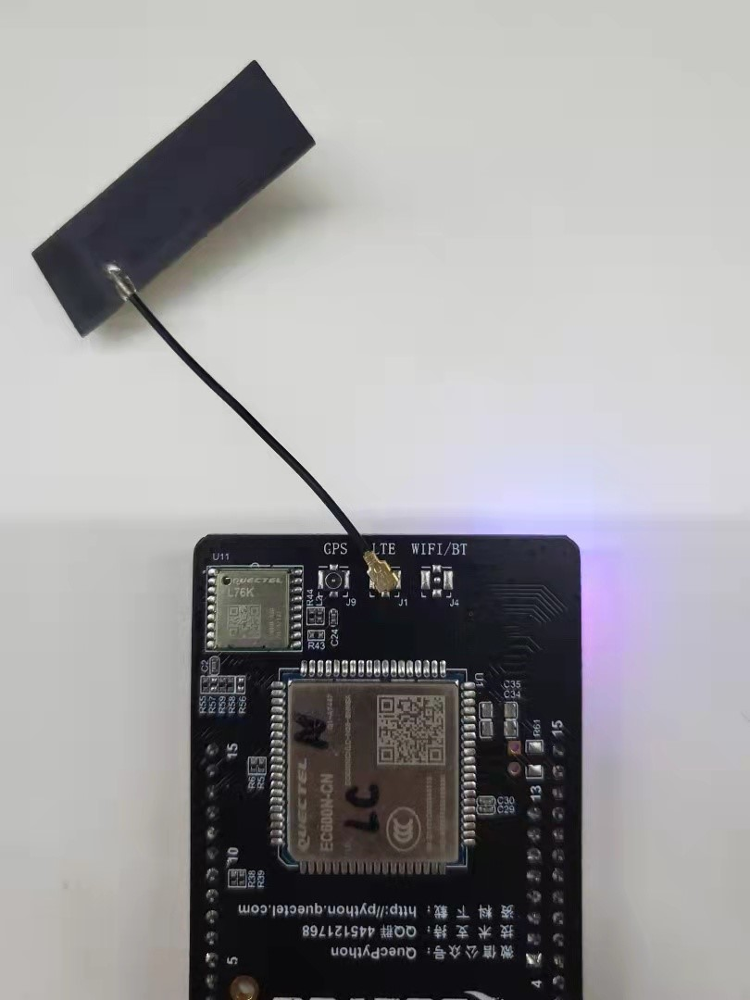

### Connect the EVB to the PC via USB cable 

**For starting up device and downloading QPYcom, please refer to the link for more details.** 

[Build QuecPython development environment](https://python.quectel.com/doc/doc/Quick_start/zh/QuecPythonStart/dev_env.html)

## Load FW of DTU and configuration file to EVB 

**Compile configuration file in accord with demands after opening up the DTU folder hidden in code library.** 

**Format and illustration of configuration file are displayed.** 

```json
{
  "plate": 1,									 //Whether IMEI is added in the message 
  "password": "123",							//Set password 
  "conf": {									    //Set online connection 
"1": {										   //Channel serial number  
//Set HTTP connection 
      "protocol": "http",					  //Connection type, fixed as http 
      "method": "get",						 //Method of request
      "url": "http://httpbin.org/get",		//Request url
      "reg_data": "",							//Fixed text attached  
      "timeout": "",							//Timeout
      "serialID": 1							//Bound serial port (1-2)
    },
"2": {
//Set TCP&UDP connection 
      "protocol": "tcp",						//Conncetion type. If it is tcp, fill it directly, while for UDP, it is the same way. 
      "ping": "",								//Ping
      "heartbeat": 30,						//Heartbeat duration 
      "url": "220.180.239.212",				//Ruquest url 
      "port": "8305",							//Port
      "keepAlive": 300,						//Keepalive duration 
      "serialID": 2							//Bound serial port
    },
"3": {
//Set mqtt connection 
      "protocol": "mqtt",						//Connection type 
      "clientID": "test_mqtt",				//Client ID 
      "keepAlive": "",						//keep alive timeout 
      "url": "mq.tongxinmao.com",			//url
      "port": "18830",						//Port 
      "cleanSession": "0",					//Clean session
      "subscribe": {"0": "/public/TEST/python"},	//Subscribe topic (multiple topics are supported)
      "publish": {"0": "/public/TEST/python"},		//Publish topic (multiple topics are supported)
      "qos": "0",								//QoS
      "retain": "1",							//Reattach internally 
      "serialID": "1"							//Bound serial port 
},
//Set Aliyun connection 
    "4": {
      "protocol": "aliyun",					//Connection type 
      "type": "mos",							//Set unique-certificate-per-device authentication/unique-certificate-per-product authentication 
      "keepAlive": "",						// Keep alive timeout 
      "clientID": " test_mos ",				//Client ID 
      "Devicename": " light01",				//Device name 
      "ProductKey": " a1QNbCDxIWM ",			//Product key
      "DeviceSecret": "0bceb8010ade0df2e6989982e63f7601",		//Device secret
      "ProductSecret": "",					//Product secret
      "cleanSession": "0",					//Clean session
      "qos": "1",								//QoS
      "subscribe": {"0": "/a1QNbCDxIWM/light01/user/get"},		//Subscribe topic (multiple topics are supported)
      "publish": {"0": "/a1QNbCDxIWM/light01/user/update"},	//Publish topic (multiple topics are supported)
      "serialID": "1"							//Bound serial port 
    },
"5": {
//Set Tencent Cloud 
      "protocol": "txyun",
      "type": "mos",
      "keepAlive": "",
      "clientID": "test_tx_mos",
      "Devicename": "Smart_test01",
      "ProductKey": "H7MBLRYXN9",
      "DeviceSecret": "89c7tXT3s3grZTr/YFjxSg==",
      "ProductSecret": "",
      "cleanSession": "0",
      "qos": "1",
      "subscribe": {"0": "H7MBLRYXN9/Smart_test01/control"},
      "publish": {"0": "H7MBLRYXN9/Smart_test01/event"},
      "serialID": "1"
    }
  },
  "reg": 1,							//Transit registration message
  "convert": 0,
  "version": 100,						//FW Version
  "nolog": 0,							//Whether output log 
  "message": {},						//Protocol message transparency 
  "uconf": {							//Set serial port 
    "1": {
      "baudrate": "115200",
      "databits": "8",
      "parity": "0",
      "stopbits": "1",
      "flowctl": "0"
    },
    "2": {
      "baudrate": "115200",
      "databits": "8",
      "parity": "0",
      "stopbits": "1",
      "flowctl": "0"
    }
  },
  "fota": 1,						//Whether enable fota
  "pins": [						//Enabled pio
    "pio1",
    "pio2",
    "pio3"
  ],
  "direction_pin": {},			//The direction controlled by GPIO and the default direction 
  "apn": [							//Set APN 
    "",
    "",
    ""
  ],
  "service_acquire": 0,			//Whether enble server to get parameter
  "work_mode": "command",			//Work mode 
  "auto_connect": 1,				//Auto-connect 
  "offline_storage": false		//Save when offline 
}


```

Compile configuration file according to demands and save it as "**dtu_config.json**", subsequently, save it to "**dtu**" folder in DTU codes library. 

**Note: Before saving json file, the annotation should be removed.** 

### Download code to device 

#### Connect to PC via data wire, press the "PWK" on the EVB to boot the device. After that, select the MI05 port in QPYcom. 


#### Switch to the "Download" page, click "Create program" and name it. 


#### Drag all files in "**dtu**" folder into the blank as described below. In addition, the figures are also involved. 

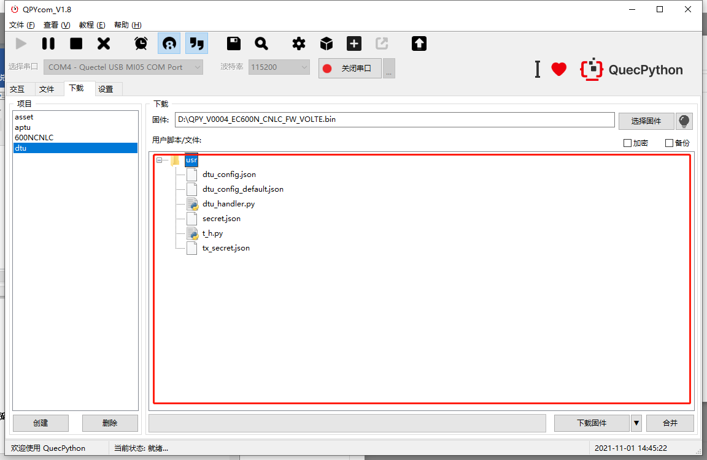

#### Click the inverted triangle and select "Download script" till the end. 

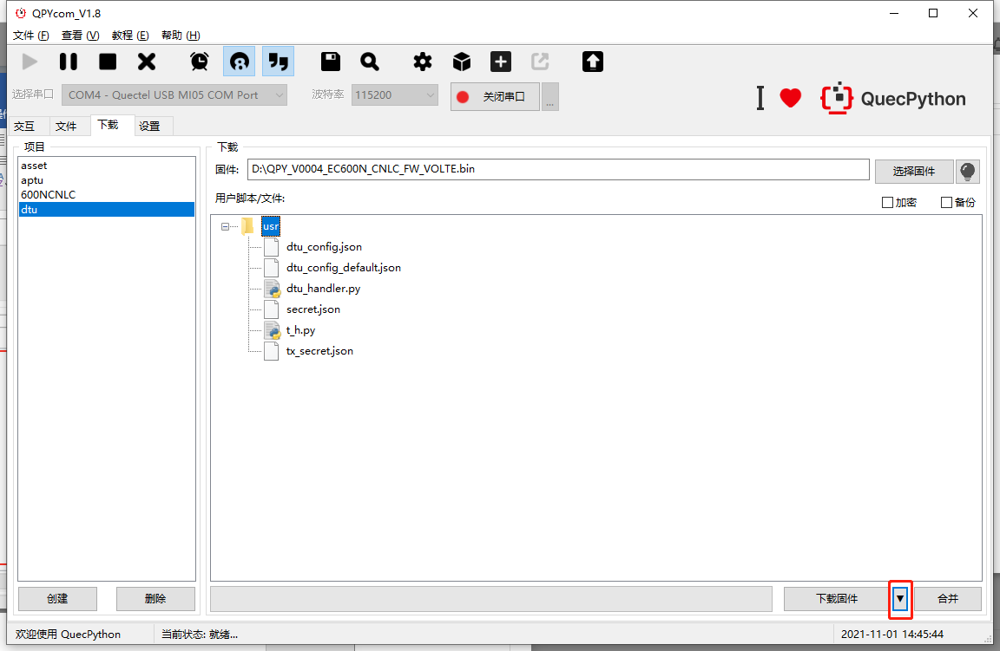

#### Transfer to "**file**" page and select "**dtu_handler.py**" on the right. It is available to debug and run dtu after clicking "**Run**" button. If there is a need to realize auto-run after power on, just rename the "**dtu_handler.py**" as "**main.py**". 

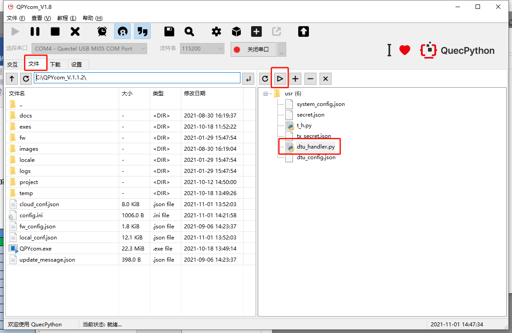

## Reboot EVB 

As above steps are done, select "USB MI05 COM Port".（For old version, it is the USB serial port) and open it. 


The DTU running is a success, the following figure shows the configuration file. 

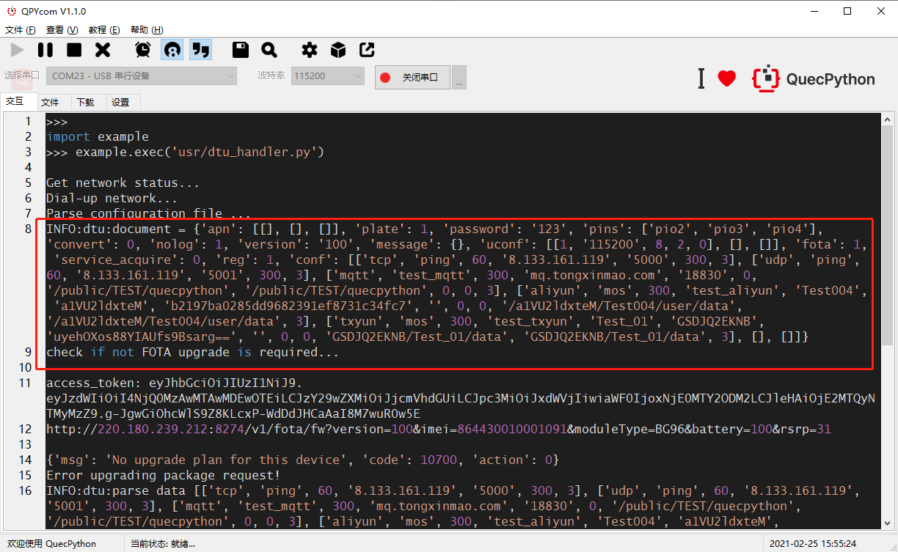

## Message format 

### Command mode/ modubus mode 

It supports transparency of multiple channels, binds channel and serial port via the serialID of configuration file. Each serial port supports binding multiple channels as well. When transmitting data, there is a need to import channel ID, meanwhile, the DTU will also transmit data to assigned channels. 

In command and modbus modes, the received message will be analyzed by command firstly. Only the analysis is a failure can the data be transmitted to serial port. 

Illustration on data format 

#### HTTP/TCP/UDP

- Message format of up-link data

`"<channel_id>,<msg_len>"[,"<crc32>",”<msg_data>”]`

- Message format of down-link data 

`"<channel_id>,<msg_len>"[,"<crc32>",”<msg_data>”]`

- Field illustration 

channel_id: Channel ID. To be specific, the channel ID in configuration file 

msg_len: Message length in string format. Generally, the length can be 0. 

crc32: CRC32 of message, when the msg_len is 0, this item can be neglected. 

msg_data: Message data, when the msg_len is 0, this item can be neglected. 

- E. g. 

**Transmit message **

`“1,6,376e6e7,abcedf”`	(The length of msg_len is not 0 )

`“1,0”`			(The length of msg_len is 0)

**Return message**

`“5,2e46f5,20001”`

#### MQTT/Aliyun/Txyun

- The message format of up-link data 

`"<channel_id>,<topic_id>,<msg_len>","<crc32>",<msg_data>"`

- The message format of down-link data 

`"<channel_id>,<topic_id>,<msg_len>","<crc32>",<msg_data>"`

- Field illustration 

channel_id: Channel ID. To be specific, the channel ID in configuration file 

topic_id: The *topic_id* of mqtt channel, the up-link means publishing **topic id** while the down-link means subscribing **topic id**. 

msg_len: Message length in string format. Generally,  the length can be 0.

crc32: CRC32 of message. This item can't be neglected even if the msg_len is 0. 

msg_data: Message data. This item can't be neglected even if the msg_len is 0. 

- E. g. 

**Transmit message **

`“1,1,6,376e6e7,abcedf”`

**Return message**

`“1,1,5,2e46f5,20002”`

### Transparency mode 

It supports the transparency of dual channel on MQTT/TCP/UDP/HTTP (Serial port 1& Serial port 2). In transparency mode, each serial port can be bound to one channel separately, which can be done via the serialID in configuration file. However, in transparency mode, if multiple channels are configured to serial port, only the first will be selected, as for the rest, just ignore. 

For transparency mode, there is no need to import *channel_id* when transmitting since the DTU will transmit data to the serial port that bound with channel automatically. 

Illustration on data format 

#### HTTP/TCP/UDP

- The message format of up-link data 

`"<msg_len>"[,"<crc32>",”<msg_data>”]"`

- The message format of down-link data

`"<msg_len>"[,"<crc32>",”<msg_data>”]"`

- Field illustration 

msg_len: Message length in string format. Generally,  the length can be 0.

crc32: CRC32 of message, when the msg_len is 0, this item can be neglected. 

msg_data: Message data, when the msg_len is 0, this item can be neglected. 

- E. g. 

**Transmit message：**

`“6,376e6e7,abcedf”`	( The length of msg_len is not 0)

`“0”`			(The length of msg_len is 0)

**Return message**

`“5,2e46f5,20001”`

#### MQTT/Aliyun/Txyun

- The message format of up-link data 

`<topic_id>,<msg_len>,<crc32>,<msg_data>`

- The message format of down-link data

`<topic_id>,<msg_len>,<crc32>,<msg_data>`

- Field illustration 

topic_id: The *topic_id* of mqtt channel, the up-link means publishing **topic id** while the down-link means subscribing **topic id**. 

msg_len: Message length in string format. Generally, the length can be 0

crc32: CRC32 of message. This item can't be neglected even if the the msg_len is 0. 

msg_data: Message data, when the msg_len is 0, this item can be neglected. 

- E. g. 

**Transmit message**

`“6,376e6e7,abcedf”`

**Return message**

`“5,2e46f5,20002”`

### Communicate with Cloud via message

As for the communication between DTU and Cloud, the json format is used. 

#### Down-link message of cloud 

- Command and modbus modes 

`{“msg_id”: msg_id, “data”: “1234”[, “cmd_code”: 0X40, “topic_id”: 1]}`

- Transparency mode

`{“msg_id”: msg_id, “data”: “1234”}`

- Field illustration

msg_id: Message ID, which composed by time stamp and 3 random numbers normally 

data: Filed of message 

cmd_code: Selectable field.  Fill in corresponding function code and make DTU carry out further operations. Please bear in mind that this field will take effect in command mode only. 

topic_id: electable filed. When filling in mqtt, return the *topic_id* to be published. Similarly, this field will  take effect in command mode or using MQTT/Aliyun/Txyun only. 

#### Up-link message of cloud 

Command and modbus modes 

`{“msg_id”: msg_id, “data”: “1234”[, “cmd_code”: 0X40, “status”: 1]}`

Transparency mode 

`{“msg_id”: msg_id, “data”: “1234”}`

- Field illustration

msg_id: Message ID, which composed by time stamp and 3 random numbers normally. when replying message, the same msg_id will be used. 

data: Filed of message 

cmd_code: Selectable field, fill in corresponding function code make DTU carry out further operations. Please bear in mind that this field will take effect in command mode only . 

status: Selectable field. it will take effect in command mode only, which is used to reply whether the execution is a success. 

## Example of MQTT on Aliyun

### Connect device 

In this case, the **EC600N EVB** and **CP202 USB to TTL** module are used to debug. 

Connect to Tx, Rx and GND pins via 3 Dupont wires separately. 

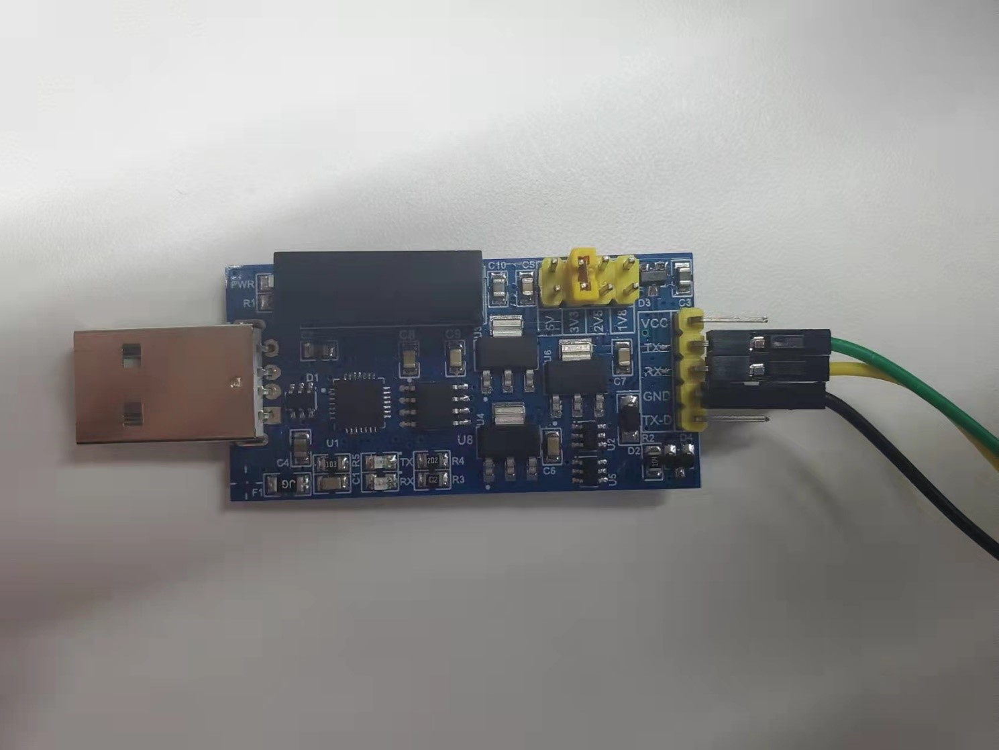

Connect the Tx of **CP2102** to the RX0 pin of **EC600N EVB** (No.7), at the same time, link the Rx of **CP2102** to the TX0 pin of EVB (No. 6). What's more, attach the GND of **DP2102** to the GND pin of the EVB (No. 1).

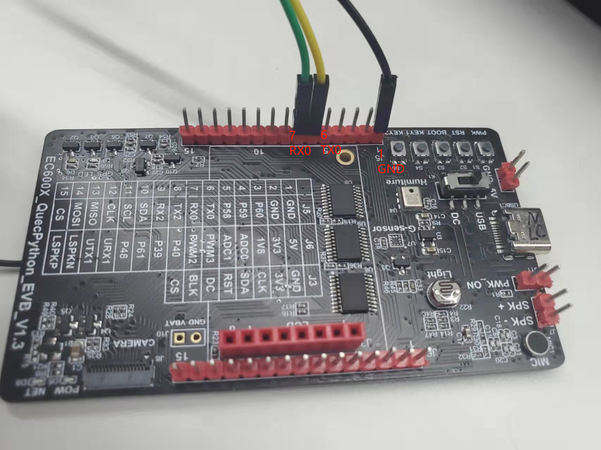

Connect the EVB and CP2102 to the PC separately, press PWK to boot. 

### Get connection parameter of Aliyun 

There is a need for user to register account on Aliyun, create new program, register device name and get following parameters. 

Devicename

ProductKey

DeviceSecret: The parameter should be provided when using unique-certificate-per-device authentication, as for unique-certificate-per-product authentication, the parameter is invisible. 

ProductSecret: The parameter should be provided when using unique-certificate-per-product authentication, as for unique-certificate-per-device authentication, the parameter is invisible. 

Get pk/ps of Aliyun

**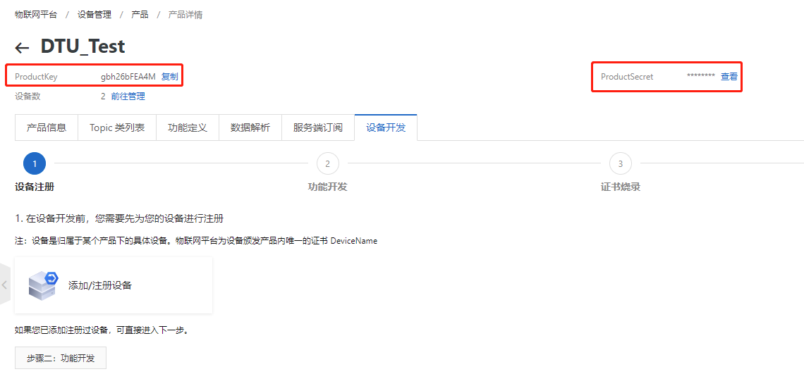

Get Device Name 

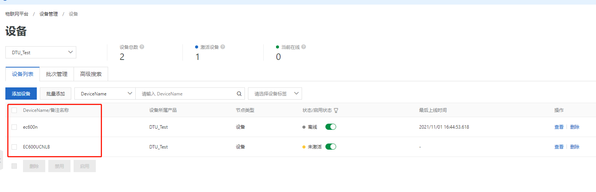

### Compile configuration file 

Compile configuration file ans name it "***dtu_config.json***"

What is involved in the configuration file. 

```json
{
  "plate": 1,
  "password": "123",
  "conf": {
    "1": {
      "protocol": "aliyun",
      "type": "mos",
      "keepAlive": "",
      "clientID": "0",
      "Devicename": " ec600n",
      "ProductKey": " gbh26bFEA4M",
      "DeviceSecret": " b7ff5acc0671d40adfd0eff57e7605f6",	
      "ProductSecret": "", 
      "cleanSession": true,
      "qos": "1",
      "subscribe": {"0": " /gbh26bFEA4M/ec600n/user/subtest"}, 
      "publish": {"0": " /gbh26bFEA4M/ec600n/user/pubtest"}, 
      "serialID": "0" 
    }
  },
  "reg": 0,
  "convert": 0,
  "version": 100,
  "nolog": 0,
  "message": {},
  "uconf": { 
    "0": {
      "baudrate": "115200",
      "databits": "8",
      "parity": "0",
      "stopbits": "1",
      "flowctl": "0"
    }
  },
  "fota": 1,
  "pins": [
    "pio1",
    "pio2",
    "pio3"
  ],
  "direction_pin": {},
  "apn": [
    "",
    "",
    ""
  ],
  "service_acquire": 0,
  "work_mode": "through",	
  "auto_connect": 1,
  "offline_storage": false
}

```

### Burn code 

Connect the EVB to PC and start up.  After that, open QPYcom, select Quectel USB MI05 port and click "connect" correspondingly. 

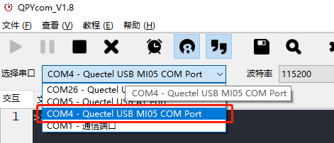

#### Switch to "Download" page, click ”Create program“, input its name and click "OK".

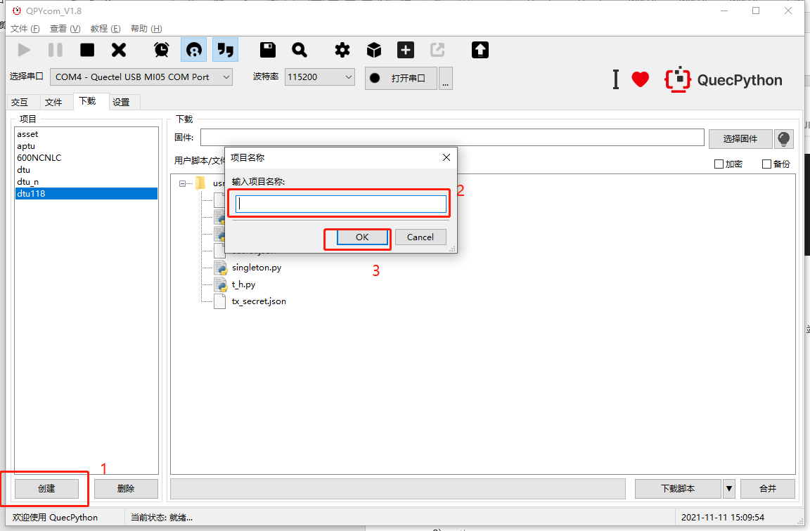

#### Drag all files in **dtu** folder into the "**user script/file**" blank. 

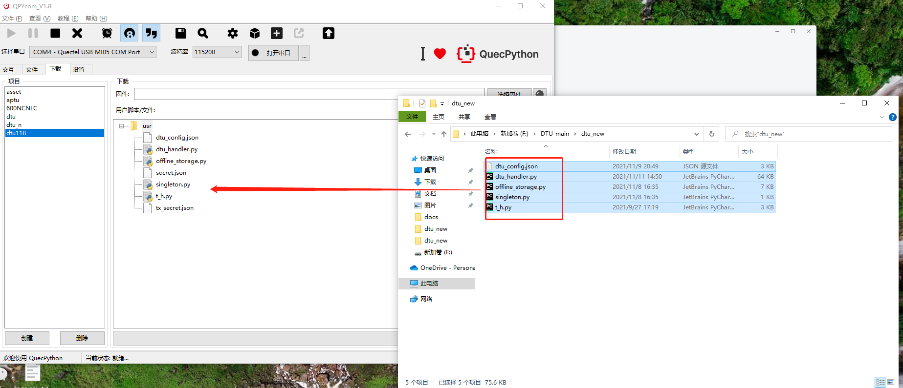

#### Click "Download script"


### About Running  

#### Switch to "File" page, select "**dtu_handler.py**" and click "Run". 

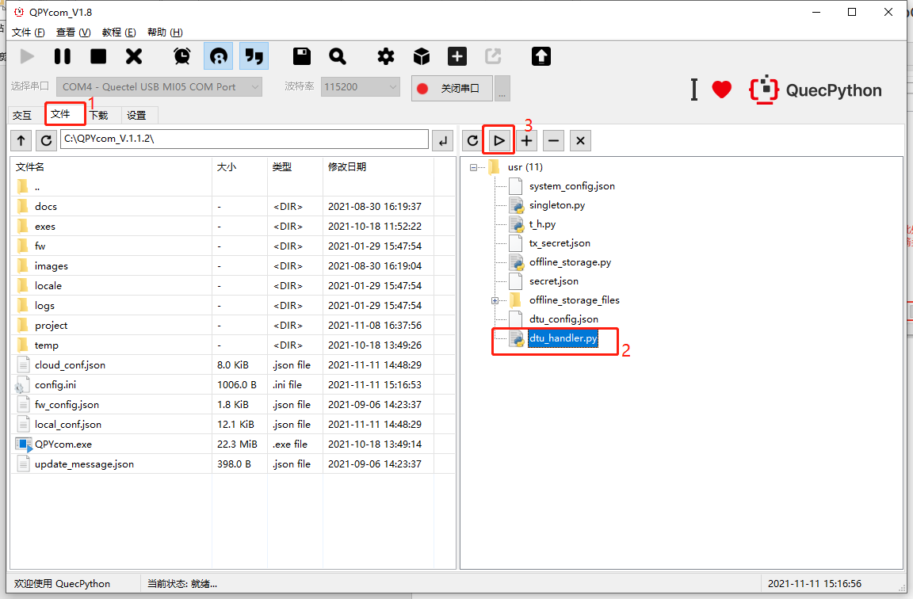

### Output running result 

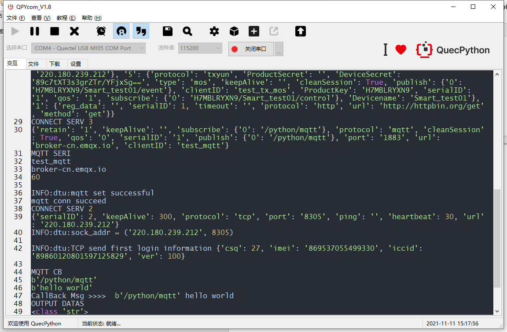

### Send message to cloud 

#### Open serial port debug tool, select **CP210X USB to UART**, connect it to **CP2102** board and open the serial port. 

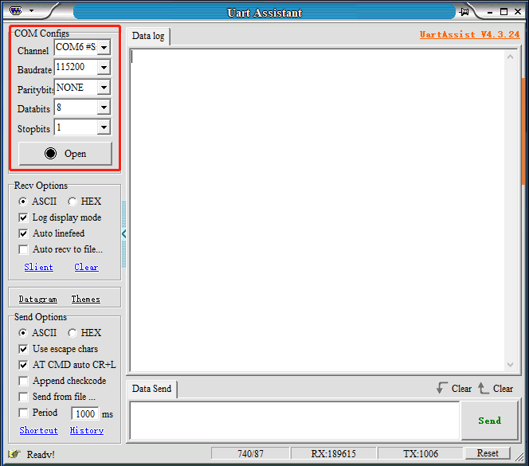

#### Import topic_id, msg_length, crc32 value and data should be sent to uart in accord with assigned format,  then click "Send".

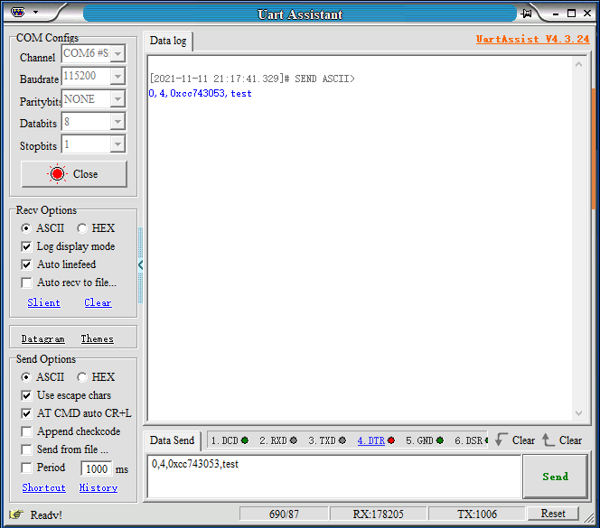

#### After receiving data, the DTU will transmit it to cloud. 

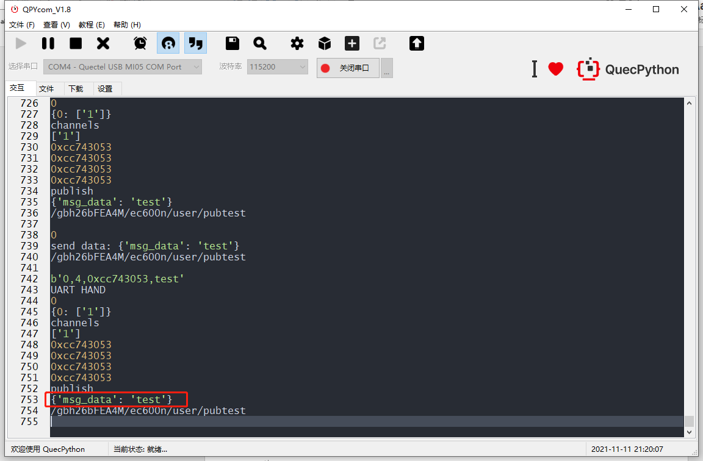

#### What received on cloud 

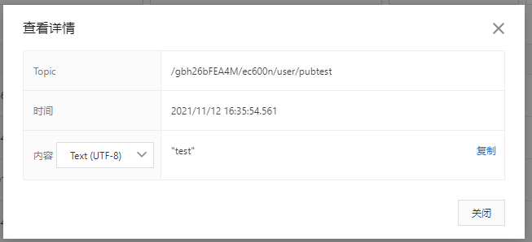

### The cloud sends message to device 

#### Send message to defined topic in the topic list of Aliyun.

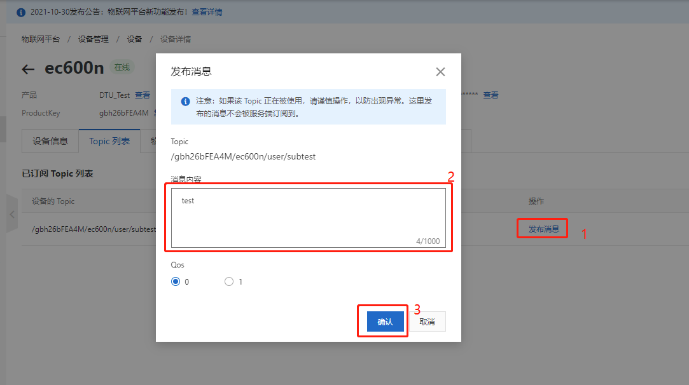

#### The DTU receives message successfully and transmits data to serial port.

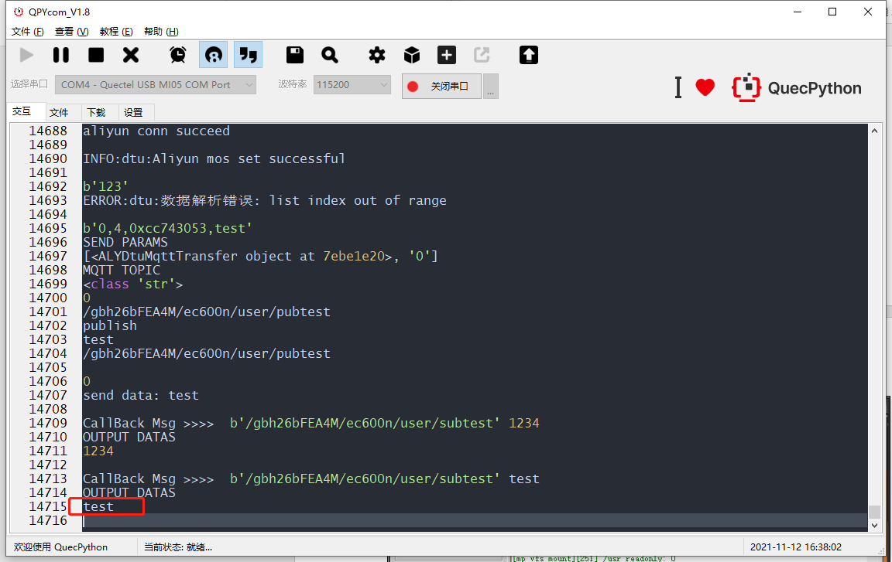

#### The transparency message received in serial port. 

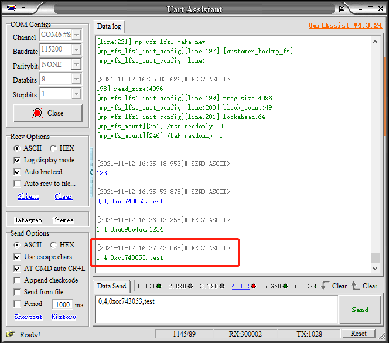