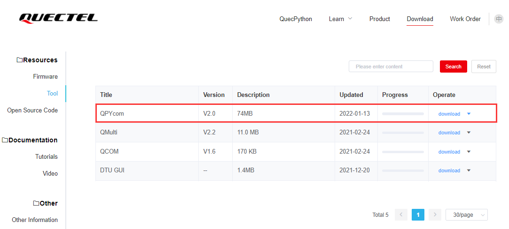
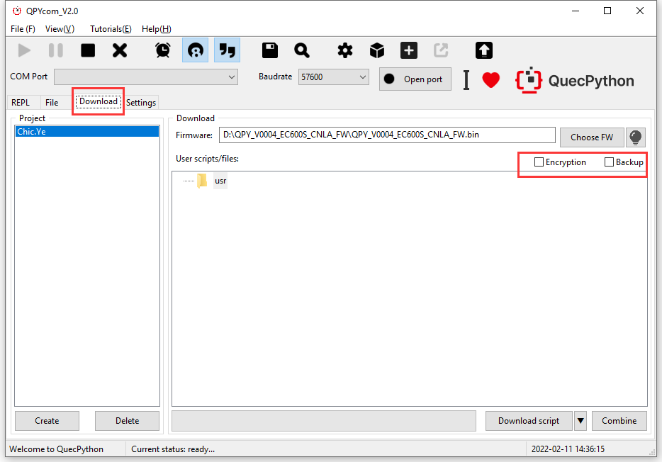
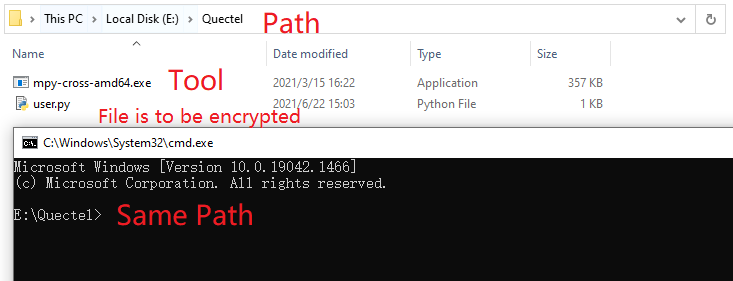
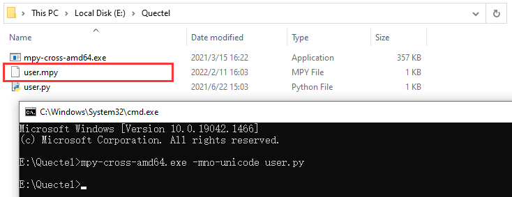

## About Document

**Revision history**

| Version | Date       | Author | Description                  |
| ------- | ---------- | ------ | ---------------------------- |
| 1.0     | 2021-04-07 | Chic   | Initial Version              |
| 1.1     | 2021-07-08 | Chic   | Added Interaction Protection |
| 1.2     | 2021-09-06 | Chic   | Updated Figure               |


## Introduction on Code Encryption

In Python, the **pyc** file, compiled from **py** file, is a format of binary. The purpose of which is to accelerate the loading rate on one hand; on other hand,  protect original code. The same function is also embedded in MicroPython, which changes the **pyc** as **mpy** with its name **.mpy** appended correspondingly. Above encryption is accomplished by **mpy-cross**. 

Protect **py** file via **mpy-cross**

- **py** file

  Suffix of python source code file 

- **pyc** file 

  The **pyc** file, compiled from **py** file, is a format of binary. The purpose of which is to accelerate the loading rate on one hand; on other hand, protect original code.  Meanwhile, the **pyc** is a kind of byte code that crossing platforms and executed by Python virtual machine. 

- **mpy** file

  In MircoPython, the **.py** file can be compiled as **.mpy** file, which is similar with the **.pyc** file. Take **`user.py`** as an example, after encrypting, the file will be changed into **`user.mpy`**.  Therefore, we can substitute the original **`user.py`** file with **`user.mpy`**. Please no worry about it for they have the same function. 
  
  


## Encrypt via tool 

- Login official website and select "download", then find "**QPYcom Graphical Tool**"  by selecting the "**Resource**" in first category and "**Tool**" in second category comprehensively. Please refer to the figure below.  



- After opening QPYcom, tick "**Encryption**" in "**Download**". This function can be used to protect the applicable code of user and make the **.py** (the source code) into **.mpy** (the binary code).



Note: The encryption capability of tool will take effect when integrating and producing firmware. 

## How to encrypt the single file

Compile **`user.py`** file in the same directory of tool via **mpy-cross-amd64.exe**. Please refer to the figure as described below.



 

Open the cmd line in windows and enter the directory where lies the **mpy-cross-amd64.exe**. After that, **mpy** file will be generated via following commands and parameters. 

`mpy-cross-amd64.exe -mno-unicode user.py`



The **`user.py`** will be modified as **`user.mpy`** after encrypting. Therefore, we can substitute the original **`user.py`** file with **`user.mpy`** file. In terms of effect, they are just the same. 

## Read File Protection 

**System - Environment Configuration**

Module Capability: Used to configure parameters and functions of systematical environment.

Adapting Version: EC100Y (V009 and later); EC600S (V002 and later)

system.replSetEnable(flag)

After setting interaction protection, all external commands and codes will be a failure to execute. Since it is an irreversible operation, please confirm before enabling it (It is disabled by default though). 

- Parameter

| Parameter | Type | Illustration                         |
| --------- | ---- | ------------------------------------ |
| flag      | int  | 0: Disabled (By default); 1: Enabled |

- Returned value

  It returns integer value () successfully.

  E. g

  ```
   import system
   
   system.replSetEnable(1)   # Enable Interaction Protection
  ```

## More mpy-cross document

For more details, please refer to the link  <a href="https://pypi.org/project/mpy-cross/1.9.3/">mpy-cross official document</a>.

