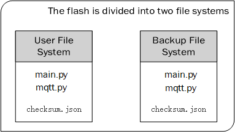
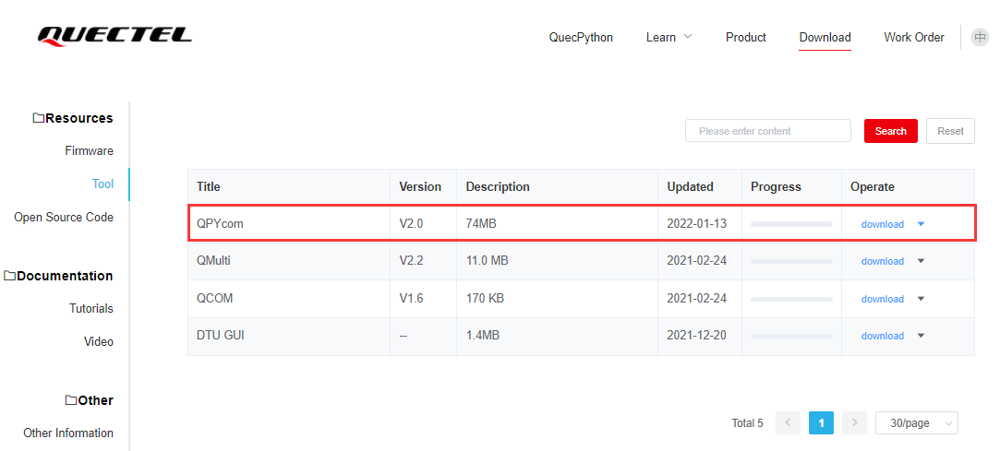

## About Document

 **Revision history**

| Version | Date       | Author | Description     |
| ------- | ---------- | ------ | --------------- |
| 1.0     | 2021-04-07 | Chic   | Initial Version |
| 1.1     | 2021-09-06 | Chic   | Initial Version |


## Brief Introduction

QuecPython is embedded with file backup restoration capability. Once the user codes are deleted by mistake or modified by accident, you can restore the lost or error file in backup partition. 

There is a need to learn about the file system of QuecPython beforehand. In order to make sure the stable running of QuecPython, we put forward the backup mechanism with dual files system, which is divided into "**User file system**" and ”**Backup file system**“.




Backup restoration capability means files should be backup in “**user file system partition**” (Including in script file and files of any form). Once it detects these files have been ruined when starting up, these flashed files in "backup file system partition" will be restored to “user file system partition”.

## Why the backup restoration capability is needed? 

When vital parameters or scripts in application or system are not allowed to lose or abnormal issue happens, the backup and restoration is needed. 


## Which type of file should be backup and restored? 

From the perspective of system, files such as **apn_cfg.json** (dial up configuration file) and **system_config.json** (system configuration file) should be backup. while in terms of user, the files that should be backup and restored is decided by scenarios. 

E. g. : Volume value, original passwords, server IP address, Aliyun, Tencent Cloud and device info.  


## Backup Restoration Fulfillment Mechanism

Before starting, we should take charge of the basic principle of backup restoration capability. 

2. When producing FW via QPYcom tool jointly, tick"**backup**" selection, the file will be imported into ‘“**backup file system file partition**"; meanwhile, two files named **checksum.json** and **backup_restore.json** will be generated in it. the **checksum.json** is used to record the hash tablet of backup partition file, while the **backup_restore.json** is used to prove whether the backup restoration capability is enabled. 
4. checksum.json: It detects that the backup restoration capability has been enabled when starting up. The system will detect whether there exists *checksum.json* in "**User file system partition**". if there is none, please copy the *checksum.json* from"**Backup file system partition**" to "**User file system partition**".
6. Once it detected the hash value of **checksum.json** in "**user file system partition"** when starting up, please do verify the user file of "**user file system partition**". If the file is invisible or the verification is a failure, copy the corresponding file in "**backup file system partition**" to the corresponding location in "**user file system partition**" , re-calculate the hash value and update it in the **checksum.json** of "**user file system partition**".
8. When the user file which took part in the backup restoration should carry out FOTA upgrade, at the final step in upgrade, it will make the upgraded hash value of the user file write into the **checksum.json** of "**user file system partition**".

**Notes**

1. The backup capability referred in this document indicates to backup the flashed file when shipment; similarly, when restoring, it is also the flashed file when shipment. 

2. The attribute of backup file system partition is "Read-only". which can't be configured by user. 


## Trigger condition

After learning about above knowledge of QuecPython, what we can conclude is that several possibilities may trigger backup restoration capability. 

2. The checksum.json file in "user file system partition" is removed by user accidentally. 
4. When short circuit or power-off in device results in the accidental error in file system, the file data that marked with backup in "user file system" also changes, even worse, the file is lost. 
6. When applying, the user modifies the file data that marked with backup in "**user file system partition**"  manually instead of updating **checksum.json**. 


## Avoid trigger by mistake

For sake of stable running, we can prevent the trigger by mistake on purpose. 

2. Be cautious in user applications, you shall never delete the **checksum.json** file in "**user file system partition**"
4. Try avoid power on/off violently when visiting file system. Or when necessary, add power failure detection and backup power supply in Hardware design for sake of leaving sufficient time for file system to update physical data. 
6.  After modifying the file data that marked with backup in "**user file system partition**"  manually, you can apply for the codes in the next figure to update the **checksum.json** file of "**user file system partition**". Once it is achieved, it will return the hash value of current file. 

```python
import file_crc32

file_crc32.calc('/usr/1.txt')
```

The outputted result is displayed as following figure after execution


Update to the hash value which took part in backup file. 

 

## Open backup restoration capability

Open backup restoration capability in QPYcom. 

- Login official website and select "download”, then find "QPYcom Graphical tool"  by selecting the "resource" in first category and "tool" in second category comprehensively. Please refer to the figure below. 



- After opening QPYcom, tick "**backup**" in "**Download**" selection and integrate, the Firmware which implemented with backup will be generated. 


## Others

For more knowledge, please refer to the official website. 

https://python.quectel.com/wiki/#/en-us/api/QuecPythonClasslib?id=pin

Official website

https://python.quectel.com/

Download relevant tools,  routines, drivers and files

https://python.quectel.com/download

 

Any question, please follow QuecPython official account. 

 

 