## About Document

**Revision history**

| **Version** | **Date**   | **Author** | **Description** |
| ----------- | ---------- | ---------- | --------------- |
| 1.0         | 2021-09-29 | Chic       | Initial Version |


# Get Access to Aliyun via QuecPython 

In this document, it illustrates how to use" IoT platform". You can access and manage device conveniently without creating the basic infrastructure. In addition, it is featured with low cost, high reliability, high performance and easy to prevent. In this chapter, we will introduce from the view of MQTT connection. By reading this article, you will learn about the operation procedure and theory to verify test on connection between QuecPython and "IoT platform".

## Setting on Cloud 

The address of Aliyun: <https://www.alibabacloud.com/en?spm=5176.19720258.J_8058803260.exp-location-0.e9392c4aY3WZBS>

### Login the platform

Click [product]---[IoT]--[IoT platform]

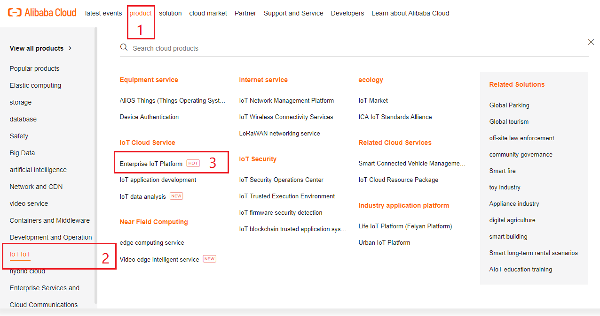

### Create real case

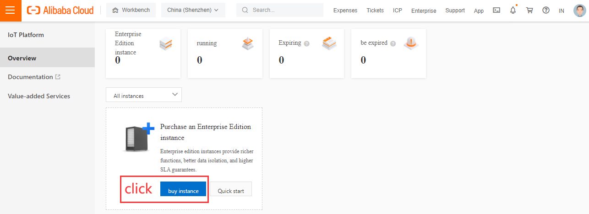

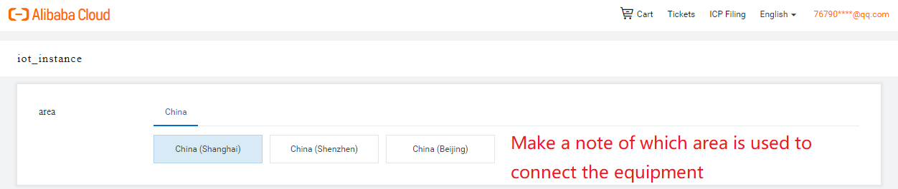

### Create product

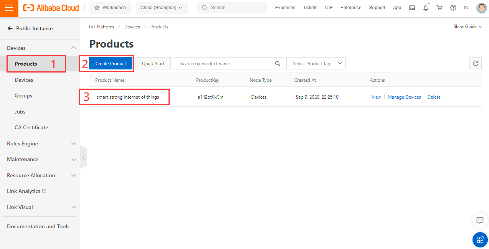

### Add device

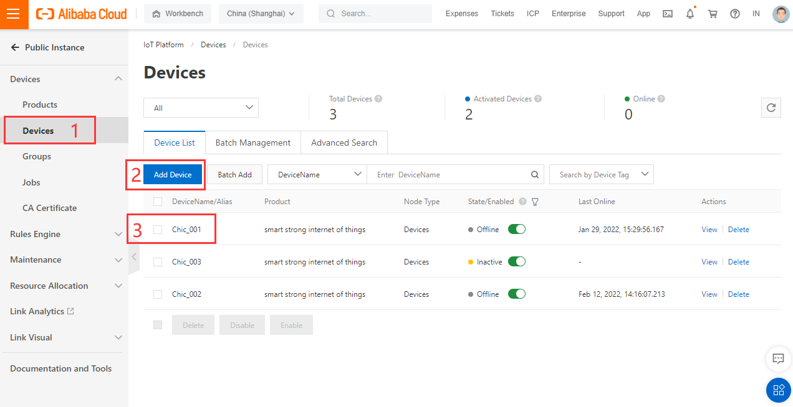

### Get triple

The triple (ProductKey、DeviceName、DeviceSecret) are used to generate connection password of next step. 

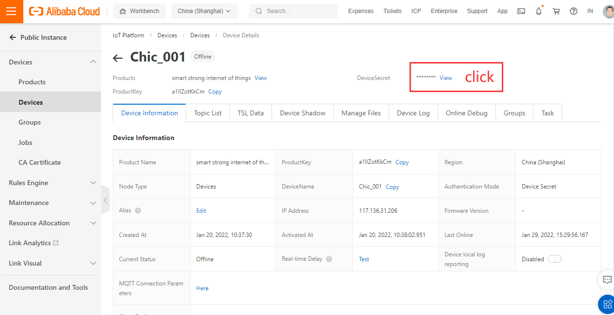

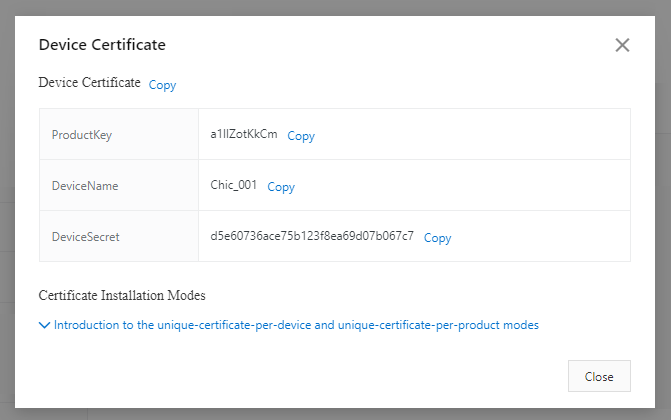

### Generate connection info

 Click to download Password and generate simple tool

http://docs-aliyun.cn-hangzhou.oss.aliyun-inc.com/assets/attach/189223/cn_zh/1605168543507/MQTT_Password.7z?spm=a2c4g.11186623.2.19.373573a8XfigN5&file=MQTT_Password.7z

#### Fill in device info

The self-defined clientid can share the same name with deviceName, which is used to MQTT connection. 

The encryption of method should be aligned with that in connecting MQTT. 

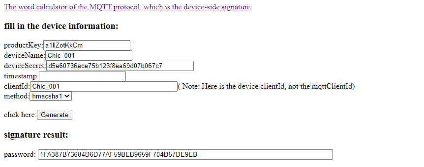

The Password by calculating sign can be deployed to connect platform. 

```
CLIENT_ID = b'Chic_001|securemode=3,signmethod=hmacsha1|'
SERVER = b'a1llZotKkCm.iot-as-mqtt.cn-shanghai.aliyuncs.com'
PORT = 1883
USER = b'Chic_001&a1llZotKkCm'
PASSWORD = b'1FA387B73684D6D77AF59BEB9659F704D57DE9EB'
```

**CLIENT_ID：**The fixed format:  \${clientId}\|securemode=3,signmethod=hmacsha1\|

​                       The complete case: Chic_001\|securemode=3,signmethod=hmacsha1\|

**USER：**The fixed format:  \${clientId}\|securemode=3,signmethod=hmacsha1\|

​              The complete case:  Chic_001&a1llZotKkCm

**PASSWORD：**The string generated by above tool.  

**PORT：** Fixed 1883

**SERVER：**${YourProductKey}.iot-as-mqtt.\${YourRegionId}.aliyuncs.com. Among which, please substitute the content in ${YourProductKey} as the ProductKey that belonged to the product under device, which can be gotten in the device specification of IoT console. 

​				  ${YourRegionId}：This is the region selected when creating real case, please substitute it as your own Region ID. 

​			 https://help.aliyun.com/document_detail/40654.html?spm=a2c4g.11186623.2.21.7b967908BJu7SZ

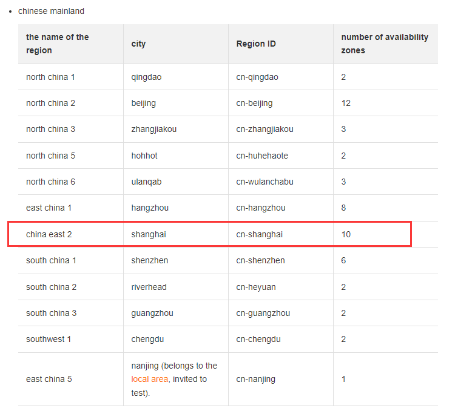

### Report and deliver data

As for the topic created above, we may name it test, correspondingly, any topic with test prefixed can subscribe or publish. 

E. g. /broadcast/a1llZotKkCm/123

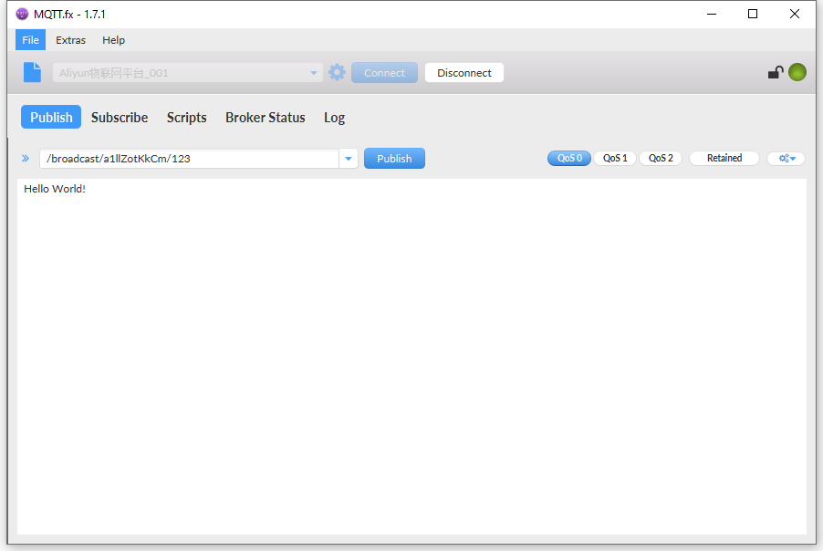

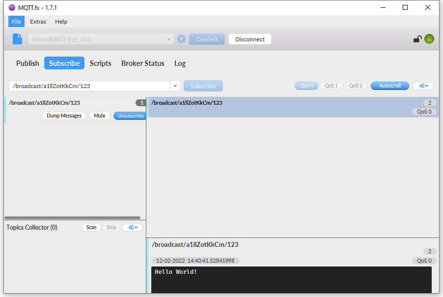

## SW design

After getting ProductKey，DeviceName and DeviceSecret on AliyunCloud platform, it will be accessible to connect Cloud platform via ALiyun kit. Since the address and port are fixed, you can carry out running test once corresponding connection info has been set in program. 

Case codes 

```python

import utime
import checkNet
from aLiYun import aLiYun
import _thread
import sys_bus


class SYSTOPIC_Class(object):
    RRPC = "rrpc"
    OTA = "ota"
    PUB = "pub"
    SUB = "sub"


class aliyun_Class(object):
    def __init__(self):
        aliyun_Class.inst = self
        self.productKey = "a1llZotKkCm" 
        self.productSecret = 'mj7qKfEn73y07gyK'  
        self.DeviceSecret = None  
        self.DeviceName = "Chic_001"
        # /broadcast/a1llZotKkCm/123
        self.subscribe_topic1 = "/broadcast" + "/" + self.productKey + "/" + "123"
        self.subscribe_topic2 = "/broadcast" + "/" + self.productKey + "/" + "123"
        self.publish_topic1 = "/broadcast" + "/" + self.productKey + "/" + "123"

        self.ali = aLiYun(
            self.productKey,
            self.productSecret,
            self.DeviceName,
            self.DeviceSecret)
        
        clientID = b'clientID' 
        ret = self.ali.setMqtt(
            clientID,
            clean_session=False,
            keepAlive=60,
            reconn=True)  # False True

        self.ali.setCallback(self.ali_sub_cb)

    def ali_sub_cb(self, topic, msg): 
        if topic.decode().find(SYSTOPIC.RRPC) != -1:
            sys_bus.publish(SYSTOPIC.RRPC, {"topic": topic, "msg": msg})
        elif topic.decode().find(SYSTOPIC.OTA) != -1:
            sys_bus.publish(SYSTOPIC.OTA, {"topic": topic, "msg": msg})
        else:
            sys_bus.publish(SYSTOPIC.SUB, {"topic": topic, "msg": msg})

    def ali_start(self):
        self.ali.start()
        print('Runing')
        # aLiYun.disconnect()

    def ali_subscribe_topic(self):
        self.ali.subscribe(self.subscribe_topic1, qos=0)
        self.ali.subscribe(self.subscribe_topic2, qos=0)

    def ali_publish(self, topic, msg):
        ret = self.ali.getAliyunSta()
        # print(ret)
        if ret == 0:
            try:
                self.ali.publish(msg.get('topic'), msg.get("msg"), qos=0)
            except BaseException:
                print('!!!!!!')


class Handler(object):
    @classmethod
    def sub(cls, topic, msg):
        print(
            "Subscribe Recv: Topic={},Msg={}".format(
                msg.get('topic').decode(),
                msg.get("msg").decode()))

    @classmethod
    def pub(cls, msg):
        while True:
            sys_bus.publish(SYSTOPIC.PUB, msg)
            utime.sleep_ms(2000)

    @classmethod
    def ota(cls, topic, msg):
        msg = {"topic": "xxx", "msg": "xxx"}
        sys_bus.publish_sync(SYSTOPIC.PUB, msg)

    @classmethod
    def rrpc(cls, topic, msg):
        msg = {"topic": "xxx", "msg": "xxx"}
        sys_bus.publish(SYSTOPIC.PUB, msg)


if __name__ == '__main__':
    PROJECT_NAME = "QuecPython"
    PROJECT_VERSION = "1.0.0"
    checknet = checkNet.CheckNetwork(PROJECT_NAME, PROJECT_VERSION)
    checknet.poweron_print_once()
    checknet.wait_network_connected()

    aliyunClass = aliyun_Class()
    aliyunClass.ali_subscribe_topic()

    SYSTOPIC = SYSTOPIC_Class()
    sys_bus.subscribe(SYSTOPIC.RRPC, Handler.rrpc)
    sys_bus.subscribe(SYSTOPIC.OTA, Handler.ota)
    sys_bus.subscribe(SYSTOPIC.SUB, Handler.sub)
    sys_bus.subscribe(SYSTOPIC.PUB, aliyunClass.ali_publish)

    tuple = ({"topic": aliyunClass.publish_topic1, "msg": "hello world"},)
    _thread.start_new_thread(Handler.pub, tuple)

    aliyunClass.ali_start()

```

The next step is to download and verify. You can download and run .py file on module via QPYcom since there is no need to compile python code. 

## Download and Verify

Download and run **.py** file on module. 

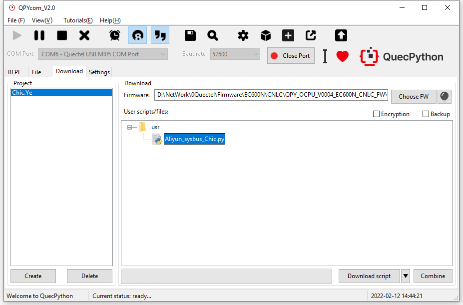

Run the script manually after downloading. 

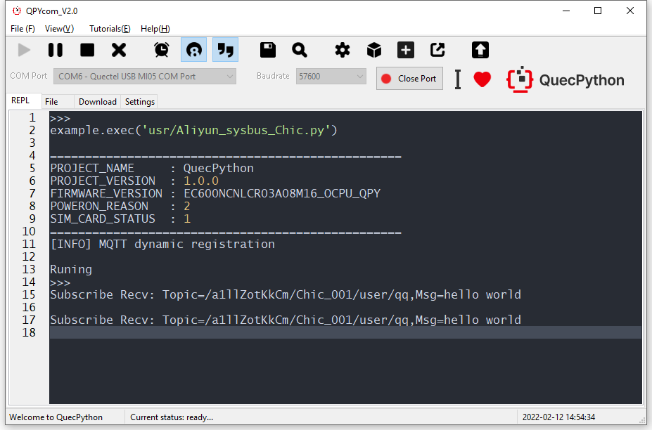

## The matched code

<!-- * [Download the code](code/Aliyun_sysbus_Chic.py) -->
 <a href="/docsite/docs/en-us/Advanced_development/QuecPythonCloud/code/Aliyun_sysbus_Chic.py" target="_blank">Download the code</a>

