## About document

**Revision history**

| **Version** | **Date**   | **Author** | **Description** |
| ----------- | ---------- | ---------- | --------------- |
| 1.0         | 2021-09-29 | Chic       | Initial version |

# Introduction on QuecPython AmazonCloud Test

In this article, it mainly illustrates how to connect network cloud via AWS  IoT. The AWS IoT  does not only provide Cloud service and device support that can be used to execute IoT solution, but also multiply cloud applications based on IoT.  The user can get access to IoT device as well as the function provided by Cloud service that connected. In next page, we mainly focus on MQTT connection. In addition, you can learn about how to connect QuecPython to AWS IoT from views of operation and verifications on test theory.  

## Cloud setting

The front page of AmazonCloud：https://aws.amazon.com/?nc1=h_ls

#### Login platform

Enter [My account]---[AWS Management Console]---[IoT Core]

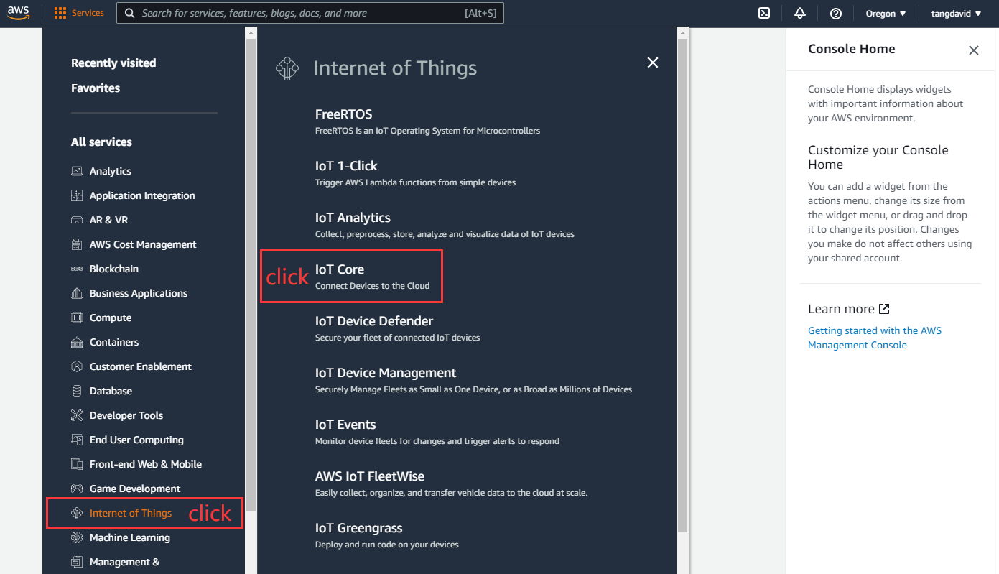

#### 【Create tactic】

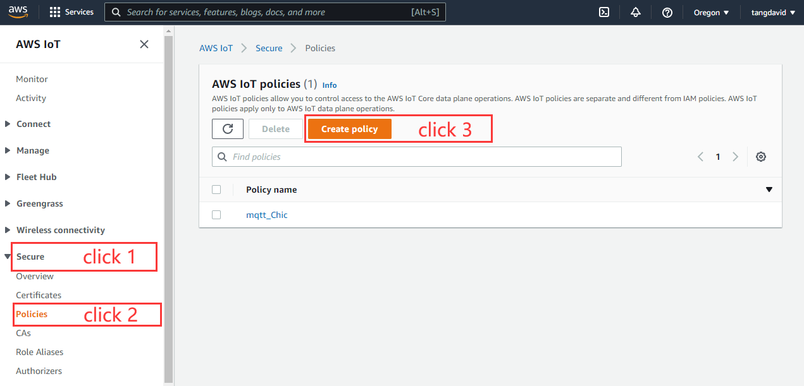

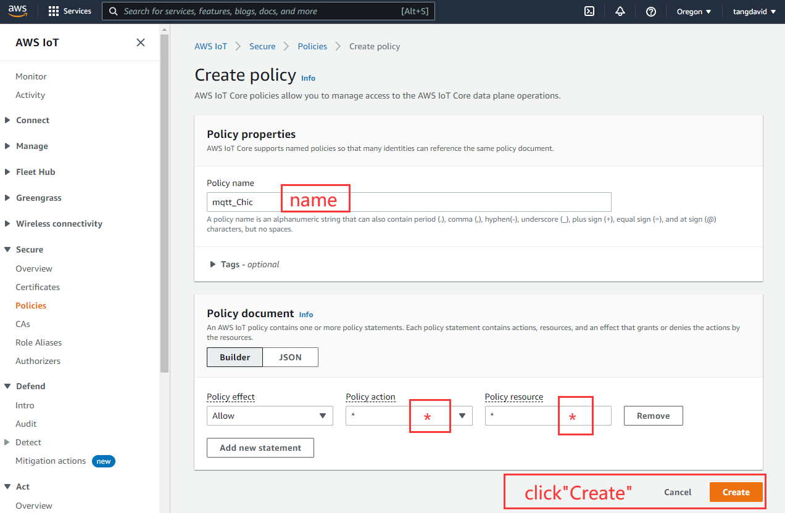

#### 【Create product】

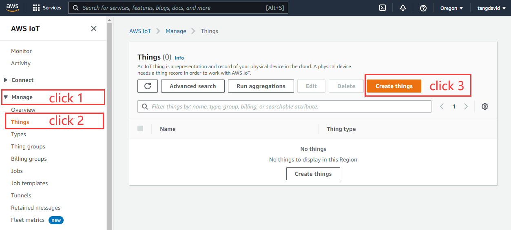

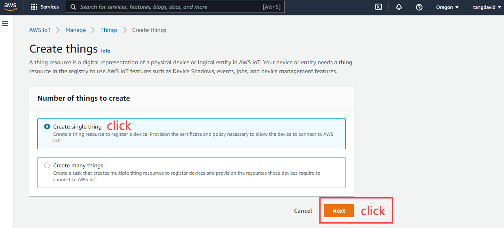

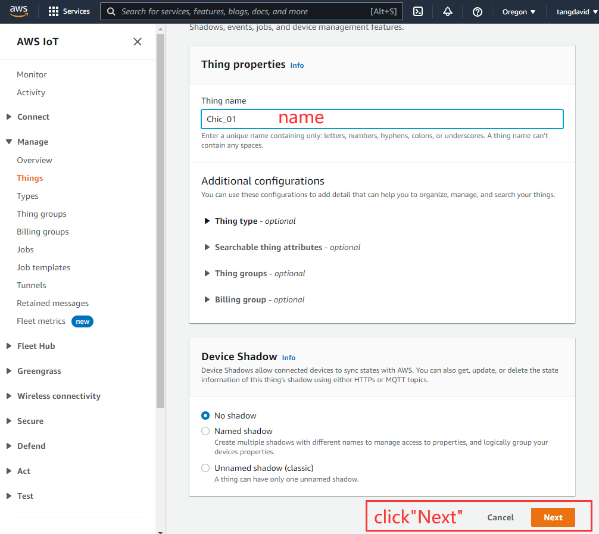

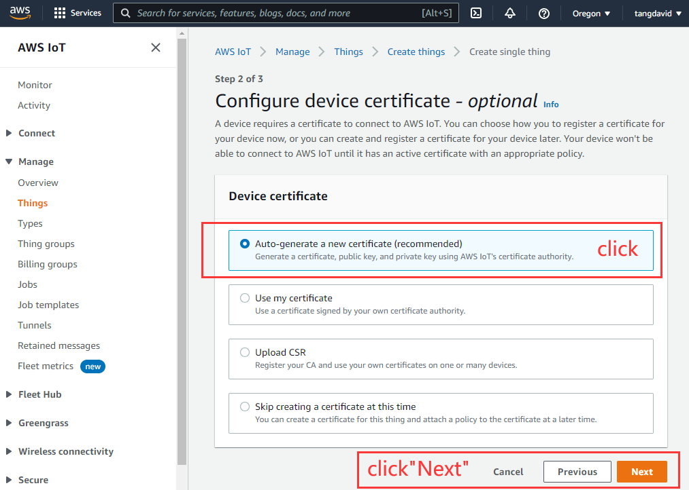

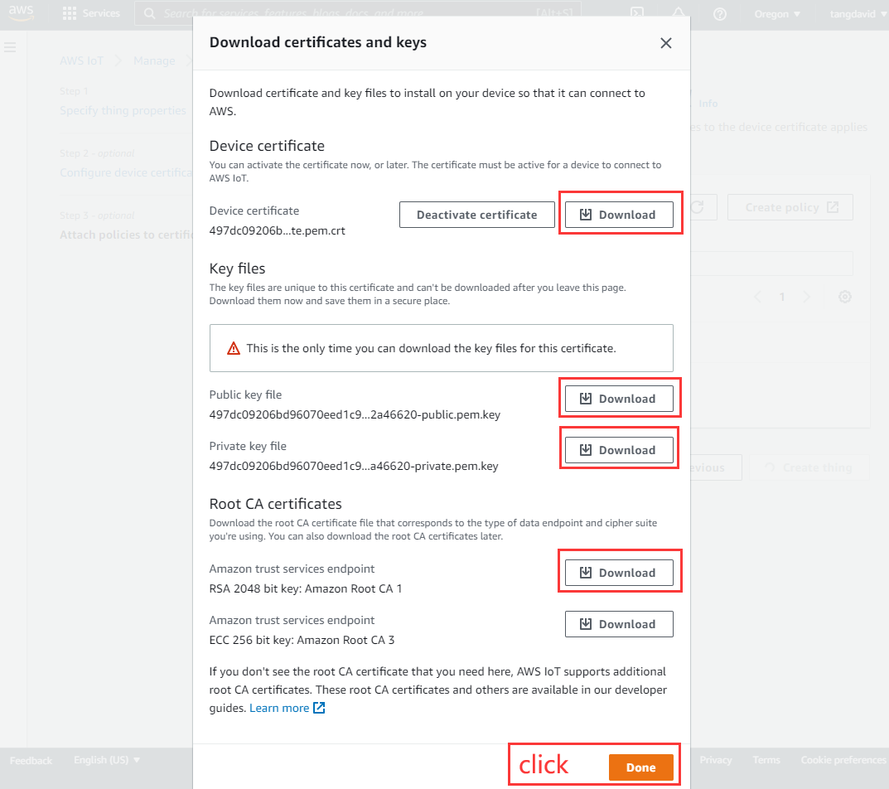

Till now, "Create product" has been finished. It is available to connect AWS IoT platform via certificate. Please note that the same certificate can be used on several devices, and the Client ID of various devices shall be unique. 

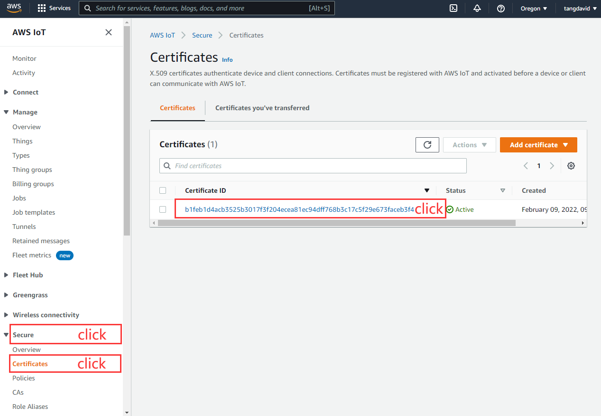

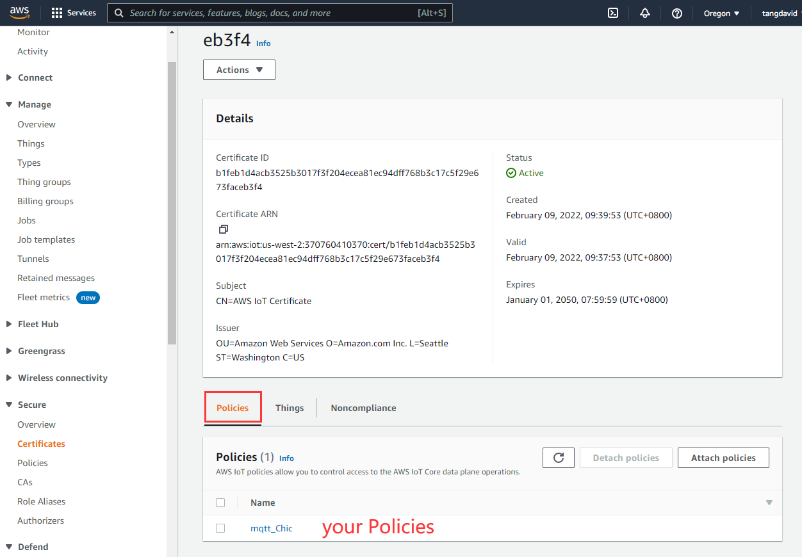

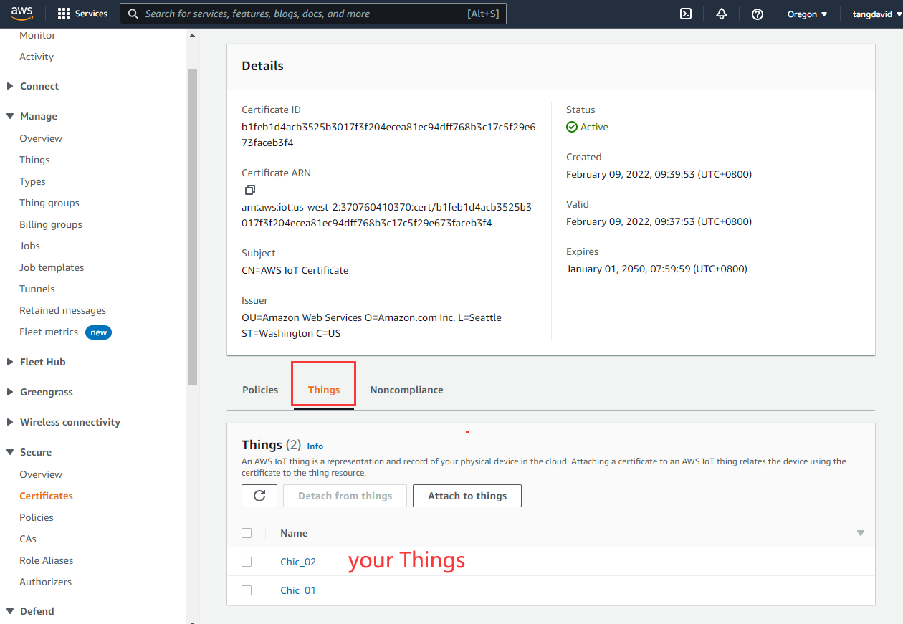

#### 【Device communication】

Get the MQTT connection address and port of AWS Server. 

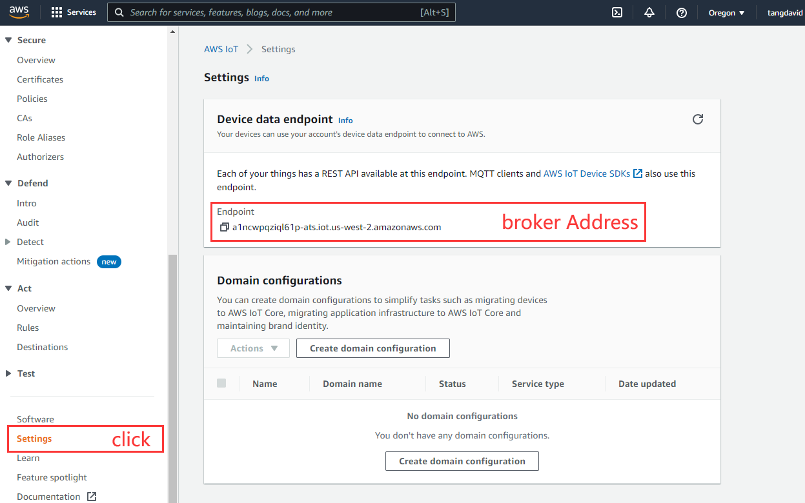

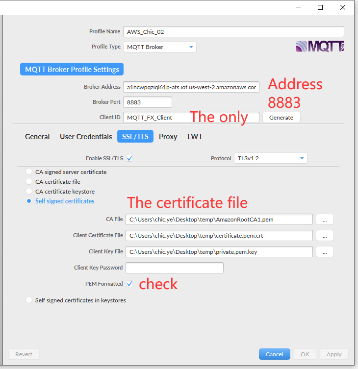

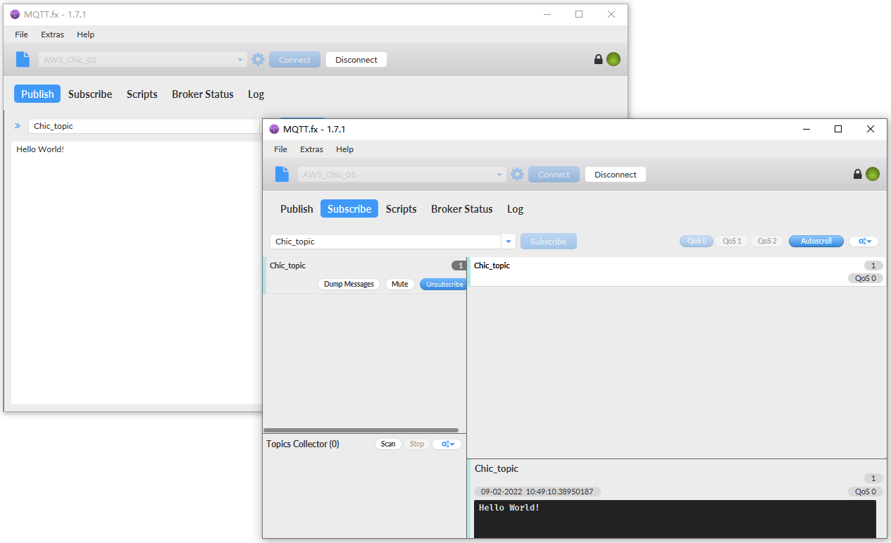

Test communication via MQTT.fx. fill in "#" on subscription topic bar to receive all topics. 

 

