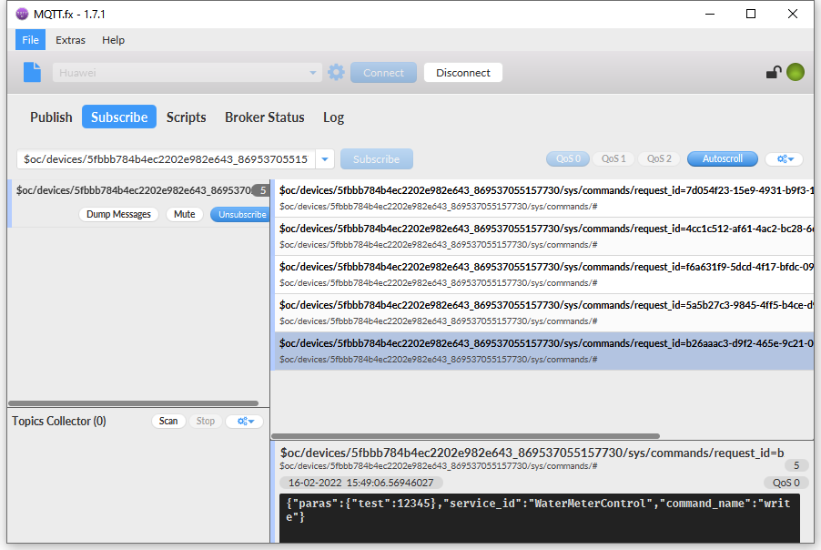

## About history

**Revision history**

| **Version** | **Date**   | Author | **Description**     |
| ----------- | ---------- | ------ | ------------------- |
| 1.0         | 2021-09-29 | Chic   | Initial version     |
| 1.1         | 2022-02-16 | Chic   | equipment debugging |


# Get access to Huawei Cloud by QuecPython

In this article, it mainly illustrates how to deploy Huawei Cloud. As the IoT platform of Huawei Cloud, The IoTDA is featured with connecting massive devices to Cloud, bidirectional message communications between device and Cloud, management of patches of devices, remote control and monitoring, OTA upgrade and device linkage. In addition, it is capable to change the device data into other service of Huawei Cloud flexibly.

Next, we will talk about  MQTT connection to QuecPython. By reading this article, you will take charge of how to connect QuecPython to Huawei CLoud and theory to verify the test.

## Cloud setting

Open up Huawei Cloud via the link: [www.huaweicloud.com](https://www.huaweicloud.com/intl/en-us/)

### Login platform

Click [Product]---[IoT]---[IoTDA]


### Create product

Click [Product] ---[Create product]


In terms of protocol type, please select the MQTT.


Product [Model Definition]


### Add device

Click [device] ---[All devices]

>   [https://console.huaweicloud.com/iotdm/?region=cn-north-4\#/dm-portal/device/all-device](https://console.huaweicloud.com/iotdm/?region=cn-north-4#/dm-portal/device/all-device)


The auto generated [Device ID] and [Device private key] will be used to generate connection info of next step after the device is registered.


### Generate connection info

Access to this address and fill in the generated device ID and Device Secret to generate ClientId, Username and Password. 

<https://iot-tool.obs-website.cn-north-4.myhuaweicloud.com/>


```
CLIENT_ID = b'5fbbb784b4ec2202e982e643_868540050954037_0_0_2021011909'

SERVER = b'a15fbbd7ce.iot-mqtts.cn-north-4.myhuaweicloud.com'

PORT = 1883

USER = b'5fbbb784b4ec2202e982e643_868540050954037'

PASSWORD =b'8001a12405743199b3396943a2ed397286117a9ebab4f5dfda8dd6fafe341d94'
```


Note:

a15fbbd7ce.iot-mqtts.cn-north-4.myhuaweicloud.com

1883

In terms of device that does not support domain name access, it is valid to get IP address via executing "ping domain name" in command box. While getting access platform via IP address, you should make the IP address as configurable owing to the unstable IP address.

As for the clientId format generated via tool, the time stamp won't be verified by default: deviceID_0_0_Time stamp.

-   When the time stamp is verified by "HMACSHA256", it will verify whether the time stamp is coincide with the time on platform, then judge the password.
-   However, when it does not verify time stamp via "HMACSHA256", the time stamp shall also be appended to authentication message instead of verifying whether it is right.

### Report data

Fill in port address, take “\$oc/devices/{device_id}/sys/properties/report” as an example,such as “\$oc/devices/5e4e2e92ac-164aefa8fouquan1/sys/properties/report”.


\$oc/devices/{device_id}/sys/properties/report

\$oc/devices/5fbbb784b4ec2202e982e643_868540050954037/sys/properties/report


### Deliver data

It works only via the API request on application end.

URI

Request method POST

URI /v5/iot/{project_id}/devices/{device_id}/messages

HTTP-Transmission Protocol

**Deliver data**

<https://support.huaweicloud.com/api-iothub/iot_06_v5_0059.html>

### Issued an order

$oc/devices/{device_id}/sys/commands/request_id={request_id} 

\- Device side subscribing to topic with {request_id} parameter can use wildcard #. For example, topic $OC /devices/{device_id}/sys/commands/request_id={request_id} You can use $oc/devices / {device_id} / sys/commands / #


$oc/devices/{device_id}/sys/commands/request_id={request_id}

$oc/devices/5fbbb784b4ec2202e982e643_869537055157730/sys/commands/#



## SW design

After getting ClientId, Username and Password on HuaweiCloud, it is approachable to get access to Cloud via the umqtt of QuecPython. As for the address and port, they should be fixed. The next step is to compile code and test. 

Case code

```python
import checkNet
from umqtt import MQTTClient
import modem
from machine import UART
import sim
import hmac
from hashlib import sha256


IMEI = modem.getDevImei()
E_SN = modem.getDevSN()
ESIM = sim.getImsi()

DeviceName = IMEI
DeviceSecret = 'ac4263b86eaf6442997a'
DeviceID = "5fbbb784b4ec2202e982e643"

CLIENT_ID = DeviceID + "_" + DeviceName + "_0_0_2022010507"
SERVER = "a15fbbd7ce.iot-mqtts.cn-north-4.myhuaweicloud.com"
PORT = 1883
USER = DeviceID + "_" + DeviceName
PASSWORD = hmac.new(
    "2022010507".encode('utf-8'),
    DeviceSecret.encode('utf-8'),
    digestmod=sha256).hexdigest()
DEVICE_ID = DeviceID + "_" + DeviceName

state = 0


def sub_cb(topic, msg):
    global state
    print(
        "Subscribe Recv: Topic={},Msg={}".format(
            topic.decode(),
            msg.decode()))
    state = 1


def MQTT_Init():

    c = MQTTClient(
        client_id=CLIENT_ID,
        server=SERVER,
        port=PORT,
        user=USER,
        password=PASSWORD,
        keepalive=30)

    c.set_callback(sub_cb)
    try:
        c.connect()
        c.subscribe('$oc/devices/{}/sys/commands/#'.format(DEVICE_ID))

        msg = b'''{
            "services": [{
                "service_id": "WaterMeterControl",
                "properties": {
                    "state": "T:15c,  H: 85% "
                }
            }
            ]
        }'''
        c.publish('$oc/devices/{}/sys/properties/report'.format(DEVICE_ID), msg)
    except BaseException:
        print('except')
    print('Waiting command')
    while True:
        c.wait_msg()
        if state == 1:
            break

    c.disconnect()


def main():
    MQTT_Init()


if __name__ == "__main__":
    main()
```

Following that, we can download and verify. Since there is no need to compile python code, you can download and run **.py** into module via QPYcom.

## Download and verify

Download and run **.py** file on module


Run the script manually


After sending data, the result is vivid:


## The matched code

<a href="/docsite/docs/en-us/Advanced_development/QuecPythonCloud/code/HuaweiCloud_hmac.py" target="_blank">Download the code</a>
