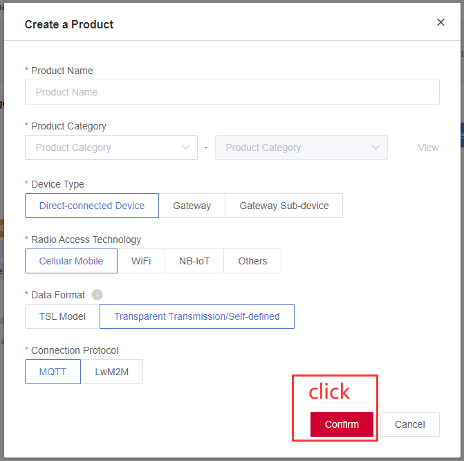
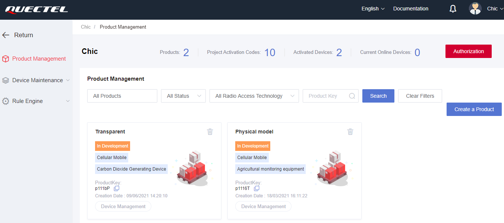

## 							About document

| Version | Date       | Author | Description     |
| ------- | ---------- | ------ | --------------- |
| 1.0     | 2021-04-30 | Chic   | Initial Version |
| 1.1     | 2021-09-08 | Chic   | Modified as DMP |


## Login platform to create program and product

Device management platform: https://iot-cloud.quectel.com/Login 

The front page after entering into the link


Click [Register now] and select the account type. Take "individual developer" as an example, you can register via personal email address and log in. About the number on"limitation item", compared with individual developer, the enterprise user is equipped with more programs.  It is valid to create up to 500 accounts for enterprise users, however, the individual developer is limited to 50. 


After log in, what we can see is the created programs. From the figure, 2 programs are vivid. Or you can create your own program via clicking "create new program".


It is easy to carry out new  program: Input “program name" and click "Confirm". 


Click the created program on the left of above step and check the product contained in program. 


Enter the program surface, you will query the "product". Correspondingly, it is accessible to create new product type via clicking "create product" on the right. 


Input "product name". we just create the transparent product and communicate via data transparency. 



Manifestation on header 



Total product: product number in this program

Activation code number of program: total activation code number in this program.  each activation code will be consumed by correspond device of itself. 

Activated device number: the initial status of newly-added is non-activated. Under the circumstance that the device has already sent up/down-link message with more than 1000, the device status will be transformed from"non-activated" to "activated".

Current on-line device number: display the device number that connected to the platform currently.  

There are two products: the first one is PaaS transparent product that supporting direct data transparency; while the second is JSON physical stereotype product that defining its function on platform. 


Click the product name and query "product info"

**[Basic info]** Pay much attention to the ProductKey and ProductSecret that used to connect module to platform. As for PaaS transparent product, the data format is "transparency or self-assignment"; while for JSON physical stereotype product, the data format is featured with JSON (Standard data format).


## Connect QuecPython device to device management platform

The next chapter tells how to connect to platform on module via QuecPython code. 

Connect the device to "device management platform".

1）Power on the device and import QuecIot module, after that, [Initialize Quecthing](https://iot-cloud.quectel.com/help?id=3010).

​	import quecIot

​	quecIot.init()

2）[Configure Cloud platform communication protocol and guide/authentication server ](https://iot-cloud.quectel.com/help?id=3013)according to the actual product need. Otherwise, the default communication protocol and server address will be used. 

​	quecIot.setServer(1,"iot-south.quectel.com:2883") 

3）According to the product info when creating Cloud platform, [Configure product info on Cloud platform](https://iot-cloud.quectel.com/help?id=3013)

​	quecIot.setProductinfo("p11169","QlZ**********WJR")  

4）[Configure lifetime of Cloud platform](https://iot-cloud.quectel.com/help?id=3013) in accord with actual need. Otherwise, the default lifetime will be used (MQTT:120). 

​	quecIot.setLifetime(120) 

5）[Configure PDP Context ID on Cloud platform](https://iot-cloud.quectel.com/help?id=3013) in aligned with real scenario. Otherwise, the default PDP Conecte ID(1) shall be used. 

​	quecIot.setPdpContextId(1)

6）[Configure auto connection mode on Cloud platform](https://iot-cloud.quectel.com/help?id=3011) via the actual need. Otherwise, it won't be connected to Cloud platform by default. 

​	quecIot.setConnmode(1)  

7）Register [Event reception callback function on Cloud platform](https://iot-cloud.quectel.com/help?id=3016) and by which to judge the current connection status on Cloud platform. 

​	quecIot.setEventCB(queciot_even_cb)


**[Device management]** It is available to query the registered device as well as its specification on this product. Meanwhile, it supports deleting and secondary authentication of device. 


Click "query" of the device list on the right to enter the "debug device".


## SW design

Case code

```python
import quecIot
import _thread
import utime

key = "p111bP"  # Fill in product key
src = "NlU1VFdpN29OOGpW"  # Fill in procut private key

class Quecthing:
    def __init__(self):
        # ''' Initialize qucsdk '''
        quecIot.init()
        # ''' Register event callback function '''
        quecIot.setEventCB(self.eventCB)
        # ''' Configure product info'''
        quecIot.setProductinfo(key, src)
        # ''' Start Cloud platform connection '''
        quecIot.setConnmode(1)
        return

    @staticmethod
    def eventCB(data):
        print("event:", data)
        event = data[0]
        errcode = data[1]
        if len(data) > 2:
            data = data[2]

        if event == 1:  # Send data
            if errcode == 10200:
                print('Succeed in device authentication')
            elif errcode == 10422:
                print('The device has been authenticated (fialed connection)')
        elif event == 2:  # Connect
            if errcode == 10200:
                print('Succeed in connection')
        elif event == 3:  # Send data
            if errcode == 10200:
                print('Successful subscription')
        elif event == 4:  # Send data
            if errcode == 10200:
                print('Successful data transmission')
        elif event == 5:  # Receive data
            if errcode == 10210:
                print('Data transparency')
                print(data)
            if errcode == 10210:
                print('Receive data')
            elif errcode == 10211:
                print('Read data on platform')
        elif event == 6:  # Connect
            if errcode == 10200:
                print('Delete successfully（Succeed in disconnection）')
        elif event == 7:  # FOTA
            if errcode == 10700:
                print('Upgrade task, which belongs to configured info')

def QuecIot_passTransSend():
    while True:
        quecIot.passTransSend(1, 'Chic')
        utime.sleep_ms(2000)

        print('QuecIot_passTransSend')

if __name__ == '__main__':
    Quecthing()
    _thread.start_new_thread(QuecIot_passTransSend, ())
```

The next step is to download and verify. You can download and run **.py** file on module via QPYcom since there is no need to compile python code. 

## Advance in debugging device 

**[Device management]** It is available to query the registered device and its specification on this product. Meanwhile, it supports deleting and secondary authentication of device. 


Click "query" of the device list on the right to get more references. 

**[Device info]** In terms of physical stereotype product, it can report info to platform. 


The reported info is displayed on this page such as volume, voltage and signal strength. 

**[Data log]** It records every data content that uploaded by module. you can click "query"  on "data content". Besides supporting module upload, it also supports data formats such as  HexString, Base64  and Text.


**[Event log]** It records the events of power on/off every time on module. 


**[Running status]** Only effective on physical stereotype product. 

**[Service call]** Only effective on physical stereotype product. 

**[Debug device]** In the device debugging of transparency devices, there are two data formats in debugging: Hex and Text. Hex indicates the hexadecimal number, while Text indicates the string Text format. Session Log on the right displays up-link and down-link information in real time. Click "View Details" to check Hex or Text data.


Please check via following sequence: Down-link data-> module: Hex


 Please check via following sequence: Down-link data-> module: Text


Please check via following sequence: Uplink data->platform

The codes on module will upload data for one time every 2 seconds.


Referential link

Device management platform: https://iot-cloud.quectel.com/Login 

## The matched code
<a href="/docsite/docs/en-us/Advanced_development/QuecPythonCloud/code/QuecIoTCloud.py" target="_blank">Download the code</a>
