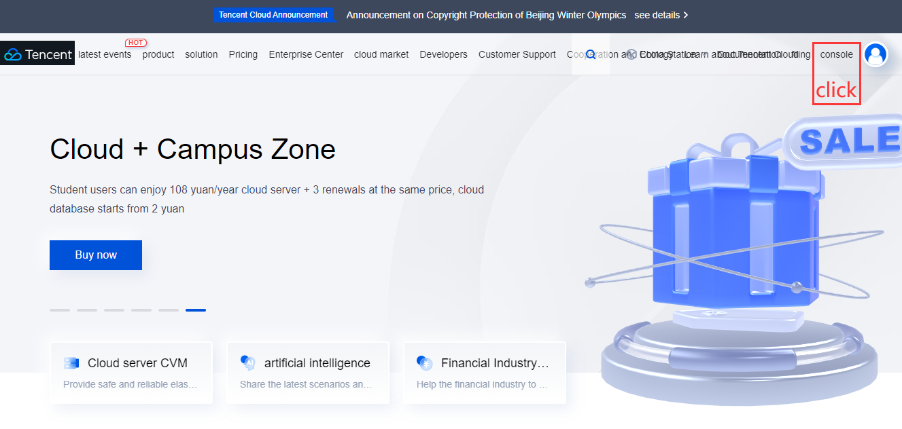
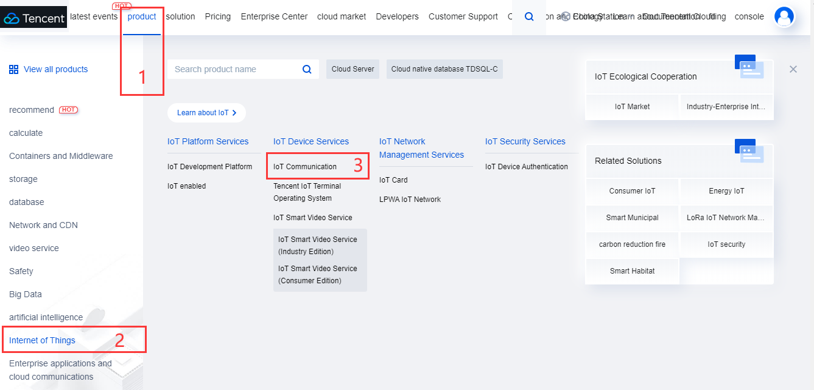
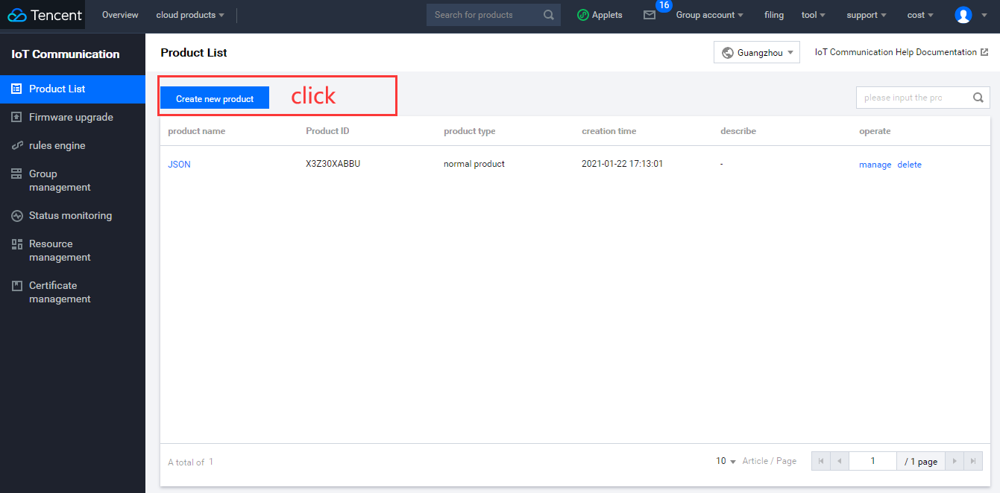
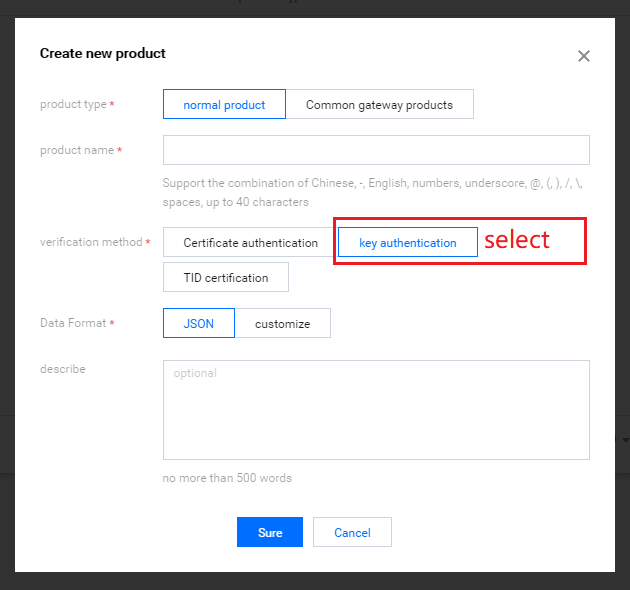
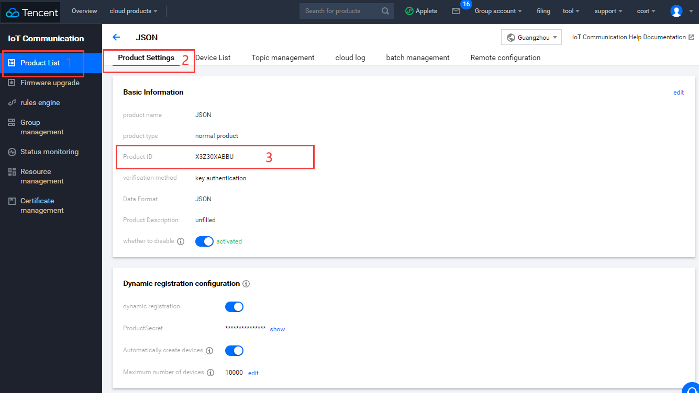
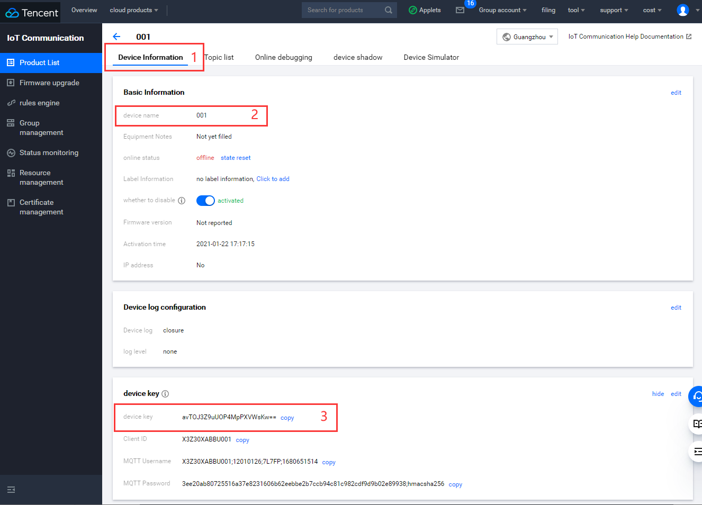
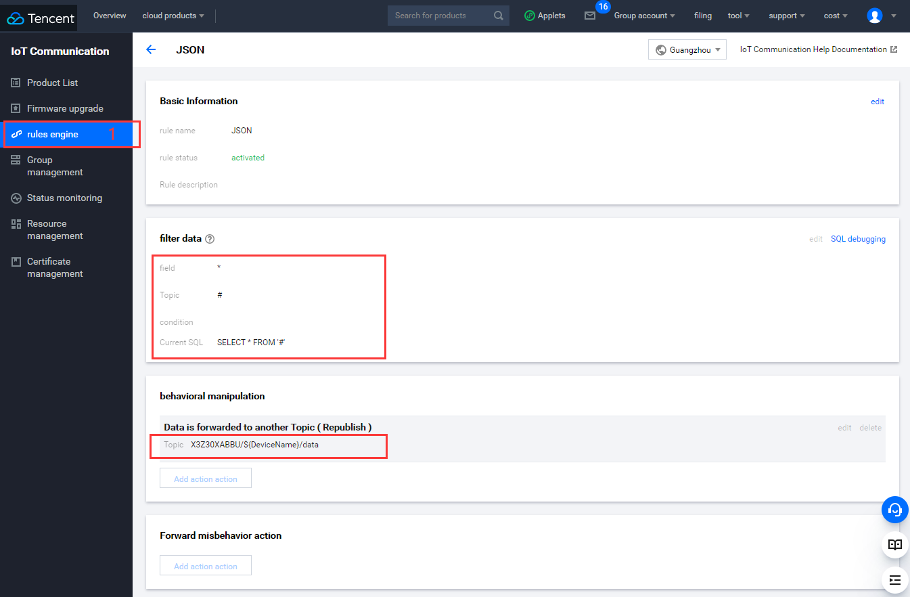
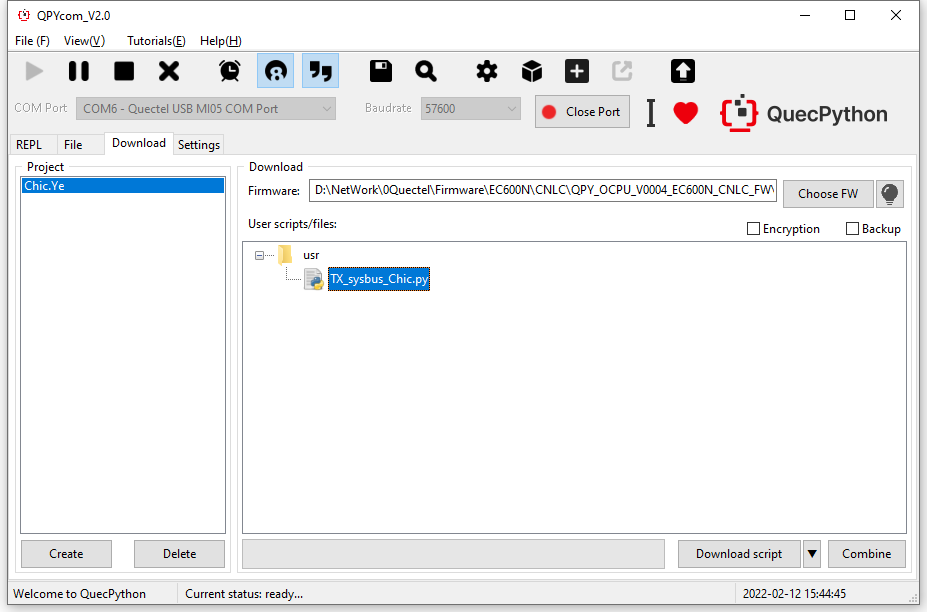
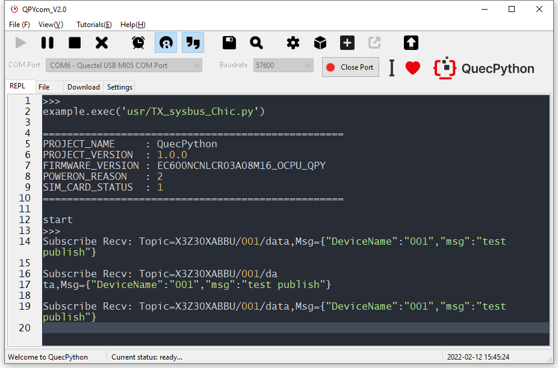

## About document

**Revision history**

| **Version** | **Date**   | **Author** | **Description** |
| ----------- | ---------- | ---------- | --------------- |
| 1.0         | 2021-09-29 | Chic       | Initial Version |


## Preamble

In this document, it mainly illustrates how to use Tencent Cloud. Tencent Cloud IoT Hub provides a secure, stable and efficient connection platform that helps developers quickly achieve reliable and high-concurrency data communications among devices, user applications and cloud services at low costs. In other words, IoT Hub can realize cross-device interaction, device data reporting and configuration distribution.

In addition, by opening up the link between device data and Tencent Cloud products using the rule engine, it allows for the quick and easy storage, real-time computation and intelligent processing and analytics of massive amounts of data.

In following chapter, it just introduces from the view of MQTT connection. Furthermore, by reading this context, you can learn about the operation procedure and theory to verify test via connection between QuecPython and Tencent Cloud.

## Cloud setting

The address of Tencent Cloud: <https://intl.cloud.tencent.com/?lang=en&pg=>

### Enter the console

Click the console on the upper right corner. 



Click "Cloud product" ---"IoT Hub"



### Create product

In terms of "authentication" when creating product, please select" private keys".





### Add device

1. Click the "product name" and enter the front page of adding device. For more details, pleas refer to the figure as described below. 


2. Add device according to the indication of following page. 


### Generate connection info

In terms of "one private key for one device", following aspects should be paid more attention on the condition of tuple: 

The location of "**Product ID**" 



The location of "**devicename**" and "**devicePsk**".




### Rules engine 

The main function of it is used to transfer topic message,. Here shows the configuration of rules engine.




## SW design

Here shows the case codes. Before that, several suggestions should be served as reminders: 

（1）In this case, the codes are tested via Tencent Cloud kit. While as for the Tencent Cloud with the feature of "one private key for one device", it will be valid to configure corresponding tuple-**productID、devicename、devicePsk**. (For more details, please refer to the "**Generate connection info**")

（2）In this case,  transformations  of two simple rules is displayed. 

The message will be transferred to  **topic = "3ICA4ULOXI/QuecPython_test/data"** in codes, meanwhile, it will also be subscribed to the topic data ( the reason is that the rules transformation is made and this topic supports publication and subscription); 

The message will be transferred to  **pub_topic = "3ICA4ULOXI/QuecPython_test/event"** in codes. At the same time, it will be subscribed to the message of topic **sub_topic = "3ICA4ULOXI/QuecPython_test/control"** . ( Rule transformation is made beforehand.)


```python

import utime
import checkNet
from TenCentYun import TXyun
import _thread
import sys_bus

class SYSTOPIC_Class(object):
    RRPC = "rrpc"
    OTA = "ota"
    PUB = "pub"
    SUB = "sub"

class TXyun_Class(object):
    def __init__(self):
        self.productID = "X3Z30XABBU"
        self.devicename = "001"
        self.devicePsk = None
        self.ProductSecret = 'TeXbX8bZ40vutWHGxfUGJEZS'

        self.subscribe_topic1 = 'X3Z30XABBU/{}/data'.format(self.devicename)
        self.publish_topic1 = 'X3Z30XABBU/{}/data'.format(self.devicename)

        self.tenxun = TXyun(
            self.productID,
            self.devicename,
            self.devicePsk,
            self.ProductSecret)
        self.tenxun.setMqtt()
        self.tenxun.setCallback(self.sub_cb)

    def sub_cb(self, topic, msg):
        if topic.decode().find(SYSTOPIC.RRPC) != -1:
            sys_bus.publish(SYSTOPIC.RRPC, {"topic": topic, "msg": msg})
        elif topic.decode().find(SYSTOPIC.OTA) != -1:
            sys_bus.publish(SYSTOPIC.OTA, {"topic": topic, "msg": msg})
        else:
            sys_bus.publish(SYSTOPIC.SUB, {"topic": topic, "msg": msg})

    def TXyun_start(self):
        self.tenxun.start()
        print('start')

    def TXyun_subscribe_topic(self):
        self.tenxun.subscribe(self.subscribe_topic1, qos=0)
        # self.tenxun.subscribe(self.subscribe_topic2, qos=0)

    def TXyun_publish(self, topic, msg):
        try:
            self.tenxun.publish(msg.get('topic'), msg.get("msg"), qos=0)
        except BaseException:
            print('!!!!!')

class Handler(object):
    @classmethod
    def sub(cls, topic, msg):
        print(
            "Subscribe Recv: Topic={},Msg={}".format(
                msg.get('topic').decode(),
                msg.get("msg").decode()))

    @classmethod
    def pub(cls, msg):
        while True:
            sys_bus.publish(SYSTOPIC.PUB, msg)
            utime.sleep_ms(2000)

    @classmethod
    def ota(cls, topic, msg):
        msg = {"topic": "xxx", "msg": "xxx"}
        sys_bus.publish_sync(SYSTOPIC.PUB, msg)

    @classmethod
    def rrpc(cls, topic, msg):
        msg = {"topic": "xxx", "msg": "xxx"}
        sys_bus.publish(SYSTOPIC.PUB, msg)

if __name__ == '__main__':
    PROJECT_NAME = "QuecPython"
    PROJECT_VERSION = "1.0.0"
    checknet = checkNet.CheckNetwork(PROJECT_NAME, PROJECT_VERSION)
    checknet.poweron_print_once()
    checknet.wait_network_connected()

    TXyunClass = TXyun_Class()
    TXyunClass.TXyun_subscribe_topic()

    SYSTOPIC = SYSTOPIC_Class()
    sys_bus.subscribe(SYSTOPIC.RRPC, Handler.rrpc)
    sys_bus.subscribe(SYSTOPIC.OTA, Handler.ota)
    sys_bus.subscribe(SYSTOPIC.SUB, Handler.sub)
    sys_bus.subscribe(SYSTOPIC.PUB, TXyunClass.TXyun_publish)

    msg = '{{"DeviceName":"{}","msg":"test publish"}}'.format(TXyunClass.devicename)
    tuple = ({"topic": TXyunClass.publish_topic1, "msg": msg},)
    _thread.start_new_thread(Handler.pub, tuple)

    TXyunClass.TXyun_start()

```

The next step is to download and verify. You can download and run **.py** file on module via QPYcom since there is no need to compile python code. 

## Download and verify

Download **.py** file into module



After downloading, run the script manually. For more details, please check the following figure. 



## The matched code

<!-- * [Download the code](code/TX_sysbus_Chic.py) -->
<a href="/docsite/docs/en-us/Advanced_development/QuecPythonCloud/code/TX_sysbus_Chic.py" target="_blank">Download the code</a>
