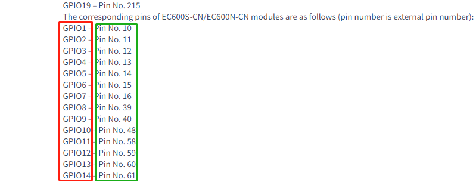
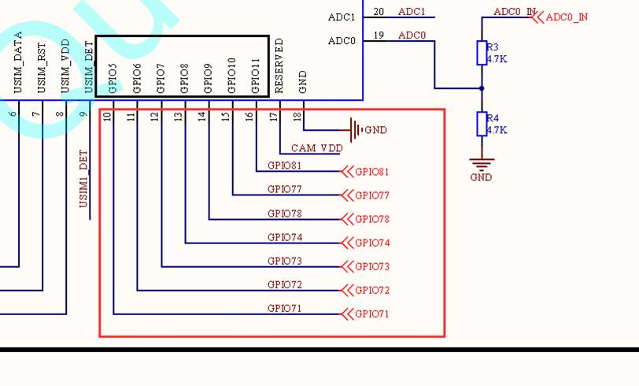
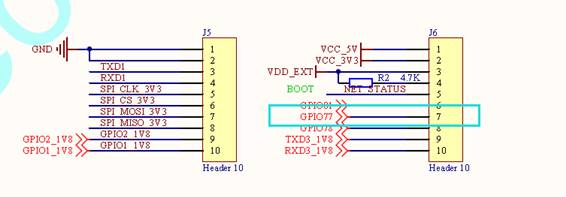
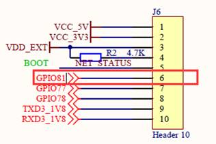
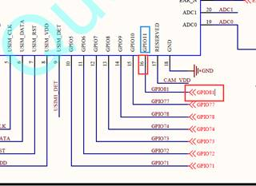
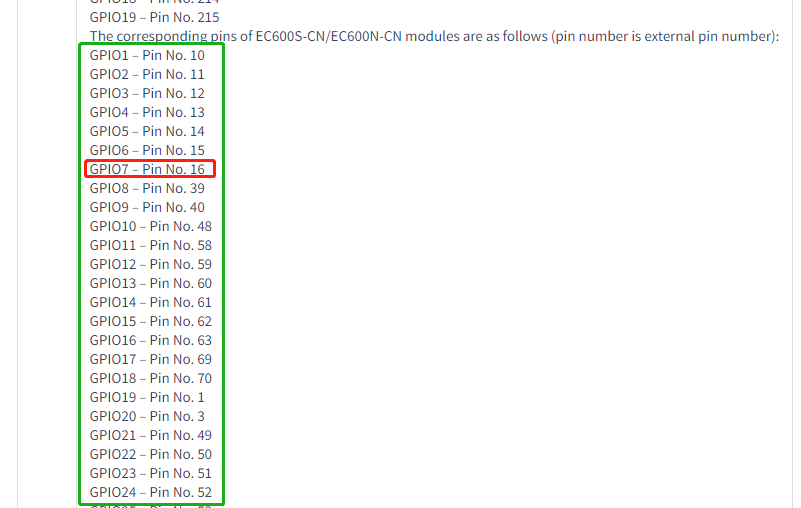
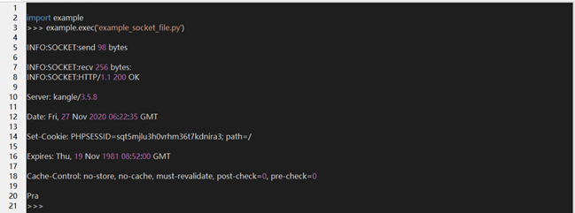
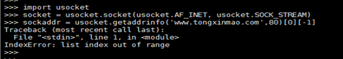
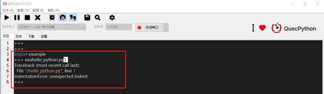

## Only two interfaces in device manager

Analysis: It is alright to select package when downloading FW. However, the FW package downloaded from official website, including FW and changelog, should be unzipped。

Solution: Unzip the package downloaded from official website. In Addition, pay attention to following aspects when flashing FW. 

2.  The selected FW is a package.
4. The sub directory of FW contains multiple **.bin** files, that means, there is no extra package on FW. 


## EC600S EVB and serial interface 				

The serial interface location of EC600S EVB. (EC600S_QuecPython_EVB_V1.x EVB)


For more details, please refer to the <Quectel_EC100S-CN_QuecOpen HW DESIGN MANUAL_V1.0.0_Preliminary_20200927>. (It is achievable to download in QuecPython development communication group)

## Corresponding relationship of GPIO 

### Find out exact location on EVB via schematic diagram 

Step 1. Check the relationship between GPIO and PIN. (It is located on the PIN module on API library. Left: GPIO name of QuecPython; Right: Pin number of module). Take GPIO6 of the QuecPython as an example. If it is needed to use, after checking the diagram, the corresponding pin is Pin 15.  

 

Step 2. Check schematic diagram of EC600SV1.1. (Pay attention to the contents on red box instead of the black one). Once again, we will take the GPIO6 (PIN15) on QuecPython as a reference. The GPIO77 corresponds to the PIN15. (In fact, it has no special meaning of GPIO77, which just serves as connection. That is to say, the GPIO77 here is related to the GPIO77 on following diagram)

 
 

Step 3. The GPIO77 of last figure as above is corresponding to the GPIO77 imported from EVB (J6 on EVB)

Summary: When configuring the GPIO6 of QuecPython, you should check whether it is effective of the GPIO77 on EVB. 

### Find out related GPIO port via the Screen printing of EVB

E. g. It is hoped to find the exact GPIO port on QuecPython that corresponding to the G81 on EVB. (However, if it is a failure to find the corresponding GPIO, which illustrates that it isn't exposed temporarily)

Step 1. Query the schematic diagram. The G81 on EVB corresponds to the GPIO81 on schematic diagram. Take the following figure as an example. The GPIO81 is corresponding to PIN16. (Please ignore the GPIO flag on blue box)

 

Step 2. Login QuecPython and find out the API library of PIN. （https://python.quectel.com/wiki/#/en-us/api/QuecPythonClasslib?id=pin）

Take the following figure as an example, if it is demanded to take charge of G81, the GPIO7 shall be configured. 



 

 

## About usocket 

In usocket module, it provides the access to BSD socket interface and supports the address binding, monitoring, connection and data reception/transmission of socket. For details, please take <Application note on usocket module on QuecPython API library> as a reference. 

Case codes

```python
# Import usocket module
import usocket
import log

# Set log output level
log.basicConfig(level=log.INFO)
socket_log = log.getLogger("SOCKET")

# Create one real socket case 
sock = usocket.socket(usocket.AF_INET, usocket.SOCK_STREAM)
# Analyze domain name 
sockaddr = usocket.getaddrinfo('www.tongxinmao.com', 80)[0][-1]
# Create connection 
sock.connect(sockaddr)
# Send message to server 
ret = sock.send('GET /News HTTP/1.1\r\nHost: www.tongxinmao.com\r\nAccept-Encoding: deflate\r\nConnection: keep-alive\r\n\r\n')
socket_log.info('send %d bytes' % ret)
# Receive server message 
data = sock.recv(256)
socket_log.info('recv %s bytes:' % len(data))
socket_log.info(data.decode())

# Close connection 
sock.close()
```

The running result

 

## Whether QuecPython supports queue？ 

The queue, a data structure featured with" first in, first out", mainly including in queue entrance and queue exit. In addition, the element on queue entrance is added to the end of the queue, while exacting the element of queue exit from the header of the queue. Correspondingly, we can simulate queue via list on QuecPython. 

```python
class queue:
    def __init__(self):
        self.__alist = []

    def push(self, value):
        self.__alist.insert(0, value)

    def pop(self):
        return self.__alist.pop()

    def size(self):
        return len(self.__alist)

    def clean(self):
        self.__alist.clear()

    def isEmpty(self):
        return self.__alist == []

    def showQueue(self):
        print(self.__alist)
```

Run

```python
if __name__ == '__main__':
    q = queue()
    q.push(1)
    q.push("123")
    q.push("456")
    q.push(2)
    q.showQueue()
    print(q.pop())
    print(q.pop())
    print(q.pop())
    print(q.pop())
    q.showQueue()
```

## Failure to analyze IP via socket



When connecting to API via socket and mqtt, there will be a failure to analyze IP. For more details, please refer to above figure. 

Focus on issue: Check whether network register of SIM card is a success and the effectiveness of this address. After that, there is a need to try again. 

Check the AT command for network register is a success or not. [The **AT+cops?** command is used to check the network register]

## It reminds sentence error when executing script file

 

Reason: Error on Python sentence indent (4 blank space indents) probably.

Investigation: Check whether the indent of code format is regulated

Suggested utility: PyCharm or VsCode. Error on sentence indent and basic sentences will be reminded by IDE. 

## The network request is a failure after carrying out hot swap of SIM card. 

Since the EC100Y does not support the hot swap of SIM card,  there is a need to reboot module manually before carrying out network register. 

## Is source code of QuecPython safe?

The QPYcom downloading tool is equipped with code mixture encryption function, as a result, the client program won't be exposed directly. 

## No reaction when operating QPYcom

Check whether the selected serial interface is right and enabled. 

## Which utility is used to compile Python code? 

Recommended **pycharm** or **VScode** (two wildly used IDEs) with the feature of auto-complete. 

## The serial port exported from EVB can't communicate 

Pay attention to whether it is the 1.8V or 3.3V. Only the level is matched can the normal communication be carried out. 

## The light is still off when connecting USB cable 

Check module voltage and make sure the module voltage is 3.8V. If necessary, power by battery. 