## Revision History

| Version | Date       | Author     | Description                                    |
| ------- | ---------- | ---------- | ---------------------------------------------- |
| 1.0     | 2021-09-02 | Kayden     | Initial compilation& User Guide on Quick-Start |
| 1.1     | 2021-09-10 | David.Tang | Added the notices on environment building      |
| 1.2     | 2022-02-12 | David.Tang | Translate Chinese operation pictures           | 

## Introduction on Official Website

**Official Website address**:  **[https://python.quectel.com/](https://python.quectel.com/)**

**Wiki address of official website**: **[https://python.quectel.com/wiki/#/](https://python.quectel.com/wiki/#/en-us/)**. You can check all APIs that supported by module.

**Address for downloading development resources**: **[https://python.quectel.com/download](https://python.quectel.com/download)**, which includes development tool, driver, FW and Referential HW design. 

**QuecPython Community link** ：**[https://forums.quectel.com/c/quecpython/66](https://forums.quectel.com/c/quecpython/66)**

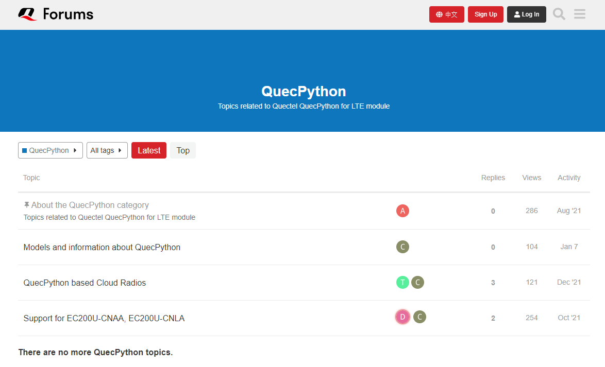

Or you can use the magnifier in the top right-hand corner to find what you want. If there is none, you can apply for us when it is convenient to you. 

## Build QuecPython Development Environment

### Acquire the Real EVB

If you have no idea about how to handle with this EVB, please take this document as a reference. 

For detailed operation, you can refer to the EC600X EVB.

In this document, we just take EC600S_QuecPython_EVB_V1.1 as an example. As for the differences compared with V1.2 or V1.3, you can check the above link on EC600X EVB. 


After acquiring the EVB, plug in the USB interface on the EVB  and carry out power supply, while on the other side, connect it to the USB interface of the PC. The multi-functional EVB supports power on/off as same as another cellphone does. As a result, we can power on once the power supply is conducted. 

### How to Boot 

| EVB                        | Boot operation                                               |
| -------------------------- | ------------------------------------------------------------ |
| EC600S_QuecPython_EVB_V1.0 | Plug in to boot                                              |
| EC600S_QuecPython_EVB_V1.1 | Long press the POWKY on the EVB for 2 seconds, the module will boot |
| EC600X_QuecPython_EVB_V1.2 | If make short circuit of the PWR_On Jumper on EVB, there is no need to long press PWK; otherwise, it should be done. |
| EC600X_QuecPython_EVB_V1.3 | After power supply,  flip the power supply selection switch to select the power supply mode, then long press the PWK to boot; or make short circuit of the PWR_On Jumper on EVB, there is no need to long press PWK. |

### Download and Install Driver

As the name implies,  "device driver", with its full name of "device driver program", is a special program that used to communicate between PC and device. To some extent, it is similar with the HW interface. The operation system can control the running of HW device via this interface only; and if the driver program of certain device is failed to install, it won't run normally.

Open the [Link of downloading driver](https://python.quectel.com/download), then select the driver that matched with your own PC as the figure shows. If you drag the arrow to the right, a button for downloading will appear, just click it. 

Notices on driver installation

1. **The driver is divided into two categories mainly:**

   **No. 1** Based on the platform: ASR platform (EC600SCNAA、EC600SCNLA、EC600SCNLB、EC600N、EC100Y）and RDA platform（EC600U).

   Many may ask what the platform of EC600X is. Generally, the "**X**" in EC600X is an unknown, which can indicate EC600S or EC600U instead of the actual platform. 

   **No. 2** Based on the PC system: Whether in Windows 7 or Windows 10, please download corresponding driver separately.

2. **While in terms of EC600SCNLA and EC600SSCNLB, it is a must to download the latest driver with at least V1.0.8 and later.** 

3. **In RDA platform, after downloading USB driver zip, it contains drivers of both Windows 7 and Windows 10.**

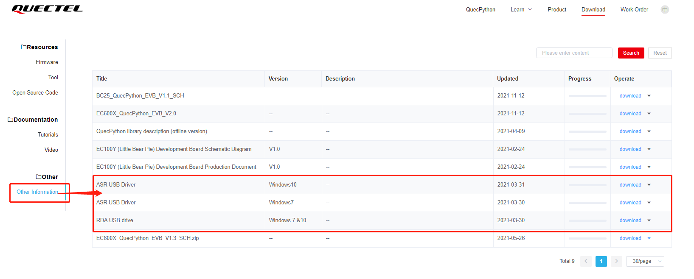

Please do as following sequence: open "**My Computer**"--"**Management**"--"**Device manager**"

Before installing driver: 

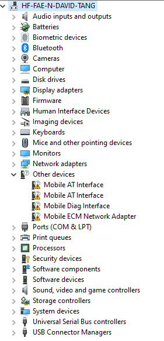

After installing driver

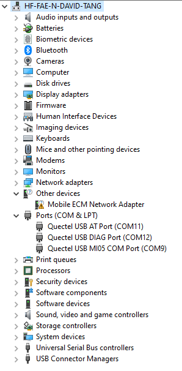

Open unzipped package, then double click to run "**setup.exe**"; after that, keep on clicking the "**Next Step**" till the installation is done. If the port marked with "**exclamation**" in "**device manager**" is invisible, which means the installation is a success and normal communication can be executed. **As the above figure implies, there still exists an "exclamation", please just ignore for it is useless.** 

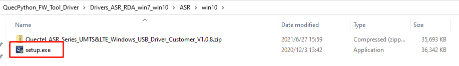


### Note on Flashing FW

1. **Different modules are varied in FW, as a result, it does not support cross-flashing. If there is a mistake, please correct it and flash the corresponding FW, otherwise, it won’t work. Take EC600S as an example, it is divided into EC600SCNAA, EC600SCNLA, EC600SCNLB and so on, which do not support cross-flashing among these modules.** 

2. **About FW, owing to the FW zip package downloaded from official website contains FW package and change log, only unzip the FW package further can you get the flashed FW package. It is evaluated to modify the suffix of FW package as .bin. (It is in schedule. If the later update is accomplished, please select the zip file with .bin suffixed when flashing.)**

3. **Before downloading FW, it is suggested to confirm the FW version priorly so as to avoid degrade or download the wrong one. After downloading, all contents in user area will be empty.**

4. **When downloading FW, there is no need to select serial interface since the tool will select it automatically and download.**

5. **Never plug in two or more EVBs at the same time so as to avoid the unidentified situation, even worse, result in the error in downloading.**

6. **The QPYcom supports flashing Python FW instead of the FW of C or AT Standard.** 

7. **When downloading FW, please do not exit tool or plug out the serial interface, which may result in the inaccessibility of module.**

### How to Use QPYcom.exe

In official website, it provides a tool in Windows for user to debug code. 

Download link: https://python.quectel.com/download

About QPYcom, please refer to the "docs in folder  which is under the directory as same as that of tool".

### Working Principle

Hereby, we should learn about how the whole process works.


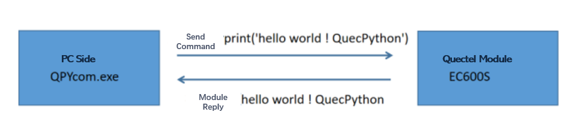

One QuecPython syntactic interpreter is embedded in module, which used to interpret QuecPython syntax. After that, return executed result. 

Illustration 

print(‘Hello world! QuecPython’)

The print (), a function, is used to output some info from the inner device. Thus, the user can learn about the device on PC. 

The print () can also be used to print string and variate. 

In QuecPython, the string is indicated by a pair of single quotation marks, such as 'Hello world! QuecPython'. 

### In Real Scenario

****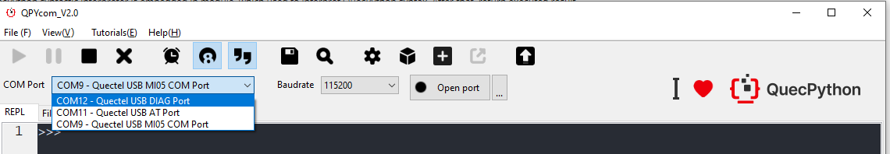

After opening up QPYcom, we can see three ports in "select interface" are module-related, among which: 

The "Quectel USB AT Port" is used to send AT command.

As for "Quectel USB DIAG Port", it is used to check the debugging info of module. 	

It is hardly for user to deploy above two ports. As a result, we should pay attention to "***Quectel USB MI05 COM port***" particularly. we can debug the code via this port only. 

Click dropdown with selecting "***Quectel USB MI05 COM port***" following, after that, click "**Enable serial interface**".

Input **print('Hello world! QuecPython')** in interaction surface and click "**Enter**".

What we can see is shown as following 

```python
>>> print('Hello World! QuecPython')

Hello World! QuecPython

>>> 
```

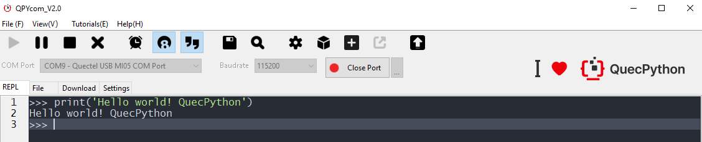

The returned value of module is visible and "Hello world! QuecPython" is outputted successfully. 

### Other API Interfaces

For other functions, please refer to the official website: https://python.quectel.com/wiki/#/en-us/api/QuecPythonClasslib?id=pin

 It is also available to download relevant tools, routines, drivers and documents in official website: https://python.quectel.com/download

You can also follow our Wechat account to get more latest info. 


## Development Procedure of QuecPython APP 

In this chapter, it mainly introduces how to develop a complete APP via QuecPython. 

Applicable Modules

- EC100Y-CNAA
- EC600S-CNAA
- EC600S-CNLA
- EC600S-CNLB
- EC600N-CNLA
- EC600N-CNLC
- EC600N-CNLD
- EC600U-CNLB
- EC600U-CNLC
- EC600U-EUAB
- EC200U-CNLB
- EC200U-EUAB

### Development Procedure

We have already acquired the communication between PC and module via above chapters. Then how to develop product, write code and manage file? Installing tool is the most suitable to handle it. 

- Install Vscode (Code complier)

- Download **.py** script file into module to run and debug via QPYcom.

- About debugging functional code, please refer to API illustration: https://python.quectel.com/wiki/#/en-us/api/QuecPythonClasslib?id=pin

- About getting better experience, please refer to demo: https://python.quectel.com/download


### Install VsCode or PyCharm

### Install Python 3.9

Download address for Python installation package: https://www.python.org/downloads/ 

Click "Next step" one by one till the installation is done, the default path is located in C:\Users\AppData\Local\Programs\Python\

Once the installation is achieved, input **python --version** command in window 

When it returns Python 3.9.1, which means the Python development environment is installed correctly. 


### Compile Code

Take *PyCharm* as an example

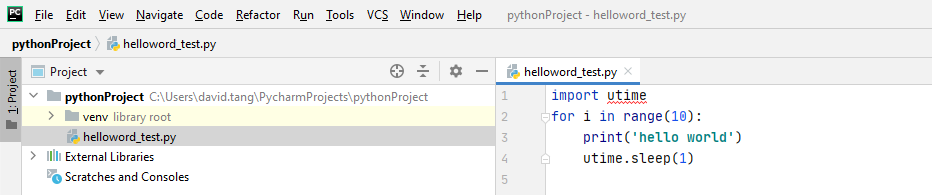

### Run Code on Module

Select the compiled code above via clicking"**+**" (Or drag from left to right), the file will be downloaded to module. 

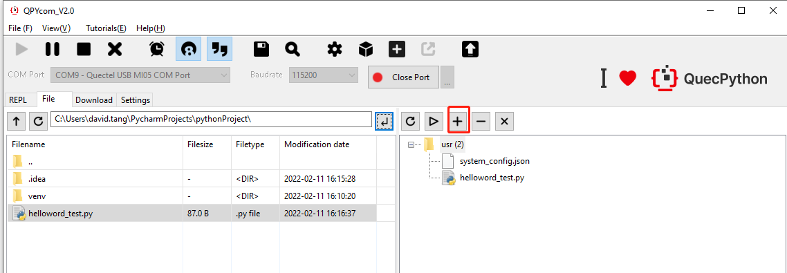

Select script file in "**file**" selection under QPYcom, click "**Run**" as following figure shows:

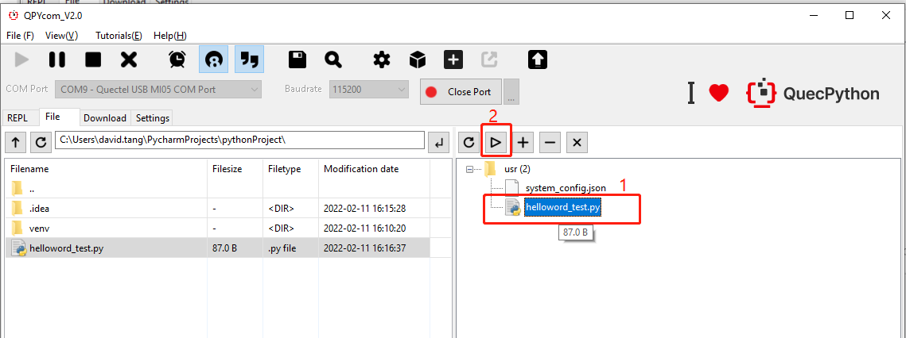

Skip to "**Interaction**" surface automatically, then you can see the executed result of module. 

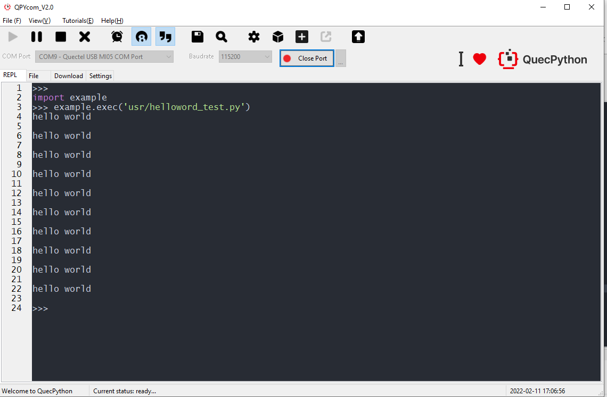

What we can find is that the result in QPYcom is as same as that in module. Normally, when compiling codes, we can verify service logic and sentence in PC but execute in module,  as a result, the development efficiency will be improved prominently. 


### Get Assistant from WIKI

When confronting with some functions development that beyond wisdom or you want to try something new, you can refer to the API introduction on WIKI, which includes the interface and parameter illustrations of all functions. **You can find the API as you wish by searching key words in upper left corner.** 


API Introduction on WIKI (In English): https://python.quectel.com/wiki/#/en-us/api/

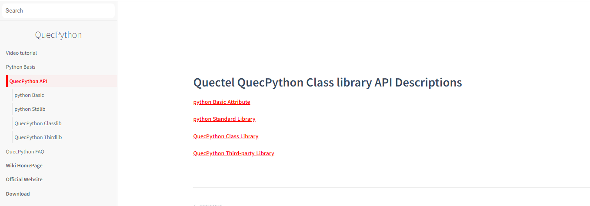

Click the corresponding item, detailed introduction on API will be displayed. 

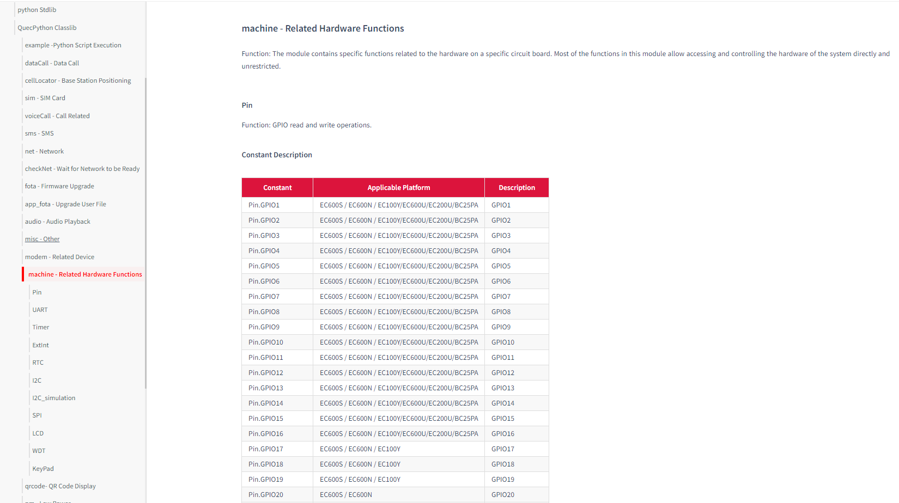


**Notes: If you want to control GPIO, you shall check the pin in HW-related capabilities as described above, which illustrates the individual physical pin number that corresponding to GPIO in API.** All pins that  supporting GPIO operations have been listed, you can search pin or GPIO in the upper left corner. 

### Take Advantage of Demo for Quick Development 

Address  to download demo：https://python.quectel.com/download 

For more practical demos, you can search for key words for downloading in QQ Group: 445121768.

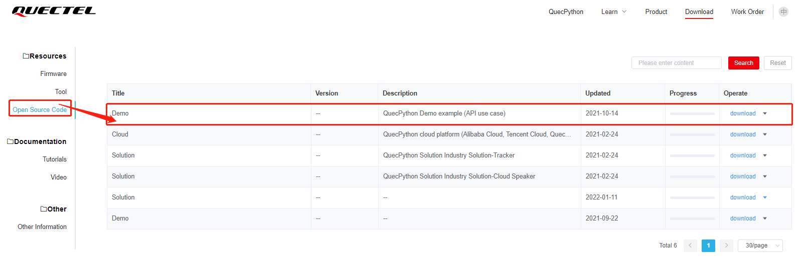Unzip the folder and add it into the **pycharm** after downloading, then you can check and compile the code in demo conveniently. 

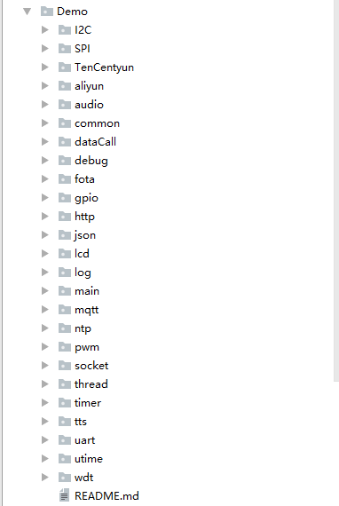

There exists illustration on every code.

from machine import Pin

import utime

import checkNet  


It is a must to have following two variates. Users can modify the value of these two variates according to the actual need. And before executing user codes, the value of these two variates will be printed beforehand.  


**PROJECT_NAME = "QuecPython_Pin_example"** 

**PROJECT_VERSION = "1. 0. 0"**  

  checkNet = checkNet. CheckNetwork(PROJECT_NAME, PROJECT_VERSION)


  * Parameter 1： Pin No.
  
    ​        Corresponding relations of pin on EC100YCN:
  
    ​                  GPIO1-Pin 22
  
    ​                  GPIO2-Pin 23
  
    ​                  GPIO3-Pin 38
  
    ​                  GPIO4- Pin 53
  
    ​                  GPIO5- Pin 54
  
    ​                  GPIO6- Pin 104
    


Abundant and complete demos are displayed on official website, which can do a great favor in developing user product. 