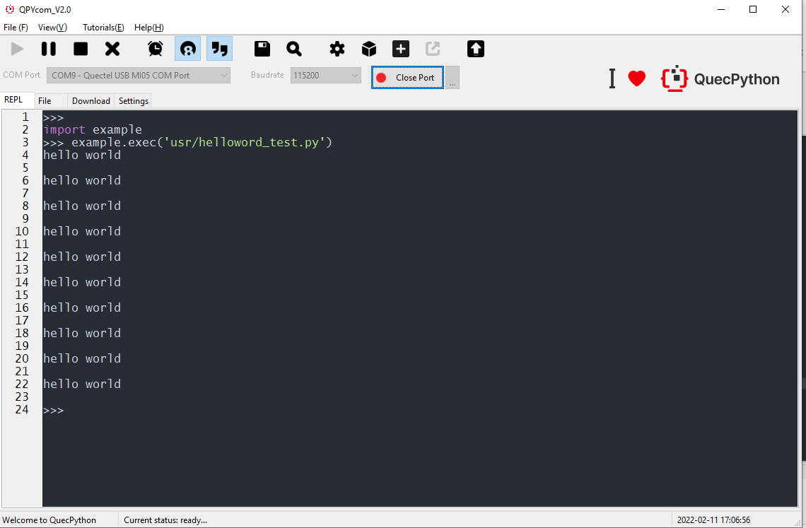
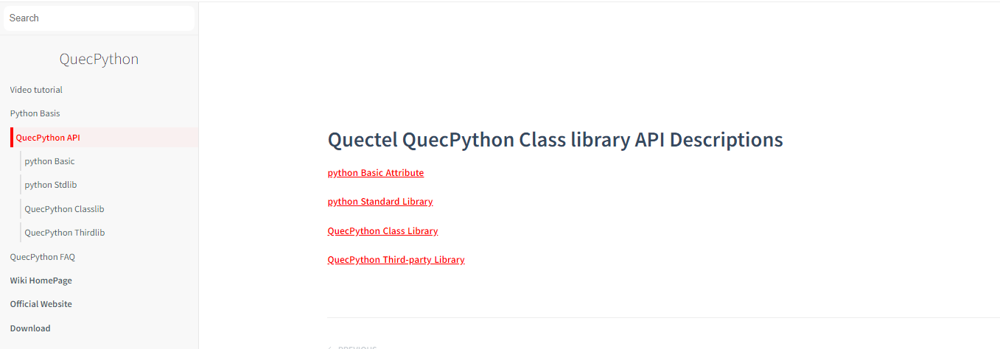

## QuecPython app development process

This document mainly introduces how to use quecpthon to develop a complete app.

Applicable modules:

- EC100Y-CNAA
- EC600S-CNAA
- EC600S-CNLA
- EC600S-CNLB
- EC600N-CNLA
- EC600N-CNLC
- EC600N-CNLD
- EC600U-CNLB
- EC600U-CNLC
- EC600U-EUAB
- EC200U-CNLB
- EC200U-EUAB

### Development process

Through the study of the previous section, we have mastered the communication between computers and modules. How do we usually develop products, write codes and manage files? At this time, we need to install tools.

-Installation code editing vscode;

-Download through qpycom tool Py script file into the module to run and debug.

-Refer to API description for debugging function code: https://python.quectel.com/wiki/#/en-us/api/QuecPythonClasslib?id=pin

-To quickly experience the function effect, you can download the reference Demo: https://python.quectel.com/download

  

### Install the editing tool vscode or pycharm

### Install Python 3 nine

Python installation package download address: https://www.python.org/downloads/

Go to the next step until the installation is completed. The default path is: C: \ users \ chic ye\AppData\Local\Programs\Python\

After installation, use the CMD command window to enter: Python -- version

When you see Python 3.9.1 returned, it indicates that the python development environment has been correctly installed

### Vscode

Recommended reference
[vscode builds Python development environment (including Python environment construction)](https://zhuanlan.zhihu.com/p/165379391)

### Write code

Take pycharm as an example:

### Run code files in modules

Click the plus sign to select the file (or drag it directly from the left to the right), and the file will be downloaded to the module.

As shown in the following figure: select the script file in the [file] tab of qpycom tool and click "run"

Automatically jump to the [interaction] interface to see the execution results of the module.

Readers will find that the execution result of qpycom is the same as that of the module. Usually, when we write code, we can also verify the business logic or syntax on the computer, and then put it into the module for execution. In this way, the development efficiency is greatly improved.

|Tips|
| ------------------------------------------------------------ |
|To be a controller, you can start with lighting, refer to the link: https://mp.weixin.qq.com/s/wrE2LXuE35UtKqaCV74zAg  |
|There are led lights on the development board for lighting. Please check the schematic diagram of the development board for details|

### Skillfully using Wiki to help development

When you encounter a function development you don't understand or want to see if there is a desired function, you can refer to the detailed introduction of API on Wiki, which contains the interface description and parameter description of all functions. ** you can find the API you want by searching keywords in the upper left corner.

Wiki English API introduction link: https://python.quectel.com/wiki/#/en-us/api/

Click the corresponding column to see the detailed introduction of API

**Special note: if you want to control GPIO, you must query the pin in the hardware related functions in the figure above, which introduces the physical pin numbers of each module corresponding to GPIO in API, and all pins supporting GPIO operation have been listed** You can search pin or GPIO in the upper left corner to find it quickly.

### Quick development with demo

Demo download address: https://python.quectel.com/download

More practical demos can be downloaded in QQ group: 445121768, group file search keywords.

After downloading, unzip the folder and add it to the pycarm project. You can easily view and edit the code in the demo

<!-- Each code has comments

The demo provided by the official website is very rich and perfect to help customers develop products quickly. -->

