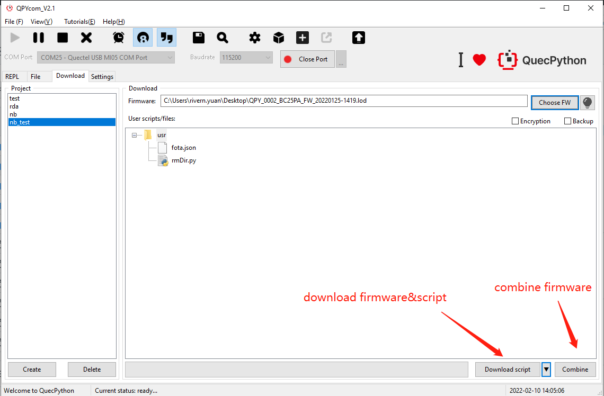

## Application notes on Quectel_QuecPython_QPYcom 

### About document

**Revision history**

| **Version** | **Date**   | **Author**              | **Description**                                              |
| ----------- | ---------- | ----------------------- | ------------------------------------------------------------ |
| 1.0         | 2020-10-31 | Kingka.Wu & Rivern.Yuan | Initial version                                              |
| 1.0         | 2020-11-08 | Kingka.Wu               | 1. Added User guide  2. Added solutions to common issue   3. Added driver installation and EVB introduction    4. Added Quick start |
| 1.1         | 2021-03-01 | Rivern.Yuan             | 1. Added tool bar illustration 2. Added illustration on interaction page |
| 1.2         | 2021-07-13 | Rivern.Yuan             | In V1.6, added the illustration on adjusting download page.  |
| 1.2         | 2021-11-13 | Rivern.Yuan             | In V1.8, adjusted the user guide.                            |

### Quick start

#### Download FW 

（1）Go for QPYcom package in provided tools, unzip and double click to run it. 

（2）Create program name and click "Select FW" to the package. As for the FW package with Python version, it is located in the FW (Firmware) directory of SDK provided. 

（3）Left click the inverted triangle, select "Download FW" and click it to download subsequently. 

#### Download script

1. Go for QPYcom package in provided tools, unzip and double click to run it. 

2. Create program, click "**+**" icon and select the python to be downloaded. 

3. Left click the inverted triangle, select "Download script" and click it to download. 

#### Interaction surface

1. Go for QPYcom package in provided tools, unzip and double click to run it. 

2. Enter interaction surface.

3. In interaction surface, it is available to interact with module manually. Please refer to following figure to get more knowledge. 

### Main surface function 

In this chapter, it mainly introduces the main features of QPYcom. As for User guide, please refer to Chapter 5. 

1. In provided SDK , enter tools directory, find out QPYCOM.zip and unzip it. After that, go for QPYcom.exe directly. It is valid to download Python script file into module, interact with module based on command line via it. In addition, this script tool is also supportive in downloading FW and detecting upgrade. The user can operate by the related functional modes in accord with actual needs. 

2.  The Python file can be downloaded to run and query via serial port.

3. Download FW and Python script

   

#### About File 

#### Storage

-   In file, there exists log storage. Click "Save" to select the path to save log. For more details, please refer to the following figure. 

About File

-   Click "Save" to select the path to save log, here shows the details. 

Save file 

#### Exit 

-   Select "Exit" to exit the entire application. 

### About Query 

"Interacting with command line, scanning over file, downloading FW/script, setting SW, switching language , checking module log and downloading log" are contained in this column, please check the following figure for more specifications. 

### Interact with command line 

The user can enter the main surface of interaction via clicking "Check" and "Interact with command line" by turns. In interaction surface, it is available to interact with module manually. Please refer to following figure to get more knowledge. 

The following icons show the related functions.

-   
 Start up the interaction with command line on module 

-   
 Pause the interaction with command line on module 

-   
 Stop the interaction with command line on module 

-   
 Delete screen printing 

-   
 Display printing time 

-   
 Display line number 

-   
Topic switch in main surface of interaction (Switch between black and white) 

-   
 Save interaction log 

-   
 Search for key words in interaction log  

-   
Set module log and serial port parameter configuration 

-   
  Tool, it is available to add shortcuts manually (configured in config.ini)

-   
  Button for configuring tool, which can be used to configure the needed commands on your own. 

  **Note:** the maximum quantity of command is 16, the maximum length of command name is 16 characters as well.
  
-   
 Top the button, click the button to pin the tool on the top

- 
   The button for making fota package when upgrade. 

### Scan over file 

Select "Query" and "Scan over file" in turn,  then behaviours such as uploading, querying, adding and deleting python file on local and module can be accomplished correspondingly. 

Besides uploading file via button, it is also available to upload file to module via dragging. Here shows the detailed procedures: 

1) Select the local file on the left firstly, drag it to the folder on the right. 

2) After above step, there will be process bar. 

Note: please keep in mind that the file can only be dragged to the folder. Once failed, corresponding error will be reminded.

As for building new folder on module, you can get it via *uos.mkdir()* and drag the local file into it. 

**Note:** the file can only be dragged into the folder displayed "**+**" and "**-**", as for the module without corresponding symbol, just refresh it. 

### Download FW script 

By selecting "Download” button, the user can upload local Python script files in packet and flash the FW functions on module. Here shows the specific procedure: 

-   Create program in the navigation bar on the left. 
-   Click "Select FW" to get FW locally, whose location is hidden in the FW (firmware) directory of SDK provided. Please note that the FW shall be in a form of zip. 
-   Select the script file to be downloaded via the location illustrated on the figure. Or it is also available to delete it via clicking it. 
-   Switch the function of downloading script and FW via left clicking the inverted triangle on the figure. 
-   After selecting FW and needed script file, the user can generate mass-product file via clicking "Merge". During the process, all widgets will be invalid except the process bar. Please bear in mind that the AT port of USB shall be vacant in the process of downloading. 
-   Please note that as for the download page of V1.6 or later, when downloading script to module, the format is changed into the directory structure. For increasing or deleting files and folders, it is valid to right click instead of original button. Or it is also achievable to drag the file from the local to tool with downloading script into module subsequently. 
-   Please refer to the figure as described below. 

#### Download FW 

-   Enter into download page, click "Create“ to build a new FW to be download. Any question, please refer to the figure as described below. 

-   Select FW as described below: 

-   Left click the drop-down and select "Download FW". 

####  Download script 

-   Upload the local python script file into module in packet. 

Step 1: Create user program in accord with need (Click "Create"  button) 

Step 2: Select the user script to be downloaded to module (Refer to Figure. 2)

Step 3: Click the button as figure shows, switch to the "download script" mode 

Step 4: Click ”Download script“ to fulfill it, during which, there will be process bar. 

### Merge FW script 

Once the user selects the "Download" surface, it is approachable to merge local python script file and FW for sake of generating file of mass product. For specific steps, please refer to following content: 

-   Create program in the navigation bar on the left. 
-   Click "Select FW" to get FW locally. 
-   As the figure shows, you can select the script to be merged. In addition, you can delete via clicking the script file. What's more, it is valid to merge the program with complicated directory structure via importing overall directory structure based on one-key. 
-   Encrypt and backup via corresponding buttons separately. 
-   For specific mass product procedure, please refer to *<Quectel_Scheme for downloading product line on QuecPuthon_V1.0.docx>*. 
-   Refer to following figure.

- After clicking Backup (the bak area should be empty), usr is automatically imported into bak/usr, as shown in the following figure:

- After that, if you add files under usr, the files will only exist in the usr area, and will not be restored to usr from the bak/usr directory; if you add files under bak, the files will only exist in the bak area, not in bak/usr. The directory is restored to usr, as shown in the figure:

- Note:

   1. The backup button must be checked to backup

   2. The files will only be backed up if they are in both usr and bak/usr at the same time.

### SW setting 

By selecting "Query" and "SW setting", the user can get into the SW setting surface. Subsequently, settings such as module log auto-save, size limitation when saving single log, numbers of log storage, serial port parameter configuration(including parity bit, data bit, stop bit and current control) and path for mpy-cross encryption tool are all involved in this viewer. In addition, the perpetual function of setting fonts on interactive page is also added newly. For more details, please check the page as described below. 

###  About Language 

-   Select  "Query" and "Language" in turn, then the language switch on SW will be achieved. Currently, The switch between Chinese and English is supported only. 

### Module log 

-   Select  "Query" and "module log" in turn, you can query module log and select a new path to save module log. 

### Download log 

-   Select  "Query" and "module log" in turn, it is achievable to download log and select a new path to save the downloaded log. 

###  Course 

#### Official website

-   Select  "Course" and "official website" in turn to get access to the official website of we QuecPython:<http://qpy.quectel.com/>

#### Online wiki

-   Select " Course" and "Online wiki" in turn to get access to the wiki course of QuecPython: 

> <https://python.quectel.com/wiki/#/en-us/>

#### Online course 

-   Select " Course" and "Online course" in turn to get access to the video course of QuecPython: <http://qpy.quectel.com/index.html#video>

####  Online communication

-   Select " Course" and "online communication" in turn to get access to the online community of QuecPython.

#### Download materials 

-   Select " Course" and "Download materials" in turn to get access to the resource center of QuecPython: <http://qpy.quectel.com/down.html>

### Help 

In help viewer, the user can check the version upgrade, scan over the version and get access to the official website of QuecPython and Quectel.  

#### Check the upgrade

Select "Help" and "Check upgrade" in turn, the user can check whether there exists the upgraded version of SW. If none, the latest version will be reminded; if it does, the upgraded contents and version number will be reminded. 

-   Under the circumstance of reminder of compulsory upgrade, if the user selects the upgrade, the system will operate; if the "delete" is selected by user, just exit from this application. 
-   If the neglected upgrade refers to the file can be neglected this time. When selecting "Neglect" by user, it will remind the upgrade when starting up of next time. However, it won't notify this time, subsequently, if the user selects upgrade, the upgrade operation will be carried out. 
-   If the neglected upgrade refers to the file can be neglected perpetually. When selecting "Neglect" by user, it will remind the upgrade when starting up of next time. Subsequently, if the user selects upgrade, the upgrade operation will be carried out. 
-   During the upgrade, the process bar and upgrade log will display, in addition, it is invalid to operate tool. 

Please refer to the figure for more specifications. 

#### Changelog

-   Select  "Help" and "Changelog" in turn, the Changelog will be opened to query the upgraded functions of the tool. The Changelog is located in the root directory of tools. 

#### Application notes 

-   Select  "Help" and "Application notes" in turn, the document will be opened to query the application notes on tools. The original file of the document is hidden in the root directory of tools. 

#### About Quectel 

-   Select  "Help" and "About Quectel" in turn, the official website of Quectel will be accessed.

#### About QuecPython 

-   Select  "Help" and "About QuecPython" in turn, the official website of QuecPython will be accessed. 

#### Version 

-   Select "Help" and "Version" by turns, the current version number will be reminded. 

## Qpycom tool version modification point description

### Version: V2.9

Platform: ec100y/ec600s/ec600u/ec200u/ec600n/ec800n/bc25/ec200a/bg95

Date: July 27, 2022

Update content:

feature
1. Tool help -- version information (instructions) is linked to the document center
2. Add 200A FOTA production function
3. New functions of ASR FOTA package
4. New functions of zhanrui's FOTA package
5. When the tool is turned on to display the printing time, set the function to be turned on by default, and restart the tool will also be turned on by default
6. Check the setting - after the last serial port is automatically connected, the unexpected interruption of the serial port will automatically connect to the last opened serial port (after opening the tool, the first connection needs to be manually connected, and then the accidental disconnection will automatically connect). Manually click to close the serial port, it will not be automatically connected again, and it needs to be manually opened again to automatically connect;
   Downloading firmware is equivalent to manually closing the serial port. After downloading, you need to manually open the serial port to open the automatic connection.
7. Download -- select firmware. The first filter is all firmware (*.zip; *.bin; *.pac; *.lod; *.blf; *.mbn)
8. Merge firmware logic adjustment:
9. Download all firmware of zhanrui without erasing the file system
10. Zhanrui download firmware card will not report failure until 600 seconds at a point. If the log output [error] download failed, it will immediately report an error and exit
11. Zhanrui consolidated firmware file system can be configured by customers, and only zhanrui firmware can be checked for size self configuration
12. The directory where the tool is located cannot have spaces, otherwise you will be prompted: there are spaces in the path where the tool is located, please open another path (it is recommended to use the full English path), and automatically close the tool
13. Support 800g firmware downloading and merging
14. Zhanrui downloads firmware exe update
15. Bg95 firmware consolidation (backup function):

Bug fix:
1. When merging firmware, the existence of files in bak area is not detected
2. When downloading firmware and merging firmware, spaces in the file path can also be used normally
3. Under high resolution, the tool size does not adapt and adjust
4. Download files. If there is a directory in the module, it will fail to delete, which may lead to the loss of downloaded files

### Version: v2.8

Platform: ec100y/ec600s/ec600u/ec200u/ec600n/ec800n/bc25/ec200a/bg95

Date: June 6, 2022

Update content:

feature
1. Consolidate firmware, backup optional (1. Only put usr without backup, 2. Only put bak area without backup, 3. Put usr/bak area all, normal backup)
2. Merge the firmware, and the PY file without lock will not be encrypted by isatone
3. ASR consolidated firmware unified Bin suffix
4. One click merge burning (check sum.json if backup is checked)
5. Download zhanrui firmware. Fbd2sfl1py exists in the firmware_ U or fbd2sfl2py_ U will not clear the partition (there is no pop-up window to clear);
  Merge zhanrui firmware. Fbd2sfl1py exists in the firmware_ U or fbd2sfl2py_ U. The size and address of the firmware are configured in the firmware. If they do not exist, the default values are used
  Note: previously, only fbd2sfl1py was detected_ U. Added fbd2sfl2py_ Detection of U
6. Update ASR firmware download tool
7. When merging firmware, adjust the EXE readable permission detection to executable permission detection

Bug fix
1. Merge firmware. If there are illegal characters (Chinese or space) in the directory selection of the generated firmware, there will be a window prompt
2. On the download page, it is forbidden to add files and folders under the file, and there are window prompts
3. Bg95 will not download more than 10 files in batch
4. File window deletion and removal function bug repair
5. When the repair file has no modification date, the file window file cannot be displayed
6. Repair bg95 to download firmware. It takes a long time (about 30s) to download firmware after 100% progress
7. The bg95 download file module is powered off and cannot download files again after restart. You must restart the tool to download again

### Version: V2.7

Platform: ec100y/ec600s/ec600u/ec200u/ec600n/ec800n/bc25/ec200a/bg95

Date: May 14th, 2022

Update: back to 2.5

### Version: v2.6

Platform: ec100y/ec600s/ec600u/ec200u/ec600n/ec800n/bc25/ec200a/bg95

Date: May 6, 2022

Update content:

bug fixes
1. On the download page, it is forbidden to add files and folders under the file, and there are window prompts
                                    
feature
1. Backup optional
2. Merge the firmware, and the PY file without lock will not be encrypted by isatone
3. ASR consolidated firmware unified Bin suffix
4. One click merge burning
5. Merge firmware. If there are illegal characters in the directory selection of the generated firmware, there will be a window prompt

### Version: v2.5

Platform: ec100y/ec600s/ec600u/ec200u/ec600n/ec800n/bc25/ec200a/bg95

Date: April 12, 2022

Update content:

bug fixes
1. Merge firmware. After encryption and backup of non py files are all selected, normal backup cannot be performed
2. Incompatible version:
  2.1 win10 1809 cannot be opened
  2.2 win10 education 200A consolidated firmware flash back
  2.3 win7 cannot open the tool
3. 200A downloads firmware restart twice, and the progress bar will repeat twice (Note: restart twice, downloading firmware will fail, and the progress bar will not appear twice)

feature
1. Bg95 merges firmware adjustments and assigns customers by itself App and efs.bin
2. Print logs manually and cancel timestamp printing
3. On the file page, press enter to the directory, and press enter to pop up the folder
4. Cancel printing of extra blank lines in app log
5. Code reconstruction, consolidated firmware encryption, backup logic simplification

### Version: v2.4

Platform: ec100y/ec600s/ec600u/ec200u/ec600n/ec800n/bc25/ec200a/bg95

Date: March 15, 2022

Update content:

bug fixes
1. Repair the firmware downloaded, merged and backed up by zhanrui. There will be more directories under usr

feature
1. When adding zhanrui consolidated firmware, get the built-in size and address in the PAC package. If it is not obtained in the PAC package, use the default value
2. There is an erased pop-up window for zhanrui's old firmware download, and there is no erased pop-up window for the new firmware download

### Version: v2.3

Platform: ec100y/ec600s/ec600u/ec200u/ec600n/ec800n/bc25/ec200a/bg95

Date: March 10, 2022

Update content:

bug fixes
1. If you do not close the window after successfully downloading the firmware, an error will be reported 45 seconds later

feature
1. Add the firmware download function of ec200a platform
2. Add ec200a platform consolidation firmware function
3. Add ec200a platform encryption backup function
4. Add the firmware download function of bg95 platform
5. Add bg95 platform consolidation firmware function

### Version: v2.1

Platform: ec100y/ec600s/ec600u/ec200u/ec600n/ec800n/bc25

Date: February 11, 2022

Update content:

bug fixes
1. Fix the problem of redundant line breaks in the saved log
2. There is no upper limit for saving files when saving logs

feature
1. Add bc25 platform consolidation firmware function
2. Add bc25 platform encryption backup function
3. The new interactive page can also be input when the timestamp is printed
4. Some initial folders of optimization can be generated during initialization, instead of being unable to start without this file
5. Code reconstruction

### Version: v2.0

Platform: ec100y/ec600s/ec600u/ec200u/ec600n/ec800n/bc25

Date: January 10, 2022

Update content:

bug fixes
1. When using the toolbox shortcut command, the probabilistic log information printed on 600u is incomplete
2. After the repair tool switches to English, some prompt boxes still show Chinese problems
3. If main.py is not selected during backup and consolidation, then checking encryption will cause the problem of encrypted file checksum failure
4. When inputting Chinese in the middle of a line, the input is disordered
5. After executing the PY file, you must refresh the file to continue downloading the file. Solve the problem
6. The tool must be restarted before it can be used normally after the power is interrupted during the document transmission process
7. Solve the problem of failed refresh of large file list (when the number of files is large, the refresh probability fails)
8. Toolbox shortcut command name length limit adjustment (15->20)

feature
1. The default instruction of the toolbox is increased (shutdown and get version number commands)
2. Add support for crtl + e shortcut keys
3. Add a link to git warehouse in the tool menu bar
4. Upgrade the aboot tool version attached to qpycom
5. The new input box of the file navigation bar on the file page can be accessed through the windows resource navigation window
(it can be triggered by pressing enter when the input box is empty)

### Version: v1.9

Platform: ec100y/ec600s/ec600u/ec200u/ec600n/ec800n/bc25

Date: November 30, 2021

Update content:

bug fixes
1. Download page new directory - character limit and length limit cancelled
2. When the tool downloads the firmware without connecting the module, it prompts that the module is not connected and does not start the download progress detection thread
3. NB download firmware because the serial port chip cannot determine the download port, it is changed to the serial port selected by the user
4. After downloading the firmware, if you don't click the end and wait for a while, you will still be prompted with a failure (actually successful) bug solution
5. Delay logic removal after the tool executes the script (judge the script execution completion logic)
6. Download a group of files and restart each download to solve the problem (which will cause main.py to run automatically)
7. Solve the problem that icons on different devices may fail to load, pop-up or fail to start
8. Solve the problem that the at port is stuck when the tool is opened
9. Fix the problem that the firmware merged by the new version of zhanrui cannot be burned
10. After opening the serial port, the directory is automatically refreshed, causing the problem of jamming to be solved

feature
1. The tool adds support for crtl a&b&c&d
2. The name of the firmware generated after the merge - change to the name of the original firmware + date, and remove the format requirements of the merge script

### Version: v1.8

Platform: ec100y/ec600s/ec600u/ec200u/ec600n/bc25

Date: September 28, 2021

Update content:
    
bug fixes
1. Fix the serial port display disorder problem, and do not refresh the serial port list in the connected state
2. Repair the problem that the automatic recovery of backup files does not take effect
3. Repair some English translation problems

feature
1. Add support for bc25 module (support to download bc25 firmware)
2. Add firmware consolidation function of RDA platform (ec600u/ec200u)
3. Add encryption and backup functions of RDA platform (ec600u/ec200u)
4. De duplication of the record of the input command on the interactive page (it only needs to repeat the command once when the direction key switches the historical command)
5. Add and open the serial port to automatically refresh the module file on the file page
6. Speed optimization of downloading files (dragging files and batch downloading)

### Version: v1.7

Platform: ec100y/ec600s/ec600u/ec200u/ec600n

Date: August 12, 2021

Update content:

bug fixes
1. The merging fails when merging and encryption are selected at the same time
2. The function of pausing interaction switches the page displayed after opening / closing the serial port, but the function is not actually switched
3. When searching the big log, the result cannot be found. Problem repair (positioning problem optimization)
4. Failed to create the default project when repairing the missing project folder, resulting in the tool being unavailable
5. When there are multiple directories in the file tree structure of the download page, the last directory displays disorderly when adding files
6. Solve the problem of invalid file size verification when dragging files with 600u
7. Download page file tree structure, file hierarchy is increased, and the display is disordered

feature
1. UI modify: new file --> Add File
2. UI modify: right click on the file and add: Add File / new folder; Same level directory as this file
3. UI modification: add a separator line to the menu
4. UI modify: delete confirmation pop-up prompt
5. UI modification: root node. If it is empty, add an import function to the menu, and add the local directory recursively
6. The new function in the left column of the file page supports folder dragging (download the file to the usr partition of the module according to the local directory structure)
7. Add the function menu of making FOTA package in the toolbar

### Version: v1.6

Platform: ec100y/ec600s/ec600u/ec200u/ec600n

Date: July 6, 2021

Update content:

bug fixes
1. Solve the problem that the file is blocked when the interactive page does not end with > > >
2. When dragging and dropping the file page from the local file page on the left to the blank area below the module page on the right, no error will be reported, and it will be downloaded to the root directory by default
3. Improvement of English translation

feature
1. The download script list on the download page is modified to treecrl, which supports downloading files to the module in the form of directory structure
2. Treecrl -- right click each node of the directory tree to pop up the menu, add file / add folder / delete
3. Treecrl -- the location of each node in the directory tree in the corresponding module is consistent with the location downloaded to the module
4. Treecrl -- each file node in the directory tree can hover the mouse to display the actual location and size of the file on the computer
5. Treecrl -- restrictions on Chinese characters are added to the file and directory nodes in the directory tree (Chinese directories and files with Chinese characters in file names cannot be created)
6. Editing the directory and file nodes in the treecrl directory tree will be saved to the configuration file, and the content of the last exit will be displayed when the project is opened next time
7. It supports dragging and dropping files locally from windows into treecrl, and you can download them into specific folders through the location where they are placed. When dragging and dropping them to a blank location, they will be downloaded to the root directory
8. Add a default item. When the item list is empty, open the tool to add a default item
9. After clicking to download firmware, first check whether the serial port is turned on. If it is turned on, close all serial ports, and then download firmware

### Version: v1.5

Platform: ec100y/ec600s/ec600u/ec200u/ec600n

Date: June 18, 2021

Update content:

bug fixes
1. Fix the probable failure rate of tab completion on ec600scnlb/cnla.ec600u.ec600n, and increase the stability of tab automatic completion
2. Add a timestamp when printing the module log to facilitate debugging
3. Manually save the log, add timestamp, and write it in several times to avoid tool crash caused by too many logs, and pop-up prompt after saving
4. When merging mass production firmware, select customer from the selected firmware package_ FS and customer_ backup_ FS file size to generate bin file, so as to avoid the problem of burning failure after merging due to the inconsistency between the size in the configuration file and the size of the actual module
5. Solve the problem that there is no prompt for downloading files that exceed the available space of the module. The size limit of downloaded files is changed from configuration files to real-time access to the remaining space of the module (dragging files to download does not add this limit)
6. Ui: the size of the '+', '-', and 'x' buttons on the download page is changed to square
7. Ui: toolbars are added to facilitate users' correct use
8. Ui: adjust the column width of each column in the local file list of the file page, in which the width of the file column is adaptive
9. Ui: the checkbox that automatically saves the log is easy to cause ambiguity. The setting of automatically saving the log is not automatically saved when the number of saved or the upper limit of occupation is set to 0

feature
1. Add the option to disable windows automatic hibernation on the settings page
2. Adjust the pop-up prompt content after downloading the file to download successfully

### Version: v1.4

Platform: ec100y/ec600s/ec600u/ec200u

Date: May 10, 2021

Update content:

bug fixes
1. Set the default mpycross path of page configuration, and fix the problem
2. Interactive page for/if/while... The content cannot be deleted after line feed input. Problem repair
3. Add a dividing line above the version number of the tool window
4. Win10 LTSC cannot open the tool (some computers cannot open the tool)

feature
1. Confirm, reset and cancel the setting page, and add tips prompt (mouse over prompt) to help users understand its specific functions
2. The tool adds support for high score screen
3. The right-click add menu on the module file list on the right side of the file page includes common functions such as add file, create folder, delete, attribute, etc
4. Check the zip firmware package before downloading the firmware. If it is not unzipped, prompt the customer to unzip the zip file
5. On the download page, select the new button on the right of the firmware button to help customers directly obtain firmware (click to jump to the official website to download firmware page)
6. Adjust the suffix of the merged firmware name to zip to facilitate mass production

### Version: v1.3

Platform: ec100y/ec600s/ec600u/ec200u

Date: April 27, 2021

Update content:

bug fixes
1. The problem of differential subcontracting upgrade is fixed. When generating differential subcontracting, do not bring main.py with you. Do not check encryption when generating differential subcontracting
2. When merging firmware, ec600scnlb's customer_ The size of fs.bin is 5120kb, which should actually be 384Kb
3. Optimize the pop-up prompt content and the processing logic of repl exceptions
4. Pop up prompt translation content repair

feature
1. Compatibility with ec600scnla
2. The automatic upgrade function of the tool is changed from forced upgrade to non forced upgrade, and the version update content is prompted when upgrading
3. Change the suffix of the firmware package name from zip to bin, download the firmware compatible bin file, and merge the firmware to generate the firmware in the format of bin file
4. Add prompt message pop-up window to notify users of important information (configurable information content, pop-up times, message validity period, pop-up mode, etc.)

### Version number: v1.2

Platform: ec100y/ec600s/ec600u/ec200u

Date: March 25th, 2021

Update content:

bug fixes
1. Fix the serial port identification problem of the module (restart the module or disconnect when the serial port is opened, and the button state of opening the serial port will not switch)
2. When running script to print information, you can delete the printed log information and repair the problem
3. If the file page is not refreshed in time and the invalid problem is repaired, the status bar of the refreshed file page prompts for repair (the status bar prompts when the file is refreshed)
4. Repair the abnormal problems caused by restarting or unplugging the module during dragging and downloading files (the serial port state automatically switches, and the interactive use after restarting is abnormal, and the restart tool is required)
5. When the serial port is disconnected, the status of the button will be automatically switched, and the status bar will prompt the disconnection information
    
feature 
1. Add the function of making app FOTA package, and generate FOTA package at the same time of merging (differential package name: main.zip)
2. Before merging, you must select serial port logic adjustment and remove the function of merging protectfile
3. Drag the file on the file page to the blank on the right side of the file tree

### Version number: v1.1.5

Platform: ec100y/ec600s/ec600u/ec200u

Date: March 16th, 2021

Update content:

bug fixes
1. Fix the problem of adding a new command with Chinese in its name through the add command button on the toolbar
2. Click the download script page without selecting the item, and it cannot be operated
3. When the module is running main.py, it fails to open the serial port. Fix the problem
4. Fix the problem of file name error during merging
    
feature 
1. The tool is compatible with ec600scnlb version, including script download / firmware download / combined mass production function
2. The tool is compatible with ec600ucnlb/ec200ucnlb version, including script download / firmware download function
3. Remove the compatibility with the old single file system

### Version number: v1.1.4

Platform: ec100y/ec600s

Date: February 24, 2021

Update content:

bug fixes
1. On APN_ In the cfg.json file, the last comma of each dictionary is missing
2. When loading some files on the file page, the icon loading is abnormal (.Dxg file...)
3. The text in repl is highlighted after the single quotation mark (for example, the traceback containing the text: isn't defined. The problem has been solved, and the style of repl has changed)
4. There is no response after the end of the search (now it will go back to the beginning)
5. In the "download page", if one column is moved to another column, the file cannot be checked or canceled (restrict the movement between columns)
6. FW download failure due to coding problem
7. Failed to upgrade from at firmware to py firmware
8. When printing the downloaded file content of the script from the download page, there will be redundant line breaks (for example, printing apn_cfg.json file will have redundant line breaks)
9. If "download page" is checked in the "backup" check box, the "bak" folder is empty after merging FW downloads "problem is fixed
10. The port is not displayed in the application. Fix the problem that the port probability is not displayed
11. Repl limits all Chinese characters, including the Chinese of printed information. Now only the Chinese characters input are limited, and the output Chinese is displayed normally
    
feature 
1. When trying to delete a protected file, a prompt box should pop up
2. "Quickcmd is blocked after adding more than max. the character length of the name and / or command"
3. On the download page, you can use the keyboard delete key to delete items from the projectlist
4. In repl, nothing is highlighted (selected) during the process of left clicking and moving characters until a version is left clicked (Shift + left = selected)
5. Create the log file every time the application starts, and divide the log into two files - STD and err
6. Right click to edit the file in the file list on the download page (configure editor in settings)
7. Optimize the selection and unselection status icons in the 'select' and 'backup' columns of the download page (more prominent than before)

### Version number: v1.1.3

Platform: ec100y/ec600s

Date: 2021/02/05

Update content:

bug fixes
1. When FW is downloaded, the status bar displays the percentage
2. The new config.ini creates the [quickcmd] section
3. [quickcmd] the command name is not allowed to exceed 15 characters
4. In the download notebook, the order of items will not change after restarting the application
5. Ctrl + V blocks Chinese letters in repl
6. After deleting items in the projectlist, items with the same index will be selected
7. The word found by searching in repl will not remain highlighted after closing the search window
8. After inputting a word that does not exist in repl, a message says that no word is found, and all letters do not turn white
9. After downloading the merged FW, the files not selected in the "download notebook" list are the merged files and are no longer listed in the module
10. After pressing the open log folder button, everything on the selected notebook will not flash
11. In the document notebook, the button to delete the document is "-"

feature 
1. Self inspection and prompt items
2. Log query function in repl
3. Drag and drop files in the download notebook
4. The function of the code editor is realized by right clicking
5. When the serial port connection is interrupted or the module crashes, the status bar will prompt the user to send a notification
6. Adjust font settings and save settings
7. Chinese letters are not allowed on repl console
8. When downloading files in the file notebook, remind the user of the remaining space on the module (for 5 MB)
9. When opening the log, the tool will add a timestamp to help locate the error location
10. Solve the logic problem of serial port selection when downloading firmware
11. When the script is downloaded and merged on the download notebook, the page will freeze
12. Add the execute clear button and status bar notification on the file page
13. Tool tips of all buttons in the document notebook are realized

### Version number: v1.1.2

Platform: ec100y/ec600s

Date: January 26, 2021

Update content:

bug fixes
1. Main.py the tool does not print the operation log when it is powered on for automatic operation
2. Repair the missing content of the imported file caused by the de annotation function (remove the de annotation function)
3. When connecting the main serial port, the probability prompts to insert the module repeatedly
4. Do not encrypt the main.py file when merging and selecting encryption (main.mpy cannot be powered on and run automatically)

feature 
1. The checksum.json file verification algorithm that generates backup files during consolidation is modified from sha256 to CRC32

### Version number: v1.1.1

Platform: ec100y/ec600s

Date: December 25, 2020 -- January 11, 2021

Update content:

bug fixes
1. Add logic to the toolbar: if it is in a non paused state, click stop, and the start button will be available again, turning black, and the pause button will turn gray.
2. Upgrade window scale adjustment
3. When connecting the main serial port, the probability prompts to insert the module repeatedly
4. Repeatedly adjust the startup judgment logic to fix the problem of low probability startup failure
5. Optimize English translation content

feature 
1. Add the top button to realize the window top function
2. Add font settings on the setting page, and you can modify the font of the interactive page
3. Remove the annotation function when downloading new py files

### Version number: V1.1.0

Platform: ec100y/ec600s

Date: December 21, 2020

Update content:

bug fixes
1. Adjust the page adaptation after maximizing the file list of the downloaded page & adjust the multi selection effect of the file list
2. There is no distinction between toolbar pause and start and module interaction. Add start and pause tool icons to distinguish the current tool status
3. Fix the problem that some icons in Windows cannot be loaded, causing the tool to report an error & unable to start (lnk.psd.pdf)
4. The toolbar screen is cleared, and the input symbol "> > >" is added to the page after the print button is cleared
5. Fix the problem that the navigation bar of the project is misaligned due to the creation of items with the same name and unnamed items on the download page
6. No selected problem after deleting items in the navigation bar of the download page is repaired
7. Fix the missing translation problem, and optimize the translation of the English interface
7. The repair tool cannot be started when the system language is Serbian
8. Improvement of the problem that the tab completion results cannot be aligned (constant width font adjustment)
9. Solve the timeout error when there is a space in the download firmware package path

feature 
1. Adjust the status bar (refresh & Download firmware & add a new status bar prompt when merging)
2. During the remote upgrade process, the user will be prompted the whole upgrade process through the progress bar, which supports the current progress & total progress & upgrade log (the problem of the previous version is repaired)
3. The backup function of consolidated files can backup specified files by checking the radio box
4. The new toolbox function supports sending shortcut instructions (you can edit the instructions in the config.ini configuration file). The maximum number of instructions is 16, and the maximum length of the instruction name is 10 characters
5. Anti freeze download, the corresponding module can only download the firmware corresponding to the module model, and the firmware version error will be prompted when downloading the wrong firmware
6. Changelog and use guide menu options are added in the help menu bar to help users use tools
7. Automatically switch the language options according to the system language when opening the tool (automatically switch to English when non Chinese and English systems)
8. Check whether there is main in the file before merging Py, and require the user to add the following two global variables: Project_ NAME PROJECT_ Version, check whether there are these two variables before generating the firmware package. The firmware package is named project_ NAME+PROJECT_ VERSION
9. Download page add, delete, clear button add tooltip

### Version number: v1.0.3

Platform: ec100y/ec600s

Date: December 4, 2020

Update content:

bug fixes
1. When the directory tree of the file page is refreshed, only files can be displayed, and all subfolders and their files cannot be traversed
2. Dynamically obtain the tool process name, avoid using fixed names, and prevent users from modifying the tool name
3. Remove the restriction of at port when downloading firmware, and directly use aDownload to download firmware without detecting at port to realize brick rescue function

feature 
1. Add Tab completion function and up and down direction keys to view history on the interactive page
2. During the remote upgrade process, the user will be prompted the whole upgrade process through the progress bar, which supports the current progress & total progress & upgrade log
3. Add the file backup function. When merging, write the file to be backed up into the firmware backup partition to generate customer_ backup_ Fs.bin file
4. The file page supports dragging and dropping local files to the specified directory of the module, and supports deleting the specified files under the & run folder
5. Adapt to the dual file system of the firmware of the new version of v07 and maintain upward compatibility
6. Add the download firmware aDownload log in the tool running log, see the logs/software directory

### Version number: v1.0.2

Platform: ec100y/ec600s

Date: November 25th, 2020

Update content:

bug fixes
1. Before downloading the file, you should check the size of the downloaded file and check the available space of the module. You can download it only after it passes, otherwise you will be prompted with an error message
2. Before downloading script.Fw. merging and other operations, check whether the target file actually exists
3. Not all scripts are selected on the "download" page. After downloading the script, the progress bar percentage is not synchronized
4. Fix the problem that the encryption function is unavailable
5. After closing the tool, it does not exit completely, and the process remains
6. The repair tool can start the problem repeatedly
7. Disable the 'open / close serial port' button when downloading firmware
8. You must select the firmware policy before removing the download script
9. Fix the problem of repeated encryption when encrypting a single file
10. Solve the problem of GUI unavailability when downloading firmware timeout and failure
11. Fix the menu failure after downloading firmware

feature 
1. Syntax detection and pop-up prompt of syntax error before downloading Python script
2. Add duplicate files and uniformly prompt "XX, XX, XX" for duplicate files
3. The buttons of the high score screen and the general screen are misaligned and adjusted. When the resolution is less than the screen size, it is turned on by default to maximize

### Version number: v1.0.1

Platform: ec100y

Date: November 10, 2020

Update content:

bug fixes
1. The tool is started for the first time, and the interface is in English
2. After the tool "firmware download / script download" is switched, the button is still in English, but at this time, it has been selected as Chinese, and some translations are invalid
3. After the download starts, other tabs are still available, and there is no prompt to exit the tool
4. Tool "firmware download" function, open the serial port, select the firmware, click download FW, and you can hear the prompt tone of serial port disconnection. The device manager observes that the download port appears, and then there is no action
5. Tool "script download" function: open the serial port, select the script and click download. No script can be downloaded
6. When the tool downloads the script, the GUI will get stuck; After downloading the script, there is no prompt
7. When downloading the script, there is no limit on the total size of the selected script
8. When downloading scripts, the download button defaults to downloading scripts
9. When downloading scripts, select and download a large number of files (dozens), and only a few files are actually downloaded into the module
10. After the FW download process starts, there is a phase of losing response for a few seconds

### Version number: v1.0.0

Platform: ec100y

Date: November 8, 2020

Update content:
    Initial version
