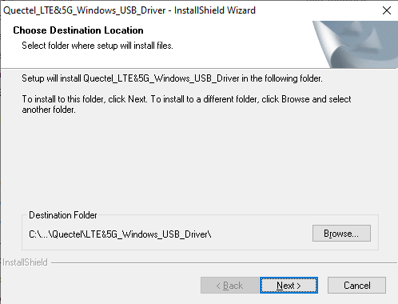

## **Revision History**

| **Version** | **Date**   | **Author** | **Description**          |
| ----------- | ---------- | ---------- | ------------------------ |
| 1.0         | 2022-03-03 | Kayden LI  | Creation of the document |

## Basic Overview

### Description

QuecPython EVB  is a communication  EVB equipped with various sensors or peripheral interfaces. This document introduces the usage and precautions for the EVB. 

The name principle of QuecPython EVB is telling as following:


QuecPython EVB is a series. This document starts off with QuecPython_EC2X_EVB_V1.0 to introduce. "X" in EC2X means a series of the module starting with 2, and "X" can be any numbers. QuecPython EVB is an EVB with portable characteristics. Through small in volume, It is equipped with abundant features, such as buttons, temperature and humidity sensor, SIM card holder, LCD interface, photo-resistor and MIC.

**Only by one USB Type-C data cable, the developers can get the comprehensive knowledge of EVB capabilities.**

### Resources of V1.0 EVB

- Quectel LTE Standard module
- NANO self-elastic SIM card holder
- GNSS, LTE, WIFI/BT/DIV antenna interface
- USB Type-C data interface
- Power, reset and force download buttons
- Four-leg and two-gear slide switch for customizing feature
- 5 watt mono audio-frequency amplifier
- Temperature and humidity sensor
- Monochromatic lights
- Electret MIC
- Speaker audio output
- Photo-resistor
- GPIO female header leading out
- LCD female header
- CAMERA interface
- SD card interface
- Power supply selection switch
- Keypad female header
- SD card, CAMERA feature selection  switch
- Other parts

### Things Can be Done on EVB

#### Little Test

Many interfaces and peripherals are included in EVB, which is convenient for developer to develop and debug. Meanwhile, multiple little tests are provided in the QuecPython official website.

For address, please click the link: [Advanced develpoment](/docsite/en-us/docs/Advanced_development/QuecPythonCloud/QuecCloud_adv.html)

#### Implement Product Prototype

Based on the peripheral such as various sensors, buttons and LCD screens that attached to the EVB, developers can make the product prototype in a rapid way. Here are a few examples of some product prototype that can be made based on the sensors on the EVB.

- **Anti-theft and Loss Implementation**

**Background**: It refers to unattended devices such as parcel locker, charging station or charging point, which is exposed to the risk of theft or damage. As a result, these devices should be fulfilled with the features of distance control, anti-theft, and abnormal state report.

**Implementation**: It is composed by Quectel communication module, accelerometers,  GPIO (matched with vibration sensor, micro switch, relay, and LED) and speaker.

**Method**: Connect the Quectel communication module to cloud and save the parameters issued by the cloud. By reading the parameters reported by sensor, you can judge the current state , whether the vibration state surpasses the threshold, LED twinkle and alarm. After that, report all above to cloud. 

- **Micro Weather Service Station**

**Background**: Establish the unattended micro weather service station in the field, which can report temperature and humidity, wind for recording, analyzing and forecasting over network periodically. 

**Implementation**: It is composed by Quectel communication module, temperature and humidity sensor, ADC (wind and battery voltage detection) and GPIO (battery charge and discharge state detection)

**Method**: Connect the Quectel communication module to cloud and save the parameter issued by the cloud. Then make the internal clock synchronous by NTP. After that, read the parameters reported by temperature and humidity sensor and ADC. Finally, make the data sequenced in accord with cloud and report it over network. Under the circumstance of bad network condition, save data offline and report the data to cloud in good network.

- **Micro Vending Machine**

**Background**: The minibar in hotel cannot meet the demand of customers, while the micro vending machine in guest-room can mend it. The micro vending machine can not only provide goods, such as snacks, chewing gun add charging wire, but also mobile charging.

**Implementation**: It is composed by Quectel communication module, GPIO (matched with stepping motor, relay/MOS tube), lignt intensity transmitter, LCD, G-Sensor and speaker.

**Method**: Connect the Quectel communication module to cloud, then register and authenticate it to receive data issued by cloud. Corresponding QR code will be displayed on LCD screen and users can scan the QR code to purchase goods with Wechat or Alipay. After paying, the cloud will issue command to module for controlling GPIO to fulfill shipment by revolving the stepping motor. Meanwhile, the light intensity transmitter will confirm whether the shipment is complete. Or it will charge the cellphone over controlling relay or MOS tube. Once all above is done, read corresponding information such as" the shipment is complete, looking forward your visit again" by TTS. If goods-pouring or violent damage is detected by G-sensor, it will report the information to cloud automatically for operations and maintenance.

- **Barcode Scanner**

**Background**: In daily use, it is available  to use scanner to enroll in barcode and QR code in packet. However, traditional scanner should rely on PC, meanwhile, it is also complicate to scan by cellphone with bad stability and high-power consumption attached. By wireless barcode scanner, remote scan, wireless scan and continuous scan can also be achievable.

**Implementation**: It is composed by Quectel communication module, SPI Camera, LCD and keypad.

**Method**: Connect the module to cloud after the module powers on and related information will display on LCD. Users should click the keyboard to confirm firstly. Then enable the camera to scan barcode or QR code (single or continuous scan is optional) until the module identifies the information of above. Finally, report the scanned information to cloud.

- **Intellectual Control**

**Background**: By issuing runnable parameter over cloud, the module can monitor device and controller automatically so as to save labor cost.

**Implementation**: It is composed by Quectel communication module, SPI Camera, SPI, I2C, LCD and GPIO (matched with buttons and relays).

**Method**: Connect the module to cloud after the module powers on for sake of obtaining runnable parameters and saving it. Then, related controlling contents and running state will be displayed on LCD. Once the value of sensor surpasses the threshold, it will execute related operations and report to cloud with saved parameters so as to realize auto controlling. (for example, when the humidity is over 80 %, the rely as well as dehumidifier should be opened).

- **Device Positioning**

**Background**: The shared bike is developing rapidly. However, it is inevitable that customers cannot find the accurate location of the bike due to the remoteness in which it parked. As a result, it does not only affect the consumption experience but also waste lots of resources. Furthermore, the real time can also not be confirmed.

**Implementation**: It is composed by Quectel communication module and L76K (GNSS module).

**Method**: The L76K is used to get location information and output NEMA sentence. Then the NEMA sentence can be read by the serial port of the module. After that, transfer the data to cloud (for example, Alibaba Cloud) to get real time sharing in the connected network.

## Introduction on EVB

The purpose of EVB is for the convenience of developer to use QuecPython. While as for the EVB based on Quectel communication module, it integrates with common configurations related to development, which will satisfy the demand of developer.

### V1.0 EVB

#### Front Interfaces of V1.0 EVB


#### Back Interfaces of V1.0 EVB


| Tips                                                         |
| ------------------------------------------------------------ |
| For more details about the silkscreen of EVB, please see the appendix, while about the EVB, please access https://python.quectel.com/download> or quecpython@Quectel.com |

#### V1.3 EVB Configuration

Multiple sensors and other peripherals are embedded in the EVB. See the table below for details.

| No.  | Name                                                | Type          | Interface type |
| ---- | --------------------------------------------------- | ------------- | -------------- |
| 1    | Temperature and humidity sensor                     | AHT20         | I2C            |
| 2    | Photo-resistor                                      | GT36528       | ADC            |
| 3    | Four-leg and two-gear slide switch                  | TM-2024A      | GPIO           |
| 4    | Microphone                                          | GMI6050P-66DB | MIC            |
| 5    | Audio power amplifier chip                          | NS4160        | SPK            |
| 6    | LED                                                 | Green         | PWM、GPIO      |
| 7    | LCD screen (Screen combo should be selected)        | ST7789        | LCD            |
| 8    | CAMERA interface (Camera combo should be purchased) | -             | CAMERA         |
| 9    | SD card slot                                        | -             | SPI            |
| 10   | KEYPAD interface                                    | -             | keypad         |

## Feature Description

| Notice: This part of the circuit schematic diagram may not be applicable to all versions. Please download the corresponding version schematic diagram on the official website or contact Quectel with the official mailbox quecpython@Quectel.com to get the it. For the specific features supported by the module, please see [API Description](https://python.quectel.com/wiki/#/en-us/api/). You can search by keyword in the upper left corner. |
| ------------------------------------------------------------ |

### LCD Interface

The EVB integrates an LCD interface and developers can do operations such as lighting the LCD screen and displaying pictures and words with the interface. More information can be displayed if it is matched with [LVGL](/docsite/en-us/docs/Advanced_development/Component/QuecPythonAdvance/lvgl_adv.html) (Click the link to get test of "[LCD](/docsite/en-us/docs/Advanced_development/Component/QuecPythonSub/LCD_adv.html)").

Currently, screens supported by QuecPython:

-   GC9305
-   HX8347
-   ST7789
-   ST7735
-   More screens are updating …
-   Official example code is based on ST7789 to write and test.


### Photo-resistor

The EVB is integrated photo-resistor with high sensitivity of  GT36528. Since the photo-resistor is extremely sensitive to light, when there is no light, it is in a high resistance state; while in light, the value can be reduced to 1 KΩ or below. Developers can collect the information of the luminance when using it.

Click the link to learn [Photo-resistor Test](/docsite/en-us/docs/Advanced_development/Component/QuecPythonSub/Photoresistor_adv.html)


### Temperature and Humidity Sensor

The EVB is integrated with AHT20 temperature and humidity sensor, which is featured with low power consumption, small volume, accuracy in counting. Developers can collect information such as temperature and humidity of environment with the sensor. For more information about it, please see [temperature and humidity sensor test.](/docsite/en-us/docs/Advanced_development/Component/QuecPythonSub/i2c_aht_adv.html)


### Audio Power Amplifier (Power Amplifier Chip)

The EVB is integrated with the audio power amplifier NS4160, which is a technology product with class AB/class D working mode switching feature, ultra-low EMI, no filter, 5 W mono audio power amplifier. Click the link for more information: [Audio Test](/docsite/en-us/docs/basic/QuecPythonPlatform/Audio_bas.html)


| Note                                                         |
| ------------------------------------------------------------ |
| The EVB needs to enable power amplifier chip. Please see the schematic diagram for pulling up pin.  This figure above is 1 pin of NS4160, which is connected to GPIO1 of EC200U module. |

### Customized Button

The EVB is integrated with four-leg and two-gear slide switch. Developers can customized the features.

Click the link to learn: [Button Input Test](/docsite/en-us/docs/Advanced_development/Component/QuecPythonBus/button_adv.html)


### Camera Interface

The EVB is integrated with a camera interface, which can be used to scan QR code and take photos. More features are developing. For camera development test, please see [Camera Test](/docsite/en-us/docs/Advanced_development/Component/QuecPythonSub/camera_adv.html)


## Preparation

### Power on EVB

After supply power to the EVB, flip the power supply selection switch to select the power supply mode. Then long press PWRKEY to power on (you can find the key location by the silkscreen of EVB).

Normally, NET indicator will flash after the EVB powers on.

### Install USB Driver 

It is necessary to install USB driver on PC before you use the EVB. Once installed successfully, the PC can identify the EVB. 

Download address for driver: <https://python.quectel.com/download>

As shown in the figure below: 


<font color='red'>  **Note**</font>

**1.QuecPython module driver is divided into two categories:**

**No.1. Based on the platform : RDA platform (EC200U. EC600U and EC600N), ASR platform (EC200A and EC600N) and Qualcomm platform (EC21, BG95 and BG77).**

**Many users may ask what the platform of EC2X is. Actually, the "X" in EC2X is an unknown, which may be EC200U, EC200A or EC21 instead of the actual platform.**

**No.2. Based on the PC system: Whether in Windows 7 or Windows 10, please download the corresponding driver. There is no other operating system driver applicable for QuecPython development.**

**Steps to install driver on RDA platform:**

- After downloading the driver zip package, developers can unzip  it to any directory and then double click to run **setup.bat**:


- Wait for the successful installation

**Steps to install driver on ASR platform**

- Select the corresponding driver (please see the note mentioned above for details). Also, please note that the driver versions between EC200A and EC600N are different.。

- After downloading the driver zip package, developers can unzip it to any directory and then double click to run **setup.exe**: 


- Click "**Next**" continuously according to the prompts in the interface wizard:


- After the installation completes, click "**Finish**":


- Installing USB driver on ASR platform is complete till now.

**Steps to install driver on Qualcomm platform**

- After downloading the driver zip package, developers can unzip it to any directory and then double click to run **setup.exe**, same as above.
- Click "**Next**" continuously according to the prompts in the interface wizard:



- After the installation completes, click "**Finish**":


| Tips                                                         |
| ------------------------------------------------------------ |
| (1) Please back up your vital files and save your working progress in fear of file loss caused by something unexpected before installation. |
| (2) There is no need to reboot the PC after the installation completes. |
| (3) If there is a need to repair or remove a program, you just need to run the driver installation program and select "**Repair**" or "**Remove**". |
| (4) If the installation is failed, please contact Quectel with quecpython@Quectel.com. |

### Verify the Driver Installation

When the driver installation completes, you can connect the EVB to PC over USB TypeA-TypeC data cable and power on the EVB. (See ***Chapter Power on EVB*** for details)

Open "**Device Manager**” on PC and enter it. Then unfold "**Ports(COM&LPT)**". There should be at least seven serial port devices for EC200U and EC600U modules. 

- **Quectel USB AT Port (COMx)**
- **Quectel USB AP Log Port (COMx)**
- **Quectel USB CP Log Port (COMx)**
- **Quectel USB Diag Port (COMx)**
- **Quectel USB MOS Port (COMx)**
- **Quectel Modem (COMx)**
- **Quectel USB Serial-1 Port (COMx)**

| Tips                                                         |
| ------------------------------------------------------------ |
| How to open "**Device Manager**" ? Please operate in the following order: "**This PC**"- "**Properties**"-"**Device Manager**". |
| It is normal for CDC Ethernet Control Model (ECM) to display an exclamation mark. |
| The driver installation verification on Qualcomm and ASR platform is to be supplemented. Mainly check whether there is a device or an exclamation mark in "**Ports(COM &LPT)**". |

If no series port is identified by PC, please check the items below:

- Whether the EVB is connected to PC (damage in data cable or socket, insufficient power supply)

- Whether the EVB is booted correctly

- Whether the USB driver is installed correctly USB

- Whether the motherboard driver is correctly installed to PC 

If this cannot be ruled out, please connect Quectel with quecpython@Quectel.com.

### Download Firmware

Note: The original firmware in the module may not the QuecPython firmware, so it is recommended to download QuecPython firmware first.

What is QuecPython firmware (hereinafter abbreviated as "FW") and why should you download it?  The FW is a binary program that contains resource like driver, BL, FS, and VM. A module without FW is just like the old saying: one cannot make bricks without straw. While after downloading that, the module can work. Generally, The FW to Quectel communication module is what operation system to PC. Similarly, the user script to QuecPython FW is what application to operation system. Only install the operation system to PC as well as various applications can the PC execute corresponding operations and commands.

<font color='red'>  **Notes**</font>

1. **How to get the QuecPython FW? Please download it from QuecPython official website <https://python.quectel.com/download>  **
2. **Different modules are varied in FW, so cross-downloading firmware is not supported. If there is a mistake, please correct it and download the corresponding FW. Otherwise the FW cannot work. Take EC200U as an example, it is divided into EC200UCNAA, EC200UEUAB and EC200UCNLB, which do not support cross-downloading among these modules.**
3. **About FW, owing to the FW zip file downloaded from the official website contains FW package and change log, the FW file needs to be unzip one layer before you obtain the downloaded FW package. The suffix of the module FW package of ASR platform is .bin, and .pac serves as the suffix in both EC200U and EC600U.**
4. **Before you download FW, it is recommended to confirm the FW version first so as to avoid degrading or downloading the wrong version. After the FW is downloaded, all contents in user area will be empty (currently, some FW versions support retaining important parameters. see [Securedata - secure data area](https://python.quectel.com/wiki/#/en-us/api/QuecPythonClasslib?id=securedata-secure-data-area) for details).**

Steps to download FW with QPYcom

1. After downloading QPYcom, you can unzip it to any directory and double click **QPYcom.exe** to run.

2. Connect the EVB to PC and power on the EVB.

3. Click "**Download**" to enter downloading page.

4. Create project name in the left navigation bar and click "**Choose FW**".

5. Left click the inverted triangle in the bottom-right corner and select "**Download FW**" in the pop-up menu . Then click "**Download FW** ", the tool will get down to downloading FW automatically.

| Tips                                                         |
| ------------------------------------------------------------ |
| When downloading FW, **you do not need to select serial port** since the tool will select serial port automatically and download it. Please do not exit tool or plug out the serial port, which may cause the module to become bricked.
| Never plug in two or more EVBs at the same time so as to avoid the unidentified situation, even worse, results in the error in downloading. |


After the download completes, you can send AT commands with the methods in next chapter or test whether the FW download is correct over "**REPL**" page.

### Verify Firmware Version

Open the corresponding serial port in "Quectel USB AT Port" over QCOM_V1.6 (Following conditions should be set beforehand: baud rate 115200, 1 stop bit, no parity check, 8 bytes-size and no HW flow control). Tick "**Send With Enter**" and send "**AT+GMR**" to check the return value of the module, that is, the current FW version.


If the return value is the QuecPython FW version, the query result usually contains Quecpython related characters such as **PY** or **QPY**.

It is also available to verify whether the current FW version is the QuecPython FW over QPYcom, which is an official graphical tool.

Download address of QPYcom: <https://python.quectel.com/download>

The specific download location is shown in the figure below:


Steps to check FW version with QPYcom:

| Module | Interactive Serial Port   |
| ------ | ------------------------- |
| EC200U | Quectel USB Serial-1 Port |

1. After downloading QPYcom, unzip it to any directory and double click **QPYcom.exe** to run.

2. Connect the EVB to PC and power on.

3. Select serial port of code interaction and open it after setting the default baud rate as 115200.

5. Type the following command and press "**Enter**" to check the return value of the module.

*import uos*

*uos.uname()*


As shown in the figure above, if the module returns value normally, the QuecPython FW is running.

If issues such as no code interactive serial port, failure to type command or no return value, then it is not the QuecPython FW that is running in the module, and you need to download QuecPython FW.

### Download `helloworld.py` Program to EVB

You can download the Python script file to module with QPYcom.

*`helloworld.py`* code (<a href="/docsite/docs/en-us/Started_Guide/Selection_Guide/EC2X_EVB/code/helloworld.py" target="_blank">Download code</a>):

```python
import utime
while True:
    print("hello world")
    utime.sleep(1)
```

Specific steps:

1. After downloading QPYcom, unzip it to any directory and double click **QPYcom.exe** to run.

2. Connect the EVB to PC and power on.

3. Select code interactive serial port and open it after setting the default baud rate as 115200.

4. Click "**File**" to enter file page (the left side is the files of local PC and the right is the files of module).

5. Scan over the files of PC on the left and select the corresponding *.py* file. Then drug the file to "Root" node or "*usr*" directory on the right, the file will be download to the module as long as you release the left key of the mouse. (Click "**+**" button on the right column, browse and select the file, and download the file to the module)

6. During the process of downloading file, the status column at the bottom of the page shows the download progress.  When the progress bar reaches 100%, the file download is successful.

   As for the new dual file system, please download it to "*usr*" directory:


As shown in the figure above, *`helloworld.py`* has been downloaded to the main directory of the module, you can check over "interactive" page in QPYcom.

Steps to check in new dual file system:


| Tips                                                         |
| ------------------------------------------------------------ |
| The new FW uses the dual file system, so the root directory / is readable but not writable. |
| As for backup partition,  /bak is neither readable nor writable. |
| As for user partition,  /usr is readable and writable.       |
| In terms of all file I/O operation of users, should be done in /usr. |

### Run hello `world.py` Program

Two ways to run Python script in the module:

- Run manually


1. After downloading QPYcom, unzip it to any directory and double click **QPYcom.exe** to run.

2. Connect the EVB to PC and power on.

3. Select code interactive serial port and open it after setting the default baud rate as 115200.

4. Click "**File**" to enter file page (the left side is the files of local PC and the right is the files of module).

5. Scan over the file in the module on th right and select the *.py* file that need to be ran. Click "**Triangle**" button, QPYcom will jump over to "**REPL**" page and run the script file.

    

6. You can also import the example module and run the Python script using the exec method.

```python
 import example  
 example.exec('usr/helloworld.py')
```

The running result is shown in the figure below:


- Run automatically after power on

In QuecPython, it supports executing user codes automatically after power on. After the module boots an runs,  QuecPython will check the program file named *`main.py`* in user partition and execute it automatically. Therefore, if you want to run your own codes after the module powers on, you need to name the program as *`main.py`*  and download it to the module together with its dependent files.

| Tips                                                         |
| ------------------------------------------------------------ |
| The file name shall be *`main.py`* (Cases should be coincide completely) and it should be placed in the user partition to run automatically after boot. If *`main.py`* calls other *py* and *mpy* files, which should be downloaded into user partition. |

Take *`helloworld.py`*  as an example. Define a method for *`helloworld.py`* file: Print " hello world! " string with a period of 1 s. The method in *`helloworld.py`* is called in the *`main.py`* file.

```python
#helloworld.py code
import utime
def prtHelloworld():
    while True:
        print("hello world")
        utime.sleep(1)
```

```python
# main.py：
# Call helloworld.py file
import helloworld
# Call rtHelloworld() in helloworld.py file
helloworld.prtHelloworld()
```

<font color='red'>  **Tips**</font>

(1) In terms of the file name should be imported, it is recommended to use pure English instead of name which contains special character such as blank.

(2) For the *py* file in dual-file system, two methods are acceptable to import:

Method 1: 

		from usr import helloworld	# helloworld means py file name

		helloworld.prtHelloworld() 	# Call *prtHelloworld()* in helloworld

Method 2: 

		import usr.helloworld 	# It means the *`helloworld.py`* file under usr directory

		usr.helloworld.prtHelloworld() 	# Note: In this method, *usr* should be prefixed.

(3) Integrating above two methods, which can be extended: 

		from usr.helloworld import *	# Reference all methods in *helloworld* file

		prtHelloworld() 	# This import * has been done, as a result, call the function name directory.

Download two files mentioned above to the module (<a href="/docsite/docs/en-us/Started_Guide/Selection_Guide/EC2X_EVB/code/test_code.7z" target="_blank">Download codes</a>).


After the file is download successfully, QPYcom at the time of this document release and subsequent tools will automatically restart the virtual machine. The code will run and output the running results after *`main.py`* is downloaded. If it cannot run automatically, you can press "**RESET**" on the EVB to reboot the module, and then reconnect the interactive serial port and enter the **REPL** interface to see the automatic running result.


| Tips                                                         |
| ------------------------------------------------------------ |
| If the automatic running is a failure, please check whether the errors on grammar or calling exist in *py* file. |

| Note                                                         |
| ------------------------------------------------------------ |
| You can press **Ctrl+C** to stop automatic running or looping output scripts. If the module goes into [Interactive protect ](https://python.quectel.com/wiki/#/en-us/api/QuecPythonThirdlib?id=system-set-system), the script cannot be terminated. At this time, there is only one way to stop running : reload the FW. |

### FAQs

**Q: Where is the FW of module?**

A: Please login in QuecPython official website to download: <http://python.quectel.com/download>

**Q: How to find the EVB and other materials commonly used?**

A: Please login in QuecPython official website to download: <http://python.quectel.com/download>

**Q" Where can you get the EVB?**

A: `Amazon.com` (Please stay tuned)

P.S. If you encounter any problems, please see the online documents on official website or get access to [QuecPython Forums](https://forums.quectel.com/c/quecpython/66) or contact Quectel with quecpython@Quectel.com

## Appendix 1 Silkscreen Diagram of EVB V1.0


