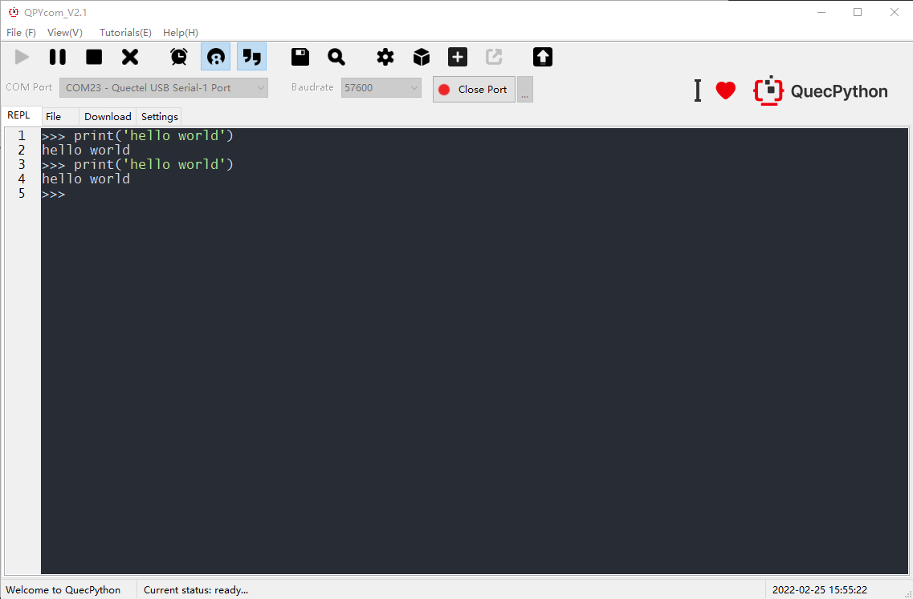
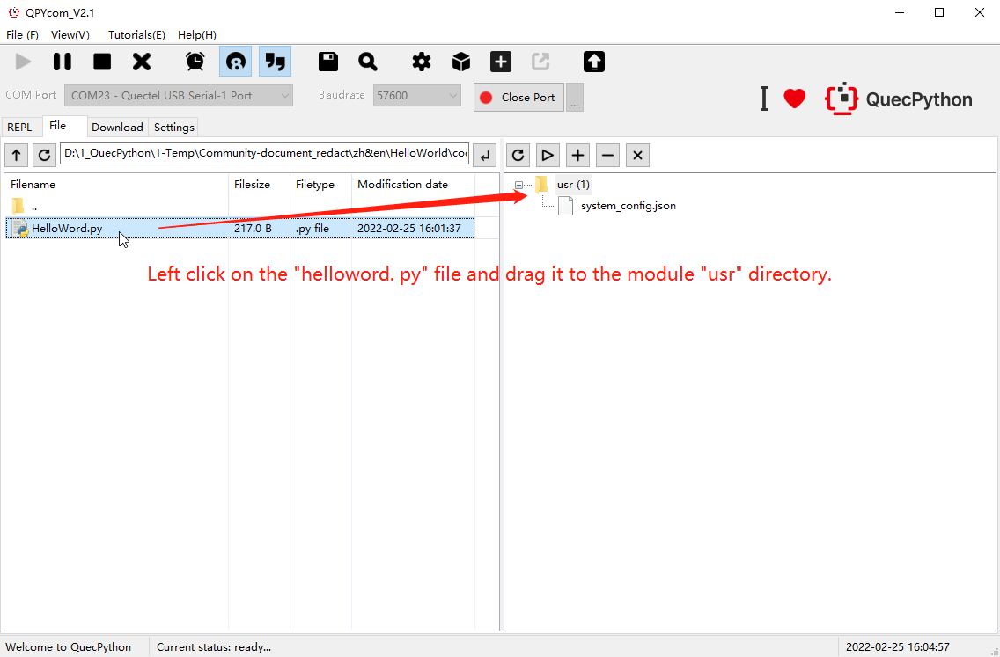
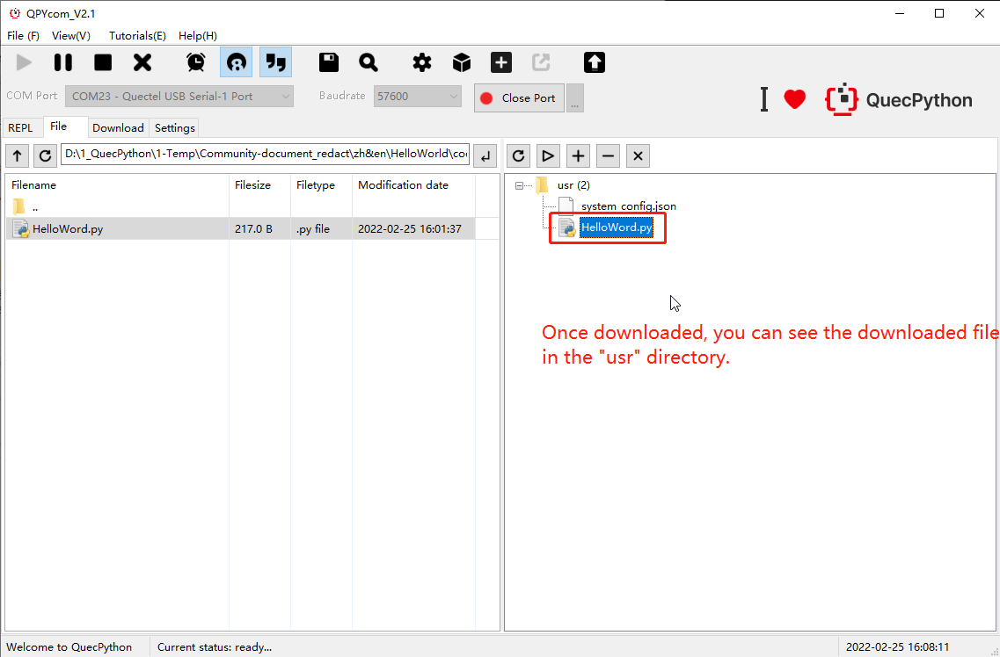
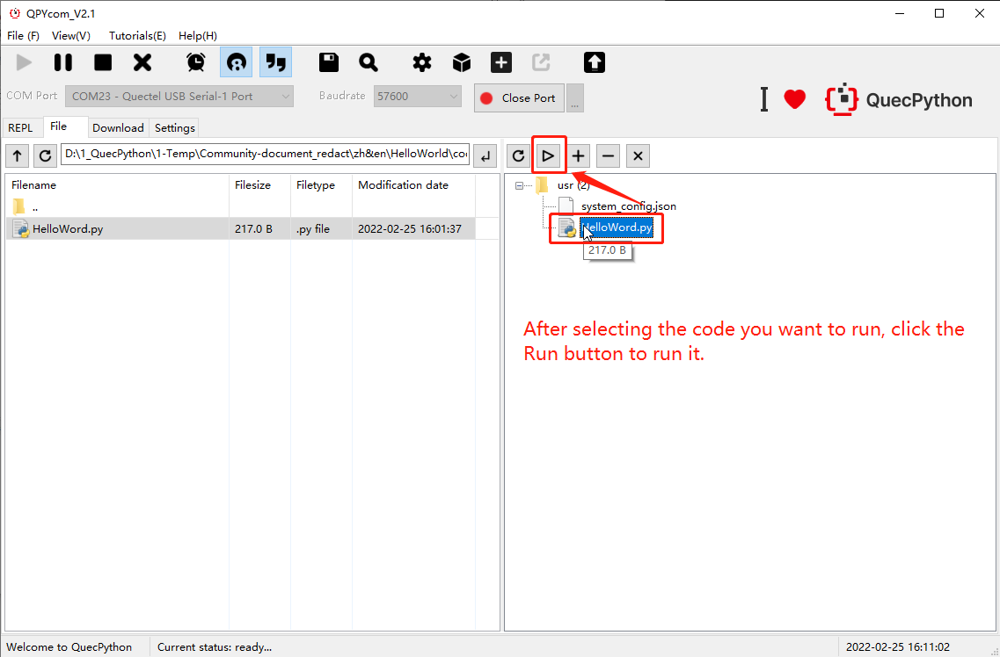
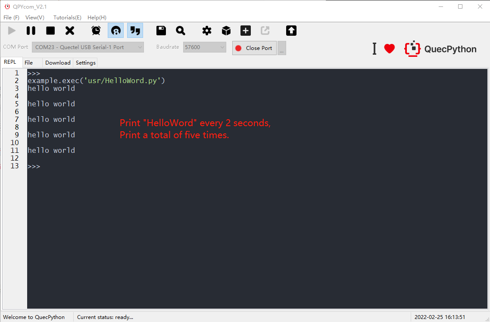

## Revision History

| Version | Date       | Author  | Description              |
| ------- | ---------- | ------- | ------------------------ |
| 1.0     | 2022-03-03 | Grey.TU | Creation of the document |

## Introduction

After the quick start of QuecPython, this document introduces how to print "Hello World" with QuecPython.

## Print "Hello World"

Connect the EVB to PC. It is necessary to install driver and download module firmware. See ***Chapter Development Environment Building*** and ***Development Process*** for the operation methods. 

### Print in Interactive Interface

As shown in the figure below,  the port is connected to the "Interactive Port of QuecPython" with QPYcom. Then select Interactive interface. After that, following printing is carried out.

```python
>>> print('hello world')
hello world
>>> print("hello world")
hello world
```



### Compile `helloworld.py` file and Print

1. Create *`helloworld.py`* file and the compilation script is described below:

```python
import utime    # Importing a Timing Module
print_num = 5   # Define the number of prints
while print_num:
    print("hello world")
    print_num -= 1   # Decrement
    utime.sleep(2)   # Delay in 2 seconds
```

2. Download the code to module.

   

   

3. Select the file and run it.

   

4. Running result.

   

## Matching Code

<!-- * [Download code](code/HelloWord.py)-->
<a href="/docsite/docs/en-us/Started_Guide/Simple_Application/HelloWorld/code/HelloWord.py" target="_blank">Download code</a> 

