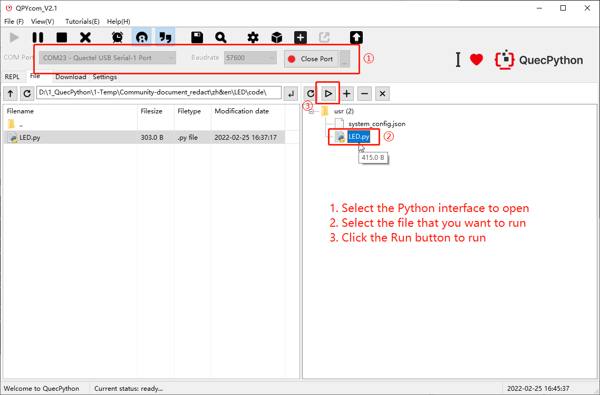
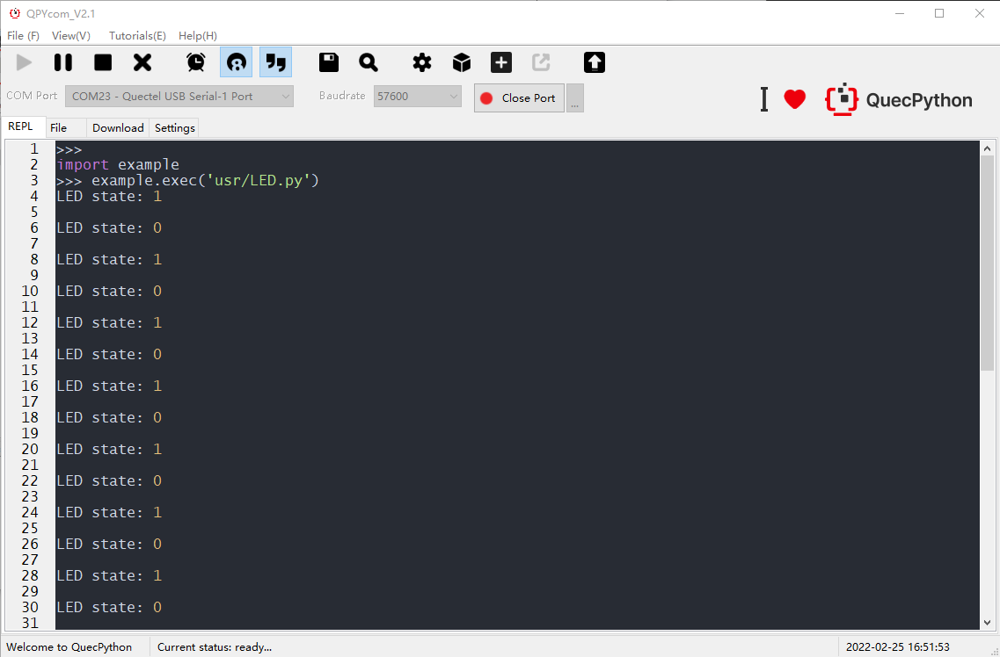

## Revision History

| Version | Date       | Author  | Description              |
| ------- | ---------- | ------- | ------------------------ |
| 1.0     | 2022-03-03 | Grey.TU | Creation of the document |

## Introduction

After the quick start of  QuecPython, this document introduces how to light an LED.


## Light an LED

### Hardware Connection

1. Prepare one LED and two Dupont lines

2. Connect the ground end (flag end) of the LED to GND with Dupont line

3. Connect the other end of the LED to GPIO with Dupont line

Here is an example:


### Software Code

```python
import utime  # import utime module
from machine import Pin  # import Pin module

gpio_x = Pin(Pin.GPIO4, Pin.OUT, Pin.PULL_PU, 0)  # GPIO is configured in output mode with 0 output by default

count = 30
state = 1
while count:
    gpio_x.write(state)
    print('LED state: {}'.format(state))
    if state == 1:
        state = 0
    else:
        state = 1
    utime.sleep_ms(500)
    count -= 1
```

### Running Result





## Matching Code

<!-- * [Download code](code/LED.py)-->
<a href="/docsite/docs/en-us/Started_Guide/Simple_Application/LED/code/LED.py" target="_blank">Download code</a> 