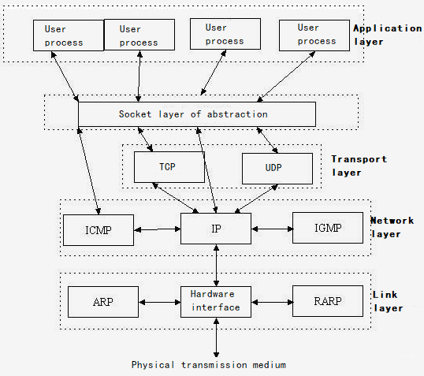
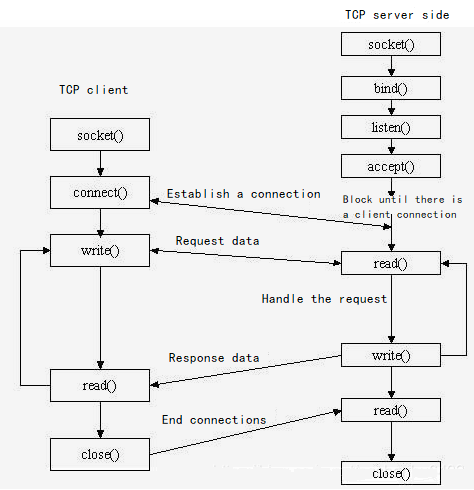

## Revision History

| Version | Date       | Author  | Description              |
| ------- | ---------- | ------- | ------------------------ |
| 1.0     | 2022-03-03 | Grey.TU | Creation of the document |

## Introduction

This document introduces the basic operations of QuecPython_usocket, which support all QuecPython development modules.

usocket module provides access to BSD socket interface. usocket is a subset of the corresponding CPython module that QuecPython implements for socket. For more information, please see CPython documentation: [socket](https://docs.python.org/3.5/library/socket.html#module-socket)

## About Socket

Socket is a cornerstone and a handle of the communication chain, which is used to realize communication between different virtual machines or different hosts.  The host on the Internet runs multiple service software and provides several services at the same time. Each service opens a socket and binds to a port. And different ports correspond to different services. Socket is just like a porous socket as its original meaning. A host is like a room full of various sockets, and each socket has a number. Some sockets provide 220 volts, some provide 110 volts and some provide cable TV programs. User software plugs the plug to different numbered sockets to get different services. A socket, an endpoint of communication process on the network, provides a mechanism for application layer process to exchange data using network protocol. As for a interface, it is not only used by application process to communicate over network protocol, but also the interaction between program and network protocol root. 

Socket is one endpoint of two-way communication link between two programs running on the network, which is a logic concept.  It plays not only role of the API (application program interface) of the inter-process communication on network environment , but also the communication endpoint used to name and find address. During the process, each socket in use will be belonged to one type and connected to one process. At communication, one of the network application programs needs to write the information to be transmitted into socket. However, the socket will send the information to the socket of another host over the transmission medium that connecting to NIC so as to make sure the receiver can get it. Socket, combined by IP address and port, is a mechanism that transmitting data package to the application layer process.

Socket is an abstract layer between the application layer and the transport layer and it is a set of interfaces. In design mode, socket serves as a door and hides the complex TCP/IP protocol family. For users, socket  can undertake the role to organize data for sake of complying with assigned protocol.



Socket is originated from Unix. Under the idea that everything is a file in UNIX, socket is an implementation of "open read / write close" mode. The server and client maintain a "file" respectively. After the connection is established and opened, they can write contents to their own files for the other party to read or read each other's contents, and close the file at the end of communication. 



## usocket Feature Realization

Socket can make an application read data from network or write data to network. Two applications on different hosts can send and receive byte stream after connection. Please note that you need to know IP and port of each other when sending messages. In daily life, there are many application scenarios realized by socket, such as how the browser process communicates with the Web server process when you browser the Web, or how the process communicates with server or the process that your friends are in when you chat online.

### API Description

For more details about API, please click the link: [usocket - socket module](https://python.quectel.com/wiki/#/en-us/api/pythonStdlib?id=usocket-socket模块)

### Environment Building

Before testing the features, please be familiarize with the basic operations of QuecPython first. See ***Chapter Development Environment Building*** and ***Development Process*** for the operation methods. This chapter takes how to create a TCP client connecting to server on QuecPython as an example to introduce socket features. 

Since the module is connected to server as a TCP client, it is necessary to provide a server to connect to before the connection. Here this document introduces socket features of the module. 

### Operating Steps

#### ①. Import usocket and create a socket

```python
import usocket
socket = usocket.socket(usocket.AF_INET, usocket.SOCK_STREAM)
```

#### ②. DNS

When modifying a domain name or port, you only need to replace the domain name or port to be linked with `'122.114.122.174', 34187` in the following code.

```python
socketinfo = socket.getaddrinfo('122.114.122.174', 34187)[0][-1]
```

#### ③. Create the connection to server

```python
socket.connect(socketinfo)
```

After the API above is executed, you can see that the module is online on the server. Then you can start data interaction.

#### ④. Module uploading data

```python
>>> ret=socket.send('1234567890\r\n')
>>> print('send %d bytes' % ret)
send 12 bytes
```

After the module uploads data, you can see the data on the server. And after the function is executed, the number of bytes sent returns.

#### ⑤. Server sending data

After server sends data, the module can read the data. The read command and return value are described as below:

```python
>>> data=socket.recv(1024)
>>> print('recv %s bytes:' % len(data))
recv 10 bytes:
>>> print(data.decode())
0123456789
```

Note: *socket.recv()* is blocked by default. It is recommended that create a separate thread in the actual code to receive socket data.

Also, you can set *socket.setblocking()* and *socket.settimeout()* to be unblocked. But it is error-prone and wasteful. The former is recommended.

See the matched code for details.

#### ⑥. Close a socket

```python
socket.close()
```

After the function above is executed, the device on server is offline. At this point, the operation that the module is connected to server as a TCP client is completed.  

## Matching Code

<!-- * [Download code](code/socket.py)-->
<a href="/docsite/docs/en-us/Started_Guide/Simple_Application/socket/code/socket.py" target="_blank">Download code</a> 