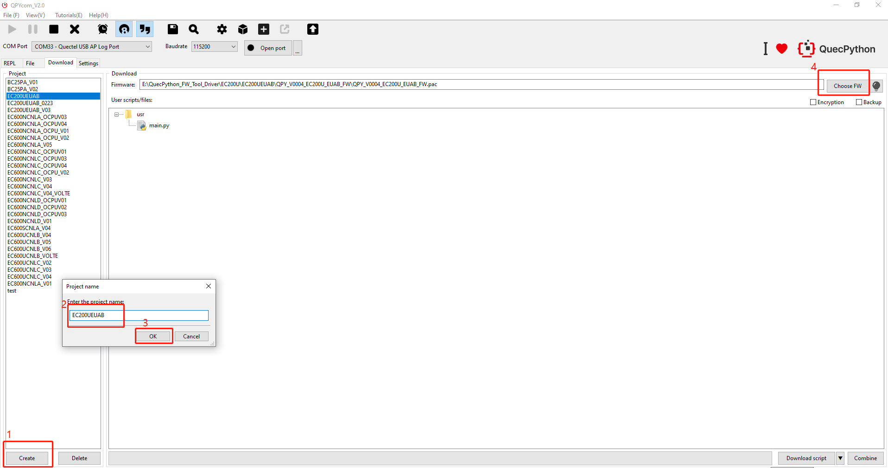
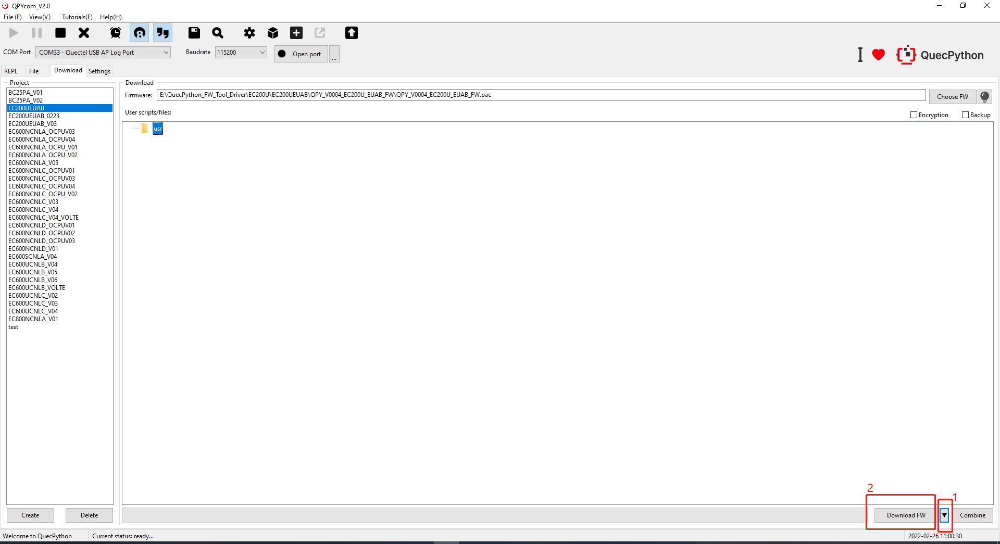
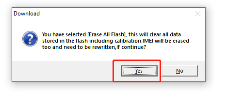
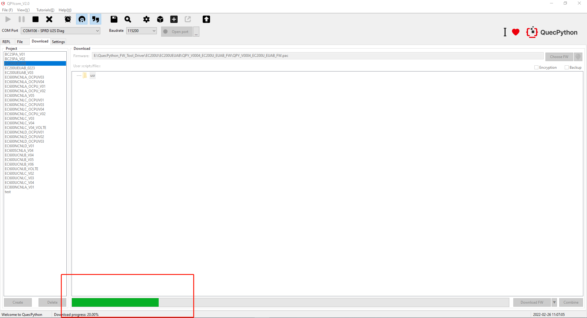
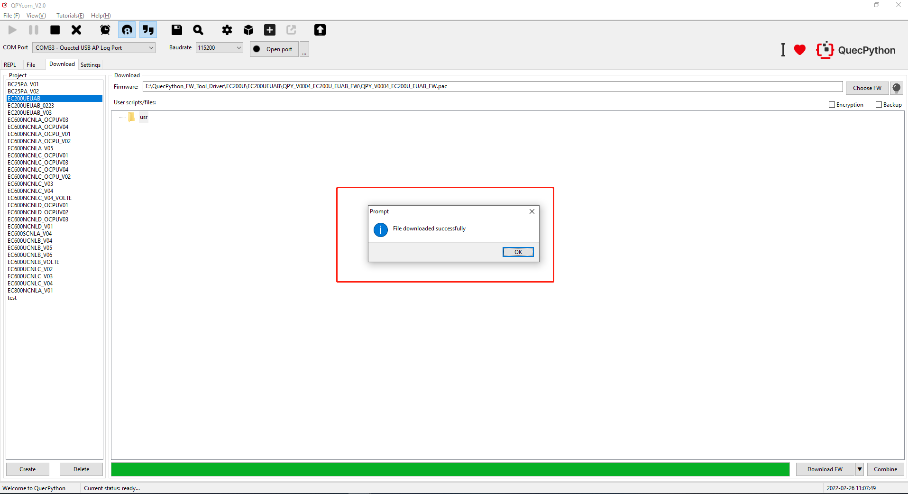

## Download Firmware

1. Go for QPYcom package in provided tools, unzip and double click to run it.

2. Create program name and click "**Choose FW**" to select the firmware upgrade package. As for the firmware package with QuecPython version, you can download it from [QuecPython Download Center](https://python.quectel.com/download ). For EC200UEUAB module, you need to select *pac* type firmware.

3. Left click the inverted triangle, select "**Download FW**" and click it to download the firmware subsequently.

4. Select "**Yes**" in the download pop-up window.

5. Then, the progress bar below the tool will display the current progress. The firmware download is not complete until the progress bar reaches 100% and a prompt for successful download appears.

