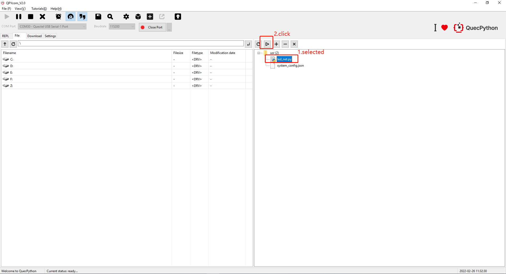
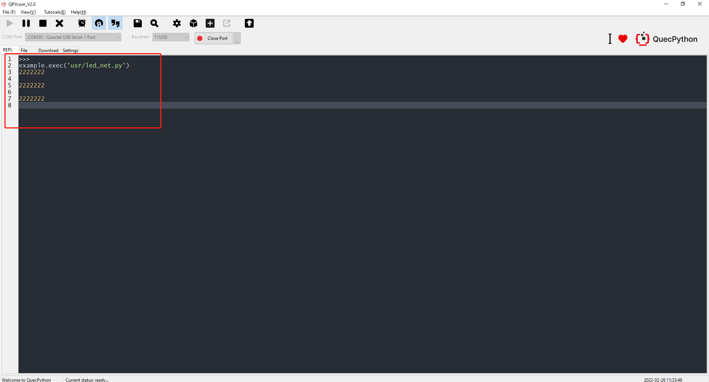

## Run Script

1. Select the script that need to be ran. Then click "**Run**" icon as shown in the figure below to run the script.

2. After the script runs, the system will automatically jump over to the interactive interface and you can print the related information in the script.

