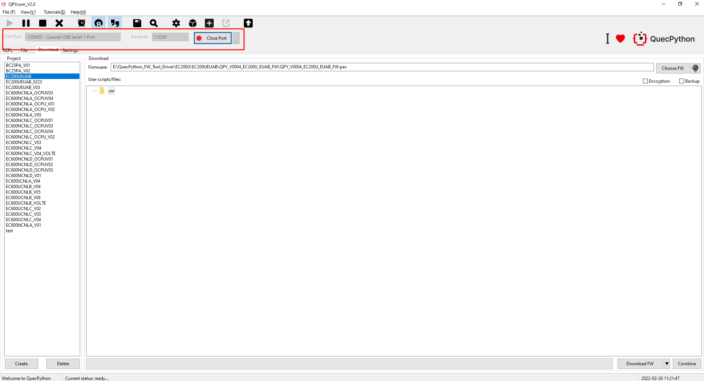
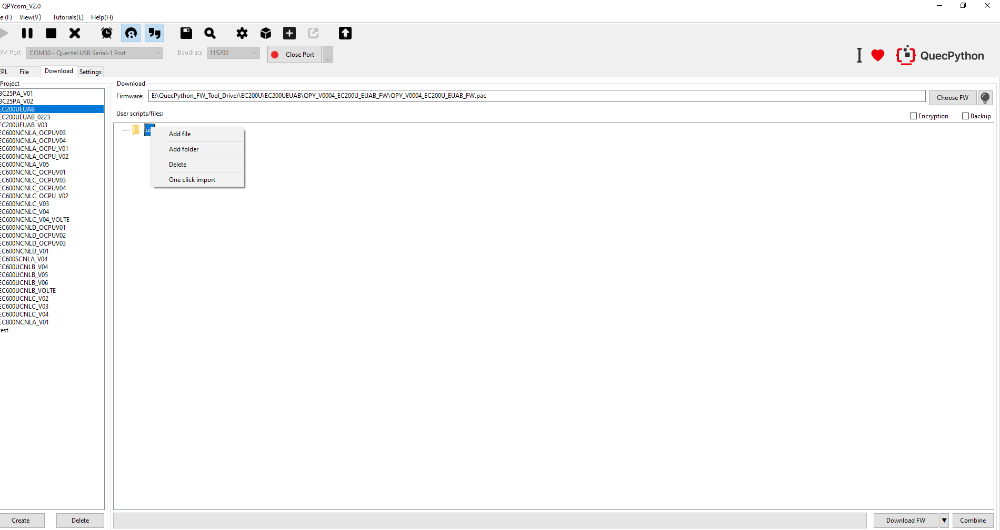
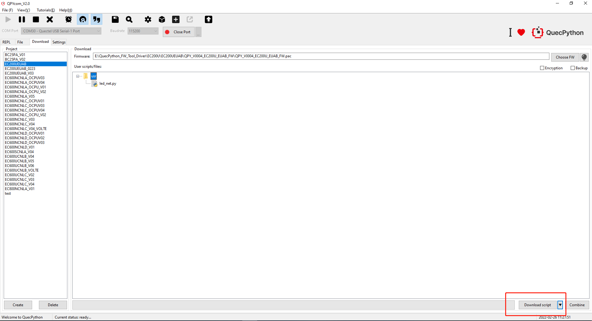
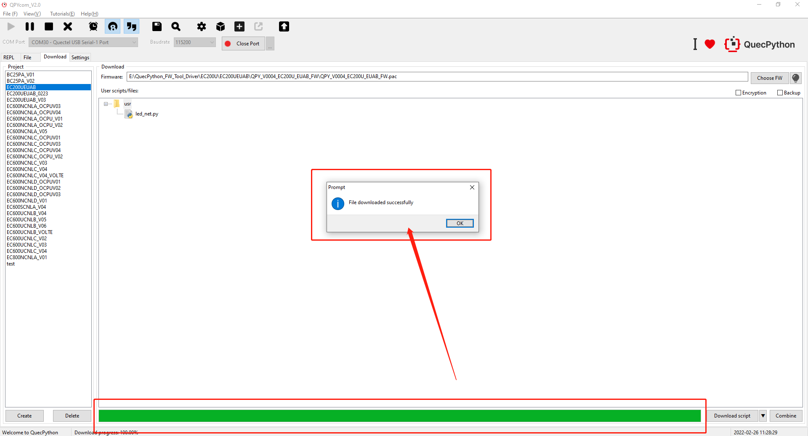

## Download Script 

1. Go for QPYcom package in provided tool, unzip and double click to run it. Then connect it to QuecPython interactive port. (For EC200UEUAB module, Quectel USB Serial-1 Port is the QuecPython interactive port)

2. After creating the project name, right click the *usr* location in the figure below, and select the script you need to download according to the prompt.

3. Left click the inverted triangle, select "**Download script**" and click it to download the script.

4. The script download is not complete until the download progress bar reaches 100% and a prompt for successful download appears. 

