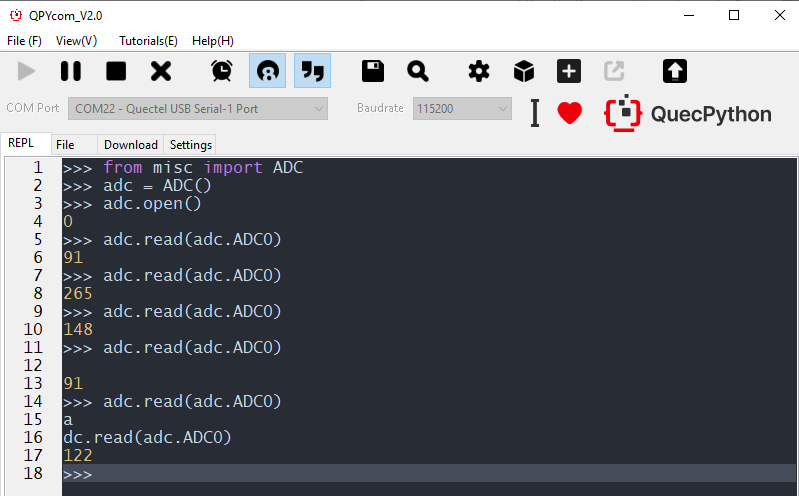
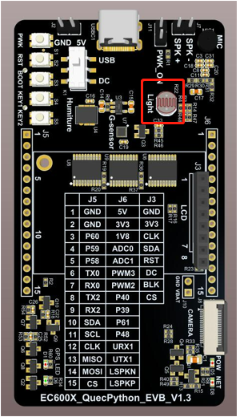
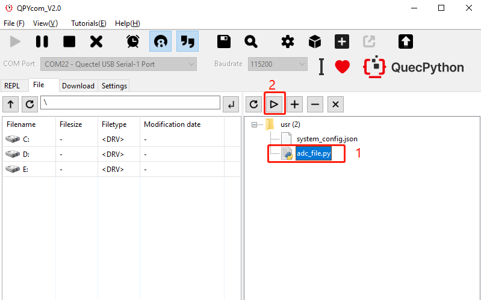
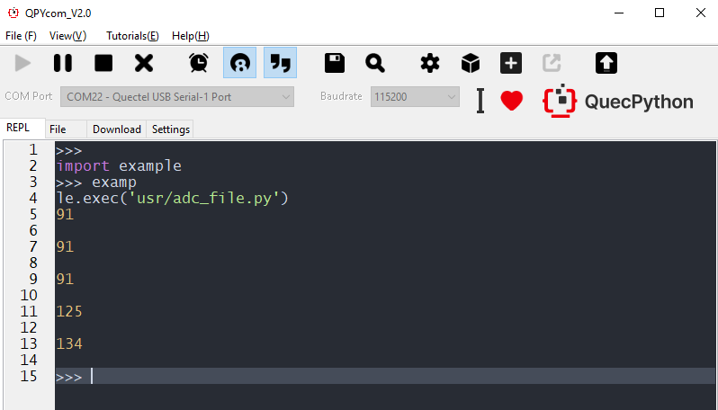
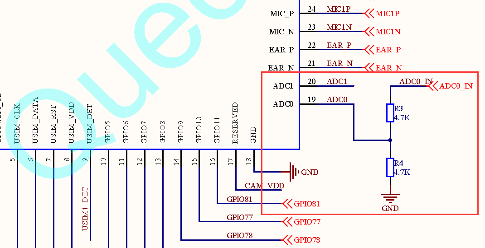

## Revision History

| Version | Date       | Author | Description                                                  |
| ------- | ---------- | ------ | ------------------------------------------------------------ |
| 1.0     | 2021-09-10 | Kayden | Added revision history, referential links. Meanwhile, changed screen-shots and locations for code downloading. |

## Application notes on ADC sampling development of QuecPython

In this document, it mainly illustrates based on EC600S_QuecPython_EVB. As for other EVBs, it is the same. 

In this chapter, it is recommended to integrate with photo-transistor test: [Phototransistor test](/docsite/en-us/docs/Advanced_development/Component/QuecPythonSub/Photoresistor_adv.html)

## Interaction operation

The interaction with module can be carried out via QPYcom. The following case is based on ADC0. 



**Note**

1.  The command line "from misc import ADC" means making the ADC module visible in current space. 
2.  Only executing command "from misc import ADC" can the function and variate in ADC be used. 
3.  The above operation is conducted under the circumstance of connecting ADC0 to photo-transistor. While as for ADC1, there is a need to connect peripheral to carry out relevant operations. 

## Download and verify

### SW codes

Download **.py** file into module and run. Here shows codes:  <a href="/docsite/docs/en-us/basic/BSP/code/adc_file.py" target="_blank">Click to download code</a>

```python
from misc import ADC  # Import ADC module
import utime  # Import timing module
read_time = 5 # Set read count
adc = ADC() 
while read_time:  
	adc.open()  
	read_data = adc.read(ADC.ADC0)  
	print(read_data)  
	adc.close()  
	read_time -= 1  
	utime.sleep(1)  # Postpone 1S
```

### HW connection

Extra HW connection is not necessary. The ADC0 port on EC600S has been connected to photo-transistor externally. In this document, the downloading and verification is realized with the assist of photo-transistor.

(If the ADC on some types of EC600N module is not available, please check the HW support via specific type. The available ADC module can download routine to run directly.)



### Result

1. Run *adc_file.py* in QPYcom. (At the same time, please make sure the sunlight received by photo-transistor is varied). Please check the following figure: 

   

2. Query outputted result in QPYcom interaction surface. (The value varies)



## HW Description 

For detailed ADC, please refer to [ADC-related API](https://python.quectel.com/wiki/#/en-us/api/QuecPythonClasslib?id=adc)

As for the HW schematic diagram of ADC, please check the HW design specification and EVB schematic diagram. 



The corresponding relationship is shown as following tablet: 

| Pin No. on module | Illustration  |
| ----------------- | ------------- |
| 19                | ADC channel 0 |
| 20                | ADC channel 1 |

## SW design

### Constant illustration

| Constant | Illustration  |
| -------- | ------------- |
| ADC.ADC0 | ADC channel 0 |
| ADC.ADC1 | ADC channel 1 |

### Establish ADC object

adc = ADC(): There is neither parameter nor returned value.

### Initialize ADC function

adc.open(), No parameter. 

Returned value: If success, it returns integer 0; otherwise, it returns integer -1. 

### Read voltage value

adc.read(ADCn): Read the voltage value of specific channel, the unit is mV. 

| Parameter | Parameter type | Parameter explanation                                        |
| --------- | -------------- | ------------------------------------------------------------ |
| ADCn      | int            | ADC channel. Note: The ADC0 and ADC1 are supported by EC600S platform, whose corresponding pins are ADC0-pin 19 and ADC1- pin 20 |

### Shutdown ADC

adc.close(), No parameter

Returned value: If success, it returns integer 0; otherwise, it returns integer -1. 

