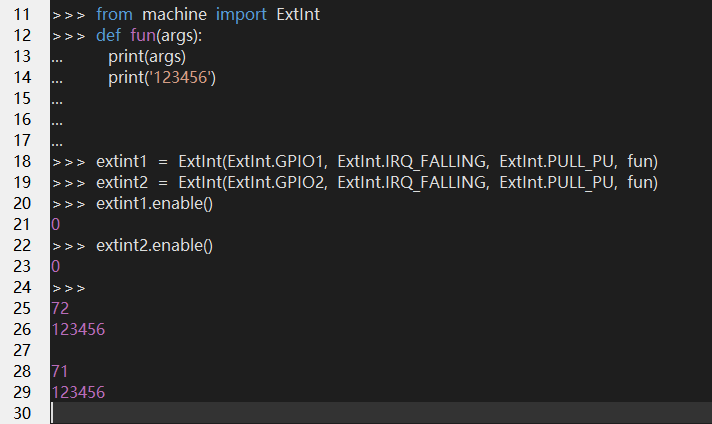
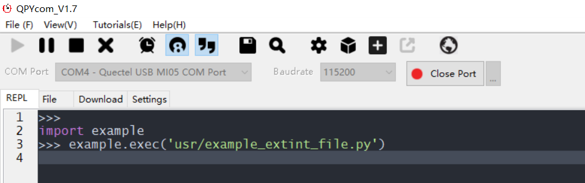
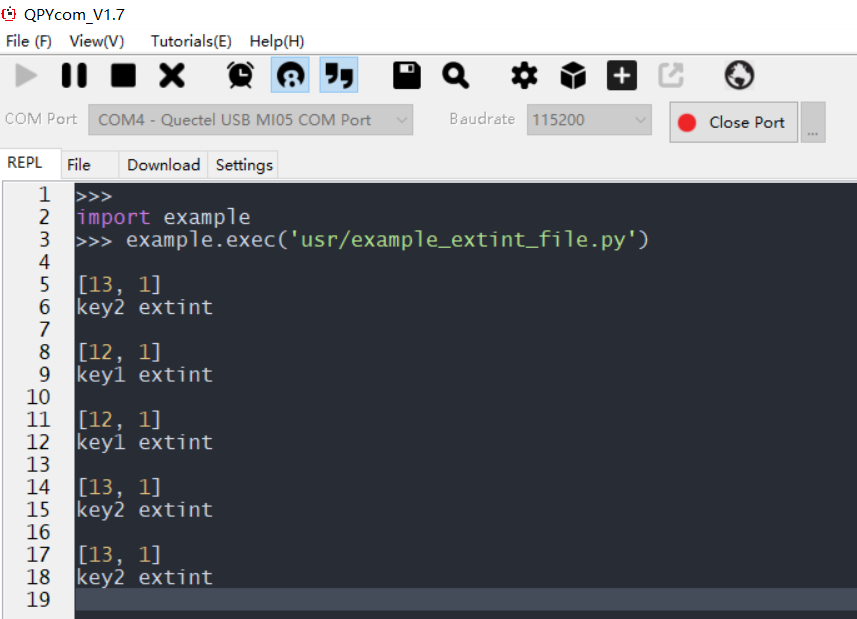

## Revision history

| Version | Date       | Author     | Change expression |
| ------- | ---------- | ---------- | ----------------- |
| 1.0     | 2021-09-06 | David.Tang | Initial version   |

## PIN

In this document, it mainly introduces how to use QuecPytho_GPIO based on EC600X modules (such as EC600S, EC600N and EC600U). As is known to all, the GPIO is commonly used in connecting driver of LED, buzzer and relay. Similarly, it can be used to read KEY, switch status, pin level status of peripheral IC. Finally, you can learn about all setting parameters and application notes of GPIO. 

###  HW design

As for the GPIO supported by QuecPython, it has been listed on the wiki of the official website, please check the specific location: [PIN_API library](https://python.quectel.com/wiki/#/en-us/api/QuecPythonClasslib?id=pin)

###  SW design

Similarly, as for the SW design,  it has been listed on the wiki of the official website, please check the specific location: [PIN_API library](https://python.quectel.com/wiki/#/en-us/api/QuecPythonClasslib?id=pin)

### Interaction operation

It is available to interact with module via QPYcom, please check the case as described below: 


**Note:** 

1. The reason to execute command ”from machine import pin'' is to make the pin module invisible in current space.

2. Only execute "from machine import pin" command in module can the function and variate in pin be used. 

3. Please do remember above operations have on connection with any peripheral, it just serves as reference to get familiar with commands. 

### Download and verify

Owing to the simple manipulation of GPIO, you can test it by yourself via connecting a triode externally. 

## ExtInt

After acquiring GPIO, let's move to external interrupt. In most cases, the common GPIO can be used to query the level status of pin in any time; however, it can't detect the level change in-time. Therefore, the external interrupt is deployed to solve this issue. If triggering external interrupt on positive edge is set, which will be occurred when the level upgrades from low level to high level instantly, as a result, the callback function will be executed when level changes. 

### HW design

Similar with above

### SW design

As for SW design, please refer to the wiki on the official website. Here shows the link: [ExtInt_API Library](https://python.quectel.com/wiki/#/en-us/api/QuecPythonClasslib?id=extint)

### Interaction operation

It is accessible to interact with module via QPYcom, please view the following case: 



Note

The args in callback function is the line number of internal GPIO returned after the pin is interrupted. However, it should be set even if it won't be used at all. 

### Download and verify

Module: EC600N_QuecPython EVB

KEY to trigger: KEY1 and KEY2

#### SW code

As for the referential codes of matched demo, it is the *example_extint_file.py* file in the same directory as the document. Download it to module and run. 

```python
from machine import ExtInt 
import utime    
def fun1(args):  
	print(args)  
	print("key1 extint")   
def fun2(args):  
	print(args)  
	print("key2 extint")   
extint1 = ExtInt(ExtInt.GPIO12, ExtInt.IRQ_FALLING, ExtInt.PULL_PU, fun1) 
extint2 = ExtInt(ExtInt.GPIO13, ExtInt.IRQ_FALLING, ExtInt.PULL_PU, fun2) 
extint1.enable()
extint2.enable()
while True:  
	utime.sleep_ms(200)  
```

#### HW connection

As for the QuecPython EVB, the external HW connection is not necessary, do normal power supply to EVB is available. 

#### Result

Run *example_extint_file.py* in QPYcom till the following surface appears.



The corresponding callback will be triggered to print if click random key. 




<!-- * [Download codes](code/example_extint_file.py)  -->

 <a href="/docsite/docs/en-us/basic/BSP/code/example_extint_file.py" target="_blank">Download codes</a>

## Terms explanation

Low level： It is represented by 0；

High level: It is represented by 1；

Rising edge: the edge for low level to high level；

Falling edge: the edge for high level to low level；

Callback function: A common function, which is executed under certain circumstances； 

Floating: it is originated from pin. No default level and in an unstable status；

Pull up: the resistor in internal pin is pulled up to VCC, it is high level by default；

Pull down: the resistor in internal pin is pulled down to GND, it is low level by default；

Input: the level status of pin varies with external change；

Output: the level of pin drives the external circuit； 

Interrupt: stop executing current program and carry out another program, that is called interrupt.