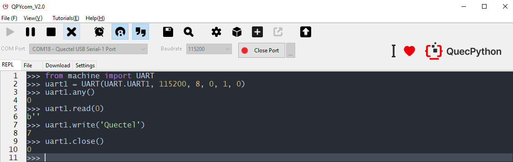
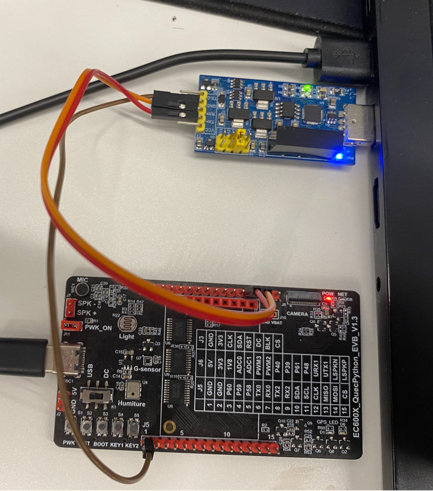
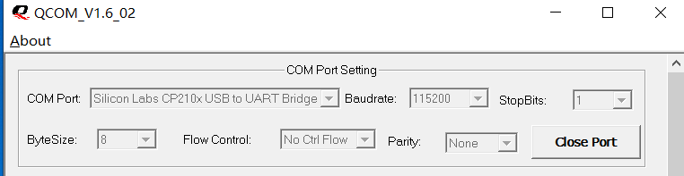
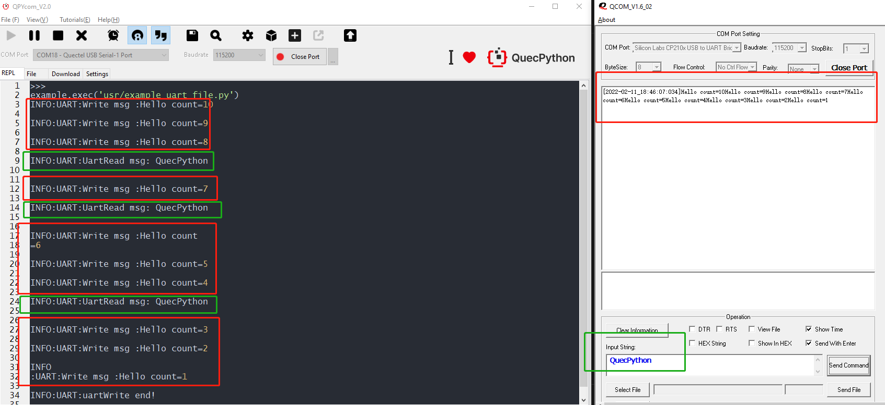

## Revision history

| Version | Date       | Author     | Change expression                    |
| ------- | ---------- | ---------- | ------------------------------------ |
| 1.0     | 2021-09-02 | David.Tang | Initial version                      |
| 1.1     | 2022-02-12 | David      | Translate Chinese operation pictures |

In this document, it mainly introduces how to use *QuecPython_UART* based on EC600X (Including in EC600S, EC600N and EC600U). As a universal serial data bus, UART can be used in asynchronous communication so as to realize duplex transmission and reception. In embedded design, the UART is used to communicate with PC, including in monitoring debugger as well as other components. After reading the whole context, you may learn about all setting parameters and application notes of *EC600X_UART*. 

## HW design 

From the view of different modules,  Please check the list of released UART: 

| module_name | module_UART_name                                      | module_UART_PIN                             |
| ----------- | ----------------------------------------------------- | ------------------------------------------- |
| EC600S/N    | UART0_DEBUG PORT<br>UART1_BT PORT<br/>UART2_MAIN PORT | PIN71、PIN72<br>PIN2、PIN3<br/>PIN31、PIN32 |
| EC600U      | UART1_BT PORT<br/>UART2_MAIN PORT                     | PIN123、PIN124<br>PIN31、32                 |

As for the QuecPython EVB of V1.2 and V1.3, the specific location of URAT is shown as following figure: 


**Note** 

2. In view of the QuecPython EVB of other versions, it is available to find the corresponding location on EVB according to above pin number and schematic diagram. 
4. As for the UART_pin upgraded on wiki in the future, please refer to the illustration on wiki and ignore the above diagram. 

## SW Design

As for SW design, please refer to wiki on official website. Here shows the link: [UART_API Library](https://python.quectel.com/wiki/#/en-us/api/QuecPythonClasslib?id=uart)

Interact with module via QPYcom. Take following case as an example, it is based on UART1. While as for UART2, the operation is just the same. 



**Note**

2.  The reason to execute command ”from machine import pin'' is to make the pin module invisible in current space. 
4.  Only execute "from machine import pin" command in module can the function and variate in pin be used.
6.  Please do remember above operations have on connection with any peripheral, it just serves as reference to get familiar with commands. 

## Download and verify

Module: EC600U_QuecPython EVB

Serial port: UART1

### SW codes

As for the referential codes of matched demo, it is the *example_extint_file.py* file in the same directory as the document. Download it to module and run. 

```python
import _thread  # Import thread module
import utime  # Import timing module
import log  # Import log module
from machine import UART  # Import UART module

# Set log output level
log.basicConfig(level=log.INFO)
uart_log = log.getLogger("UART")
uart = UART(UART.UART1, 115200, 8, 0, 1, 0)

def uartWrite():
    global uart
    count = 10
    while count:
        write_msg = "Hello count={}".format(count)
        uart.write(write_msg)
        uart_log.info("Write msg :{}".format(write_msg))
        utime.sleep(1)
        count -= 1
    uart_log.info("uartWrite end!")


def UartRead():
    global uart
    while 1:
        msgLen = uart.any()
        utime.sleep(0.1)
        # Read when there exists data
        if msgLen:
            msg = uart.read(msgLen)
            utf8_msg = msg.decode()
            uart_log.info("UartRead msg: {}".format(utf8_msg))
        else:
            continue


def run():
    _thread.start_new_thread(UartRead, ())
    _thread.start_new_thread(uartWrite, ())

if __name__ == "__main__":
    run()
    while True:
        utime.sleep(0.5)
```

### HW connection

Do power supply to module via type-c, The connection of *UART-to-USB* and *TTL-to-USB* is shown as following list. (Just for reference)

| Pin on EVB  | TTL-to-USB module | Wire color on the figure |
| ----------- | ----------------- | ------------------------ |
| Pin12 on J6 | Tx                | Orange                   |
| Pin13 on J6 | Rx                | Red                      |
| GND         | GND               | Brown                    |

The HW connection is displayed as next figure: 



### Result

1. Connect the *TTL-to-USB* port on Qcom, which is indicated as following figure: 

3. Run *example_uart_file.py* on QPYcom, then we can see the data of UART write on Qcom. For more details, please check the red box on the screen-shot. 
5. Then write message of QuecPython for several times on Qcom and check the read data on QPYcom. For more details, please check the blue box on the screen-shot. 




## Matched Codes

<a href="/docsite/docs/en-us/basic/BSP/code/example_uart_file.py" target="_blank">Download codes</a>
