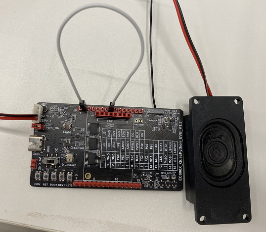
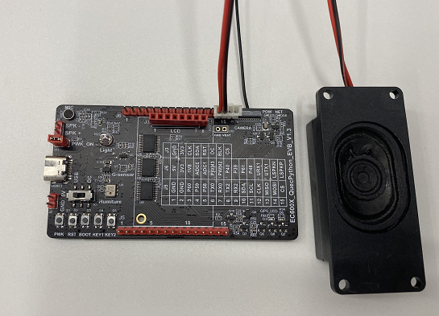

## Revision History
| Version | Date | Author | Description |
|------|------|------|------|
| 1.0 | 2021-4-6 | Gary.zhou | Initial version                          |
| 1.1 | 2021-9-16 | David.Tang | Added the adaptation of multiple modules |
| 1.2 | 2021-10-08 | Rivern | Adjusted form |


## HW Connection

| EVB type                                                 | Corresponding pin on EVB       | Corresponding connection location On EVB | Corresponding Audio channel |
| -------------------------------------------------------- | ------------------------------ | ---------------------------------------- | --------------------------- |
| EC600S_QuecPython_EVB_V1.3<br>EC600N_QuecPython_EVB_V1.3 | PIN21、PIN22                   | J7                                       | Channel 0                   |
| EC600U_QuecPython_EVB_V1.3                               | PIN21、PIN22<br>PIN109、PIN110 | J7<br>J6: PIN14、PIN15                   | Channel 0<br />Channel 2    |


As for EC600S/N, the HW connection is shown as following figure.


As for EC600U_channel 0, the HW connection is shown as following figure.



As for EC600U_channel 2, the HW connection is shown as following figure.



## Download and verify

1. Adjust the code commentary according to the test scenario

   ```python
   import utime as time
   import audio
   from machine import Pin
   
   # For EC600S and EC600N, there is no need to do any change, just play it. 
   # For the channel 0 of EC600U, No 18th line should be commented out, as it has no influece on playing. 
   # For the channel 2 of EC600U, No. 12th and No. 19th lines sould be commented out, and delete the commentary of No.13th line.
   def example_audio_mp3():
       aud = audio.Audio(0)  # Configure channel 0
       # aud = audio.Audio(2)  # Cobfigure channel 2
       aud.setVolume(9)
       # Enable external speaker to play
       # Pin(Pin.GPIO11, Pin.OUT, Pin.PULL_PD, 1)  # Applicable to Official EVB V1.1
       Pin(Pin.GPIO9, Pin.OUT, Pin.PULL_PD, 1)  # Applicable to Official EVB V1.2 and V1.3
       # U: refer to user directory, The file will be downloaded to /user file via GUI. 
       aud.play(2, 1, "U:/example.mp3")
       pass
   
   if __name__ == "__main__":
       example_audio_mp3()
   ```
   
3. Download the *example.mp3* (involved in the package) and modified *example_audio_file.py* into EVB.

4. Run *example_audio_file.py* script.


## The matched code

<!-- * [Download code and audio file](code/Audio.zip)  -->

 <a href="/docsite/docs/en-us/basic/QuecPythonPlatform/code/Audio.rar" target="_blank">Download code and audio file</a>