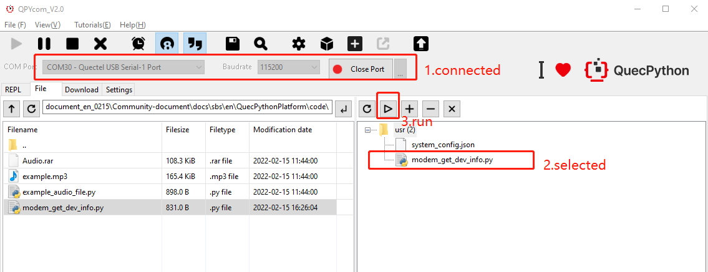
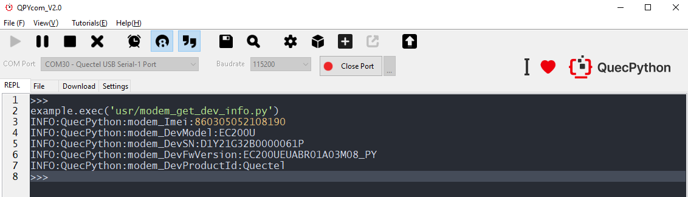

## **Get device info via QuecPython modem**

## Revision History

| Version | Date       | Author     | Description                          |
| ------- | ---------- | ---------- | ------------------------------------ |
| 1.0     | 2021-09-15 | David.Tang | Initial version                      |
| 1.1     | 2022-02-15 | David.Tang | Translate Chinese operation pictures |

## Foreword

In this document, it ilustrates how to get device info via QuecPython modem based on EC600U-CN. Through this document, you will learn about all setting parameters and applications of EC600U-CN thread. 

## SW design

In terms of SW design, please refer to the wiki on official website, which  is located in [modem_API Library](https://python.quectel.com/wiki/#/en-us/api/QuecPythonClasslib?id=modem-related-device)

## Interaction operation 

Interact with EC200U-EU via QPYcom. 

```Python
>>> import modem
>>> help(modem)
object <module 'modem'> is of type module
  __name__ -- modem
  getDevSN -- <function>
  getDevImei -- <function>
  getDevModel -- <function>
  getDevFwVersion -- <function>
  getDevProductId -- <function>
>>> from modem import *
>>> getDevSN()
'D1D20J60A0017870P'
>>> getDevImei()
'868540050393723'
>>> getDevModel()
'EC600S'
>>> getDevFwVersion()
'EC200UEUABR01A03M08_PY'
>>> getDevProductId()
'Quectel'
```

Note：

3. The reason to execute command ”import modem'' is to make the modem module invisible in current space.
4. Only execute "import modem " command in module can the function and variate in modem be used. 

## Download and verify

#### SW code

Download **.py** file and run on EC200U-EU, please check codes

```python
import modem
import log

state = 1
log.basicConfig(level=log.INFO)   # Set the output level of log

log = log.getLogger("QuecPython")

def modem_msg():
    global state
    modem_Imei = modem.getDevImei()
    modem_DevModel = modem.getDevModel()
    modem_DevSN = modem.getDevSN()
    modem_DevFwVersion = modem.getDevFwVersion()
    modem_DevProductId = modem.getDevProductId()
    log.info("modem_Imei:{}".format(modem_Imei))
    log.info("modem_DevModel:{}".format(modem_DevModel))
    log.info("modem_DevSN:{}".format(modem_DevSN))
    log.info("modem_DevFwVersion:{}".format(modem_DevFwVersion))
    log.info("modem_DevProductId:{}".format(modem_DevProductId))
    state = 0

if __name__ == "__main__":
    modem_msg()
    while 1:
        if state:
            pass
        else:
            break
```

#### HW connection

HW connection is not necessary

#### Result

Run *modem_file.py* in QPYcom. 



Please refer to the result. 



