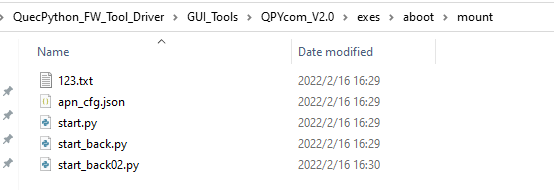
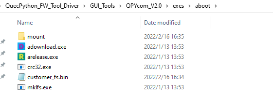

## Revision History

| Version | Date       | Author     | Change expression                    |
| ------- | ---------- | ---------- | ------------------------------------ |
| 1.0     | 2021-09-17 | David.Tang | Initial version                      |
| 1.1     | 2022-02-16 | David.Tang | Translate Chinese operation pictures |

## Brief introduction 

In this document, it mainly introduces how to operate and deploy QuecPython file system. The file system plays the role of making sure the storage device  (Generally, it is the disk; however, SSD based on NAND Flash is also available) in operation system or the method of file in partition as well as the data structure. That is the way to organize file on storage device. In most cases, the software organization which is  responsible for managing and storing file information in an operating system is called file management system (It is also abbreviated as file system). After learning about this document, you will take charge of the operation and application note of file system. 

## About saving file into file system

### Download and debug file via QPYcom 

**Download script**

Several ways are achievable to download script. 

（1）Drag the file into module via the "Dragging" function in QPYcom;

（2）Download the script to module via the "Downloading script" function of QPYcom ;

**Note:** For specific script downloading, please refer to <Application notes of Quectel QuecPython_QPYcom tool>.

**File operation**

For how to operate QuecPython file system, you can take [uos module](https://python.quectel.com/wiki/#/en-us/api/pythonStdlib?id=uos-basic-quotoperating-systemquot-services) and [uiomodule](https://python.quectel.com/wiki/#/en-us/api/pythonStdlib?id=uio-inputoutput-streams) as references.

For various ports, please take following cases as examples: 

```python
>>> import uos
>>> uos.getcwd()  # Get path
'/'
>>> uos.chdir('/usr') # Change path
>>> uos.mkdir('QuecPython') # Make file in current path
>>> uos.listdir()
['apn_cfg.json', 'a.py', 'b.py', 'V05.bin', 'system_config.json', 'checksum.json', 'b.txt', 'QuecPython']
>>> uos.chdir('QuecPython')# Change path
>>> uos.getcwd()
'/usr/QuecPython'
>>> import uio
>>> fd = uio.open('test.py', mode='w')  # Make new file in current file and open it by written 
>>> fd.write('quectel')  # Write
7
>>> fd.close()  # Close file
>>> fd = uio.open('test.py', mode='r')   # As for the file in current file, open it by read
>>> fd.read()  # Read
'quectel'
>>> fd.close()
```

### The way to generate bin in mass production file

As for the FW merge, actually, the *customer_fs.bin* has been generated. Here shows the principle: 

1. Find *mklfs* in the directory of *QPYcom_v1.7\exes\aboot* after unzipping QPYcom. After that, open following contents via commands in *mklfs* tool directory.


2. Make a folder named mount, then place the file to be merged in this folder. 



3. Execute commands 


（1）The commands to generate ***.bin*** file are shown as above, while for specific illustration, please check the figure： 


（2）As above figure shows, it is the *customer_fs.bin* with a size of 5 MB by default that is generated, which refers to the 5242880 on the figure. 

（3）For *customer_backup_fs.bin*, it is 200 KB by default, which refer to the 20480 on the figure. 

4. The generated *customer_fs.bin* file can be seen in the tool directory of *mklfs*, please check the screen-shot as below. 



## Method to save parameter

### Method to save dynamic parameter

In development, the temporary parameters, variates and string definitions used by developer are called dynamic parameters. As for these parameters, on QuecPython, the GC memory management module is provided to retrieve memory garbage. For more details, please refer to the wiki-related explanation on QuecPython official website:   [gc - Retrieve memory fragmentations](https://python.quectel.com/wiki/#/en-us/api/pythonStdlib?id=gc-control-the-garbage-collector)

### How to save factory parameter

So how to save factory parameters? there is a need to write the configured factory parameters into file beforehand, then generate .bin file via image. For detailed operation procedure, take the Chapter "The way to generate bin in mass production file" as an example. 

## File (Script) Backup 

Concerning about file backup, there is a necessity to generate a new FW by combining the backup file and the original FW. After that, re-flash it to module. For detailed operation procedure, check the next chapter. 

### Make image file

For making image file, please refer to the Chapter "The way to generate bin among mass production file"。 Meanwhile, <Quectel_EC100Y-QuecOpen_FS Image Making_Application Note> is also available. 

In this document, the image file making of several files are illustrated: 


The made image file is


### Substitute image file and flash FW 


By default, the module will flash a formatted image file with empty contents for the user partition and backup partition, as a result, there is a must to substitute the original image file with *customer_backup_fs.bin* (The image file after making) so as to generate a new zipped FW. For flashing FW via QPYcom as well as its procedure, please refer to the <Application Note on Quectel_QuecPython_QPYcom tool>.

### Update file

If you want to flash above files, please login QPYcom beforehand: 


The operation shown on interaction surface. 

```python
>>> import checksum 
>>> checksum.update('/usr/a.py')  

[{'name': '/usr/a.py', 'sha256': '454f048b9b584add8b6f67a86ec4ec01ce63baace41efba994881f608a227e30'}, {'name': '/usr/b.py', 'sha256': '3edc1bd333bc7f4caf33bb35e7602bafe5d85c6b6b2ca74a92588a470fbee917'}, {'name': '/usr/b.txt', 'sha256': 'cced28c6dc3f99c2396a5eaad732bf6b28142335892b1cd0e6af6cdb53f5ccfa'}, {'name': '/usr/V05.bin', 'sha256': 'e5d2dd354947292348a8fb29cdf78e4ffc05754f8e12ecf0dc0ff3783b6b8822'}]
>>> uos.listdir('usr/')
['apn_cfg.json', 'checksum.json', 'a.py', 'b.py', 'b.txt', 'V05.bin', 'system_config.json']
>>> uos.listdir('/bak/usr/')
['test.txt', 'a.py', 'b.py', 'b.txt', 'V05.bin']
>>> 
```

Operation illustration

（1）The above figure shows the flash after modifying *customer_backup_fs.bin*.

（2）If it is hoped to update the file under **usr** directory and run continuously after power on for the next time, there is a need to update *checksum.json* file via *checksum.update* interface. 

（3）The purpose to backup file is to save the merged file and avoid deleting file by mistake, which cause the failure in retrieve of the program. 

