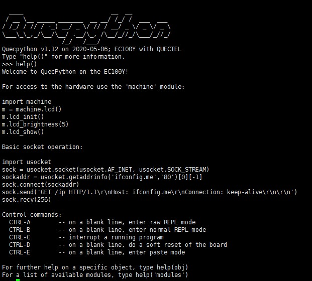
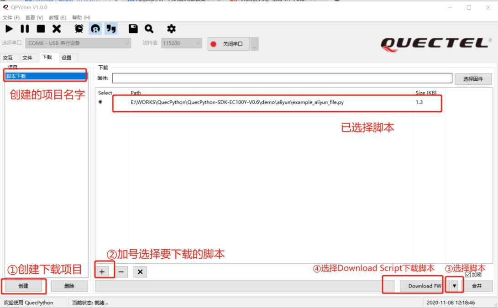
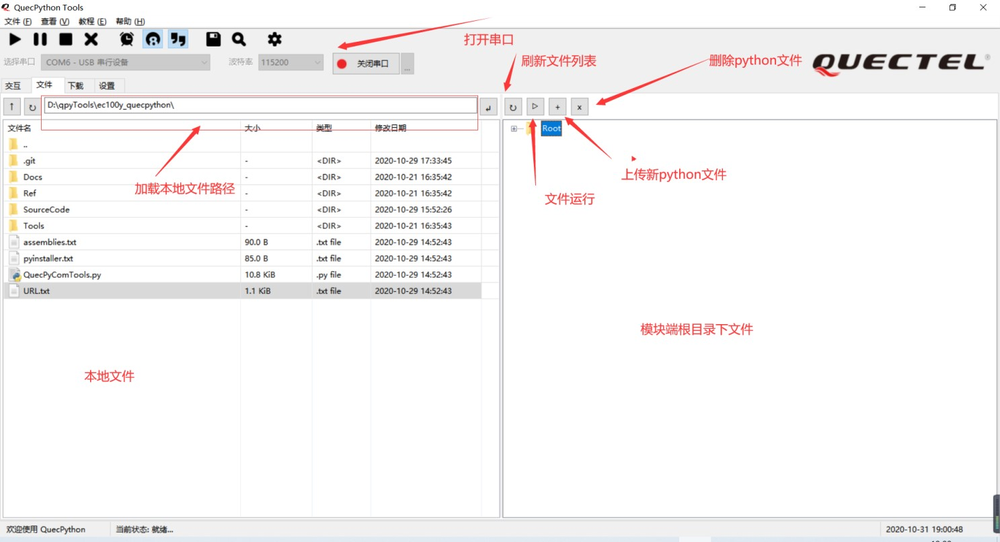
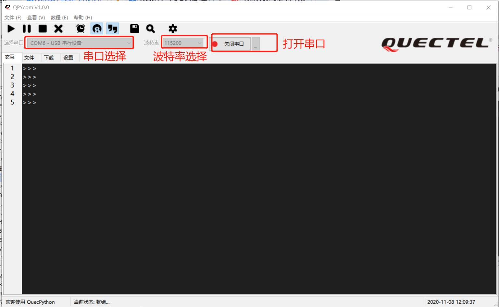
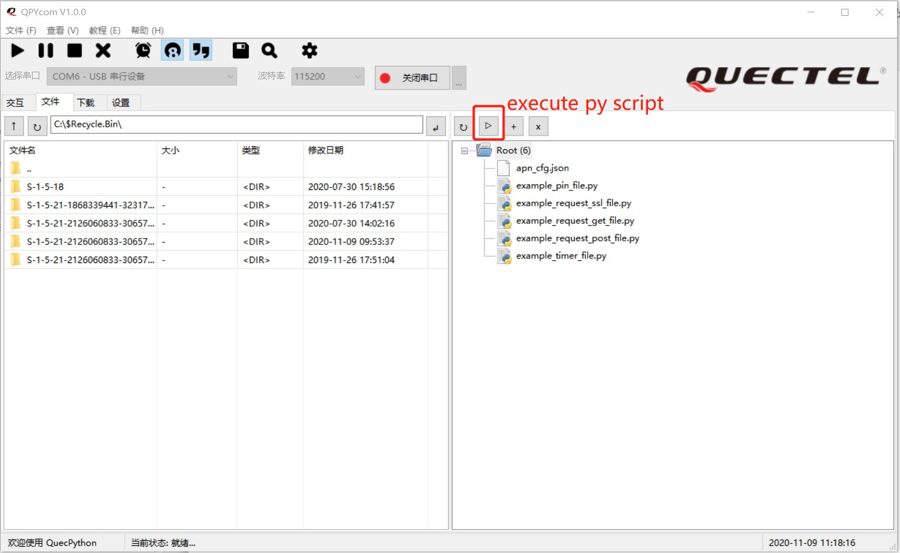

## QuecPython basic operation instructions

This article mainly introduces the basic operations of quecpthon, including file system and instruction execution.

### Document history

| version | date | author | change statement |
| -------- | ---------- | ----------- | ------------- |
|1.0 | 2021-09-31 | river.yuan | initial version & Revision|


### System startup

After quecpthon is started, the interactive interpreter will be started on the main serial port, similar to the Linux shell. Through the interactive interpreter, users can execute commands in real time and view the returned results.



Interactive interpreter

Of which:

-Execute ** help (obj) ** command to view help;

-Execute the ** dir (obj) ** instruction to view the detailed methods provided by the module;

-Execute the ** help ('modules') ** command to view the currently supported class libraries. During system startup, in addition to hardware resource initialization, partition mounting and initialization script operation will also be performed. The startup script mainly includes two parts:

-* boot. Py *: resource initialization, such as attaching partitions during startup, and the script is frozen in the factory firmware;

-* main. Py *: user initialization script, which is executed after system initialization.

### File system

In quecpthon, 5 MB is divided
As a user partition, users can store some configuration, script and other files in this partition. When the system starts, the partition will be automatically mounted in the '/' directory.

>In quecpthon, a class library * UOS * for accessing the file system is provided, which can be used to operate and access the file system.
>The following code example shows how to create files, write contents and read contents in the current directory.

```python
import uos    # create a file
f=open('test.txt','w')  
f.write('hello quecpython!\n')  
f.write('123456789abcdefg!\n')  
f.close() # read a file 
f=open('test.txt', 'r') 
print(f.readline()) 
print(f.readline()) 
f.close() 
```


>To facilitate operation, you can use the * qpycom. Exe * tool for routine file system operation.

Script Download

Step ** 1 **: unzip * qpycom. Zip * under the * tools * directory in the SDK package, obtain * qpycom. Exe *, and double-click to run;

Step ** 2 **: enter the "download" tab, click the "create" button to create a user project according to requirements;

Step ** 3 **: click the "** + **" button to select the script to be downloaded to the module;

Step ** 4 **: click the inverted triangle button at the bottom right of the interface to switch to the "download script" mode;

Step ** 5 **: click ** Download FW ** to download the script;

Step ** 6 **: when the progress bar displays "** 100% **", it indicates that the download is complete. You can enter the "file" tab to view the file details in the module.



>** 2 **: script Download Interface

see file

Run * qpycom. Exe * tool and click "view" --> "file browsing" to realize Python connection between local and module
The operation interface and buttons for uploading, viewing, adding and deleting files are shown in the figure below.



Upload, view, add and delete ** Python ** files with local modules

Command interaction

Run * qpycom. Exe * tool, click "view" --> "interactive command line" to enter the main interactive interface. In the interactive interface, you can manually input and interact with the module through the interactive window. The description of the main interactive interface is shown in the figure.



Interactive interface description

>** 4 ** execute script

>Step ** 1 **: unzip * qpycom. Zip * under the * tools * directory in the SDK package, obtain * qpycom. Exe *, and double-click to run;
>Step ** 2 **: enter the "file" tab;
>Step ** 3 **: click the button shown in the red box below to execute the script file.



Execute script interface

### Bytecode compilation

In order to improve the speed of code execution and the security of customer code, the MPY cross tool is provided for mobile communication to compile the user's Python script into bytecode. Bytecode can be solidified in firmware or stored in file system for script. For details, please refer to

>Quectel_quecpthon_mpy cross User Guide

>The commands for compiling Python scripts into bytecode are:

>mpy-cross.exe -o test.mpy -s test.py -march=armv7m test.py


