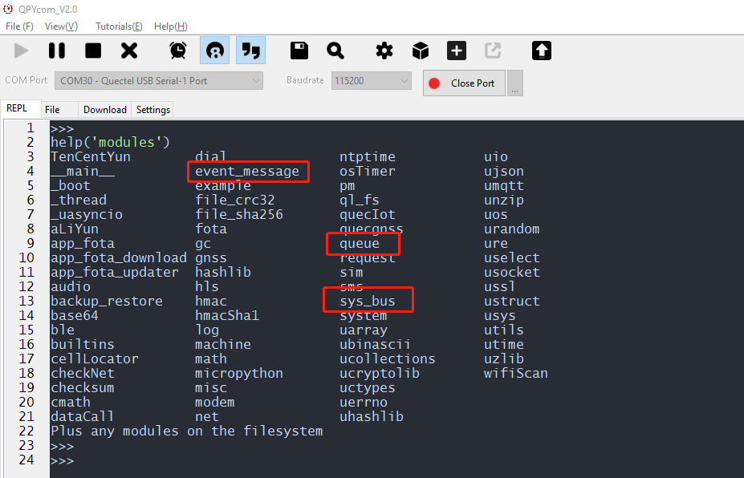
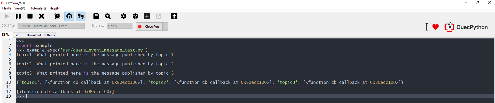
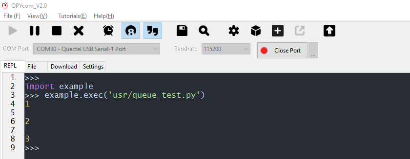
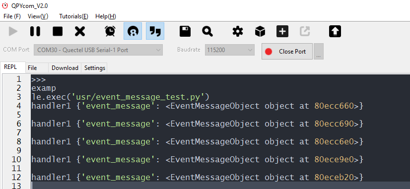

## Revision History

| Version | Date       | Author     | Description                          |
| ------- | ---------- | ---------- | ------------------------------------ |
| 1.0     | 2021-09-30 | David.Tang | Initial version                      |
| 1.1     | 2022-02-16 | David.Tang | Translate Chinese operation pictures |

## Foreword

Currently, the supported queue and message bus are composed by *sys_bus*, *Queue* and *event-manage*. In following chapter, we will introduce the differences and show examples among them. 

Confirming function support is necessary. If it is doubtful that whether the current version supports before application, you'd better try following method. 



As above screen-shot implies, this FW supports all queues and message buses. 


## Sys_bus

The *sys_bus* is mainly used in publication and subscription; in addition, the server is not necessary. Here shows codes: 

```python
import sys_bus
import utime 
def cb_callback(topic, msg):
    print(topic, msg)
# Support registering multiple subscription functions by one topic. 
sys_bus.subscribe("topic1", cb_callback)
sys_bus.subscribe("topic2", cb_callback)
sys_bus.subscribe("topic3", cb_callback)


" The subscriber will receive message after publishing"
sys_bus.publish("topic1", " What printed here is the message published by topic 1")
utime.sleep(2)
sys_bus.publish("topic2", " What printed here is the message published by topic 2")
utime.sleep(2)
sys_bus.publish("topic3", " What printed here is the message published by topic 3")
utime.sleep(2)

print(sys_bus.sub_table())
# Return {"topic1": set(cb_callback...)}
utime.sleep(2)
print(sys_bus.sub_table("topic1"))
# Return set(cb_callback...)

sys_bus.unsubscribe("topic1", cb_callback)
# As suscribing callback has been cancelled above, the following publication won' t slide into the former callback. That means: the subscribed message can still be received, however, there is no callback.  
sys_bus.publish("topic1", "What printed here is the message published by topic 1")

sys_bus.unsubscribe("topic1")
# As the subscription of topic 1 has been cancelled, the following publication won't receive any message. 
sys_bus.publish("topic1", " What printed here is the message published by topic 1")
```

Here is the result. 



Explanation

Under the circumstance that thread A subscribes topic C, then if another thread B sends message to topic C, the thread A will receive the message of topic C correspondingly.

## Queue

The Queue is widely used in the communication among threads.  Here shows the codes.

```python
import _thread
from queue import Queue
import utime
# Initialize queue
q = Queue(maxsize=100)
def get():
    while True:
# The q.get will wait until get the message. Whenever the q.put is executed, the q.get will delete block and carry on if influenced by relevant signal. 
        item = q.get()
        print(item)
# Start the thread and wait for message in which place. 
_thread.start_new_thread(get,())
# put the message to queue
q.put(1)
utime.sleep(2)
q.put(2)
utime.sleep(2)
q.put(3)
```

Here shows the result.

 

Explanation

When the thread A builds a queue, it will wait to get the data until put by another thread B. 

## Event-manage

The event-manage is mainly used to dispatch message among layers as well as the implementation of observer, which supports dispatch service of message queue, synchronous/ asynchronous dispatch mechanism and observer mode. Here show codes: 

```python
from event_message import Event
import utime
"""
1. Initialize event
2. Initialize event manager
3. Register event to event manager
4. Start event manager
5. Add event manager
6. Dispatch data
"""
from event_message import Event, EventManager
# Initialize event and event manager
event = Event("test")
event_manager = EventManager()
# Register event
event_manager.register_event(event)
# Start event manager
event_manager.start()
# Add event manager, you can comment different event types by patches. 
@event.add_handler_via()
def handler(**kwargs):
    em = kwargs["event_message"]
    """
    The first way to get data
    kwargs:{
        "event_message":EventMessageObject
    }
    Four attributes are invloved in EventMessageObject
        event_name
        msg
        event
        callback
        It provides the method to get by itself and by combination. As for getting by combination, following methods are available, the model_to_dict()will get the dictionary of combination. 
        {
            'name': 'test',
            'event': event_object,
            'msg': '1111',
            'callback': None
        }
    """
    
    print("handler1 {}".format(kwargs))
    """
    1. Method to get the first attribute
        # Get the event name
            event_name = em.event_name
        # Get the event message
            msg = em.msg
        # Get the original event
            ev = em.event
        # None Get the transmitted callback, it is None by default if there is no transmission. 
            cb = em.callback
    """
    """
    2. The way to get the second attribute value(Recommended)
        data_map = em.model_to_dict()
            {
                'name': 'test',
                'event': event_object,
                'msg': '1111',
                'callback': None
            }
    """
# Asynchronous dispatch data instead of block 
while True:
    event.post(message="1111")
    utime.sleep(2)
```

The running result is shown as following figure.



Illustration

The program is in a mode of cycle asynchronous dispatch data.


