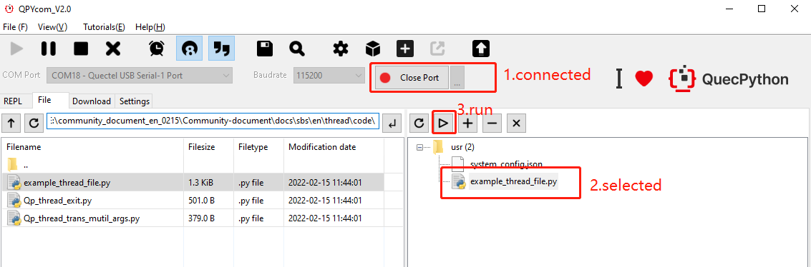
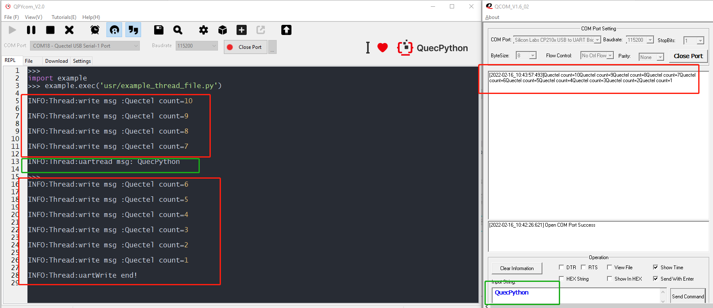

## Revision history

| Version | Date       | Author     | Description                          |
| ------- | ---------- | ---------- | ------------------------------------ |
| 1.0     | 2021-09-16 | David.Tang | Initial version                      |
| 1.1     | 2022-02-16 | David.Tang | Translate Chinese operation pictures |

## Foreword

In this document, it illustrates how to use the thread function of QuecPython based on EC600U-CN module. Nearly all operation systems support Process and the running task will correspond to one Process normally  in an operation system. One program will turn into a process when it enters the memory to run. Corresponding, the multiple threads expand the multi process, which makes the same thread can handle several tasks at the same time. Thread, also called lightweight Process, serves as the execution unit of process though. Similarly, the thread is a concurrent and independent execution flow in program just as the process in operation system. 

## HW description

Thread is the function implementation on software level; as for the hardware,  enough memory is abundant. No more explanations here.

## SW design 

The function of thread module is to provide the method to make new thread and mutex. For more details, please refer to the link: [thread](https://python.quectel.com/wiki/#/en-us/api/pythonStdlib?id=_thread-multithreading-support).

## Interaction 

Interact with EC600U-EU via QPYcom. Please refer to the screen-shot for more details

```python
>>> import _thread
>>> _thread.get_ident()
2126467632
>>> _thread.get_heap_size()
748032
>>> lock = _thread.allocate_lock() 
>>> lock.acquire()
True
>>> lock.locked()
True
>>> lock.release()
>>> lock.locked()
False
```

Note：

​	1.The reason to execute command ”import_thread'' is to make the ***_thread*** visible in current space.

​	2.Only execute "import_thread" command in module can the function and variate in ***_thread*** be used. 

## Download and verify

### SW codes

As for the referential codes of matched demo, it is the *example_thread_file.py* file in the same directory as the document. Download it to EC600U-CN module and run. 

```python
import _thread
import utime
import log
from machine import UART  

# Set the opuput level of log
log.basicConfig(level=log.INFO)
uart_log = log.getLogger("Thread")

state = 1
msglen = 0
count = 10
uart = UART(UART.UART2, 115200, 8, 0, 1, 0)

def uartwrite():
    global count
    while count:
        write_msg = "Quectel count={}".format(count)  # Transmit data
        uart.write(write_msg)
        uart_log.info("write msg :{}".format(write_msg))
        utime.sleep(1)
        count -= 1
        if count == 0:
            break
    uart_log.info("uartWrite end!")

def uartread():
    global state
    global msglen
    while 1:
        utime.sleep_ms(10)
        msgLen = uart.any()   # Return whether there exists readable message length
        if msgLen:
            msg = uart.read(msgLen)  # Read when there exists message
            utf8_msg = msg.decode()  # The form of origial message is bytes, just convert that into STR
            uart_log.info("uartread msg: {}".format(utf8_msg))
            state = 0
            break
        else:
            continue

def run():
    _thread.start_new_thread(uartread, ())  # Make a new thread to monitor receiving uart message
    _thread.start_new_thread(uartwrite, ())


if __name__ == "__main__":
    run()
    while 1:
        if state:
            pass
        else:
            break

```

### HW connection

Do power supply to EC600U-CN via type-C port, the connection of UART-to-USB module and TTL-to-USB module is shown as next tablet (Just for reference): 

| EC600U Module_PIN No. | EC600U_QuecPython_EVB_V1.3 | TTL-to-USB module |
| :-------------------: | :------------------------: | :---------------: |
|         PIN31         |          J5_PIN9           |        Tx         |
|         PIN32         |          J5_PIN8           |        Rx         |
|           /           |            GND             |        GND        |

The figure displayed HW connection: 


### Result

（1）Run *example_thread_file.py* in QPYcom .



（2）Since two threads are conducted simultaneously, when writing data via UART, it is available to transmit data to EC600U-CN serial interface. (The following figure just displays that writing and reading are conducted simultaneously; however, the detailed outputting sequence of log is decided by manual transmission time.) As the next figure implies, during the third and fourth interval when writing data to EC600U-CN, it transmits "QuecPython" to EC600U-CN via TTL-to-USB. 



## The matched code

<!-- * [Download codes](code/example_thread_file.py) -->

<a href="/docsite/docs/en-us/basic/thread/code/example_thread_file.py" target="_blank">Download codes</a>

