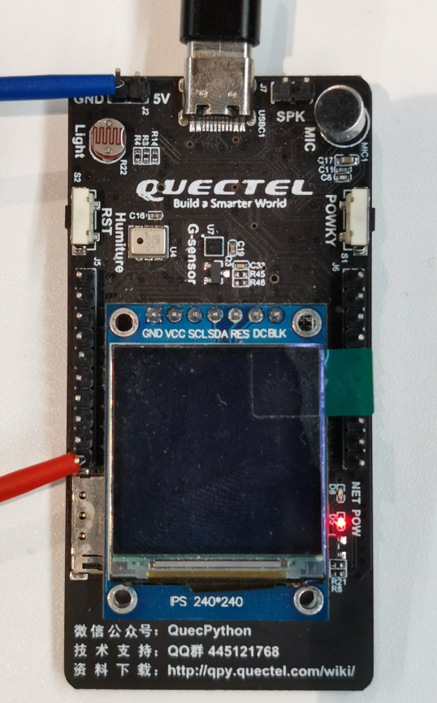

## Revision History

| Version | Date       | Author     | Change expression |
| ------- | ---------- | ---------- | ----------------- |
| 1.0     | 2021-09-06 | David.Tang | Initial version   |

In this chapter, it illustrates how to use QuecPython_PWM based on EC600X (Including in EC600S, EC600N and EC600U). PWM, a kind of method to carry out digital coding of analog signal level, will manipulate the bias of transistor base electrode and MOSFET gate electrode according to the variation of load so as to change the induction pf transistor or MOSFET, then stable power supply will be outputted correspondingly.  In this way, the output voltage of the power supply can be kept constant when the working conditions change, and it is a very effective technology to control the analog circuit by using the digital signal of the microprocessor. What's more, PWM is a very effective technique to control analog circuits by using the digital output of microprocessor. As a result, it is widely used in many fields from measurement, communication to power control and transformation.

## SW design

For SW design, please refer to the wiki on official website. Here is the address: [PWM_API Library](https://python.quectel.com/wiki/#/zh-cn/api/QuecPythonClasslib?id=pwm)

## Interaction operation

Take the HW of EC600S V1.1 as an example, It is the No.69 pin (G1) that transmits the PWM waveform. 



The red and wire cables are connected to logic analyzer, then the waveform can be  captured after running following codes.

It is divided into three levels- 1ms, 10us and 1us owig to the API ports of PWM. 

```python
from misc import PWM
import utime as time
import log


class pwmclass():
    def __init__(self):
        self.Log = log.basicConfig()
        self.Log = log.getLogger("pwm_class")
        # self.Log.setLevel(log.INFO)
        self.Log.setLevel(log.DEBUG)
        self.pwm = None
        pass

    """
       Note： on EC100YCN paltform, it supports PWM0~PWM3, here shows the corresponding pins
        PWM0 – Pin 19
        PWM1 – Pin 18
        PWM2 – Pin 23
        PWM3 – Pin 22

        Note： on EC600SCN paltform, it supports PWM0~PWM3, here shows the corresponding pins
        PWM0 – Pin 52
        PWM1 – Pin 53
        PWM2 – Pin 70
        PWM3 – Pin 69
    """

    # fre   The frequency is K, (0.0 ~ 1000] 
    # Duty_Cycle (0~1)
    def init(self, Pwm_pin=PWM.PWM3, fre=1, Duty_Cycle=0.5):
        # https://python.quectel.com/wiki/#/zh-cn/api/QuecPythonClasslib?id=pwm

        # Calculate the level via frequency
        # Calculate the cycle
        if (fre <= 0) or (fre > 1000):
            self.Log.error(
                "ERROR: {0} Unsupported frequency parameters, please input (0~1000]K ".format(fre))
        if (Duty_Cycle < 0.000) or (Duty_Cycle >= 1):
            self.Log.error(
                "ERROR: {0} Unsupported duty cycle parameters, please input the frequency within (0~1.0)".format(Duty_Cycle))
                          
        # us Unit
        cycle_time = int(1 * 1000 / fre)
        hight_time = int(cycle_time * Duty_Cycle)
        self.Log.info("""Setting {0} the device frenquency as {1}khz  
                   The cycle is {2}us While the duty cycle is  {3}us""".format(Pwm_pin, fre, cycle_time,
                                                  hight_time))
        # ms Cycle range
        # The cycle ranges: 1K us ~ 1000K us
        if cycle_time > 1000:
            self.pwm = PWM(Pwm_pin, PWM.ABOVE_MS, int(hight_time / 1000),
                           int(cycle_time / 1000))
        # The cycle ranges from 10us to 15.75ms
        if (cycle_time > 10) and (cycle_time < 15750):
            self.pwm = PWM(Pwm_pin, PWM.ABOVE_10US, int(hight_time / 10),
                           int(cycle_time / 10))
        # The cycle ranges from 0 to 157us
        if (cycle_time > 0) and (cycle_time < 157):
            self.pwm = PWM(Pwm_pin, PWM.ABOVE_1US, hight_time, cycle_time)

    def deinit(self, fre=0):
        self.pwm = None
        pass

    def start(self, fre=1):
        self.Log.info("Start to output PWM waveform".format())
        if self.pwm is not None:
            self.pwm.open()
        pass

    def stop(self):
        if self.pwm is not None:
            self.pwm.close()
        pass


def test_pwm(fre, duty, delay=2):
    obj_pwm = pwmclass()
    obj_pwm.init(fre=fre, Duty_Cycle=duty, Pwm_pin=PWM.PWM3)
    obj_pwm.start()
    time.sleep(delay)
    obj_pwm.stop()
    obj_pwm.deinit()


if __name__ == "__main__":
    # Frenquency: 1K, Duty cycle: 0.1
    test_pwm(fre=1, duty=0.1)
    # Frenquency: 10K, Duty cycle: 0.2
    test_pwm(fre=10, duty=0.2)
    # Frenquency: 100K, Duty cycle: 0.4
    test_pwm(fre=100, duty=0.4)

```


The above figures shows the packaged PWMclass outputs the waveforms of 1K, 10K and 100K directly. 

## Term explanation

PWM: Pulse Width Modulation

High level: Generally, it is high level if above 0.8 V 

Low level: Generally, it is low level if lower than 0.8 V

Cycle: The total time of low level and high level

Duty cycle: The ratio occupied by high level. 