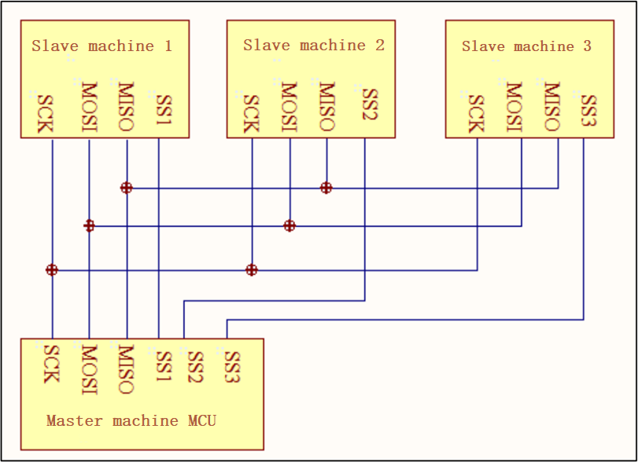
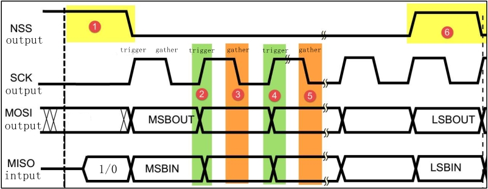
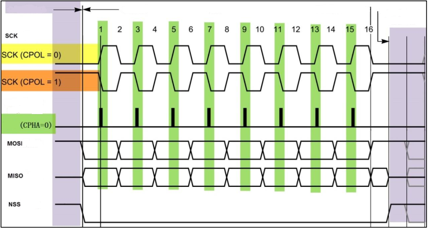
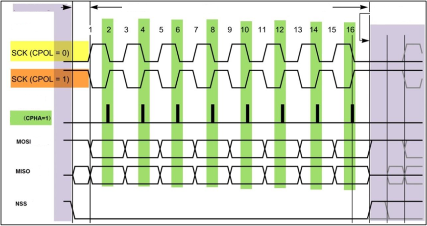
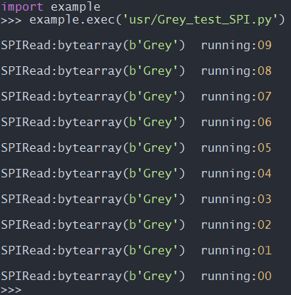

# QuecPython--SPI Bus development

## Revision history

| Version | Date       | Author | Description     |
| ------- | ---------- | ------ | --------------- |
| 1.0     | 2021-09-14 | Grey   | Initial Version |

In this document, it mainly introduces how to use *QuecPython_SPI* on EC600X (EC600S, EC600N and EC600U are included). In addition, you can learn about the parameter settings and application notes of *EC600x_SPI*. 

About API, please refer to  [QuecPython-machine - spi](https://python.quectel.com/wiki/#/en-us/api/QuecPythonClasslib?id=spi)

## Brief introduction on SPI

As its name implies, SPI, the abbreviation of Serial Peripheral interface and defined by Motorola on its MC68HCXX CPU, is widely used in EEPROM, FLASH, real-time clock, AD converter, data signal handler and signal decipher with features of high-speed,full-duplex and synchronization. Nowadays, this communication protocol has been integrated in more and more chipsets for its characteristics of pin-saving in chipset and space-saving in PCB layout. 

### Master-Slave mode


In SPI, it regulates that during the during the communication of two SPI devices, the Slave device shall be controlled by the Master device. One Master device can control several Slave devices by providing Clock and carrying out Salve Select. In addition, it is regulated the Clock of Slave device should be provided by Master device via SCK pin since the Slave device can't produce or control Clock. Furthermore, without Clock, it would be a failure for Slave device to run smoothly. 




### Synchronous

The Master device will generate corresponding Clock Pulse according to the data should be exchanged, while the clock pulse makes up the clock signal. The clock signal uses CPOL and CPHA to control when data is exchanged between the two SPI devices and when the received data is sampled to ensure synchronous data transmission between the two devices.



### Four communication modes

**CPOL** refers to the level signal of SCK signal line when SPI communication device is in idle status. (That is the SCK status when the NSS in high level before the SPI communication) When CPOL=0, the SCK is low level when idle; However, if the CPOL=1, it is the high level. 

**CPHA** refers to the data sampling moment. When CPHA=0, The signal in MOSI or MISO data line will be samplied by the odd edge of SCK clock line; while CPHA=1. the data wire will be sampled by the even edge of SCK. 

According to the difference between **CPOL** and **CPHA**, SPI is embedded with four communication modes. 

| SPI mode | CPOL | CPHA | SCK Clock when idle | Sampling moment |
| -------- | ---- | ---- | ------------------- | --------------- |
| 0        | 0    | 0    | Low level           | Odd edge        |
| 1        | 0    | 1    | Low level           | Even edge       |
| 2        | 1    | 0    | High level          | Odd edge        |
| 3        | 1    | 1    | High level          | Even edge       |







### Data Exchanges

The data transmission among SPI devices is called data exchanges since one SPI device can't only play a role of Transmitter or Receiver in data communication according to SPI protocol. In addition, the SPI device will transmit and receive the data with a size of one bit every Clock, which means that one bit data is exchanged in this device. 

If one Slave device should receive the controlling signal from Master, it can be accessed by Master device beforehand. As a result, there is must for Master device to carry out Slave Select on Slave device via SS/CS pin and select the salve device to be accessed. Since during the data transmission, the received data should be sampled before the nest data transmission occurs; otherwise, the SPI physical module will be invalid once the received data be abandoned. Therefore, in program, the data will be read in SPI device after the transmission is done, even if some useless Dummy data. 

In SPI, there exist Master and Slave modes only instead of reading or writing. In actual, the data exchange is carried out between Master and Slave device. That means you shall receive one data if you send one data beforehand or vice versa. 

## SPI communication 

### Test Code

Following code is applicable to the Asynchronous Receiption and Transmission communication test of SPI on EC600x EVB. 

Premise: Make SPI_MISO and SPI_MOSI pin short circuit. 

```python
# -*- coding: UTF-8 -*-
import utime
from machine import SPI
from machine import Pin

#  Shield the data inteference of GNSS module. As the SPI_MISO and SPI_MOSI are multiplexed as UART1, A GNSS module (L76K)is also connected to EVB. In order to disconnect the inteference to SPI communition by data from L76K, followiing two lines of codes should be added. 
gpio11 = Pin(Pin.GPIO11, Pin.OUT, Pin.PULL_PD, 0)   # Used in EC600S/EC600N
gpio11.write(0)                                     # Used in EC600S/EC600N

w_data = "Grey"
r_data = bytearray(len(w_data))
count = 10  # Running count

# Please select codes with the module type
spi_obj = SPI(1, 0, 1)  # Used in EC600S/N
# spi_obj = SPI(0, 0, 1)  # Used in EC600U

while count:
    count -= 1
    utime.sleep(1)
    ret = spi_obj.write_read(r_data, w_data, 100)
    if ret == -1:
        SPI_msg = "SPIReadError"
    else:
        SPI_msg = "SPIRead:{}  running:{:0>2d}".format(r_data, count)
    print(SPI_msg)
```


### Test Result



## Matched code

> <!-- * [Download Codes](code/code_SPI.py) -->
>  <a href="code/code_SPI.py" target="_blank">Download codes</a>